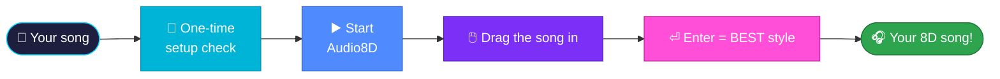
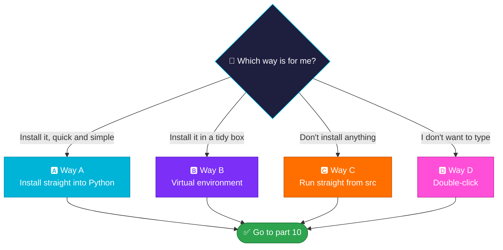
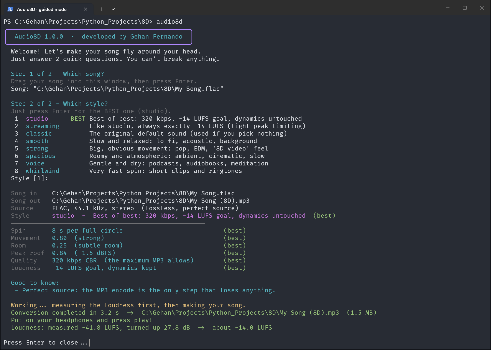
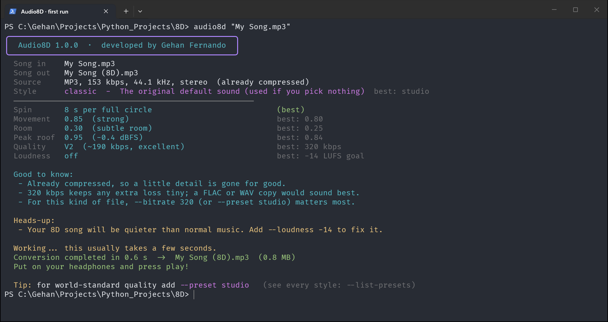
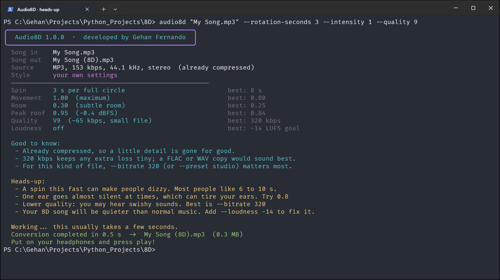
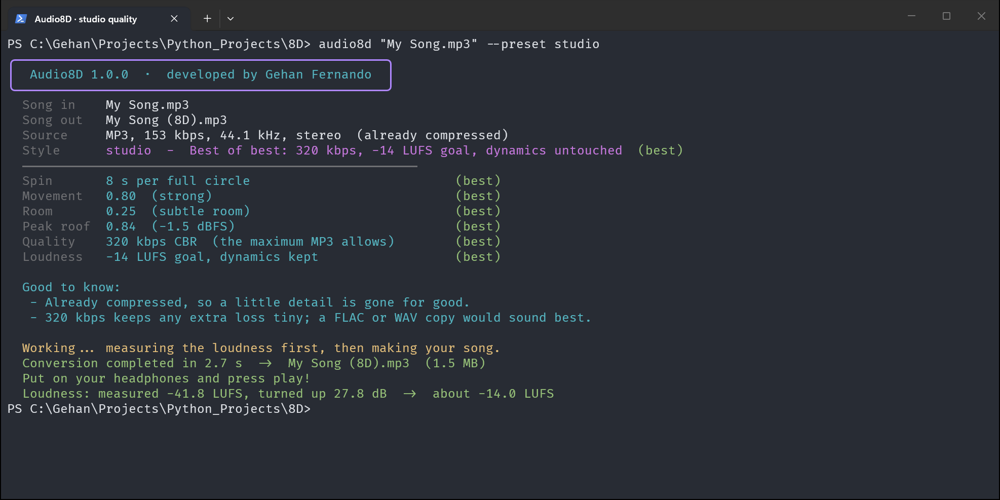
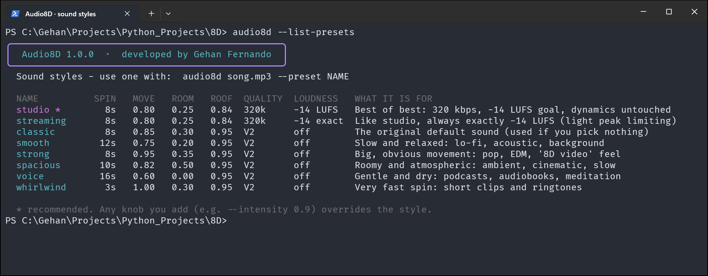
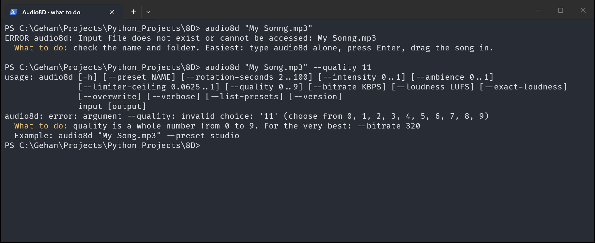
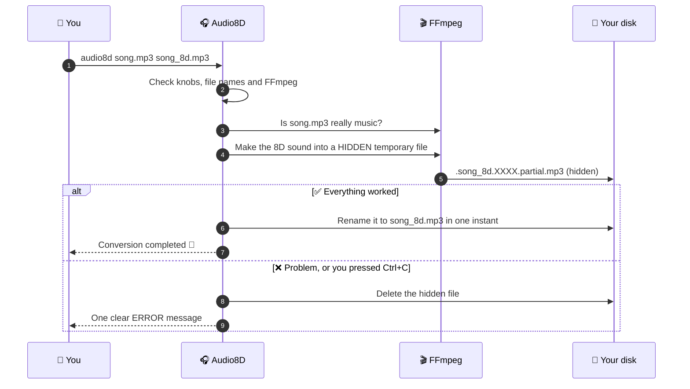
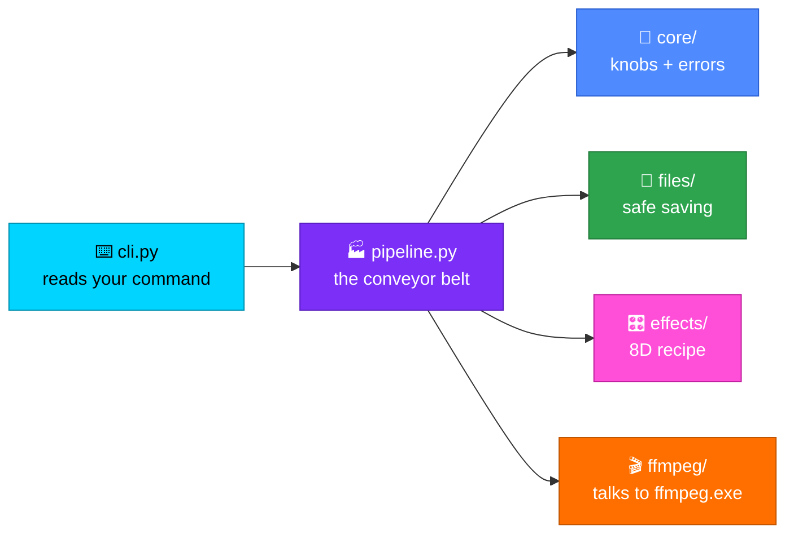

<!-- Developed by Gehan Fernando -->
<div align="center">


# 🎧 Audio8D

### Give it a song. Get back a song that **moves around your head**. 🌀

**👨‍💻 Developed by Gehan Fernando**

<p>

</p>
<p>


</p>
<p>


</p>

</div>

**Audio8D** is a small, free program for your computer. You give it a normal song, and it makes a new copy where the music seems to **travel slowly around your head**, from your left ear to your right ear and back again. This effect is known as **"8D audio"**. Your original song is never changed.

> [!TIP]
> 👶 **You don't need any technical knowledge.** Start Audio8D (type **`audio8d`** and press Enter, or double-click `src\__main__.py`). It asks you **2 easy questions** and picks the best settings for you. 👉 [Jump to the step-by-step quick start](#-6-quick-start-your-first-8d-song)
>
> 🏆 **Already know your way around?** `audio8d song.mp3 --preset studio` gives world-standard quality and loudness in one go. 👉 [Why these values?](#-14-best-quality-and-sound-styles)

> [!IMPORTANT]
> 🎧 **Always listen with headphones.** The effect only works when your left ear and your right ear hear different things. On a normal speaker you will not feel it.

---

## 📚 What's inside this guide

This guide is written for **everyone**. The first parts need no technical knowledge at all. The later parts go deeper, and the last parts are for programmers.

| 🌱 Understand it | 🚀 Get started | 🎵 Make great 8D songs |
|---|---|---|
| 1. [What is Audio8D?](#-1-what-is-audio8d) | 6. [Quick start: your first 8D song](#-6-quick-start-your-first-8d-song) | 11. [Making 8D songs](#-11-making-8d-songs) |
| 2. [Why does it exist?](#-2-why-does-it-exist) | 7. [Where is everything?](#-7-where-is-everything) | 12. [Check your new song](#-12-check-your-new-song) |
| 3. [Why you'll like it](#-3-why-youll-like-it) | 8. [Full setup, step by step](#-8-full-setup-step-by-step) | 13. [Change how it sounds](#-13-change-how-it-sounds) |
| 4. [Everything it can do](#-4-everything-it-can-do) | 9. [Four ways to start Audio8D](#-9-four-ways-to-start-audio8d) | 14. [🏆 Best quality and sound styles](#-14-best-quality-and-sound-styles) |
| 5. [What you need](#-5-what-you-need) | 10. [Check that it works](#-10-check-that-it-works) | 15. [Which songs can I use?](#-15-which-songs-can-i-use) |
| | | 16. [Many songs at once](#-16-many-songs-at-once) |
| | | 17. [Why is my new song quieter?](#-17-why-is-my-new-song-quieter) |

| 🆘 Help | 👩‍💻 For programmers | 👋 The end |
|---|---|---|
| 18. [When something goes wrong](#-18-when-something-goes-wrong) | 22. [Use it from Python](#-22-for-programmers-use-it-from-python) | 24. [Remove Audio8D](#-24-remove-audio8d) |
| 19. [How your files stay safe](#-19-how-your-files-stay-safe) | 23. [Tests and code](#-23-for-programmers-tests-and-code) | 25. [Credits](#-25-credits) |
| 20. [Questions people ask](#-20-questions-people-ask) | | |
| 21. [Word helper (tricky words explained)](#-21-word-helper) | | |

> 💡 **Met a word you don't know?** The [Word helper](#-21-word-helper) explains every technical word in this guide in one simple line.

---

## 🎧 1. What is Audio8D?

### 🗣️ Imagine this

Imagine your favourite singer is standing **next to your left ear**. 🗣️👂

Now imagine they **slowly walk around your head** to your right ear… and back again… again and again. 🚶‍♂️🔄

That feeling is called **8D audio**. **Audio8D makes it for you**, from any song you already have.


### 🤔 How does the trick work?

Your brain works out where a sound comes from by asking one simple question:

> *"Which ear hears it louder?"*

- Left ear louder ➡️ your brain says *"the sound is on the left"* ⬅️
- Right ear louder ➡️ your brain says *"the sound is on the right"* ➡️

Audio8D slowly turns the left side **up** while it turns the right side **down**, then swaps them, over and over. It also adds a tiny bit of "room" sound (soft echoes), so the music feels like it is **outside** your head instead of inside it. Your brain does the rest. ✨

> [!NOTE]
> "8D" is just a fun name. There are **not** 8 of anything. It is a clever trick that uses your **2** ears.

---

## 🤔 2. Why does it exist?

### 😕 The problem

Making an 8D version of a song by yourself is harder than it sounds:

- 🎛️ You need to know **which sound effects** to use, in **which order**, and with **which numbers**.
- 🔉 An 8D song usually comes out **much quieter** than the original (often 10 to 20 dB quieter), so it sounds weak next to your other music.
- 📉 Every time a song is saved as an MP3 again, a little quality is lost. Bad settings make this worse.
- 😬 It's easy to overwrite or damage a file by accident.

### 💡 The solution

Audio8D does all of this for you, safely:

- 🧑‍🍳 It already knows the **"8D recipe"** (the effects, their order and good numbers).
- 🏆 One word, **`studio`**, picks the **best quality** settings, based on standards that music professionals and streaming services use.
- 🔊 It can make your 8D song **as loud as songs on Spotify and YouTube**, without squashing the music.
- 🔒 It **never touches your original song**, and never replaces a file unless you say so.
- 👶 If you don't want to type anything, it simply **asks you 2 questions**.

---

## ⭐ 3. Why you'll like it

| | Benefit | What it means for you |
|:---:|---|---|
| 👶 | **Easy** | Answer 2 questions, or double-click. Pressing Enter always picks the best choice. |
| 🏆 | **Best quality** | One word (`--preset studio`) gives professional-level settings. |
| 🔒 | **Safe** | Your original songs are never changed or deleted. |
| ⚡ | **Fast** | A 3½-minute song takes about **4 seconds** with the normal settings. |
| 🗣️ | **Talks in plain words** | Every setting is explained on screen, and every error comes with a **"What to do:"** line. |
| 📴 | **Works offline** | Once it's set up, no internet is needed. |
| 🆓 | **Nothing extra to download** | The helper programs it needs are already included in the `src` folder. |

---

## ✨ 4. Everything it can do

<table>
<tr>
<td width="50%" valign="top">

### 🎵 Sound
- 🌀 Music moves **smoothly** from ear to ear, with no jumps
- 🏛️ Adds a little **room sound** for depth
- 🧱 Has a **safety guard** so the sound never crackles or breaks
- 🏆 **`--preset studio`**: world-standard quality and **Spotify/YouTube loudness** in one word
- 🎚️ **8 ready-made styles** and **7 knobs** (settings) you can turn to change the sound
- 🥇 **Best of best** quality: 320 kbps (the highest MP3 quality), the MP3 maker's most careful mode, and loudness set **without squashing** the music
- 🔍 **Knows your file**: tells you if it is lossless (a perfect copy, like FLAC or WAV) or already compressed (like MP3 or AAC), and what that means
- 🎧 Works with **one-speaker (mono)** and **cinema (5.1 surround)** recordings too

</td>
<td width="50%" valign="top">

### 🤝 Friendly helpers
- 👶 A **step-by-step helper**: just type `audio8d` and answer 2 questions
- 🖥️ Shows **every setting in plain words** while it works, marking each one **(best)** or saying what the best value would be
- 🚦 **Heads-up warnings** when a setting might sound bad, with the fix
- 🆘 A plain **"What to do:"** line under every error

### 🛡️ Safety
- 🔒 **Never** deletes or replaces your songs unless you say so
- ✅ You only ever see **finished** songs, never broken half-songs
- 🧹 Cleans up after itself, even if you stop it early
- 🚫 Strange file names cannot trick your computer
- 💾 Works on **USB sticks** and memory cards too

</td>
</tr>
<tr>
<td width="50%" valign="top">

### ⚡ Speed & files
- ⚡ **Fast**: a 3½-minute song takes about **4 seconds** with the normal settings
- 🎞️ Reads almost anything: **MP3, FLAC, WAV, M4A, OGG, Opus**, even **MP4 videos**
- 🏷️ Keeps the **song name, singer and album**
- 🔎 Checks its tools **before** it starts, and tells you clearly if something is missing
- 📦 FFmpeg (the helper program that does the sound work) is **already inside** the `src` folder
- ▶️ Runs **with or without installing**, even by **double-click**

</td>
<td width="50%" valign="top">

### 👩‍💻 For programmers
- 🐍 Can be used **inside your own Python programs**
- 🧪 **191 automatic tests** check that everything works
- 🧊 Wrong settings are caught with a **clear message**
- 🧩 Neat, tidy code in small folders
- 📦 Needs **no extra Python packages** to run

</td>
</tr>
</table>

---

## 🧺 5. What you need

You need only **3 things**:

| | Thing | What it is | Do I have it? |
|:---:|---|---|---|
| 🐍 | **Python** 3.10 or newer | Free software that lets your computer run Audio8D (Audio8D is written in the Python language) | [Step 1](#step-1-get-python) shows you how to check |
| 🎬 | **FFmpeg** and **FFprobe** | Free helper programs that open, read, change and save music files | ✅ **Already inside** the `src` folder! |
| 🎧 | **Headphones** | Any normal pair or earbuds | You probably do 😊 |

That's all. No other downloads are needed.

---

## 🚀 6. Quick start: your first 8D song

Got a music file? 🎵 Follow these steps **from top to bottom**. Every step tells you **what you should see** when it worked ✅, and what to do if it didn't ❌. You can't break anything, and your original song is **never changed**.



> [!NOTE]
> 📁 **About the folder paths in this guide:** the examples use the author's folders, like `C:\Gehan\Projects\Python_Projects\8D` (the project) and `C:\Users\Gehan\Music` (songs). If your copy of the project or your music lives somewhere else, just use **your own** folder in their place.

### 🧰 Before your very first song (only once, ever)

Tick these off one by one. You only do this **the first time**.

| ✔ | What | How to check | ✅ Good if… | ❌ If not… |
|:---:|---|---|---|---|
| ☐ | **Python 3.10 or newer** | Open PowerShell, type `python --version` | You see `Python 3.10` or higher | Install it: [Step 1](#step-1-get-python) |
| ☐ | **FFmpeg helper files** | Open the folder `8D\src` | You see `ffmpeg.exe` **and** `ffprobe.exe` | Get them: [Step 2](#step-2-check-the-helper-programs) |
| ☐ | **How you'll start Audio8D** | Pick **one** way from the table below | – | Details: [part 9](#-9-four-ways-to-start-audio8d) |
| ☐ | **Headphones** | Put them on the right way round (L on the left ear) | – | Any normal pair or earbuds will do |

> 💬 **What is PowerShell?** It's a window where you type instructions (called **commands**) for your computer, then press <kbd>Enter</kbd>. It's also called the **terminal**. To open it: press the <kbd>⊞ Windows</kbd> key, type `powershell`, and press <kbd>Enter</kbd>.

**Which way should I pick?** If you're not sure, pick **🅳 Way D (double-click)**. It needs no setup at all.

| Way | One-time setup | How you'll start it every time |
|---|---|---|
| 🅳 **Double-click** (easiest) | Nothing | Double-click `8D\src\__main__.py` |
| 🅰️ **Installed** | In the `8D` folder, run `python -m pip install -e .` once | Type `audio8d` in any terminal |
| 🅱️ **Virtual environment** | In `8D`: `python -m venv .venv`, open it, then `python -m pip install -e .` | Open the box (`.\.venv\Scripts\Activate.ps1`), then type `audio8d` |
| 🅲 **No install** | Nothing | In a terminal inside `8D\src`, type `python __main__.py` |

*(Want the full explanation of each way? See [part 9](#-9-four-ways-to-start-audio8d).)*

### 🎵 Your song, in 7 easy steps

#### Step 1 · Find your song 🔎

Any normal music file works: **MP3, FLAC, WAV, M4A/AAC, OGG, Opus, WMA**, even the sound of a **video** (MP4, MKV, WEBM). See [part 15](#-15-which-songs-can-i-use) for the full list.

- 🥇 **Have more than one copy?** Use the best one: **FLAC or WAV** beats a **320 kbps MP3**, which beats a smaller MP3. Audio8D can't add back detail that a small file already lost. ([Why?](#best-of-best-for-every-kind-of-file))
- 🔒 **Copy-protected songs can't be converted.** That means songs you *stream* or download inside Spotify, Apple Music (`.m4p`), YouTube Music, etc. Songs from CDs, music stores like Bandcamp or Amazon MP3, and your own recordings are fine.
- 🎧 **Never feed it an 8D song** (a file ending in `(8D).mp3`). Always start from the **original**.

✅ **You're ready when:** you know where the song is, e.g. in your `Music` folder.

#### Step 2 · Start Audio8D ▶️

Do the one that matches **your way**:

| Your way | Do this |
|---|---|
| 🅳 Double-click | Open `C:\Gehan\Projects\Python_Projects\8D\src` in File Explorer and **double-click `__main__.py`**. *(If Windows asks which app to use, pick **Python**.)* |
| 🅰️ Installed | Open **PowerShell** (press <kbd>⊞ Windows</kbd>, type `powershell`, <kbd>Enter</kbd>), type **`audio8d`**, press <kbd>Enter</kbd> |
| 🅱️ Virtual environment | Open PowerShell **in the `8D` folder**, type `.\.venv\Scripts\Activate.ps1`, then **`audio8d`**, <kbd>Enter</kbd> |
| 🅲 No install | Open PowerShell **in the `8D\src` folder**, type **`python __main__.py`**, <kbd>Enter</kbd> |

✅ **It worked if** you see the purple title box **"Audio8D 1.0.0 · developed by Gehan Fernando"** and the words **"Welcome! Let's make your song fly around your head."**

❌ **Didn't work?** `python`/`audio8d` "is not recognized", or the window closed at once? See [Stuck? Quick fixes](#-stuck-quick-fixes) below.

#### Step 3 · Give it your song (question 1 of 2) 🎵

It asks **"Step 1 of 2 - Which song?"**

1. Open **another** File Explorer window and find your song.
2. **Drag the song** with the mouse and **drop it into the black window**. Its full path (the file's "address" on your computer) appears after `Song:`.
3. Press <kbd>Enter</kbd>.

💡 **Any name works here**, even names with spaces, `'`, `$`, `&` or brackets, because you're answering a question, not typing a command.
💡 **Typed it wrong?** It says *"I can't find that file"* and simply asks again. Press <kbd>Enter</kbd> on an empty line to stop.

✅ **It worked if** it moves on to **"Step 2 of 2 - Which style?"**

#### Step 4 · Pick the style (question 2 of 2) 🎨

You'll see a numbered list of styles (ready-made sets of settings). The best one says **BEST**.

- 🏆 **Just press <kbd>Enter</kbd>.** That picks **`studio`**, the best of best (320 kbps, loudness like Spotify, dynamics untouched).
- Or type a number from **1 to 8** and press <kbd>Enter</kbd>, e.g. `2` for `streaming` (always exactly −14 LUFS) or `4` for `smooth`. All styles: [part 14](#all-ready-made-styles).

✅ **It worked if** a list of settings appears, each marked **(best)**, and it says **"Working…"**

#### Step 5 · Wait a few seconds ⏳

Audio8D first **measures** your song, then **makes** the 8D version. On a normal PC this takes about **20 seconds for a 5-minute song** with `studio` (the normal settings are quicker, because they skip the measuring and the extra-careful MP3 mode). While it works, it shows:

| You'll see | It means |
|---|---|
| **Source** | What your file is, e.g. *"MP3, 320 kbps, 48 kHz, stereo (already compressed)"* |
| **(best)** next to each setting | Every value is already the best one |
| **Good to know** 💙 | Honest facts about your file, e.g. *"a FLAC or WAV copy would sound best"* |
| **Conversion completed** 💚 | ✅ **Done!** With the time taken and the file size |
| **Loudness:** 💚 | How loud it was, how much it was turned up or down, and where it ended up |

Then it says **"Press Enter to close…"**, so press <kbd>Enter</kbd>.

❌ **See a line starting with `ERROR`?** Read the yellow **`What to do:`** line right under it, which tells you the fix. All messages: [part 18](#-18-when-something-goes-wrong).

#### Step 6 · Find your new 8D song 📁

It's saved **right next to your original song**, with **`(8D)`** added to the name:

```text
C:\Users\Gehan\Music\My Song.mp3        ← your original (never changed)
C:\Users\Gehan\Music\My Song (8D).mp3   ← your new 8D song ✨
```

This works for every file type: `Track 01.flac` becomes `Track 01 (8D).mp3`. The new song is **always an MP3**, so it plays on everything.

#### Step 7 · Listen! 🎧

1. Put on your **headphones**.
2. **Double-click** the new `(8D).mp3` file to play it in your music app.
3. **Close your eyes.** Within about **8 seconds** the music should float **left ➡️ right ➡️ left** around your head. 🌀

✅ **Perfect if:** smooth movement, clear voice, no crackles. Want to check it properly? See [part 12](#-12-check-your-new-song).

🎉 **That's it, you made your first 8D song!**

### ⌨️ Prefer one command instead of questions?

Once you know the steps, this single line does **Steps 2 to 5 in one go**:

```powershell
audio8d "C:\Users\Gehan\Music\My Song.mp3" --preset studio
```

*(Way C: open PowerShell in `8D\src` and type `python __main__.py` instead of `audio8d`.)*

**What the parts mean:** `audio8d` starts the program, the text in quotes is your song, and `--preset studio` picks the best style.

| Want to… | Add this |
|---|---|
| Choose the new file's name or folder | A second name: `audio8d "My Song.mp3" "D:\8D Songs\My Song.mp3" --preset studio` (the folder is created for you) |
| Replace an 8D file you made before | `--overwrite` |
| Exactly −14 LUFS, like every other song in a playlist | `--preset streaming` instead of `--preset studio` |
| See every style first | `audio8d --list-presets` |

💡 **Easy path trick:** in File Explorer, **hold <kbd>Shift</kbd> and right-click the song → "Copy as path"**, then paste it into the terminal with a right-click. The quotes are added for you. **Warning:** if the name has a `$` or `` ` `` in it, change the double quotes to single quotes (see [special characters](#song-names-with-special-characters)).

### 🔁 After your first song

**Not quite right?** Make it again from the **original** with one change (add `--overwrite` to replace the old 8D file):

| It sounds… | Try this |
|---|---|
| 😵 Too strong or dizzy | `audio8d "My Song.mp3" --preset smooth --overwrite` |
| 🐌 Spinning too fast for a slow song | `audio8d "My Song.mp3" --preset studio --rotation-seconds 12 --overwrite` |
| 😐 Hardly moving | `audio8d "My Song.mp3" --preset studio --intensity 0.95 --overwrite` *(and check you're on headphones)* |
| 🌫️ Too echoey | `audio8d "My Song.mp3" --preset studio --ambience 0.15 --overwrite` |
| 🔉 Quieter than my other songs | `audio8d "My Song.mp3" --preset streaming --overwrite` |
| 🥁 Not in time with the beat | Match the spin to the song's tempo: [tempo table](#bonus-make-the-spin-match-the-beat) |

**Good to remember:**

- 🎵 **Your original song is never changed.** Keep it, because an 8D song can't be turned back.
- 🚫 **Never convert an `(8D)` file again.** Always start from the original.
- 📚 **Got lots of songs?** Do a whole folder at once: [part 16](#-16-many-songs-at-once).
- 📱 **On your phone:** copy the `(8D).mp3` file over; every music app can play it.
- 🙈 **Git:** songs inside the `8D` folder are ignored (`*.mp3` in `.gitignore`), so they are never uploaded by accident.
- ⚖️ **Sharing:** making an 8D version doesn't make a song yours. Ask the owner before uploading it anywhere.

### 🆘 Stuck? Quick fixes

| What happened | Quick fix | More help |
|---|---|---|
| `python` is not recognized | Try `py` instead; if that fails, install Python and tick **"Add python.exe to PATH"** | [Step 1](#step-1-get-python) |
| `audio8d` is not recognized | Use Way C (`python __main__.py` in `8D\src`), or install again in the `8D` folder | [part 18](#-18-when-something-goes-wrong) |
| The double-clicked window closes at once | Open PowerShell in `8D\src` and run `python __main__.py` to read the message | [part 18](#-18-when-something-goes-wrong) |
| "Missing required executable(s): ffmpeg" | Put `ffmpeg.exe` and `ffprobe.exe` in `8D\src` | [Step 2](#step-2-check-the-helper-programs) |
| "Input file does not exist" | Check the name, or type `audio8d` alone and **drag the song in** | [Song names](#song-names-with-special-characters) |
| "Command failed … Invalid data found" | That file isn't music, or it's copy-protected | [Step 1](#step-1--find-your-song-) |
| "Output already exists" | Add `--overwrite`, or give the new file another name | [part 11](#if-the-new-file-already-exists) |
| I can't hear any 8D movement | Use **headphones** and turn **off** "Mono audio" (Windows *Settings → Accessibility → Audio*) | [part 18](#-18-when-something-goes-wrong) |

### ✅ My checklist (print me!)

- [ ] Python works (`python --version`)
- [ ] `ffmpeg.exe` and `ffprobe.exe` are in `8D\src`
- [ ] I picked my way to start (A, B, C or D)
- [ ] I found the **best copy** of my song (not an `(8D)` file, not copy-protected)
- [ ] I started Audio8D and saw the **Welcome!** message
- [ ] I dragged my song in and pressed <kbd>Enter</kbd>
- [ ] I pressed <kbd>Enter</kbd> again for the **BEST** style (`studio`)
- [ ] I saw **"Conversion completed"**
- [ ] I found `My Song (8D).mp3` next to my original
- [ ] I listened with **headphones** 🎧, and it flies around my head! 🌀

---

## 📍 7. Where is everything?

The whole project lives in **one folder** called **`8D`**. You don't need to open or understand the code files; this map just helps you find your way around.

```text
📁 C:\Gehan\Projects\Python_Projects\8D      ← the main folder (the "root")
│
├── 📄 README.md             ← this guide you are reading
├── ⚙️ pyproject.toml        ← the "recipe card" that tells Python how to install Audio8D
├── 🙈 .gitignore            ← tells Git (a tool for saving versions of code) which files to ignore
├── 📁 docs\images\          ← the screenshots used in this guide
│
├── 📁 src\                  ← 💙 ALL THE PROGRAM CODE IS HERE
│   ├── 🎬 ffmpeg.exe        ← helper program that changes the sound
│   ├── 🔍 ffprobe.exe       ← helper program that reads song information
│   ├── cli.py               ← ▶️ also a start button (reads the command you type)
│   ├── pipeline.py          ← the main "conveyor belt": check → read → change → save
│   ├── display.py           ← the colourful settings panel you see in the terminal
│   ├── hints.py             ← the friendly "What to do:" fix for every error
│   ├── __init__.py          ← the front door for Python programs
│   ├── __main__.py          ← ▶️ THE START BUTTON: double-click me, or run "python __main__.py"
│   ├── 📁 core\             ← settings, ready-made styles (presets), error messages
│   ├── 📁 effects\          ← the 8D sound recipe
│   ├── 📁 ffmpeg\           ← code that talks to ffmpeg.exe and ffprobe.exe
│   └── 📁 files\            ← code that keeps your files safe
│
└── 📁 tests\                ← 🧪 automatic checks that the program works
    ├── 📁 unit\             ← small, quick checks
    └── 📁 integration\      ← real music conversions
```

### ❓ "I can't find a folder called `audio8d`!"

That's correct: **there is no folder with that name, and that's okay.** 😊

**`audio8d` is a nickname.** It is used in two ways:

1. 🗣️ **The command you type** to make an 8D song, like `audio8d song.mp3 song_8d.mp3`. This command **appears after you install** (Way A or B in [part 9](#-9-four-ways-to-start-audio8d)). Don't want to install? No problem, use **Way C** or **Way D**, which start the program straight from the `src` folder.
2. 🏷️ **The name Python uses for the `src` folder.** The recipe card `pyproject.toml` says *"when someone asks for `audio8d`, give them the `src` folder."* It can't be called `8D`, because Python names are not allowed to start with a number.

> [!TIP]
> **Short version:** the code lives in **`src`**, and its nickname is **`audio8d`**. 🏷️

> [!NOTE]
> After you install, a new folder called **`audio8d.egg-info`** appears inside `8D`. That's normal: it is Python's "receipt" for the install. **Leave it alone while Audio8D is installed.** Git ignores it, and you can delete it after you uninstall ([part 24](#-24-remove-audio8d)).

---

## 🪜 8. Full setup, step by step

Follow these steps **in order**. Take your time, there is no rush. 🐢

### Step 1: Get Python

Python is the free software that runs Audio8D. Let's check whether you already have it.

1. Press the <kbd>⊞ Windows</kbd> key, type **`powershell`**, and press <kbd>Enter</kbd>. A blue or black window opens. This is the **terminal**.
2. Type this and press <kbd>Enter</kbd>:
   ```powershell
   python --version
   ```
3. Look at the answer:
   - ✅ You see `Python 3.10` or a bigger number (`3.11`, `3.12`, `3.13` …)? **Great, go to Step 2.**
   - ❌ You see an error, or a number smaller than `3.10`? Then:
     1. Go to **[python.org/downloads](https://www.python.org/downloads/)** and click the big yellow **Download Python** button.
     2. Open the file you downloaded.
     3. ⚠️ **Very important:** at the bottom of the first screen, **tick the box "Add python.exe to PATH"**. (This lets the terminal find Python by name.)
     4. Click **Install Now** and wait until it finishes.
     5. **Close** the terminal, open a **new** one, and try `python --version` again.

### Step 2: Check the helper programs

Audio8D uses two free helper programs, **FFmpeg** (changes and saves sound) and **FFprobe** (reads information about a song). They are normally already included.

Open File Explorer and go to:

```text
C:\Gehan\Projects\Python_Projects\8D\src
```

You should see these two files:

- ✅ `ffmpeg.exe`
- ✅ `ffprobe.exe`

Both there? **Perfect, go to Step 3.** 🎉

<details>
<summary><b>😟 They are missing. What do I do?</b> (click to open)</summary>

Pick **one** of these:

**🅰️ Put them in the `src` folder (easiest):**
1. Go to **[gyan.dev/ffmpeg/builds](https://www.gyan.dev/ffmpeg/builds/)**.
2. Download the file called **`ffmpeg-release-essentials.zip`**.
3. Open the zip. Inside, open the **`bin`** folder.
4. Copy **`ffmpeg.exe`** and **`ffprobe.exe`** into `C:\Gehan\Projects\Python_Projects\8D\src`.

**🅱️ Install FFmpeg for the whole computer:**
- Windows: `winget install Gyan.FFmpeg`
- macOS: `brew install ffmpeg`
- Linux (Ubuntu/Debian): `sudo apt install ffmpeg`

Then close the terminal and open a new one.

Audio8D **looks in `src` first**. If the files aren't there, it looks for FFmpeg on the whole computer.

</details>

### Step 3: Open a terminal in the 8D folder

The terminal must be "standing" inside the `8D` folder, so it can find the project's files. Pick the way you like:

**🖱️ Way 1: with the mouse (easiest)**
1. Open **File Explorer** and go into `C:\Gehan\Projects\Python_Projects\8D`.
2. **Right-click** on an empty white space inside the folder.
3. Click **"Open in Terminal"**.

**⌨️ Way 2: with the address bar**
1. Open the `8D` folder in **File Explorer**.
2. Click on the **address bar** at the top, where the folder path is written.
3. Delete what is written, type **`powershell`**, and press <kbd>Enter</kbd>.

**🧑‍💻 Way 3: by typing** (`cd` means "change directory", i.e. go into a folder)
```powershell
cd C:\Gehan\Projects\Python_Projects\8D
```

✅ **How do I know it worked?** The terminal line now starts with `PS C:\Gehan\Projects\Python_Projects\8D>`.

---

## 🧭 9. Four ways to start Audio8D

There are **4 ways** to run Audio8D. They all make **exactly the same** 8D songs. **Pick the ONE you like.** 😊



| | 🅰️ Way A | 🅱️ Way B | 🅲 Way C | 🅳 Way D |
|---|---|---|---|---|
| **In one sentence** | Install into Python | Install into a private box | No install, run from `src` | No install, double-click |
| **Think of it like…** | Putting a toy in your big toy box | Giving the toy its own little box | Playing with the toy right where it lies | Pressing the big red button |
| **Setup** | 1 command, once | 3 commands, once | Nothing! | Nothing! |
| **You type** | `audio8d song.mp3` | `audio8d song.mp3` (box open) | `python __main__.py song.mp3` | Nothing, you drag the song in |
| **Works from any folder?** | ✅ Yes | ✅ Yes (box open) | Go to `8D\src` first | ✅ Just double-click |
| **All knobs & styles?** | ✅ | ✅ | ✅ | Always the best (`studio`) style |
| **Good for** | Most people | Programmers | People who never install things | People who don't like typing |

---

### Way A: Install straight into Python

**What this does:** it teaches your computer the word `audio8d`, so you can use it from any folder. It uses **pip**, Python's built-in tool for installing things.

Make sure your terminal is in the `8D` folder ([Step 3](#step-3-open-a-terminal-in-the-8d-folder)). Then type:

```powershell
python -m pip install -e .
```

⚠️ Don't forget the **dot `.` at the end**. It means *"this folder"*.

✅ **Success looks like:** `Successfully installed audio8d-1.0.0`

<details>
<summary><b>😟 It said "Permission denied" or "Access is denied"</b></summary>

Add `--user` so Python installs it just for you:

```powershell
python -m pip install --user -e .
```

</details>

<details>
<summary><b>😟 It shows a yellow WARNING: "...Scripts is not on PATH"</b></summary>

That's okay, it still installed! 😊 It just means the short word `audio8d` might not work in the terminal.

**Use the long way instead.** It always works:

```powershell
python -m audio8d song.mp3 song_8d.mp3
```

Anywhere this guide says `audio8d …`, you can write `python -m audio8d …` instead.

</details>

**🎉 Done! Go to [part 10](#-10-check-that-it-works).**

---

### Way B: Install inside a virtual environment

A **virtual environment** is a private little box just for this project, so it never mixes with your other Python things. 📦

Make sure your terminal is in the `8D` folder ([Step 3](#step-3-open-a-terminal-in-the-8d-folder)).

**1️⃣ Make the box** (only once):
```powershell
python -m venv .venv
```
A new folder called `.venv` appears inside `8D`. That's the box.

**2️⃣ Open the box:**
```powershell
.\.venv\Scripts\Activate.ps1
```
✅ You now see **`(.venv)`** at the start of the terminal line.

<details>
<summary><b>😟 Red error: "running scripts is disabled on this system"</b></summary>

Windows is being extra careful. Type this **once**, press <kbd>Enter</kbd>, then try opening the box again:

```powershell
Set-ExecutionPolicy -Scope CurrentUser RemoteSigned
```

If it asks a question, type **`Y`** and press <kbd>Enter</kbd>.

</details>

<details>
<summary><b>🍎 On macOS or Linux?</b></summary>

Use this instead of step 2️⃣:

```bash
source .venv/bin/activate
```

</details>

**3️⃣ Install Audio8D into the box:**
```powershell
python -m pip install -e .
```

✅ **Success looks like:** `Successfully installed audio8d-1.0.0`

> [!IMPORTANT]
> **With Way B, each time you open a NEW terminal**, go to the `8D` folder and open the box again (step 2️⃣) **before** using `audio8d`. If you forget, you'll get *"audio8d is not recognized"*.

**🎉 Done! Go to [part 10](#-10-check-that-it-works).**

---

### Way C: No install, run from the src folder

**Nothing to install!** You just walk into the `src` folder and press "start". 🏃

**1️⃣ Open the terminal in the `src` folder.** Same as [Step 3](#step-3-open-a-terminal-in-the-8d-folder), but go one folder deeper, into **`8D\src`**. Or type:
```powershell
cd C:\Gehan\Projects\Python_Projects\8D\src
```
✅ The terminal line now starts with `PS C:\Gehan\Projects\Python_Projects\8D\src>`.

**2️⃣ Start Audio8D and give it your song:**
```powershell
python __main__.py "C:\Users\Gehan\Music\song.mp3"
```

🎉 **That's it!** A new song called **`song (8D).mp3`** appears **next to your original song**.

Want to pick the new name yourself? Add it as a second name:
```powershell
python __main__.py "C:\Users\Gehan\Music\song.mp3" "C:\Users\Gehan\Music\song_8d.mp3"
```

All the knobs from [part 13](#-13-change-how-it-sounds) work the same way:
```powershell
python __main__.py "C:\Users\Gehan\Music\song.mp3" --intensity 0.95 --rotation-seconds 10
```

> [!IMPORTANT]
> 📍 **Short song names are looked for in the folder your terminal is in.** If the terminal is in `8D\src` and you type just `song.mp3`, Audio8D looks for `8D\src\song.mp3`. **Easiest:** always use the **full path**. In File Explorer, hold <kbd>Shift</kbd>, right-click the song, and choose **"Copy as path"**. Then paste it in.

#### 🔀 Other ways to start it (all do exactly the same thing)

| Where your terminal is | What you type |
|---|---|
| inside `8D\src` | `python __main__.py song.mp3` ⭐ |
| inside `8D\src` | `python . song.mp3` *(the dot means "this folder")* |
| inside `8D\src` | `python cli.py song.mp3` |
| inside `8D` | `python src song.mp3` |
| inside `8D` | `python src\__main__.py song.mp3` |
| inside `8D` | `python -m src song.mp3` |
| **anywhere at all** | `python C:\Gehan\Projects\Python_Projects\8D\src song.mp3` |

💡 **`python` not found?** Try **`py`** instead, for example `py __main__.py song.mp3`. `py` is the Python starter that comes with Python from python.org.

> [!NOTE]
> 🔁 **Reading the rest of this guide with Way C?** Wherever you see **`audio8d`**, type **`python __main__.py`** instead (with your terminal in `8D\src`):
>
> | The guide says | Way C people type |
> |---|---|
> | `audio8d song.mp3 song_8d.mp3` | `python __main__.py song.mp3 song_8d.mp3` |
> | `audio8d song.mp3 --overwrite` | `python __main__.py song.mp3 --overwrite` |
> | `audio8d --help` | `python __main__.py --help` |

> [!WARNING]
> ▶️ **Only `__main__.py` and `cli.py` are start buttons.** The other files (like `pipeline.py` or `settings.py`) are parts *inside* the machine. Starting one of them shows `attempted relative import with no known parent package`. That's not broken, it's just the wrong button. 🙂

**🎉 Done! Go to [part 10](#-10-check-that-it-works).**

---

### Way D: Double-click

**No typing at all!**

1. 📂 Open **File Explorer** and go into **`C:\Gehan\Projects\Python_Projects\8D\src`**.
2. 🖱️ **Double-click `__main__.py`**. *(If Windows asks which app to use, choose **Python**.)*
3. ⬛ A black window opens and says **"Welcome! Let's make your song fly around your head."**
4. 🎵 **Step 1 of 2 - Which song?** Open another File Explorer window, find your song, and **drag it into the black window**. Its path appears after `Song:`. Press <kbd>Enter</kbd>.
   - Typed it wrong? No problem. It says *"I can't find that file"* and simply asks again.
5. 🎨 **Step 2 of 2 - Which style?** A numbered list appears, and the best one says **BEST**. **Just press <kbd>Enter</kbd>** to take it (or type a number from 1 to 8).
6. ⏳ Wait a few seconds for **`Conversion completed`** and **"Put on your headphones and press play!"**
7. ⏎ Press <kbd>Enter</kbd> again to close the window.

📸 See a **real screenshot** of these 2 questions in [part 11](#the-easiest-way-let-the-app-ask-you).

🎉 Your new song **`<song name> (8D).mp3`** is waiting **next to the original song**!

💡 **Even faster:** drag your song and **drop it right on top of `__main__.py`** in File Explorer. Audio8D makes `<song name> (8D).mp3` next to the song, and the window closes by itself when it's done. *(This works when Python was installed from python.org. If nothing happens, use the double-click steps above.)*

💡 **Using VS Code (a code editor)?** Open `src\__main__.py` and press the ▶️ **Run** button. The terminal at the bottom asks for the song, just like the black window.

> [!NOTE]
> In Way D, pressing <kbd>Enter</kbd> at Step 2 picks the **best style, `studio`** (world-standard quality and Spotify loudness). To fine-tune single knobs, use Way A, B or C.

**🎉 Done! Go to [part 10](#-10-check-that-it-works).**

---

> [!WARNING]
> **Used Way A or Way B, then moved the `8D` folder?** Then **install again**. The install remembers the *old* place, and it will stop working until you do. (Ways C and D don't care where the folder is. 👍)

---

## ✅ 10. Check that it works

These **3 quick checks** confirm that everything is set up. Type them one at a time, pressing <kbd>Enter</kbd> after each.

**Check 1: does the computer know the word `audio8d`?**
```powershell
audio8d --help
```
✅ You see a help page starting with `usage: audio8d ...`
<br/>😟 *"not recognized"*? Try `python -m audio8d --help`. If that works, just use `python -m audio8d` from now on.

**Check 2: can it find its helper programs?**
```powershell
python -c "from audio8d.ffmpeg import FFmpegToolchain as T; print(T.discover())"
```
✅ You see two paths, ending in `ffmpeg.exe` and `ffprobe.exe`.

**Check 3: who made it?** 😊
```powershell
python -c "import audio8d; print(audio8d.__author__)"
```
✅ `Gehan Fernando`

**All 3 worked? 🎉🎉🎉 You're ready to make music!**

**🅲 Using Way C (no install)?** Do these checks instead:

```powershell
cd C:\Gehan\Projects\Python_Projects\8D\src
python __main__.py --help
cd ..
python -c "from src.ffmpeg import FFmpegToolchain as T; print(T.discover())"
python -c "import src; print(src.__author__)"
```

✅ You'll see the help page, the two FFmpeg paths, and `Gehan Fernando`. *(The last two commands must be run from the `8D` folder, which is why there's a `cd ..` — it means "go up one folder".)*

**🅳 Using Way D (double-click)?** Just try it with a song! If the window says *Welcome!* and asks `Song:`, everything is working. ✅

---

## 🎵 11. Making 8D songs

This part shows every way to make a song, from the easiest to the most flexible.

> [!TIP]
> Using **Way C**? Type `python __main__.py` wherever this part says `audio8d`. Using **Way D**? Just double-click `__main__.py` and drag your song in. 🖱️

### The easiest way: let the app ask you

Don't know any settings? **You don't need to!** Type just the word **`audio8d`** and press <kbd>Enter</kbd> (Way C: `python __main__.py`, Way D: double-click). The app then:

1. 👋 Says hello and promises **2 quick questions** (and that you can't break anything).
2. 🎵 **Step 1 - Which song?** Drag your song into the window and press <kbd>Enter</kbd>. If the file can't be found, it kindly asks again.
3. 🎨 **Step 2 - Which style?** Shows a numbered menu with the best one marked **BEST**. Just press <kbd>Enter</kbd>.
4. ✅ Makes the song, shows every setting marked **(best)**, and says **"Put on your headphones and press play!"**

Real screenshot:

<p align="center">
  
</p>

Your new song **`<song name> (8D).mp3`** is saved **next to the original**. That's it! 🎉

### The simple way with a command (4 steps)

1. 📋 **Copy a song** (for example `song.mp3`) into the `8D` folder.
2. 📂 **Open the terminal** in the `8D` folder ([Step 3](#step-3-open-a-terminal-in-the-8d-folder)). With Way B, open the box too.
3. ⌨️ **Type this** and press <kbd>Enter</kbd>:
   ```powershell
   audio8d song.mp3 --preset studio
   ```
   - `song.mp3` is your song (what goes **in**) 🎵
   - `--preset studio` picks the **best of best** style 🏆
   - The new 8D song is saved as **`song (8D).mp3`** next to it. Want another name? Put it second, e.g. `audio8d song.mp3 song_8d.mp3 --preset studio` (it must end with **`.mp3`**)
4. ⏳ **Wait a few seconds.** Audio8D shows you **every setting in plain words**, then says when it's done.

This **real screenshot** shows what happens if you **leave out** `--preset studio`: you get the `classic` sound, and the app points you to the best values:

<p align="center">
  
</p>

What each line on the screen means:

| Line | What it tells you |
|---|---|
| **Song in / Song out** | Which song it's reading, and the name of the new 8D song |
| **Source** | What your file is: its format, bitrate, sample rate, and whether it is **lossless** or **already compressed** |
| **Style** | Which ready-made style is used (`classic` when you pick nothing) |
| **Spin · Movement · Room** | How fast, how far and how "roomy" the 8D effect is |
| **Peak roof** | The loudest the sound may get (stops crackles) |
| **Quality** | MP3 quality; **320 kbps** is the best MP3 can do |
| **Loudness** | `off` = natural level; `-14 LUFS` = the same loudness as Spotify and YouTube |
| **(best)** 💚 | This value is already the best one. Nothing to change! |
| **best: 0.80** (grey) | You are using a different value, and this is what the best one would be |
| **Good to know** 💙 | Honest facts about *your* file, e.g. "already compressed, so a FLAC copy would sound best" |
| **Heads-up** 💛 | Something that may not sound its best, with the exact fix (see [the warnings list](#the-app-warns-you-before-it-starts)) |
| **Conversion completed** 💚 | Done! With the time it took and the file size |
| **Loudness:** 💚 | With a loudness goal: what was measured, how much it was turned up or down, and where it landed |
| **Tip** 💛 | A friendly hint. Here: add `--preset studio` for the best quality |

🎉 **"Conversion completed"** means it worked! Your new song **`song (8D).mp3`** is now in the `8D` folder. Put on your headphones, close your eyes, and press play. 🎧🌀

### Even shorter: give only the song 🎯

You can **leave out the second name**. Audio8D then names the new song for you and puts it **next to the original**:

```powershell
audio8d song.mp3
```

➡️ makes **`song (8D).mp3`**. It works for any file type: `track.flac` becomes `track (8D).mp3`.

### Using a song from another folder

You don't have to copy songs around. Just write the **full path** (the file's complete address), and put it inside **"quotes"** (quotes are needed when a name has spaces):

```powershell
audio8d "C:\Users\Gehan\Music\My Song.mp3" "C:\Users\Gehan\Music\8D\My Song (8D).mp3"
```

💡 **Easy trick:** in File Explorer, **hold <kbd>Shift</kbd>, right-click the song**, and choose **"Copy as path"**. Then paste it into the terminal with a right-click or <kbd>Ctrl</kbd>+<kbd>V</kbd>. The quotes are added for you!

💡 If the output folder (like `8D` above) doesn't exist yet, Audio8D **makes it for you**.

### Song names with special characters

**All of these were tested.** Some characters mean something special to PowerShell, so **how you put quotes around the name matters**:

| The song's name has… | Write it like this | ✅ Example that works |
|---|---|---|
| Spaces | Double quotes `" "` | `audio8d "My Song.mp3"` |
| An apostrophe `'` | Double quotes `" "` | `audio8d "Rock 'n' Roll.mp3"` |
| `&` `[ ]` `( )` | Double quotes `" "` | `audio8d "Tom & Jerry [Live] (2024).mp3"` |
| A dollar sign `$` or a backtick `` ` `` | **Single** quotes `' '` | `audio8d 'Cash $ong.mp3'` |
| Both `'` **and** `$` | Single quotes, and type the apostrophe **twice** | `audio8d 'Rock ''n'' $ong.mp3'` |
| Anything strange at all | **Skip the command**: type just `audio8d` and **drag the song in** | Works with every name ✅ |

❌ **Forgot the quotes?** You'll see *"unrecognized arguments"* and a **What to do** line telling you to add them.
❌ **Used double quotes around a `$` name?** PowerShell removes part of the name, so you'll see *"Input file does not exist"*. Use single quotes, or drag the song in.

*(macOS and Linux terminals follow the same rules.)*

### If the new file already exists

Audio8D **will not replace it**, to protect you. You'll see:

```text
ERROR audio8d: Output already exists: ...\song_8d.mp3. Use --overwrite to replace it.
```

Either choose a **new name**:
```powershell
audio8d song.mp3 song_8d_v2.mp3
```
…or say **"yes, replace it"**:
```powershell
audio8d song.mp3 song_8d.mp3 --overwrite
```

> [!NOTE]
> Audio8D **never** changes your original song. And it will **never** let the "in" and "out" names be the same file, not even with `--overwrite`.

### The app warns you before it starts

If you choose a value that might not sound its best, the app **tells you before it starts**, in plain words, and gives you the fix. It still makes your song, because you're the boss. 😊 Real screenshot, with three risky values on purpose:

<p align="center">
  
</p>

Every warning the app can show:

| When you… | The app says | Use instead |
|---|---|---|
| Spin faster than 5 s | *A spin this fast can make people dizzy.* | `--rotation-seconds 8` |
| Spin slower than 20 s | *A spin this slow is hard to notice.* | `--rotation-seconds 8` |
| Movement below 0.5 | *The movement is gentle and may be hard to hear.* | `--intensity 0.8` |
| Movement above 0.95 | *One ear goes almost silent at times, which can tire your ears.* | `--intensity 0.8` |
| Room above 0.6 | *This much room sound can make voices blurry.* | `--ambience 0.25` |
| Quality 6 or higher | *Lower quality: you may hear swishy sounds.* | `--bitrate 320` |
| Bitrate below 192 | *Low bitrate: you may hear swishy sounds.* | `--bitrate 320` |
| Peak roof above 0.95 | *Peaks this high may crackle on some phones.* | `--limiter-ceiling 0.84` |
| Peak roof below 0.5 | *A peak roof this low makes the song very quiet.* | `--limiter-ceiling 0.84` |
| Loudness off | *Your 8D song will be quieter than normal music.* | `--loudness -14` |
| Loudness above −9 | *That is very loud; music apps will turn it down anyway.* | `--loudness -14` |
| Loudness below −20 | *Quieter than music apps (-23 is for TV and radio).* | `--loudness -14` |

🏆 **With `--preset studio` there are no warnings at all**, because every value is already the best.

---

## 🔍 12. Check your new song

Here are **5 ways** to check your new 8D song, from easiest to most technical. **Test 1 is all most people need.** Tests 2 to 5 use the included FFmpeg tools to look "inside" the file. Run these commands **from the `8D` folder**, and change `song_8d.mp3` to your file's name.

### 🎧 Test 1: Listen! (the most important one)

1. Put on **headphones**, and make sure left is on your **left** ear. 👂
2. Play `song_8d.mp3` and **close your eyes**. 😌
3. Within about **8 seconds**, the music should travel **left ➡️ right ➡️ left**.
4. Now play the **original** song. The 8D one should feel **wider** and more "around you".

| What you hear | What it means | What to do |
|---|---|---|
| 😍 Smooth movement, clear voice | **Perfect!** | Enjoy! |
| 😵 Too much, dizzy | Too strong or too fast | Lower `--intensity`, or raise `--rotation-seconds` |
| 🌫️ Echoey or muddy | Too much room sound | Lower `--ambience` |
| 😐 Hardly moving | Maybe not on headphones | Use headphones, then raise `--intensity` |
| 🔉 Quieter than the original | **Normal** | See [part 17](#-17-why-is-my-new-song-quieter) |

### 🔍 Test 2: Read the song's "ID card"

This shows the basic facts stored in the file:

```powershell
.\src\ffprobe.exe -v error -show_entries stream=codec_name,channels,sample_rate:format=duration,bit_rate -of default=nw=1 "song_8d.mp3"
```

What you'll see, and what it means:

```text
codec_name=mp3        ← it's an MP3 ✅
sample_rate=48000     ← sound detail per second ✅
channels=2            ← two sides, left + right ✅
duration=24.110000    ← same length as the original ✅
bit_rate=184194       ← about 184 kbps, good quality ✅
```

*(This example was made with the normal settings. A `studio` song uses 320 kbps.)*

### 📊 Test 3: Watch the sound move between ears

This prints **how loud each ear is**, about once every second:

```powershell
.\src\ffmpeg.exe -hide_banner -loglevel error -i "song_8d.mp3" -af "asetnsamples=n=48000,astats=metadata=1:reset=1:measure_overall=none:measure_perchannel=RMS_level,ametadata=print:file=-" -f null - | Select-String "RMS_level"
```

```text
lavfi.astats.1.RMS_level=-40.38   ← 1 = LEFT ear  🔊 loud
lavfi.astats.2.RMS_level=-54.37   ← 2 = RIGHT ear 🔈 quiet
   …
lavfi.astats.1.RMS_level=-54.28   ← LEFT ear  🔈 quiet
lavfi.astats.2.RMS_level=-40.50   ← RIGHT ear 🔊 loud
```

🎯 **If left and right keep swapping, it works!** (Numbers closer to 0 are louder: −40 is louder than −54.)

### 🌈 Test 4: Draw a picture of the sound

```powershell
.\src\ffmpeg.exe -hide_banner -loglevel error -i "song_8d.mp3" -filter_complex "color=c=0x14142b:s=1600x400[bg];[0:a]volume=18dB,showwavespic=s=1600x400:split_channels=1:scale=sqrt:colors=0x00d4ff|0xff4fd8[w];[bg][w]overlay=format=auto" -frames:v 1 "song_8d_picture.png"
```

Open **`song_8d_picture.png`**. You'll see a **blue** wave (left ear) and a **pink** wave (right ear). They get **fat and thin in turns**, like this:

```text
LEFT  💙  ▆▆▆▆▅▄▃▂▁▁▂▃▄▅▆▆▆▆▅▄▃▂▁▁▂▃▄▅▆▆▆▆
RIGHT 💗  ▁▁▂▃▄▅▆▆▆▆▅▄▃▂▁▁▂▃▄▅▆▆▆▆▅▄▃▂▁▁
```

*(The `volume=18dB` part only makes the picture bigger. It doesn't change your song.)*

### 📏 Test 5: Measure how loud it is

```powershell
.\src\ffmpeg.exe -hide_banner -i "song_8d.mp3" -af ebur128=peak=true -f null - 2>&1 | Select-String "^\s+(I|Peak):"
```

- **`I:`** = how loud it *feels* on average (in **LUFS**). Music apps like Spotify aim for about **−14 LUFS**.
- **`Peak:`** = the loudest single moment (in **dBFS**). It should be **below 0**.

> [!TIP]
> Installed FFmpeg for the whole computer? Then you can type just `ffmpeg` and `ffprobe` instead of `.\src\ffmpeg.exe` and `.\src\ffprobe.exe`. On macOS/Linux, use `grep` in place of `Select-String`.

### ✅ Final checklist

- [ ] The song plays in your music app
- [ ] Test 2 says `codec_name=mp3` and `channels=2`
- [ ] The length is the same as the original
- [ ] On headphones, the music moves between your ears
- [ ] No crackles or broken sounds
- [ ] The song name and singer still show in your music app

---

## 🔧 13. Change how it sounds

Audio8D has **knobs** (settings), just like a music mixer. 🎚️ You add them **after** the file names, each starting with two dashes `--`:

```text
audio8d  IN.mp3  OUT.mp3  --knob-name value  --another-knob value
```

💡 `OUT.mp3` is **optional**. Leave it out and you get `IN (8D).mp3` next to the original.

> [!TIP]
> 🤷 **Don't know which values to use?** You don't have to! Use **`--preset studio`** for the best quality, or pick another style from [part 14](#-14-best-quality-and-sound-styles). The knobs below are for people who like to fine-tune.

### 🌀 Knob 1: `--rotation-seconds`, how FAST it spins

How many **seconds** for one full trip: **left ➡️ right ➡️ back to left**.
Smaller number = faster spin. 🌪️ Bigger number = slower spin. 🐢

| Value | Feels like |
|:---:|---|
| `2` – `4` | 🌪️ A merry-go-round at top speed. Fun but dizzy! |
| `6` – `10` | 🎠 The classic 8D feeling ⭐ |
| `12` – `20` | 🌊 Slow ocean waves, dreamy |
| `30` – `100` | 🌅 A very slow drift, you'll barely notice |

**Allowed:** `2` to `100` · **Normal:** `8`

```powershell
audio8d song.mp3 song_8d.mp3 --rotation-seconds 12
```

### 💪 Knob 2: `--intensity`, how FAR it travels

How far the sound walks towards each ear.

| Value | Feels like |
|:---:|---|
| `0` | 🧍 Stands still in the middle (no 8D at all) |
| `0.5` – `0.7` | 🚶 A gentle sway |
| `0.8` – `0.9` | 🏃 Clear movement ⭐ |
| `0.95` – `1` | 🎢 All the way into each ear. Wow! |

**Allowed:** `0` to `1` · **Normal:** `0.85`

### 🏛️ Knob 3: `--ambience`, how BIG the room is

Adds tiny echoes (after 55 and 110 thousandths of a second), so the music feels like it's in a room.

| Value | Feels like |
|:---:|---|
| `0` | 🛏️ No room at all (dry). Best for talking and podcasts. |
| `0.2` – `0.35` | 🛋️ A cosy living room ⭐ |
| `0.5` | 🏟️ A big hall |
| `1` | ⛪ A giant church. Voices may become blurry. |

**Allowed:** `0` to `1` · **Normal:** `0.30`

### 🧱 Knob 4: `--limiter-ceiling`, the safety ROOF

The **loudest** the sound is allowed to get. Like a ceiling that stops a ball from bouncing too high. 🏀 This stops crackles.

| Value | In "dB" | Use it for |
|:---:|:---:|---|
| `1.0` | 0 dB | The very top. Not recommended. |
| `0.95` | −0.45 dB | ⭐ Normal, safe for everything |
| `0.89` | −1 dB | Extra safe, the streaming-app minimum |
| `0.84` | −1.5 dB | 🏆 **Best** (`studio`): the headroom mastering engineers leave for MP3, because MP3 pushes peaks up a little |
| `0.5` | −6 dB | Make it quieter on purpose |
| `0.0625` | −24 dB | The lowest allowed |

**Allowed:** `0.0625` to `1` · **Normal:** `0.95` · 💡 *Most people never need to change this.*

### 💎 Knob 5: `--quality`, how GOOD the MP3 is

**0 = best quality** (bigger file) · **9 = smallest file** (lower quality)

| Value | Quality | Size for 1 minute | Good for |
|:---:|---|:---:|---|
| `0` | 💎💎💎 Best | ~1.8 MB | Music lovers, keeping forever |
| `1` | 💎💎💎 | ~1.7 MB | |
| `2` | 💎💎 Excellent ⭐ | ~1.4 MB | **Normal**, sounds the same as the original to almost everyone |
| `3` | 💎💎 | ~1.3 MB | |
| `4` | 💎 Very good | ~1.2 MB | |
| `5` | 👍 Good | ~1.0 MB | Phones |
| `6` | 👍 | ~0.9 MB | |
| `7` | 🆗 OK | ~0.7 MB | Talking, podcasts |
| `8` | ⚠️ Not great | ~0.6 MB | |
| `9` | ⚠️ Lowest | ~0.5 MB | Saving space |

*(Sizes are approximate; real sizes depend on the song.)*

### 🔊 Knob 6: `--loudness`, how LOUD the finished song is

Music apps play every song at about the same loudness, measured in **LUFS** (a unit for how loud music *feels* to people). This knob makes your 8D song match them, so it isn't quieter than your other music.

| Value | Matches |
|:---:|---|
| `off` | Nothing. Keeps the natural level, which is usually **quieter** than the original (normal) |
| `-14` | 🟢 **Spotify, YouTube, Tidal, Amazon Music** (the world standard for music) 🏆 best |
| `-16` | 🍏 **Apple Music** |
| `-23` | 📺 TV and radio (EBU R128 broadcast standard) |

**Allowed:** `-30` to `-5`, or `off` · **Normal:** `off` · **In the `studio` style:** `-14`

**How it works (the careful way):** Audio8D first *listens* to the finished 8D song and measures it. Then it turns the whole song up or down by **one exact amount**, like turning a volume knob once and never touching it again. The quiet parts and loud parts keep exactly the same balance, so **nothing gets squashed**. If turning it all the way to −14 would push the loudest moment past the peak roof, it stops just before that point. The app then tells you, for example *"about −17.4 LUFS, kept below −14 so the loudest moments are not squashed."*

```powershell
audio8d song.mp3 --loudness -14
```

### 🏆 Knob 7: `--bitrate`, the highest MP3 quality

**Bitrate** is how much sound detail is stored each second (in **kbps**, kilobits per second). This knob locks the MP3 to a **constant bitrate** instead of the variable `--quality` scale. **`320`** is the **most the MP3 format allows**, so it is the best of best. It also switches on LAME's (the MP3 maker's) slowest, most careful encoding mode.

| Value | Use it for |
|:---:|---|
| `320` | 🏆 **Best of best** (`studio`). Especially important when your song is **already an MP3/AAC**, because more bits keep the second compression as clean as possible |
| `256` | Excellent, a bit smaller |
| `192` | Good, smaller |
| `128` / `160` | ⚠️ Small files; you may hear swishy sounds |

**Allowed:** `128`, `160`, `192`, `224`, `256`, `320` · **Normal:** off (uses `--quality`) · **Best:** `320`

```powershell
audio8d song.mp3 --bitrate 320
```

### 🎯 Switch: `--exact-loudness`

A **switch** is a setting you just turn on by writing its name (no value needed).

This one makes `--loudness` hit its target **exactly, every time**, even when the loudest moments are too big. To do that it **shaves the loudest peaks a little** with a gentle limiter. That's usually hard to hear, but it does change the dynamics (the difference between quiet and loud parts) slightly, so it is **off** in `studio` and **on** in the `streaming` style.

### 🎨 Style: `--preset NAME`

Loads a whole **ready-made style** at once: `studio`, `streaming`, `classic`, `smooth`, `strong`, `spacious`, `voice` or `whirlwind`. See them all in [part 14](#all-ready-made-styles). Any knob you add **after** it wins, e.g. `--preset studio --intensity 0.9`.

### 📋 Switch: `--list-presets`

Shows **every style and its exact values** right in the terminal (see the screenshot in [part 14](#all-ready-made-styles)).

### 🏷️ Switch: `--version`

Shows the version and who made it: `audio8d 1.0.0 - developed by Gehan Fernando`

### ♻️ Switch: `--overwrite`

Lets Audio8D **replace** an output file that already exists.

### 🔬 Switch: `--verbose`

Shows **extra details** while it works, useful for finding problems.

### ❔ Switch: `--help` (or `-h`)

Shows the built-in help page. It starts with a **QUICK START** you can copy, then the **BEST VALUES**, and every option says its **normal** and **BEST** value. So even without this guide, the app tells you what to use.

<details>
<summary><b>📜 See the real <code>audio8d --help</code> page</b> (click to open)</summary>

```text
usage: audio8d [-h] [--preset NAME] [--rotation-seconds 2..100]
               [--intensity 0..1] [--ambience 0..1]
               [--limiter-ceiling 0.0625..1] [--quality 0..9] [--bitrate KBPS]
               [--loudness LUFS] [--exact-loudness] [--overwrite] [--verbose]
               [--list-presets] [--version]
               input [output]

Turn any song into an 8D song that moves around your head (use headphones!).

QUICK START - just copy one of these:
  audio8d "My Song.mp3" --preset studio    best quality, same loudness as Spotify
  audio8d "My Song.mp3"                    classic sound, new file: "My Song (8D).mp3"
  audio8d                                  step-by-step helper that asks you questions
  audio8d --list-presets                   show every ready-made style

BEST VALUES (this is exactly what --preset studio uses):
  --rotation-seconds 8      --intensity 0.80
  --ambience 0.25           --limiter-ceiling 0.84
  --bitrate 320             --loudness -14

positional arguments:
  input                 the song you want to change (mp3, flac, wav, ...)
  output                where to save the 8D song, ending in .mp3 (leave out:
                        '<song> (8D).mp3')

options:
  -h, --help            show this help message and exit
  --preset NAME         a ready-made style: studio, streaming, classic,
                        smooth, strong, spacious, voice, whirlwind. BEST:
                        studio
  --rotation-seconds 2..100
                        how FAST it spins: seconds for one full circle (normal
                        8, BEST 8)
  --intensity 0..1      how FAR it moves between your ears (normal 0.85, BEST
                        0.8)
  --ambience 0..1       how much ROOM sound, 0 = none (normal 0.30, BEST 0.25)
  --limiter-ceiling 0.0625..1
                        the loudest a peak may get, stops crackles (normal
                        0.95, BEST 0.84)
  --quality 0..9        MP3 quality, 0 = best, 9 = smallest (normal 2, BEST 0)
  --bitrate KBPS        constant MP3 bitrate, 320 = the most MP3 allows;
                        replaces --quality (normal off, BEST 320)
  --loudness LUFS       final loudness: -14 = Spotify/YouTube, -16 = Apple
                        Music, or off (normal off, BEST -14)
  --exact-loudness      always hit the --loudness target exactly, even if the
                        loudest peaks must be shaved a little (normal off)
  --overwrite           allow replacing a file that already has the output
                        name
  --verbose             show extra technical details, useful when something
                        goes wrong
  --list-presets        show every ready-made style with its exact values,
                        then stop
  --version             show the version number and who made it

MORE EXAMPLES:
  audio8d "My Song.mp3" --preset studio --loudness -16      Apple Music loudness
  audio8d "My Song.mp3" --preset studio --intensity 0.95    stronger movement
  audio8d "My Song.mp3" "C:\Music\8D\My Song.mp3"           choose where to save it

Developed by Gehan Fernando. Full guide: README.md
```

</details>

### 🧾 All knobs in one table

| Knob | What it changes | Allowed | Normal |
|---|---|:---:|:---:|
| `--rotation-seconds` | 🌀 Spin speed | `2` – `100` | `8` |
| `--intensity` | 💪 How far it travels | `0` – `1` | `0.85` |
| `--ambience` | 🏛️ Room size | `0` – `1` | `0.30` |
| `--limiter-ceiling` | 🧱 Loudness roof | `0.0625` – `1` | `0.95` |
| `--quality` | 💎 MP3 quality | `0` – `9` | `2` |
| `--loudness` | 🔊 Final loudness (LUFS) | `-30` – `-5`, or `off` | `off` |
| `--bitrate` | 🏆 Constant MP3 bitrate | `128`, `160`, `192`, `224`, `256`, `320` | off |
| `--exact-loudness` | 🎯 Always hit the loudness exactly | on/off | off |
| `--preset` | 🎨 Load a whole style | `studio`, `streaming`, `classic`, `smooth`, `strong`, `spacious`, `voice`, `whirlwind` | none |
| `--list-presets` | 📋 Show all styles | – | – |
| `--version` | 🏷️ Show the version | – | – |
| `--overwrite` | ♻️ Allow replacing | on/off | off |
| `--verbose` | 🔬 Extra details | on/off | off |

> [!TIP]
> 🧑‍🍳 **Change only ONE knob at a time**, then listen. Just like cooking: add a little salt, taste, then add more if needed.

---

## 🏆 14. Best quality and sound styles

### 🥇 The one command for the best quality

Most people don't know which numbers to use, and **that's fine**. Just add **`--preset studio`**:

```powershell
audio8d song.mp3 --preset studio
```

*(Way C: `python __main__.py song.mp3 --preset studio` · Way D: double-click already uses `studio`!)*

This is a **real screenshot** of it running:

<p align="center">
  
</p>

### 🌍 Why these values? (the world standards)

Each `studio` value follows a standard used by music professionals and streaming services around the world:

| Setting | `studio` value | Why this value | The standard behind it |
|---|:---:|---|---|
| 💎 **Quality** | `320` kbps CBR + LAME `-q 0` | The **most bits MP3 can hold**, encoded with LAME's most careful mode | 320 kbps is the MPEG-1 Layer III maximum |
| 🔊 **Loudness** | `-14` LUFS **goal** | As loud as Spotify and YouTube, reached by **one exact volume change**, so the music is never squashed | **Spotify, YouTube, Tidal, Amazon** play at about −14 LUFS (ITU-R BS.1770 / EBU R128) |
| 🧱 **Peak roof** | `0.84` (−1.5 dBFS) | MP3 pushes peaks up slightly, so −1.5 dB keeps the *finished* file safe | Mastering practice for lossy formats: at least −1 dBTP, −1.5 for MP3 |
| 💪 **Movement** | `0.80` | Clear 8D motion, but neither ear ever goes empty, so it stays comfortable over a whole album | Smooth sine panning, no hard jumps |
| 🏛️ **Room** | `0.25` | Adds depth but keeps voices crisp | Two short early reflections (55 ms and 110 ms) |
| 🌀 **Spin** | `8` s | Exactly 4 bars of a 120 BPM song, the most common tempo | See [tempo sync](#bonus-make-the-spin-match-the-beat) to match *your* song perfectly |
| 📶 **Sample rate** | kept | 44.1 kHz and 48 kHz stay exactly as they are; hi-res songs are resampled once, carefully | Automatic, no knob needed |

### Best of best for every kind of file

> [!IMPORTANT]
> 🙋 **The honest truth first:** the new 8D song is always an **MP3**, and MP3 always leaves out a tiny bit of sound that ears can't hear. **No setting can avoid that**, because the 8D effect has to unpack your song, change it, and pack it again. What Audio8D *can* do is keep that loss **as small as MP3 physically allows**. `--preset studio` does exactly that for **every** kind of file.

**The same one command is the best for every file:**

```powershell
audio8d "your song.ext" --preset studio
```

What changes from file to file is **what Audio8D does for you automatically**, and **what you can expect**. The app tells you all of this in its **Source** and **Good to know** lines:

| Your file | What kind it is | What Audio8D does automatically | What you can expect |
|---|---|---|---|
| 💿 **`.flac` `.wav` `.aiff` `.alac`** (CD quality: 44.1 / 48 kHz) | ✅ **Lossless**, a perfect copy | Keeps the sample rate exactly · 320 kbps | 🥇 **The best 8D MP3 possible.** The MP3 step is the only thing that loses anything |
| 💿 **Hi-res `.flac` `.wav`** at 88.2 or 176.4 kHz | ✅ Lossless, hi-res | Resamples **once** to 44.1 kHz (a clean 2:1 or 4:1 step, high-quality filter) · 320 kbps | 🥇 Same as above. MP3 can't store more than 48 kHz anyway |
| 💿 **Hi-res `.flac` `.wav`** at 96 or 192 kHz | ✅ Lossless, hi-res | Resamples **once** to 48 kHz (clean 2:1 or 4:1 step) · 320 kbps | 🥇 Same as above |
| 🎵 **`.mp3` at 256–320 kbps**, **`.m4a` / `.aac` at 256 kbps** (iTunes) | ⚠️ Already compressed, high quality | 320 kbps, so the **second** compression adds as little as possible · keeps the sample rate | 🥈 Sounds the same as the original to almost everyone |
| 🎵 **`.mp3` at 192 kbps or less**, `.ogg`, `.opus`, `.wma` | ⚠️ Already compressed | 320 kbps (never less) · keeps the sample rate | 🥉 **Can't sound better than the file you give it.** If you have a FLAC/WAV copy, use that instead |
| 🎞️ **Videos** `.mp4` `.mkv` `.webm` | Depends on the sound inside (usually AAC or Opus) | Takes the first sound track only | Same as the matching row above |
| 🎙️ **Mono** recordings | Any | Copies the sound to both ears first | Works perfectly |
| 🔊 **5.1 surround** `.wav` `.flac` | Any | Folds it down to left and right first | Works well |

**🥇 The 3 golden rules for the very best result:**

1. **Start from the best copy you have.** FLAC or WAV beats a 320 kbps MP3, which beats a smaller MP3. The source is the ceiling. Nothing can add back detail that is already gone.
2. **Use `--preset studio`.** It already has every best value.
3. **Always convert from the original, never from an 8D file.** Converting an 8D MP3 again squeezes it a second time.

### 🔊 Which loudness is best for me?

| Style | Loudness | Dynamics | Choose it when… |
|---|---|---|---|
| 🏆 **`studio`** | Up to −14 LUFS, **never squashed** | ✅ **100% untouched** | You want the **purest** sound (recommended) |
| 📻 **`streaming`** | **Always** −14 LUFS | ⚠️ The loudest peaks are shaved a little | Every song must be exactly as loud as the others, e.g. for a playlist or a video |
| 🔈 **`--loudness off`** | Natural level (quieter) | ✅ Untouched | You'll set the volume yourself later |

### 📏 Measured, not guessed

Real results, measured with FFmpeg's EBU R128 loudness meter on the finished files:

| Style and song | Loudness | Loudest peak | Dynamics (loudness range) | Bitrate | Sample rate |
|---|:---:|:---:|:---:|:---:|:---:|
| `classic` (nothing chosen), 40-second test track | −41.6 LUFS 😴 far too quiet | −30.6 dBFS | – | ~173 kbps | 44.1 kHz |
| **`studio`**, Annie Lennox *No More "I Love You's"* (320 kbps MP3, 48 kHz) | **−17.4 LUFS** (held back to protect the peaks) | **−1.5 dBFS** ✅ | **8.7 LU, the same as before** ✅ | **320 kbps** ✅ | 48 kHz ✅ |
| **`streaming`**, the same song | **−14.4 LUFS** ✅ | **−1.6 dBFS** ✅ | 8.0 LU (slightly squeezed) | 320 kbps ✅ | 48 kHz ✅ |
| **`studio`**, 96 kHz FLAC test track | **−14.0 LUFS** ✅ | **−3.3 dBFS** ✅ | **0.5 LU, the same as before** ✅ | 320 kbps ✅ | 48 kHz ✅ |

💡 **Why did the Annie Lennox song stop at −17.4?** The 8D movement makes its loudest moments stand out more than its average level. Reaching −14 would mean squashing those moments, and `studio` refuses to do that. The 96 kHz test track had room to spare, so it reached −14.0 exactly.

### 🎯 Small changes to `studio` (copy and paste)

| I want… | Type this |
|---|---|
| 🍏 Apple Music loudness | `audio8d song.mp3 --preset studio --loudness -16` |
| 🥁 The spin to match a 128 BPM song | `audio8d song.mp3 --preset studio --rotation-seconds 7.5` *(see the [tempo table](#bonus-make-the-spin-match-the-beat))* |
| 💪 A stronger 8D effect | `audio8d song.mp3 --preset studio --intensity 0.95` |
| 🌫️ Less echo | `audio8d song.mp3 --preset studio --ambience 0.15` |
| 🔈 The natural level, not louder | `audio8d song.mp3 --preset studio --loudness off` |
| 📻 Exactly −14 LUFS every time | `audio8d song.mp3 --preset streaming` |

💡 **Want to see every number?** This long command is **exactly the same** as `--preset studio`:

```powershell
audio8d song.mp3 --rotation-seconds 8 --intensity 0.80 --ambience 0.25 --limiter-ceiling 0.84 --bitrate 320 --loudness -14
```

### All ready-made styles

Type **`audio8d --list-presets`** to see every style in the terminal. Real screenshot:

<p align="center">
  
</p>

| Style | Spin | Movement | Room | Peak roof | Quality | Loudness | Great for |
|---|:---:|:---:|:---:|:---:|:---:|:---:|---|
|  ⭐ | 8 | 0.80 | 0.25 | 0.84 | 320 kbps | −14 goal | **Everything. The best of best.** |
|  | 8 | 0.80 | 0.25 | 0.84 | 320 kbps | −14 exact | Playlists and videos where every song must be equally loud |
|  | 8 | 0.85 | 0.30 | 0.95 | V2 | off | What you get when you pick nothing |
|  | 12 | 0.75 | 0.20 | 0.95 | V2 | off | Chill, lo-fi, acoustic |
|  | 8 | 0.95 | 0.35 | 0.95 | V2 | off | Pop, dance, "8D video" style |
|  | 10 | 0.82 | 0.50 | 0.95 | V2 | off | Slow songs, film music |
|  | 16 | 0.60 | 0 | 0.95 | V2 | off | Talking, stories, meditation |
|  | 3 | 1.00 | 0.30 | 0.95 | V2 | off | Short clips, ringtones |

*("V2" means the normal `--quality 2` setting.)*

```powershell
audio8d song.mp3 --preset studio      # 🏆 best of best (recommended)
audio8d song.mp3 --preset streaming   # 📻 always exactly -14 LUFS
audio8d song.mp3 --preset classic     # 🎵 the default sound
audio8d song.mp3 --preset smooth      # 🌊 chill and slow
audio8d song.mp3 --preset strong      # 🌀 big 8D movement
audio8d song.mp3 --preset spacious    # 🌌 roomy and dreamy
audio8d talk.mp3 --preset voice       # 🎙️ podcasts and stories
audio8d clip.mp3 --preset whirlwind   # 🌪️ super fast spin
```

💡 **Mix and match:** a style plus a knob, e.g. `--preset smooth --loudness -14` gives the smooth sound at Spotify loudness.

### Bonus: make the spin match the beat

Every song has a speed called **BPM** (beats per minute). You can find it by searching online for *"song name BPM"*. If the spin matches the beat, it feels **extra magical**. ✨

**Easy formula** (for most songs, which count 1-2-3-4):

$$\text{rotation seconds} = \text{number of bars} \times \frac{240}{\text{BPM}}$$

Or just **look it up in this table**:

| Song speed | Spin every 2 bars | Spin every 4 bars | Spin every 8 bars |
|:---:|:---:|:---:|:---:|
| 70 BPM (slow love song) | 6.86 | 13.71 | 27.43 |
| 90 BPM (hip-hop) | 5.33 | 10.67 | 21.33 |
| 100 BPM | 4.80 | 9.60 | 19.20 |
| 120 BPM (pop) | 4.00 | **8.00** ⭐ | 16.00 |
| 128 BPM (dance / house) | 3.75 | 7.50 | 15.00 |
| 140 BPM (trap / dubstep) | 3.43 | 6.86 | 13.71 |
| 174 BPM (drum & bass) | 2.76 | 5.52 | 11.03 |

🎯 **Fun fact:** the normal setting of **8 seconds** is exactly **4 bars of a 120 BPM pop song**, the most common song speed!

---

## 📂 15. Which songs can I use?

### ✅ Files that go IN (all tested)

| File type | Example | What happens |
|---|---|---|
| 🎵 MP3 | `song.mp3` | ✅ Works. Song name and singer are kept. |
| 💿 FLAC (even super-high quality) | `album.flac` | ✅ Works. Very high detail is lowered to 44,100 or 48,000 per second, the most MP3 allows. |
| 🌊 WAV (1, 2 or 6 speakers) | `mix.wav` | ✅ Works. Always becomes 2 sides (left + right). |
| 🍏 M4A / AAC (Apple) | `track.m4a` | ✅ Works |
| 🟠 OGG / Opus | `clip.ogg` | ✅ Works |
| 🎞️ Videos (MP4, MKV, WEBM) | `concert.mp4` | ✅ Takes the sound only. The picture is left out. |
| 📄 Not music (text, pictures) | `notes.txt` | ❌ Politely refused with a message |

### 🎧 What comes OUT

Always an **MP3** file with **2 sides (stereo)**. The name must end in `.mp3` (big or small letters are both fine: `.MP3` works too).

### 🔎 What stays the same, and what changes

| Thing | What happens |
|---|---|
| ⏱️ **Length** | Stays **exactly** the same |
| 🏷️ **Song name, singer, album, year** | ✅ **Kept** |
| 🔢 **Sides (channels)** | Always becomes **2** (left + right) |
| 📶 **Sound detail (sample rate)** | Kept, unless it's higher than MP3 allows; then it becomes 44,100 or 48,000 (whichever divides it cleanly) |
| 🖼️ **Album picture (cover art)** | ⚠️ **Not kept.** Add it back in your music app if you want it. |
| 🎚️ **Files with many sound tracks** | Only the **first** sound track is used |

---

## 🔁 16. Many songs at once

The `audio8d` command does **one song at a time**. To do a **whole folder** in one go, copy one of these small scripts (a script is a short list of commands that runs by itself).

<details open>
<summary><b>🪟 Windows (PowerShell)</b></summary>

Change the two folder paths at the top, then paste the whole thing into the terminal:

```powershell
$in  = "C:\Music"
$out = "C:\Music\8D"
New-Item -ItemType Directory -Force $out | Out-Null

Get-ChildItem $in -File |
  Where-Object Extension -in '.mp3', '.flac', '.wav', '.m4a', '.ogg', '.opus', '.aac', '.wma' |
  ForEach-Object { audio8d $_.FullName (Join-Path $out "$($_.BaseName) (8D).mp3") }
```

- `$in` = the folder **with** your songs 🎵
- `$out` = the folder **for** the new 8D songs 🎧 (it's created for you)
- 💡 Want songs in sub-folders too? Add `-Recurse` right after `-File`.
- 🅲 **Not installed (Way C)?** Replace `audio8d` in the last line with `python C:\Gehan\Projects\Python_Projects\8D\src`.

</details>

<details>
<summary><b>🍎 macOS / 🐧 Linux</b></summary>

```bash
in="$HOME/Music"
out="$HOME/Music/8D"
mkdir -p "$out"

find "$in" -maxdepth 1 -type f \( -iname '*.mp3' -o -iname '*.flac' -o -iname '*.wav' \
  -o -iname '*.m4a' -o -iname '*.ogg' -o -iname '*.opus' \) -print0 |
while IFS= read -r -d '' f; do
  name="$(basename "${f%.*}")"
  audio8d "$f" "$out/$name (8D).mp3"
done
```

💡 Remove `-maxdepth 1` to include sub-folders too.

</details>

<details>
<summary><b>🐍 Python</b></summary>

```python
from pathlib import Path

from audio8d import Audio8DError, EffectConfig, convert

source = Path.home() / "Music"
target = source / "8D"
config = EffectConfig(rotation_seconds=9, intensity=0.85, ambience=0.28)

for song in sorted(source.iterdir()):
    if song.suffix.lower() not in {".mp3", ".flac", ".wav", ".m4a", ".ogg", ".opus"}:
        continue
    try:
        info = convert(song, target / f"{song.stem} (8D).mp3", config)
        print(f"OK      {song.name}  ({info.codec_name}, {info.channels} ch)")
    except Audio8DError as error:
        print(f"FAILED  {song.name}: {error}")
```

</details>

> [!TIP]
> 🔁 Run it again after adding new songs. Songs that already have an 8D version are **skipped with a message**, never replaced. Safe! 👍

---

## 🔉 17. Why is my new song quieter?

> [!WARNING]
> Unless you use a loudness setting (like `--preset studio`), your 8D song will sound **quieter** than the original, usually **10 to 20 "dB" quieter**. **This is normal, not a mistake.** 🙂

### 🤔 Why?

- 🏛️ The **room sound** turns the whole song down a bit, to make space for its echoes.
- 🌀 The **spinning** keeps turning one ear down.
- 🧱 The **safety roof** only stops sounds that are too loud. It never makes quiet sounds louder.

💡 **Fun fact:** `--ambience 0` switches the room sound **completely off**, so that song comes out **much louder** than one with even a tiny amount like `0.05`.

### 🛠️ How to fix it (pick one)

1. 🏆 **Easiest: use `--preset studio`** (or add `--loudness -14` to any style). Audio8D measures your 8D song and turns it up to Spotify/YouTube loudness **without squashing it**, all in one go (use `--preset streaming` to always reach exactly −14):
   ```powershell
   audio8d song.mp3 --preset studio
   ```
2. 🔊 **Just turn up the volume.** A quieter song is not a worse song.
3. 📱 **Turn on "volume levelling" in your music app** (called *Normalize volume*, *Sound Check* or *ReplayGain*).
4. 🪄 **Already made the song?** The best fix is simply to **make it again** from the original with `--preset studio`. If you no longer have the original, this FFmpeg command makes the 8D file louder (run it from the `8D` folder):

```powershell
.\src\ffmpeg.exe -i "song_8d.mp3" -af "loudnorm=I=-14:TP=-1.5:LRA=11" -ar 44100 -c:a libmp3lame -b:a 320k -compression_level 0 -map_metadata 0 "song_8d_loud.mp3"
```

This makes a new file, **`song_8d_loud.mp3`**, at the same loudness Spotify and YouTube use. In a real test, a song went from **−35.3 LUFS** (quiet) to **−14.3 LUFS** (normal), and its song name and singer were kept. ✅

*(Keep the `-ar 44100` part. Without it, the file would come out at an unusual setting.)*

---

## 🆘 18. When something goes wrong

Don't worry! 🤗 Audio8D always tells you **what** went wrong in one line starting with **`ERROR`**, and right under it a yellow **`What to do:`** line tells you **how to fix it**. For typing mistakes, it also shows a working **Example:**. Real screenshot:

<p align="center">
  
</p>

💡 A misspelled song name is caught **straight away**, before anything else happens, so you never wait for nothing.

The table below lists every message, in case you want to read more. *(For the most common problems, see also [Stuck? Quick fixes](#-stuck-quick-fixes).)*

### 🔎 Find your message

| The message says… | What it means | How to fix it |
|---|---|---|
| `Missing required executable(s): ffmpeg, ffprobe` | The helper programs are missing | Put `ffmpeg.exe` + `ffprobe.exe` in the `src` folder ([Step 2](#step-2-check-the-helper-programs)) |
| `This FFmpeg build is missing required audio filter(s)` | Your FFmpeg is a "mini" version | Download the **essentials** version from gyan.dev |
| `This FFmpeg build does not include the libmp3lame encoder` | Your FFmpeg can't make MP3s | Download the **essentials** version from gyan.dev |
| `Input file does not exist or cannot be accessed` | The song name is wrong, or it isn't there | Check the spelling. Use **"quotes"** if the name has spaces. |
| `Input path is not a regular file` | You gave a **folder**, not a song | Give the song file inside the folder |
| `Input file is empty` | The song file is empty (0 bytes) | Download or copy the song again |
| `Command failed with exit code 1: … Invalid data found` | This file isn't music | Check the file plays in a music app |
| `The input file does not contain a usable audio stream` | The file has no sound (e.g. a silent video) | Use a file that has sound |
| `Output file must use the .mp3 extension` | The new name doesn't end in `.mp3` | End the second name with `.mp3` |
| `Output already exists: … Use --overwrite to replace it.` | A file with that name is already there | Use a new name, or add `--overwrite` |
| `Output path exists but is not a regular file` | There's a **folder** with that name | Choose a different name |
| `Cannot create output directory` | Not allowed to make that folder | Save somewhere you're allowed, like your Music folder |
| `Input and output paths must be different` | "In" and "out" are the same file | Give the new song a different name |
| `rotation_seconds must be between 2.0 and 100.0 seconds` | A knob is set too high or too low | Check the allowed values in [part 13](#-13-change-how-it-sounds) |
| `intensity must be between 0.0 and 1.0` | Same as above | Same as above |
| `ambience must be between 0.0 and 1.0` | Same as above | Same as above |
| `limiter_ceiling must be between 0.0625 and 1.0` | Same as above | Same as above |
| `loudness_target must be between -30 and -5 LUFS` | `--loudness` is out of range | Use a value like `-14`, or `off` |
| `error: argument --loudness: use a number like -14, or 'off'` | `--loudness` got a word it doesn't know | Write a number such as `-14`, or `off` |
| `error: argument --preset: invalid choice` | That style name doesn't exist | Type `audio8d --list-presets` to see the names |
| `error: argument --quality: invalid choice` | Quality must be a whole number 0 to 9 | Use `--quality 2` (or 0 to 9) |
| `error: the following arguments are required: input` | You didn't give a song name | Add the song after the command: `audio8d song.mp3` |
| `Audio8D needs Python 3.10 or newer` | Your Python is too old | Install a new Python ([Step 1](#step-1-get-python)) |
| `No song given, nothing to do.` | You pressed <kbd>Enter</kbd> without dragging a song in (Way D) | Double-click again and drag a song in first |
| `FFmpeg conversion failed with exit code …` | FFmpeg had a problem while working | Read the words after the `:`, and try adding `--verbose` |
| `Output appeared while conversion was running` | Another program made a file with the same name at the same moment | Try again with a new name |
| `Conversion cancelled by user` | You pressed <kbd>Ctrl</kbd>+<kbd>C</kbd> to stop it | Nothing to fix. It cleaned up after itself. 🧹 |
| `Unable to publish completed output` or `I/O error during conversion` | The disk is full, or the USB stick was pulled out | Free some space or plug the drive back in, then try again |

### 😟 Other common problems

<details>
<summary><b>❗ "audio8d is not recognized as the name of a cmdlet…"</b></summary>

The computer doesn't know the word `audio8d` yet. Try these, in order:

1. **Did you install it?** Go to [part 9](#-9-four-ways-to-start-audio8d).
2. **Using Way B?** Open the box first: `.\.venv\Scripts\Activate.ps1`
3. **Still not working?** Use the long way:
   ```powershell
   python -m audio8d song.mp3 song_8d.mp3
   ```
4. **Moved the `8D` folder?** Install again ([part 9](#-9-four-ways-to-start-audio8d)).
5. **Don't want to install at all?** Use **Way C**: go into `8D\src` and type `python __main__.py song.mp3`.

</details>

<details>
<summary><b>❗ "python is not recognized…"</b></summary>

First, try **`py`** instead of `python` (for example `py __main__.py song.mp3`). `py` often works even when `python` doesn't.

Still nothing? Python isn't installed, or "Add python.exe to PATH" wasn't ticked. Go back to [Step 1](#step-1-get-python) and install Python again. **Tick that box!** ✅

</details>

<details>
<summary><b>❗ "running scripts is disabled on this system"</b></summary>

Type this once, press <kbd>Enter</kbd>, and answer `Y`:

```powershell
Set-ExecutionPolicy -Scope CurrentUser RemoteSigned
```

</details>

<details>
<summary><b>❗ "No module named audio8d"</b></summary>

Audio8D isn't installed in the Python you're using. Either:

- go to the `8D` folder and install it ([Way A or B](#-9-four-ways-to-start-audio8d)). With Way B, open the box first, **or**
- skip installing and use **Way C**: in `8D\src`, type `python __main__.py song.mp3`.

</details>

<details>
<summary><b>❗ "attempted relative import with no known parent package"</b></summary>

You started a file that is **not** a start button (like `pipeline.py` or `settings.py`). Only **`__main__.py`** and **`cli.py`** are start buttons:

```powershell
python __main__.py song.mp3
```

</details>

<details>
<summary><b>❗ I double-clicked <code>__main__.py</code> and the window closed straight away</b></summary>

1. **Your Python may be too old.** Open a terminal and type `py --version`. It needs to be 3.10 or newer ([Step 1](#step-1-get-python)).
2. **See the message yourself:** open a terminal in `8D\src` and type `python __main__.py`. The window stays open, so you can read what it says.
3. **Windows opened it in Notepad instead?** Right-click `__main__.py` → **Open with** → **Python**.

</details>

<details>
<summary><b>🔇 I can't hear the 8D effect</b></summary>

1. Are you wearing **headphones** (both sides)? 🎧
2. Is **"Mono audio"** turned ON on your computer or phone? Turn it **OFF**. On Windows: *Settings → Accessibility → Audio → Mono audio*.
3. Try a stronger setting: `--intensity 0.95`

</details>

<details>
<summary><b>😵 It's too strong, I feel dizzy</b></summary>

Make it gentler and slower:
```powershell
audio8d song.mp3 song_8d.mp3 --intensity 0.7 --rotation-seconds 12 --overwrite
```

</details>

<details>
<summary><b>🌫️ It sounds echoey or muddy</b></summary>

Make the room smaller: `--ambience 0.15`, or remove it completely with `--ambience 0`.

</details>

<details>
<summary><b>🔉 It's too quiet</b></summary>

That's normal. See [part 17](#-17-why-is-my-new-song-quieter) for a one-line fix.

</details>

### 🚦 Exit codes (for programmers and scripts)

When Audio8D finishes, it gives back a number that other programs can read:

| Number | Meaning |
|:---:|---|
| 🟢 `0` | Everything worked |
| 🔴 `1` | A problem was found. The `ERROR` line says what. |
| 🟠 `2` | The command was typed wrong (unknown knob, bad value, missing song name), or no song was given in the double-click window |

---

## 🔒 19. How your files stay safe

Audio8D is **very careful** with your files. **In short:** it builds the new song in a hidden file first, and only shows it to you once it's completely finished. If anything goes wrong, the hidden file is deleted and your folders stay clean.

Here's what happens every time:



| 🛡️ Safety guard | What it protects you from |
|---|---|
| 🔎 Checks FFmpeg first | Confusing crashes if a helper program is missing |
| 🧾 Checks the song first | Trying to "play" a text file or picture |
| 🎚️ Checks every knob | Silly settings that would break the sound |
| 🚫 Never uses the "shell" (the system's command interpreter) | A file name like `song & del *.*` being run as a command |
| 🫥 Works in a hidden file first | Half-made songs that look finished |
| ⚡ Finishes in one instant | A broken file if the power goes off at the last second |
| 🔒 Never replaces files by surprise | Losing a song you already made |
| 💾 USB-stick friendly | Failing on memory cards and USB drives |
| 🧹 Cleans up | Leftover junk files in your folders |
| 🪞 "In" must differ from "out" | Destroying your original song |

---

## 💬 20. Questions people ask

<details>
<summary><b>I don't know anything about sound. Can I still use it?</b></summary>

Yes! Type just **`audio8d`** (or double-click `src\__main__.py`). The app asks you 2 easy questions, and pressing <kbd>Enter</kbd> always picks the best answer. While it works, it shows every setting marked **(best)**, warns you about anything risky, and tells you **what to do** if something goes wrong. See [the easiest way](#the-easiest-way-let-the-app-ask-you).
</details>

<details>
<summary><b>Which settings give the best, most professional quality?</b></summary>

Just use **`--preset studio`**. It is the best of best: 320 kbps (the MP3 maximum) with LAME's most careful mode, −1.5 dBFS peak headroom, and a −14 LUFS loudness goal reached **without squashing** the music. Start from a FLAC or WAV if you have one. See [part 14](#-14-best-quality-and-sound-styles) for the details and real measurements.
</details>

<details>
<summary><b>Does it work on normal speakers?</b></summary>

A little, but not really. Speakers let **both** ears hear **both** sides, so the magic is lost. It just sounds like the music leans left and right. **Use headphones.** 🎧
</details>

<details>
<summary><b>Is this the same as Dolby Atmos or "real" 3D sound?</b></summary>

No. Audio8D moves sound **left and right** with a little room sound. Real 3D sound can also place sounds in front, behind, above and below, using much more complicated maths. Audio8D is simpler, fast, and fun.
</details>

<details>
<summary><b>Why only MP3?</b></summary>

Because MP3 plays **everywhere**: phones, cars, computers, TVs, old music players. At normal quality (`--quality 2`), almost nobody can hear any difference from the original.
</details>

<details>
<summary><b>Can I turn an 8D song back into the normal song?</b></summary>

No. The effect is "baked in", like a cake. 🎂 That's why Audio8D **never touches your original song**. Keep it!
</details>

<details>
<summary><b>Where did my album picture go?</b></summary>

Audio8D only takes the **sound**, so the picture is left behind. The song name, singer and album **are** kept. You can add the picture back with your music app or a free tag editor like **Mp3tag**.
</details>

<details>
<summary><b>How long does it take?</b></summary>

About **4 seconds** for a 3½-minute song on a normal modern computer with the normal settings. ⚡ The `studio` style takes a little longer (about **20 seconds for a 5-minute song**), because it measures the song first and uses the most careful MP3 mode.
</details>

<details>
<summary><b>Can I use a video file?</b></summary>

Yes! Give it an `.mp4`, `.mkv` or `.webm`, and it will make an 8D MP3 from the video's sound.
</details>

<details>
<summary><b>Do I need the internet?</b></summary>

Only to download Python (and FFmpeg, if it's missing). Making 8D songs works **completely offline**. ✈️
</details>

<details>
<summary><b>Can I share the songs I make?</b></summary>

Making an 8D version doesn't make the song **yours**. Listening yourself is fine. To upload or share someone else's song, you need permission from the people who own it.
</details>

---

## 📖 21. Word helper

Tricky words, explained simply:

| Word | What it means |
|---|---|
| **8D audio** | Music that seems to fly around your head on headphones |
| **Terminal / PowerShell** | The window where you type commands |
| **Command** | A line you type in the terminal, then press <kbd>Enter</kbd> |
| **Folder / directory** | A place on your computer that holds files |
| **Path** | The "address" of a file, like `C:\Music\song.mp3` |
| **Install** | Teaching your computer about a new program |
| **pip** | Python's built-in tool for installing things |
| **Virtual environment (venv)** | A private box that keeps one project's Python stuff separate |
| **FFmpeg / FFprobe** | Free helper programs that open, change and save sound and video |
| **Knob / option** | A setting you add to a command, like `--intensity 0.9` |
| **Switch** | A setting you turn on just by writing its name, like `--overwrite` |
| **Channel** | One side of the sound. Stereo = 2 channels (left + right). |
| **Mono** | Sound with only 1 channel (both ears hear the same) |
| **Stereo** | Sound with 2 channels (left and right can be different) |
| **Panning** | Moving a sound between left and right |
| **Ambience / echo** | Quiet repeats of a sound that make it feel like it's in a room |
| **Limiter** | A "safety roof" that stops sounds getting too loud |
| **dB (decibel)** | A way to measure how loud something is |
| **dBFS** | Loudness in a computer file. 0 is the very top; lower numbers are quieter. |
| **LUFS** | How loud music *feels* to people. Spotify aims for about −14. |
| **BPM** | Beats per minute, how fast a song is |
| **Bar** | A group of beats, usually 4 (count 1-2-3-4) |
| **MP3** | A popular kind of music file that plays everywhere |
| **LAME** | The free MP3 maker (encoder) that FFmpeg uses to save MP3 files |
| **Encode / encoder** | Packing sound into a file format like MP3 / the tool that does it |
| **Bitrate / kbps** | How much detail is saved each second. Bigger = better and larger. |
| **Sample rate** | How many tiny "photos" of the sound are taken each second (e.g. 44,100) |
| **Resample** | Changing a song's sample rate, e.g. from 96,000 to 48,000 |
| **Tags / ID3** | The song name, singer and album stored inside an MP3 |
| **Cover art** | The album picture stored inside a music file |
| **Exit code** | A number a program gives back when it finishes (0 = all good) |
| **Python package** | A bundle of Python code with a name. Here it's `audio8d`. |
| **Preset / style** | A ready-made set of knob values with a name, like `studio` |
| **V0 / V2** | LAME's *variable* quality settings: V0 is the best (about 245 kbps), V2 is the normal one (about 190 kbps) |
| **CBR / 320 kbps** | Constant bitrate; 320 kbps is the most the MP3 format can hold |
| **Lossless** | A perfect copy of the sound (FLAC, WAV, AIFF, ALAC) |
| **Lossy / compressed** | A smaller file that left out sounds ears can't hear (MP3, AAC, OGG, Opus) |
| **Dynamics / loudness range (LRA)** | The difference between the quiet and loud parts of a song; squashing makes it smaller |
| **True peak** | The real loudest point of the sound, even between the samples |
| **EBU R128** | The European standard for measuring and matching loudness |
| **Git / GitHub** | A tool for saving versions of code / a website for sharing code |

---

## 🐍 22. For programmers: use it from Python

> 👩‍💻 **This part is for programmers.** If you only want to make 8D songs, you can skip it.

You can use Audio8D **inside your own Python program**, like an app, a bot or a website.

### A full example

```python
from pathlib import Path

from audio8d import Audio8DError, EffectConfig, convert

config = EffectConfig(
    rotation_seconds=9.0,   # one full L → R → L trip every 9 seconds
    intensity=0.85,         # how far the sound swings
    ambience=0.28,          # a touch of room
    limiter_ceiling=0.95,   # peaks stay below −0.45 dBFS
    mp3_quality=2,          # LAME V2, ~190 kbps
)

try:
    info = convert(
        input_path=Path("song.mp3"),
        output_path=Path("song_8d.mp3"),
        config=config,
        overwrite=False,
    )
except Audio8DError as error:
    print(f"Could not convert: {error}")
else:
    print(f"Done! Source was {info.codec_name}, {info.channels} ch, "
          f"{info.sample_rate} Hz, {info.duration_seconds:.1f} s")
```

> [!TIP]
> **Not installed?** Put your own Python script in the **`8D`** folder, run it from there, and import from **`src`** instead:
> ```python
> from src import EffectConfig, convert
> ```

> [!IMPORTANT]
> Give file names as **`Path(...)`**, not plain text. `convert("a.mp3", ...)` gives `AttributeError`, but `convert(Path("a.mp3"), ...)` works.

### 📘 The parts

**`convert(input_path, output_path, config, *, overwrite=False, validate_toolchain=True)`**: makes one 8D song and gives back facts about the **original** song.

| Part | Type | What it is |
|---|---|---|
| `input_path` | `Path` | The song to change |
| `output_path` | `Path` | Where to save the `.mp3` (missing folders are made) |
| `config` | `EffectConfig` | The knob settings |
| `overwrite` | `bool` | `True` = allowed to replace. Normal: `False`. |
| `on_loudness` | callable or `None` | Called with a `LoudnessPlan` (what was measured, the exact gain, where it lands) when a loudness goal is set |
| `validate_toolchain` | `bool` | Check FFmpeg first. Normal: `True`. Use `False` for big batches once you know FFmpeg is good; it saves 2 quick checks per song. |

**`EffectConfig`**: the knobs (can't be changed after creation):

| Knob | Type | Normal | Allowed |
|---|---|:---:|:---:|
| `rotation_seconds` | `float` | `8.0` | `2.0` – `100.0` |
| `intensity` | `float` | `0.85` | `0.0` – `1.0` |
| `ambience` | `float` | `0.30` | `0.0` – `1.0` |
| `limiter_ceiling` | `float` | `0.95` | `0.0625` – `1.0` |
| `mp3_quality` | `int` | `2` | `0` – `9` |
| `loudness_target` | `float \| None` | `None` (off) | `-30.0` – `-5.0` LUFS |
| `mp3_bitrate` | `int \| None` | `None` (uses `mp3_quality`) | `128`, `160`, `192`, `224`, `256`, `320` |
| `exact_loudness` | `bool` | `False` | `True` shaves peaks to always hit the target |

Call `config.validate()` to check the values yourself. `convert()` always checks them anyway.

**`PRESETS`**: the ready-made styles, so your program can use them too:

```python
from pathlib import Path

from audio8d import PRESETS, convert

# The best-quality style, exactly like `--preset studio`
convert(Path("song.mp3"), Path("song (8D).mp3"), PRESETS["studio"].config)

# Start from a style and change one knob
import dataclasses
louder_smooth = dataclasses.replace(PRESETS["smooth"].config, loudness_target=-14.0)
```

Each preset has a `.name`, a one-line `.summary` and its `.config`. `RECOMMENDED_PRESET` is `"studio"`.

**`AudioStreamInfo`**: what `convert()` gives back:

| Part | Type | Example |
|---|---|---|
| `codec_name` | `str` | `"flac"` |
| `channels` | `int` | `2` |
| `sample_rate` | `int \| None` | `44100` |
| `duration_seconds` | `float \| None` | `213.4` |

**Errors**: one family, so you can catch them all at once:

```text
Audio8DError                  ← catch this one to catch everything below
├── DependencyError           ← FFmpeg / FFprobe missing or too "mini"
├── InputValidationError      ← wrong path, wrong knob, not music, file exists
└── ConversionError           ← FFmpeg failed, disk problem, or cancelled
```

Anything that is **not** an `Audio8DError` is a real bug. Please report it! 🐛

**Also available:** `audio8d.__author__` → `"Gehan Fernando"` and `audio8d.__version__` → `"1.0.0"` 😊

---

## 🧪 23. For programmers: tests and code

### 🧪 Run the automatic tests

The tests are small programs that check Audio8D works correctly. They take about **15 seconds**.

**1️⃣ Install the test tools** (once, from the `8D` folder; with Way B, open the box first):
```powershell
python -m pip install -e ".[dev]"
```
This installs Audio8D plus **pytest** (runs the tests) and **ruff** (checks the code is tidy).

🅲 **Don't want to install Audio8D itself?** Just install the two tools. The tests work fine without Audio8D installed:
```powershell
python -m pip install pytest ruff
```

**2️⃣ Run them:**
```powershell
python -m pytest                     # all 191 tests
python -m pytest tests/unit          # only the quick ones (183)
python -m pytest tests/integration   # only the real music ones (8)
python -m pytest -v                  # show the name of every test
```

✅ **Success looks like:** `191 passed`

> [!NOTE]
> The tests always use the code in the `src` folder, even without installing Audio8D itself. If FFmpeg can't be found, the 8 music tests are skipped automatically instead of failing.

| Test file | What it checks |
|---|---|
| 🧱 `unit/test_settings.py` | Every knob's lowest and highest value, and that settings can't be changed by accident |
| 🎛️ `unit/test_spatial.py` | The **exact** 8D sound recipe, its order, the maths, the exact-volume loudness stage (never past the peak roof), careful hi-res resampling |
| 🏆 `unit/test_presets.py` | Every style is valid, `studio` follows the streaming standards, loudness limits, and the version number matches `pyproject.toml` |
| 🖥️ `unit/test_display.py` | The terminal panel shows every setting in plain words, marks **(best)** values, shows every heads-up warning, puts BEST first in the menu, and falls back to plain text on old consoles |
| 🆘 `unit/test_hints.py` | Every common error and typing mistake gets a plain **What to do** fix, and every out-of-range knob points to its best value |
| 🎬 `unit/test_ffmpeg.py` | The exact FFmpeg command, 320 kbps with LAME's careful mode, reading song info and bitrate, reading the loudness meter, and finding FFmpeg in `src` first |
| 💾 `unit/test_paths.py` | Missing, empty and folder inputs, `.mp3` names, making folders, not replacing files |
| ⚛️ `unit/test_atomic.py` | The hidden temporary file, the instant rename, and USB-stick support |
| ⌨️ `unit/test_cli.py` | The command, its knobs, styles, `--loudness`, `--list-presets`, `--version`, `--help`, exit numbers, the optional output name, drag-and-drop paths, the 2-question helper (asking again for missing songs and bad answers), and the early missing-song check |
| ▶️ `unit/test_standalone.py` | **All 8 no-install ways to start it** (`python __main__.py`, `python .`, `python cli.py`, `python src`, `python -m src` …), each in a Python that has nothing installed |
| 🎧 `integration/test_convert.py` | Real conversions of test tones, kept song names, safety, refusing non-music, using the FFmpeg in `src`, a real song made **without installing**, **`studio` measured at its loudness goal**, and proof that `studio` **never changes the dynamics** |

### 🧹 Check the code is tidy

```powershell
python -m ruff check .
python -m ruff format --check .
```

✅ `All checks passed!`

### 🔧 How the code fits together



| File | Its job |
|---|---|
| `src/__init__.py` | The front door: `convert`, `EffectConfig`, the errors, `__author__` |
| `src/__main__.py` | ▶️ The start button: works installed, not installed, or double-clicked, and checks the Python version |
| `src/cli.py` | Reads the command and knobs you type, names the output when you don't, runs the 2-question helper, and adds friendly fixes to typing mistakes |
| `src/pipeline.py` | Runs everything in order: check → read → change → save |
| `src/display.py` | The colourful terminal panel: settings in plain words with **(best)** markers, heads-up warnings, the result, tips, the style table, and the helper's screens |
| `src/hints.py` | The plain **What to do** fix for every error and typing mistake |
| `src/core/presets.py` | The ready-made styles (`studio`, `classic`, …) |
| `src/core/settings.py` | The knobs (including `loudness_target`) and their allowed values |
| `src/core/errors.py` | The family of error messages |
| `src/core/types.py` | The "facts about the song" box, including its bitrate and whether it is lossless |
| `src/effects/spatial.py` | The 8D sound recipe: 2 sides → room → spin → safety roof |
| `src/ffmpeg/toolchain.py` | Finds FFmpeg (`src` first, then the computer) and checks it has everything |
| `src/ffmpeg/probe.py` | Reads facts about your song |
| `src/ffmpeg/loudness.py` | Measures the 8D song's loudness before the real encode |
| `src/ffmpeg/commands.py` | Writes the exact FFmpeg command |
| `src/ffmpeg/runner.py` | Runs programs safely |
| `src/files/paths.py` | Checks the "in" and "out" names |
| `src/files/atomic.py` | Hidden temporary file → instant rename → clean-up |

### 🍳 The 8D sound recipe, step by step

1. **🎛️ Make it 2 sides.** A 1-speaker (mono) song is copied to both ears. A 6-speaker (5.1) song is folded down to 2.
2. **🏛️ Add the room.** Two quiet echoes after 55 ms and 110 ms. How strong they are depends on `--ambience`:

   | `--ambience` | Overall level | Echo 1 | Echo 2 |
   |:---:|:---:|:---:|:---:|
   | `0` | *room is skipped* | – | – |
   | `0.30` ⭐ | 0.274 | 0.152 | 0.098 |
   | `0.50` | 0.310 | 0.200 | 0.130 |
   | `1.00` | 0.400 | 0.320 | 0.210 |

3. **🌀 Spin it.** A slow wave turns the left ear up and the right ear down, then swaps. The right ear is always half a turn behind. Speed $= \frac{1}{\text{rotation seconds}}$, so 8 seconds is 0.125 turns per second.
4. **🔊 Loudness (only when `--loudness` is set, e.g. in `studio`).** First a silent **measuring pass** plays the 8D song through FFmpeg's EBU R128 meter. Then **one exact `volume` change** is applied, never lifting the loudest peak past the roof (unless `--exact-loudness` is on). Hi-res songs are resampled once at the very start with a long, high-quality filter.
5. **🧱 Safety roof.** A limiter (5 ms attack, 50 ms release) stops any sound going above `--limiter-ceiling`.
6. **💎 Save as MP3.** The LAME encoder, using variable quality (`--quality`), or a constant bitrate when `--bitrate` is set (as in `studio`), with ID3v2.3 + ID3v1 song tags that every player can read.

### 📏 House rules for changing the code

- ✍️ **Every code file starts with** `# Developed by Gehan Fernando`.
- 💬 **Comments are one short, friendly line** that explains *why*.
- 🎯 **The sound is locked by a test.** `test_default_chain_is_unchanged` checks the exact 8D recipe. If you *want* to change the sound, update that test too.
- 📁 **Made a new folder inside `src`?** Add it to the `packages` list in `pyproject.toml`, or it won't be installed.
- 🎛️ **Used a new FFmpeg filter?** Add it to `REQUIRED_FILTERS` in `src/ffmpeg/toolchain.py`.
- 🚫 **Never use `shell=True`.** Always pass lists of words to programs.

### 📦 About sharing on GitHub

> [!CAUTION]
> `ffmpeg.exe` and `ffprobe.exe` are about **105 MB each**. GitHub **refuses** files bigger than 100 MB. To upload this project to GitHub, either use **[Git LFS](https://git-lfs.com/)** (a GitHub add-on for large files) for the two `.exe` files, or leave them out and let each person install FFmpeg themselves ([Step 2](#step-2-check-the-helper-programs)).

---

## 🧹 24. Remove Audio8D

Want to remove it? Easy. 👋

**If you used Way A (no environment):**
```powershell
python -m pip uninstall audio8d
```
Type **`y`** when asked, then delete the `audio8d.egg-info` folder inside `8D` if it's still there.

**If you used Way B (virtual environment):**
Just delete the **`.venv`** folder inside `8D`. That's it!

**If you used Way C or Way D:** nothing was installed, so there's nothing to uninstall! 🎉

**To remove everything:** delete the whole `8D` folder. Your original songs are **not** inside it, so they're safe. 🎵

---

## 🙏 25. Credits

<div align="center">

### 👨‍💻 Developed by **Gehan Fernando**


Audio8D was designed, written and tested by **Gehan Fernando**.

Built with 🐍 [Python](https://www.python.org/) and 🎬 [FFmpeg](https://ffmpeg.org/) (with the LAME MP3 encoder).

---

### 🎧 Your song goes in. It comes out flying around your head. 🌀

**Start with the normal settings · Listen with headphones · Change one knob at a time**

<sub>Audio8D 1.0.0 · Developed by Gehan Fernando · Made with 💜 for everyone who loves music</sub>


</div>
