<!-- Developed by Gehan Fernando -->
<div align="center">


# 🎧 Audio8D

### Drop in a song, or a whole folder. Get back music that **moves around your head**. 🌀

**👨‍💻 Developed by Gehan Fernando**

<p>

</p>
<p>


</p>
<p>


</p>

</div>

**Audio8D** is a small, free program for your computer. You give it a normal song (or a whole folder of songs), and it makes a new copy where the music seems to **travel around your head**: past your right ear, behind you, past your left ear, and back in front. This effect is known as **"8D audio"**. Audio8D uses a real **3D head model**, so the sound truly goes *around* you instead of just bouncing left and right. Your original songs are never changed, unless you ask Audio8D to replace them.

Everything happens in **one friendly window**: add your songs, pick a sound, choose where to save, and press **Start converting**. Every control explains itself, the best choices are already selected, and each finished song is measured so you can see it came out right.

<p align="center">
  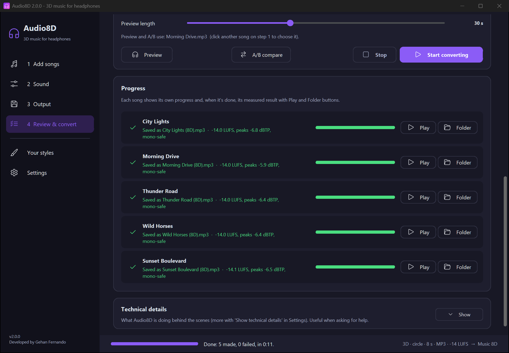
</p>

> [!TIP]
> 🎁 **Easiest (Windows): the standalone app.** Unzip the `Audio8D` folder anywhere and double-click **`Audio8D.exe`**. Python, FFmpeg and everything else are already inside, so there is nothing to install. 👉 [The standalone app](#-the-standalone-app-audio8dexe)
>
> 🚀 **Running from the source code?** Check you have [Python](#step-1-get-python) and [the window's two helpers](#step-3-add-the-windows-two-helpers), then **double-click `Audio8D.pyw`** in the `8D` folder. Drag your songs in, press **Next** three times, then **Start converting**. 👉 [Open the Audio8D window](#-6-open-the-audio8d-window)
>
> ⌨️ **Prefer typing?** Everything the window does also works in **Windows Terminal**: `python src\__main__.py "My Song.mp3" --preset studio`. 👉 [The terminal app](#-16-the-terminal-app)

> [!IMPORTANT]
> 🎧 **Always listen with headphones.** The effect only works when each ear hears its own sound. On speakers you will not feel it (though the [`speakers` style and the "Safe for speakers too" switch](#-speakers-and-car-stereos) make a version that still sounds good there).

---

## 📚 What's inside this guide

The first parts need no technical knowledge at all. **New here? Read parts 3 to 7 in order.** The terminal app has its own part (16), and the last parts are for programmers.

| 🌱 Understand it | 🧰 Get ready | 🪟 Use the window |
|---|---|---|
| 1. [What is Audio8D?](#-1-what-is-audio8d) | 3. [What you need](#-3-what-you-need) | 7. [**Your first 8D song, step by step**](#-7-your-first-8d-song-step-by-step) |
| 2. [What's new in 2.0](#-2-whats-new-in-20) | 4. [Where is everything?](#-4-where-is-everything) | 8. [Your styles and Settings](#-8-your-styles-and-settings) |
| | 5. [Set up, step by step](#-5-set-up-step-by-step) | 9. [Every setting, explained](#-9-every-setting-explained) |
| | 6. [**Open the Audio8D window**](#-6-open-the-audio8d-window) | 10. [🏆 Best quality and sound styles](#-10-best-quality-and-sound-styles) |
| | | 11. [Which files go in and out?](#-11-which-files-go-in-and-out) |
| | | 12. [Loudness: why is my song quieter?](#-12-loudness-why-is-my-song-quieter) |
| | | 13. [Check your new song](#-13-check-your-new-song) |

| 🆘 Help | ⌨️ Terminal | 👩‍💻 For programmers | 👋 The end |
|---|---|---|---|
| 14. [When something goes wrong](#-14-when-something-goes-wrong) | 16. [**The terminal app**](#-16-the-terminal-app) | 20. [Use it from Python](#-20-for-programmers-use-it-from-python) | 22. [Remove Audio8D](#-22-remove-audio8d) |
| 15. [How your files stay safe](#-15-how-your-files-stay-safe) | 17. [Window ↔ terminal checklist](#-17-window--terminal-checklist) | 21. [Tests and code](#-21-for-programmers-tests-and-code) | 23. [Credits](#-23-credits) |
| 18. [Questions people ask](#-18-questions-people-ask) | | | |
| 19. [Word helper](#-19-word-helper) | | | |

> 💡 **Met a word you don't know?** The [Word helper](#-19-word-helper) explains every technical word in this guide in one simple line.

---

## 🎧 1. What is Audio8D?

### 🗣️ Imagine this

Imagine your favourite singer is standing **in front of you**. 🗣️

Now imagine they **slowly walk around you**: past your right ear 👂, **behind** your head, past your left ear, and back in front… again and again. 🚶‍♂️🔄

That feeling is called **8D audio**. **Audio8D makes it for you**, from any song you already have.


```mermaid
flowchart LR
    A(["🎵 Your normal song<br/>or a whole folder"]):::a --> B["🎧 Audio8D"]:::b --> C(["🌀 New songs that<br/>fly around your head"]):::c

    classDef a fill:#1e1e3f,stroke:#00d4ff,color:#fff
    classDef b fill:#7b2ff7,stroke:#5a1fc0,color:#fff
    classDef c fill:#2ea44f,stroke:#1f7a38,color:#fff
```

### 🤔 How does the trick work?

Your brain works out where a sound comes from with **three clues**. Audio8D gives it all three, changing them smoothly 200 times a second as the sound moves:

| Clue | What happens in real life | What Audio8D does |
|---|---|---|
| ⏱️ **Time** | A sound on your right reaches your right ear up to **0.66 thousandths of a second** before your left ear | Delays the far ear by exactly that much for the low and middle notes |
| 🔊 **Loudness** | Your head is in the way, so the far ear hears it quieter, **especially the high notes** | Turns the far ear down, a little for low notes and a lot for high notes |
| 🎨 **Colour** | From **behind**, your outer ear makes a sound slightly duller. From **above**, a band of high notes gets brighter | Dulls the sound as it passes behind you, and brightens it as it rises (the **Height** setting) |

On top of that it keeps the **bass in the middle** (like a real mix, so the beat stays solid), adds a small natural **room** (reverb) so the music feels *outside* your head, and makes sure the result is never too loud or crackly. ✨

> [!NOTE]
> "8D" is just a fun name. There are **not** 8 of anything. It is a clever trick that uses your **2** ears. Audio8D 1.0 only did the loudness clue (left-right "ping-pong"). Version 2 does all three, which is why the sound now goes **around** you and **behind** you. The old sound is still there as the [`retro` style](#all-ready-made-styles).

---

## 🆕 2. What's new in 2.0

Making a good 8D song by hand is hard: you need the right effects in the right order, simple 8D makers move the bass (so the beat wobbles), the result is often too quiet or crackly, and album art gets lost. Audio8D 2.0 does all of it for you, now in **a proper window**.

<table>
<tr>
<td width="50%" valign="top">

**🪟 The Audio8D window**
- 🧭 A **4-step guided workflow**: Add songs → Sound → Output → Review & convert
- 🖱️ **Drag and drop** songs and folders from File Explorer
- 💬 **Every control explains itself**, with a tooltip and a line of help, and the **recommended value is already set**
- ✅ **Checks your choices** before it starts, with a **Fix it** button that jumps to the problem
- 🙈 **Only shows what applies**: e.g. the MP3 quality appears only for MP3, the tempo box only with beat sync
- 📊 **A progress bar per song**, then its **measured result** with **Play** and **Folder** buttons
- ⏹️ **Stop** at any time; finished songs are kept
- 🎧 **Preview** and **A/B compare** before the full song
- 💾 **Your own styles**, saved and reused
- 🌗 **Light, dark or system theme**, and 90 % to 125 % size
- ⌨️ **Keyboard shortcuts** for the common actions

</td>
<td width="50%" valign="top">

**🎵 The sound and the files**
- 🧠 **Real 3D head model** (time + loudness + colour clues)
- 🥁 **Bass stays in the middle**, like every professional mix
- 🔙 **Front and back**, and ⛰️ **height** over your head
- 🏛️ **A real room**: convolution reverb
- 🥁 **Beat sync**, 🎤 **singer in the middle** (AI), 🛣️ **4 paths** in either direction
- 📈 **Changes over time**: faster in the chorus, stronger in the bridge
- 🔊 **As loud as Spotify**, or **the same loudness as the original** (new `hifi` style)
- 📚 **Whole folders**, several songs at once, sub-folders kept
- ♻️ **Replace the originals** (they go to the **Recycle Bin**, and are never deleted for good)
- 💿 **5 formats**: MP3, FLAC, WAV, M4A, Opus. 🖼️ **Album art kept**
- ✂️ **Trim**, ✅ **automatic quality check**, ⚡ **remembered measurements**

</td>
</tr>
</table>

### 🔀 Coming from the terminal version?

> [!NOTE]
> **Nothing you know stops working.** The terminal app is still there, with every option it had, and it still opens in Windows Terminal ([part 16](#-16-the-terminal-app)). The window is a new, easier front door to **exactly the same engine**:
>
> - `python src\__main__.py --gui` (or `audio8d --gui`) opens the window. The old small Tkinter window has been replaced by the new one.
> - Every terminal option has a control in the window: see the [window ↔ terminal checklist](#-17-window--terminal-checklist).
> - Styles you saved with `--save-preset` appear in the window, and styles saved in the window work with `--preset NAME`. They share one `presets.toml` file.
> - The window needs two extra packages, **CustomTkinter** and **Pillow** ([Step 3](#step-3-add-the-windows-two-helpers)). The terminal app still needs no extra packages.
> - **New everywhere:** the `hifi` style and `--loudness match` ("Same as original" in the window) keep the song's own loudness, and `--bitrate auto` hands MP3 back to its variable quality.
> - **FFmpeg has moved** from the `src` folder to **`bin\executable`**. If you keep your own copies of `ffmpeg.exe` and `ffprobe.exe`, put them there.
> - **New:** a [standalone `Audio8D.exe`](#-the-standalone-app-audio8dexe) that needs no Python, and a [technical log file](#-the-log-file) for troubleshooting.

---

## 🧺 3. What you need

> [!NOTE]
> **Using the standalone `Audio8D.exe`?** You need only **Windows 10 or 11 (64-bit)** and **headphones**. Python, FFmpeg, FFprobe and the window's packages are all inside the `Audio8D` folder, so skip straight to [the standalone app](#-the-standalone-app-audio8dexe). The rest of this part is for running Audio8D from its source code.

| | Thing | What it is | Do I have it? |
|:---:|---|---|---|
| 🐍 | **Python** 3.10 or newer | Free software that runs Audio8D | [Step 1](#step-1-get-python) shows you how to check |
| 🎬 | **FFmpeg** and **FFprobe** | Free helper programs that open, read, change and save music files | Windows: ✅ **already inside** the `bin\executable` folder. macOS/Linux: one install command ([Step 2](#step-2-check-the-helper-programs)) |
| 🪟 | **CustomTkinter** and **Pillow** | Two small Python packages that draw the window and its icons | One command ([Step 3](#step-3-add-the-windows-two-helpers)). *Not needed for the terminal app.* |
| 🎧 | **Headphones** | Any normal pair or earbuds | You probably do 😊 |
| 🎤 | *Optional:* **Demucs** | A free AI model that separates the singer from the music. Only needed for "Keep the singer in the middle". Big download (about 1 GB) | `python -m pip install demucs` ([details](#-singer-in-the-middle)) |

### Which computers does it run on?

| Computer | Works? | What's different |
|---|:---:|---|
| 🪟 **Windows 10 / 11** | ✅ | The **standalone `Audio8D.exe`** needs nothing installed (64-bit Windows). From source, FFmpeg is included and you **double-click `Audio8D.pyw`**. Drag-and-drop from File Explorer works. The terminal app opens in **Windows Terminal**. Replaced originals go to the **Recycle Bin**. |
| 🍎 **macOS** | ✅ | Install FFmpeg once with `brew install ffmpeg`. Type **`python3`** where this guide says `python`, and use `/` instead of `\` in paths. Add songs with the **Add songs** / **Add folder** buttons (drag-and-drop from Finder is Windows-only). Replaced originals go to the **Trash**. |
| 🐧 **Linux** | ✅ | Install FFmpeg (e.g. `sudo apt install ffmpeg`) and Tk (`sudo apt install python3-tk`). Type **`python3`** where this guide says `python`. Add songs with the buttons. Replaced originals go to the desktop **Trash**. |

### 💬 What is a terminal?

A **terminal** is a window where you type instructions (called **commands**) and press <kbd>Enter</kbd>. You need one **only for setting up** (Steps 1 to 3), or if you choose the [terminal app](#-16-the-terminal-app).

| Computer | The terminal to use | How to open it |
|---|---|---|
| 🪟 Windows | **Windows Terminal** (it runs **PowerShell** inside) | Press the <kbd>⊞ Windows</kbd> key, type `terminal`, press <kbd>Enter</kbd>. Or right-click a folder → **Open in Terminal** |
| 🍎 macOS | **Terminal** | Press <kbd>⌘ Cmd</kbd>+<kbd>Space</kbd>, type `terminal`, press <kbd>Enter</kbd> |
| 🐧 Linux | **Terminal** | Press <kbd>Ctrl</kbd>+<kbd>Alt</kbd>+<kbd>T</kbd> on most systems |

> [!IMPORTANT]
> 🪟 **Windows: please use Windows Terminal, not the old Command Prompt (`cmd.exe`) window.** Every command in this guide was run in **Windows Terminal** with **PowerShell** inside it. **No Windows Terminal?** Get it free from the [Microsoft Store](https://aka.ms/terminal), or run `winget install Microsoft.WindowsTerminal`.

> [!NOTE]
> 📁 **About the folder paths in this guide:** the examples use the author's folders, like `C:\Gehan\Projects\Python_Projects\8D` (the project) and `C:\Users\Gehan\Music` (songs). Use **your own** folders in their place.

---

## 📍 4. Where is everything?

The whole project lives in **one folder** called **`8D`**. You don't need to open the code files; this map just helps you find your way around.

```text
📁 C:\Gehan\Projects\Python_Projects\8D      ← the main folder (the "root")
│
├── 🪟 Audio8D.pyw           ← DOUBLE-CLICK ME to open the Audio8D window
├── 📄 README.md             ← this guide
├── ⚙️ pyproject.toml        ← tells Python how to install Audio8D
├── 🙈 .gitignore            ← tells Git which files to ignore (your songs, for example)
├── 📁 docs\images\          ← the screenshots in this guide
│
├── 📁 bin\executable\       ← 🎬 ffmpeg.exe and ffprobe.exe, the sound tools Audio8D uses
├── 📁 packaging\            ← builds the standalone Audio8D.exe (see part 21)
├── 📄 THIRD-PARTY-NOTICES.md ← the software Audio8D ships with, and its licences
├── 📁 licenses\            ← the full licence texts
├── 📁 dist\Audio8D\         ← the standalone app, once you've built it
│
├── 📁 src\                  ← 💙 ALL THE PROGRAM CODE IS HERE
│   ├── ▶️ __main__.py       ← the start button for the terminal app (and --gui for the window)
│   ├── gui.py               ← opens the window (and says what to install if a part is missing)
│   ├── gui_app.py           ← the window: its pages, buttons and progress rows
│   ├── gui_model.py         ← the window's settings, checks and plain-word summaries
│   ├── gui_widgets.py       ← the window's building blocks: cards, sliders, tooltips, dialogs
│   ├── gui_layout.py        ← checks that no control ever overlaps another
│   ├── dropfiles.py         ← drag-and-drop from File Explorer (Windows)
│   ├── pipeline.py          ← the main "conveyor belt" for one song
│   ├── batch.py             ← many songs at once
│   ├── cli.py · options.py · guided.py · display.py · launcher.py · hints.py
│   │                        ← the terminal app (see part 16)
│   ├── cache.py             ← remembers loudness measurements
│   ├── logs.py              ← the technical log file, and a record of any crash
│   ├── 📁 assets\           ← the app icon
│   ├── 📁 core\             ← settings, ready-made styles, your own styles, errors
│   ├── 📁 effects\          ← the 3D sound: head model, paths, room, filter graph
│   ├── 📁 analysis\         ← tempo, loudest part, quality check, vocal separation
│   ├── 📁 ffmpeg\           ← code that talks to ffmpeg.exe and ffprobe.exe
│   └── 📁 files\            ← code that keeps your files safe (and the Recycle Bin)
│
└── 📁 tests\                ← 🧪 automatic checks that the program works
```

> [!TIP]
> **"I can't find a folder called `audio8d`!"** That's correct. 😊 `audio8d` is the **nickname** Python uses for the `src` folder, and the name of the **command** you get after installing ([Way C](#way-c--install-it-the-audio8d-gui-command)). Python names can't start with a number, so the folder itself can't be called `8D`.

---

## 🪜 5. Set up, step by step

You do this **only once**. Follow the steps **in order**. 🐢

### Step 1: Get Python

1. Open a terminal ([how?](#-what-is-a-terminal)). On Windows, that's **Windows Terminal**.
2. Type this and press <kbd>Enter</kbd>:

   | Computer | Type |
   |---|---|
   | 🪟 Windows | `python --version` |
   | 🍎 macOS / 🐧 Linux | `python3 --version` |

3. Look at the answer:
   - ✅ `Python 3.10` or a bigger number (`3.11`, `3.12`, `3.13` …)? **Great, go to Step 2.**
   - ❌ An error, or a number smaller than `3.10`? Install Python:

<details open>
<summary><b>🪟 Install Python on Windows</b></summary>

1. Go to **[python.org/downloads](https://www.python.org/downloads/)** and click the big yellow **Download Python** button.
2. Open the file you downloaded.
3. ⚠️ **Very important:** on the first screen, **tick "Add python.exe to PATH"**. (PATH is the list of places the terminal searches for programs.)
4. Click **Install Now** and wait until it finishes. Python from python.org already includes **Tk**, which the window is built on.
5. **Close** Windows Terminal, open a **new** one, and try `python --version` again.

💡 **`python` still not found?** Try **`py --version`**. `py` is the Python starter that comes with Python from python.org; use it in place of `python` in every command.

</details>

<details>
<summary><b>🍎 Install Python on macOS</b></summary>

Download the macOS installer from **[python.org/downloads](https://www.python.org/downloads/)** and run it (it includes Tk, which the window is built on). Then open a new Terminal and try `python3 --version` again.

</details>

<details>
<summary><b>🐧 Install Python on Linux</b></summary>

Most Linux systems already have Python 3. Add the venv tool and Tk (the window is built on Tk), for example on Ubuntu/Debian:

```bash
sudo apt install python3 python3-venv python3-tk
```

</details>

### Step 2: Check the helper programs

Audio8D uses two free helper programs, **FFmpeg** (changes and saves sound) and **FFprobe** (reads information about a song). Audio8D **looks in the `bin\executable` folder first**. If they aren't there, it looks for FFmpeg installed on the whole computer (on your PATH).

**🪟 On Windows** they are normally already included. Open File Explorer and go to:

```text
C:\Gehan\Projects\Python_Projects\8D\bin\executable
```

You should see both **`ffmpeg.exe`** and **`ffprobe.exe`**. Both there? **Perfect, go to Step 3.** 🎉

**🍎🐧 On macOS and Linux** the `.exe` files don't work. Install FFmpeg once for the whole computer:

| Computer | Type this in the terminal |
|---|---|
| 🍎 macOS | `brew install ffmpeg` |
| 🐧 Linux (Ubuntu/Debian) | `sudo apt install ffmpeg` |

<details>
<summary><b>😟 Windows: the two files are missing. What do I do?</b> (click to open)</summary>

Pick **one** of these:

**🅰️ Put them in the `bin\executable` folder (easiest):**
1. Go to **[gyan.dev/ffmpeg/builds](https://www.gyan.dev/ffmpeg/builds/)**.
2. Download **`ffmpeg-release-essentials.zip`**.
3. Open the zip, then its **`bin`** folder.
4. Copy **`ffmpeg.exe`** and **`ffprobe.exe`** into `C:\Gehan\Projects\Python_Projects\8D\bin\executable`.

**🅱️ Install FFmpeg for the whole computer:**
```powershell
winget install Gyan.FFmpeg
```
Then close Windows Terminal and open a new one.

</details>

💡 The window's **Settings** page shows whether FFmpeg was found, and where ([part 8](#-settings)).

### Step 3: Add the window's two helpers

The window is drawn with **[CustomTkinter](https://github.com/TomSchimansky/CustomTkinter)** (modern buttons, sliders and themes) and **[Pillow](https://python-pillow.org/)** (the icons). Install them once:

| Computer | Type this in the terminal |
|---|---|
| 🪟 Windows | `python -m pip install customtkinter pillow` |
| 🍎 macOS / 🐧 Linux | `python3 -m pip install customtkinter pillow` |

✅ **Success looks like:** `Successfully installed customtkinter-… pillow-…` (or `Requirement already satisfied`).

<details>
<summary><b>😟 macOS/Linux says <code>externally-managed-environment</code></b></summary>

Newer systems don't let pip install into the main Python. Use a **virtual environment** instead: [Way D](#way-d--in-a-virtual-environment) sets everything up in one go.

</details>

> [!NOTE]
> Forgot this step? No problem: the window tells you exactly what to install, and the terminal app works without these packages.

**🎉 Setup done! Now open the window.**

---

## 🪟 6. Open the Audio8D window

### 🎁 The standalone app: Audio8D.exe

**The easiest way on Windows.** The standalone app is a folder called **`Audio8D`** that holds everything Audio8D needs: its own copy of Python, the window's packages, FFmpeg and FFprobe. **Nothing has to be installed**, not even Python, and it doesn't touch any Python or FFmpeg already on your computer.

**What's in the folder:**

```text
📁 Audio8D\
├── 🪟 Audio8D.exe         ← DOUBLE-CLICK ME: the Audio8D window
├── ⌨️ audio8d-cli.exe     ← the terminal app (for Windows Terminal, see part 16)
├── 📄 README.md           ← this guide ("Open the full guide" in Settings opens it)
├── 📁 docs\images\        ← the pictures in this guide
├── 📁 bin\executable\     ← ffmpeg.exe and ffprobe.exe, used by both programs
├── 📄 THIRD-PARTY-NOTICES.md ← what else is inside, and its licences
├── 📁 licenses\           ← the full licence texts (FFmpeg's GPL, Python, CustomTkinter…)
└── 📁 _internal\          ← Python, CustomTkinter, Pillow, Tk and the Audio8D code
```

**How to use it:**

1. **Get the folder.** Unzip **`Audio8D-2.0.0-windows.zip`** (right-click → **Extract All…**), or [build it yourself](#-build-the-standalone-app) from the source code.
2. **Put it anywhere you like**, for example `C:\Programs\Audio8D`, your Documents, or a USB stick. It runs from wherever it is.
3. **Double-click `Audio8D.exe`.** The window opens (it takes a few seconds the first time). Then follow [part 7](#-7-your-first-8d-song-step-by-step).
4. 💡 **Drop songs or folders onto `Audio8D.exe`** in File Explorer to open the window with them already listed.
5. 💡 **Want a Start-menu or desktop shortcut?** Right-click `Audio8D.exe` → **Send to → Desktop (create shortcut)**, or **Pin to Start**.

| | |
|---|---|
| **Needs** | Windows 10 or 11, 64-bit, about 260 MB of disk space. Nothing else |
| **Keep together** | The files in the `Audio8D` folder belong together. Copy or move **the whole folder**, never `Audio8D.exe` on its own |
| **FFmpeg** | Always the copy in `Audio8D\bin\executable`. If it's missing, Audio8D says so and uses FFmpeg installed on the computer instead, if there is one |
| **Your settings** | Saved styles, remembered measurements and the log live in your Windows profile (`%APPDATA%\Audio8D` and `%LOCALAPPDATA%\Audio8D`), so they survive when you replace the folder with a newer version |
| **Not included** | *Keep the singer in the middle* (it needs a 1 GB AI model and a Python install). The window shows it greyed out with this reason. Use the source-code version if you need it |
| **Other computers** | The standalone app is for Windows. On macOS and Linux, run Audio8D from its source code (Ways B to D below) |

> [!NOTE]
> 🛡️ **"Windows protected your PC"?** If the zip came from the internet, Windows SmartScreen may warn you the first time, because the app isn't signed with a paid certificate. If you trust where it came from, click **More info → Run anyway**. It only asks once.

### The source-code version

Running from the `8D` source folder instead? There are **four ways** to open the same window. Pick the one you like. 😊

| | 🖱️ Way A<br/>Double-click | ⌨️ Way B<br/>One command | 📦 Way C<br/>Install it | 🗃️ Way D<br/>Virtual env |
|---|:---:|:---:|:---:|:---:|
| **Installs anything?** | No | No | Yes | Yes (in a private box) |
| **Typing needed?** | None | 1 command | 1 command, once | A few commands, once |
| **You open it with** | Double-click `Audio8D.pyw` | `python src\__main__.py --gui` | `audio8d-gui` | `audio8d-gui` (box open) |
| **Windows / macOS / Linux** | Windows | ✅ all | ✅ all | ✅ all |

### Way A · Double-click (Windows)

**No typing at all!** 🖱️

1. 📂 Open **File Explorer** and go into the **`8D`** folder.
2. 🖱️ **Double-click `Audio8D.pyw`**.
   - Windows asks which app to use? Choose **Python**.
   - It opened in an editor instead? Right-click `Audio8D.pyw` → **Open with → Python** (or **pythonw**).
3. 🪟 The Audio8D window opens, with **no black console window** behind it.

💡 **Even faster:** drag songs or a folder and **drop them onto `Audio8D.pyw`** in File Explorer. The window opens with those songs already in the list.

### Way B · One command, no install

From **Windows Terminal** in the `8D` folder (right-click the `8D` folder in File Explorer → **Open in Terminal**):

```powershell
python src\__main__.py --gui
```

(macOS/Linux: `python3 src/__main__.py --gui`.) Add songs or folders after `--gui` to open the window with them already listed.

### Way C · Install it (the `audio8d-gui` command)

This installs Audio8D **with the window's helpers** in one go, and teaches your computer two commands: **`audio8d-gui`** (the window, with no terminal at all) and **`audio8d`** (the [terminal app](#-16-the-terminal-app); `audio8d --gui` opens the window too). The `-e` means it runs straight from your `8D` folder, so nothing is copied.

In Windows Terminal in the `8D` folder:

```powershell
python -m pip install -e ".[gui]"
audio8d-gui
```

✅ **Success looks like:** `Successfully installed audio8d-2.0.0 …`, then the window opens.

<details>
<summary><b>😟 <code>audio8d-gui</code> isn't found after installing</b></summary>

pip put the command in a folder your terminal doesn't search (it prints a yellow *"…Scripts is not on PATH"* warning). Use `python -m audio8d --gui` instead, which always works, or add that folder to your PATH.

</details>

> [!WARNING]
> **Moved the `8D` folder after installing?** Install again: the install remembers the *old* place. After installing you'll also see an **`audio8d.egg-info`** folder inside `8D`; that's Python's receipt for the install, so leave it alone.

### Way D · In a virtual environment

A **virtual environment** ("venv") is a private box just for this project, so it never mixes with your other Python things. 📦

| Step | 🪟 Windows (PowerShell in Windows Terminal) | 🍎 macOS / 🐧 Linux |
|---|---|---|
| **1️⃣ Make the box** (once) | `python -m venv .venv` | `python3 -m venv .venv` |
| **2️⃣ Open the box** (every new terminal) | `.\.venv\Scripts\Activate.ps1` | `source .venv/bin/activate` |
| **3️⃣ Install Audio8D and the window** (once) | `python -m pip install -e ".[gui]"` | `python -m pip install -e ".[gui]"` |
| **4️⃣ Open the window** | `audio8d-gui` | `audio8d-gui` |

<details>
<summary><b>😟 Red error: "running scripts is disabled on this system"</b></summary>

Type this **once**, press <kbd>Enter</kbd>, answer **`Y`**, then open the box again:

```powershell
Set-ExecutionPolicy -Scope CurrentUser RemoteSigned
```

</details>

### ✅ It worked if…

The **Audio8D** window opens on **Step 1 of 4 · Add your songs**:

<p align="center">
  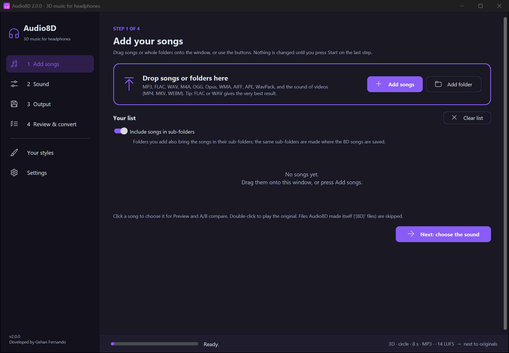
</p>

| Part of the window | What it is |
|---|---|
| **Sidebar** (left) | The four steps in order, then **Your styles** and **Settings**. Click any of them at any time |
| **The page** (middle) | The current step. Every control has a line of help under it and a tooltip when you rest the mouse on it |
| **Status bar** (bottom) | Overall progress, what's happening now, and a short summary of your choices (e.g. *3D · circle · 8 s · MP3 · -14 LUFS → next to originals*) |

😟 **It didn't open?** See [When something goes wrong](#-the-window-doesnt-open).

---

## 🚀 7. Your first 8D song, step by step

Follow the four steps **from top to bottom**. The best choices are **already selected**, so you can simply press **Next** each time. You can't break anything: nothing is changed until you press **Start converting**, and your originals are **kept** unless you choose otherwise.


```mermaid
flowchart LR
    A(["🎵 1 · Add songs"]):::a --> B["🎨 2 · Sound"]:::b --> C["💾 3 · Output"]:::c --> D["✅ 4 · Review<br/>& convert"]:::d --> E(["🎧 Your 8D songs!"]):::e

    classDef a fill:#1e1e3f,stroke:#00d4ff,color:#fff
    classDef b fill:#7b2ff7,stroke:#5a1fc0,color:#fff
    classDef c fill:#4f8bff,stroke:#2a5fd0,color:#fff
    classDef d fill:#ff4fd8,stroke:#c0209f,color:#fff
    classDef e fill:#2ea44f,stroke:#1f7a38,color:#fff
```

### Step 1 · Add your songs 🎵

Add songs in whichever way you like:

- 🖱️ **Drag songs or whole folders** from File Explorer and drop them anywhere on the window (Windows).
- ➕ **Add songs** (<kbd>Ctrl</kbd>+<kbd>O</kbd>) picks one or more files; 📁 **Add folder** (<kbd>Ctrl</kbd>+<kbd>Shift</kbd>+<kbd>O</kbd>) adds every song in a folder.
- 🌳 **Include songs in sub-folders** (on by default) also brings the songs in sub-folders, and the same sub-folders are made where the 8D songs are saved.

<p align="center">
  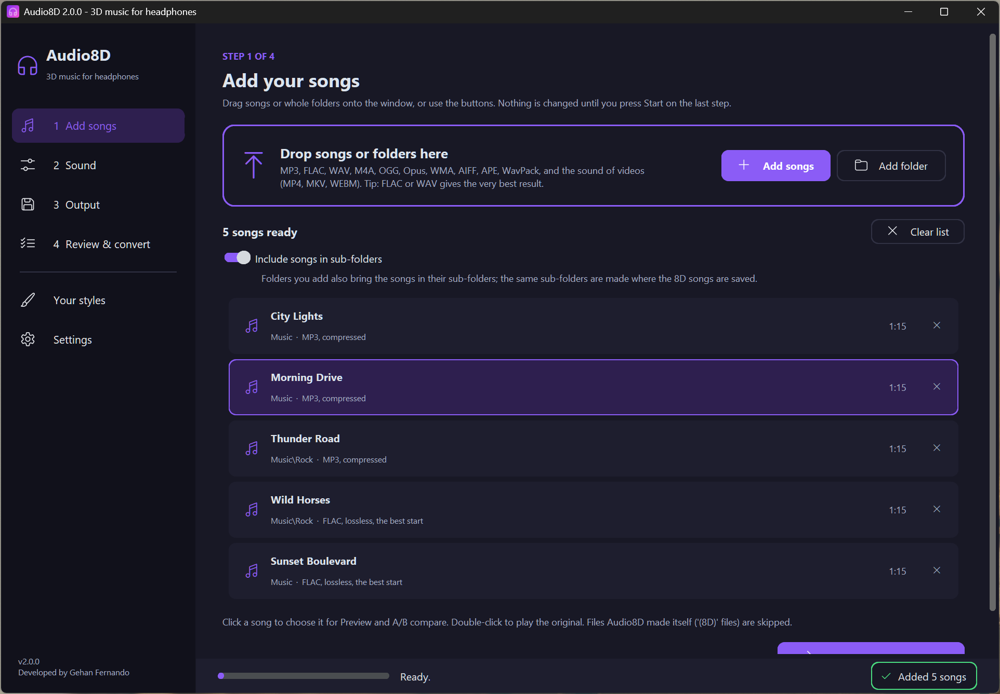
</p>

Each row shows the song's folder, **what kind of file it is** (e.g. *FLAC, lossless, the best start* or *MP3, compressed*), and its length. A file that can't be read as music shows a red **!** and *Can't be read as music - it will fail*.

| To… | Do this |
|---|---|
| Choose the song used for Preview and A/B compare | **Click** it (it gets a purple outline) |
| Hear the original | **Double-click** it |
| Take one off the list | Click its **✕** (the file itself is not touched) |
| Start again | **Clear list** |

💡 **Skipped automatically:** files that aren't music (with a note), songs already in the list, and files Audio8D made itself (`(8D)`, `(8D preview)`, `(A-B compare)`, and originals it kept as `(original)`).
💡 **Long lists** show 25 songs at a time, with *Showing 25 of 300 songs. All 300 will be converted.* and a **Show 25 more** button underneath. Every song on the list is converted, shown or not.
💡 **Use the best copy you have:** FLAC or WAV beats a 320 kbps MP3, which beats a smaller MP3. Copy-protected songs from streaming apps (Spotify, Apple Music `.m4p`) can't be converted.

Press **Next: choose the sound**.

### Step 2 · Choose the sound 🎨

**1. Pick a style.** A style is a ready-made set of settings. **`studio` ★ best** is already chosen: 3D sound, 320 kbps MP3, as loud as Spotify, dynamics untouched. Click another card to try something else. Your own saved styles appear here too, marked **(yours)**.

<p align="center">
  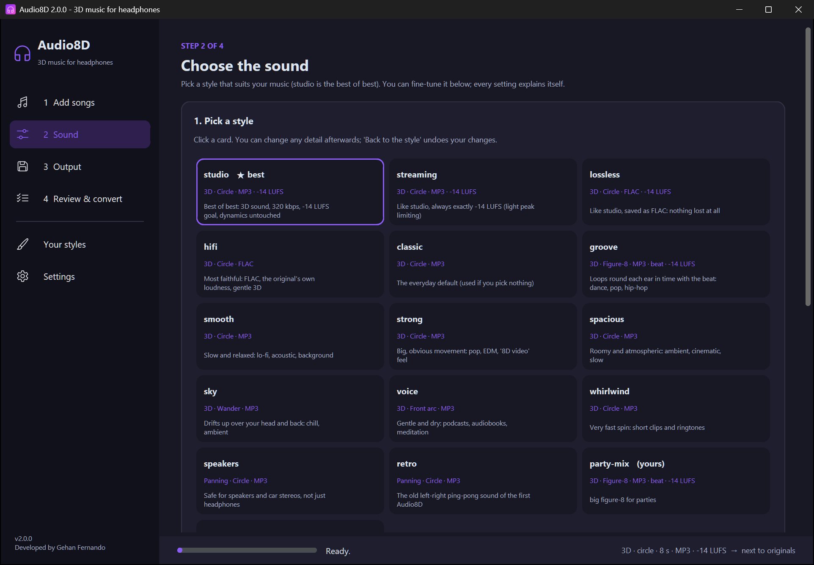
</p>

**2. The essentials.** The three settings that change the sound most, each with its recommended value in the help line:

<p align="center">
  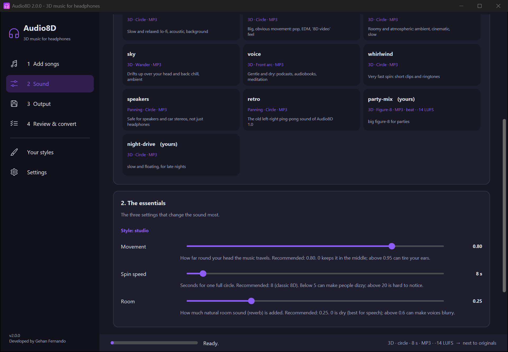
</p>

| Setting | What it does | Recommended |
|---|---|:---:|
| **Movement** | How far round your head the music travels (0 keeps it in the middle) | 0.80 |
| **Spin speed** | Seconds for one full circle. Below 5 can make people dizzy; above 20 is hard to notice | 8 s |
| **Room** | How much natural room sound (reverb). 0 is dry; above 0.6 can blur voices | 0.25 |

Changed something? The title shows **(changed by you)**, and **Back to the style** puts the style's values back.

**3. Advanced sound** (press **Show**). Everything else, already set to good values by the style:

<p align="center">
  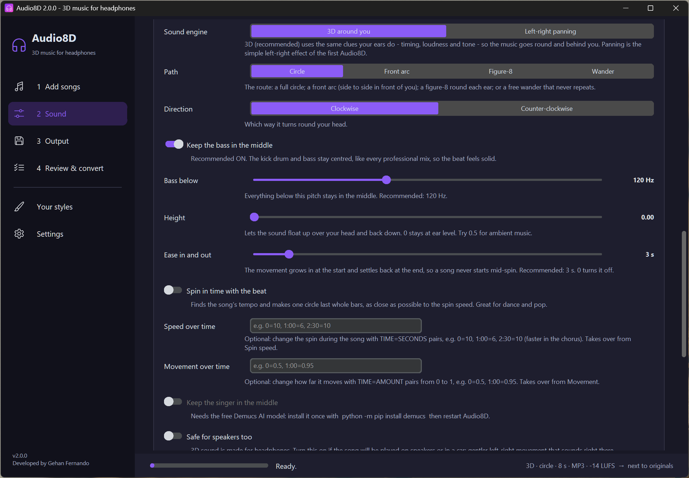
</p>

- Boxes you type in are **checked as you type**: the green line under *Speed over time* reads your text back in words, and a mistake turns it red with the reason.
- Controls that don't apply are **greyed out or hidden**: *Bass below* only matters with *Keep the bass in the middle* on; the *Tempo* box appears only with *Spin in time with the beat*; *Keep the singer in the middle* is greyed out until [Demucs](#-singer-in-the-middle) is installed, and says how to get it.
- While *Speed over time* is filled in, the **Spin speed** slider notes that the curve is in charge.

All of these are explained in [part 9](#-9-every-setting-explained). Press **Next: output options**.

### Step 3 · Output options 💾

<p align="center">
  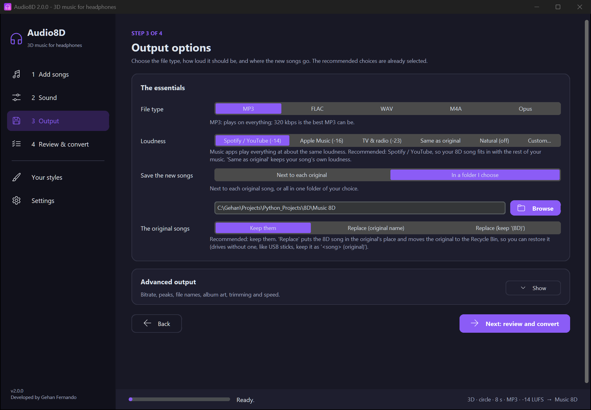
</p>

| Setting | Your choices | Recommended |
|---|---|---|
| **File type** | **MP3** plays everywhere (320 kbps, the best MP3 can be) · **FLAC** loses nothing · **WAV** for music software · **M4A** for Apple · **Opus** small and modern | MP3, or FLAC to lose nothing |
| **Loudness** | **Spotify / YouTube (-14)** · **Apple Music (-16)** · **TV & radio (-23)** · **Same as original** · **Natural (off)** · **Custom…** (type any value from -30 to -5) | Spotify / YouTube |
| **Save the new songs** | **Next to each original**, or **In a folder I choose** (type a path or **Browse**; it's created for you) | Your choice |
| **The original songs** | **Keep them** · **Replace (original name)** · **Replace (keep '(8D)')**. Replaced originals go to the **Recycle Bin**; on drives that have none (USB sticks, memory cards, network drives) the original stays in its folder, renamed `<song> (original)`. The window asks you to confirm first | Keep them |

**Advanced output** (press **Show**):

<p align="center">
  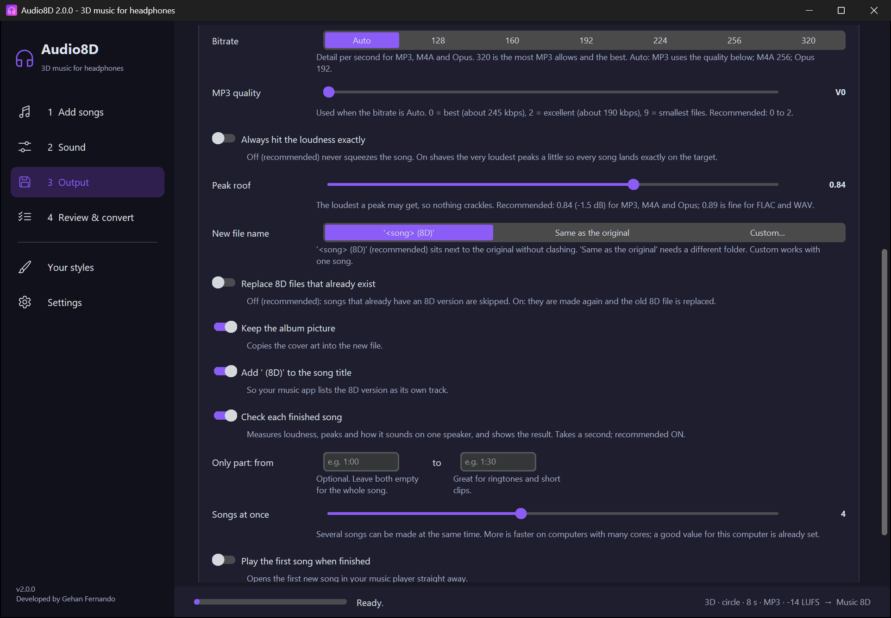
</p>

It holds the bitrate, MP3 quality (only shown for MP3 with bitrate *Auto*), *Always hit the loudness exactly*, the peak roof, the new file name, *Replace 8D files that already exist*, album picture, " (8D)" in the title, the automatic check, **Only part: from … to …** (trimming), **Songs at once**, and *Play the first song when finished*. Each is explained in [part 9](#-9-every-setting-explained).

💡 Choosing **FLAC** or **WAV** greys out the bitrate (lossless files don't use one), and choosing **Natural (off)** greys out *Always hit the loudness exactly*.

Press **Next: review and convert**.

### Step 4 · Review and convert ✅

**Your choices** lists everything in plain words, so you can check it at a glance:

<p align="center">
  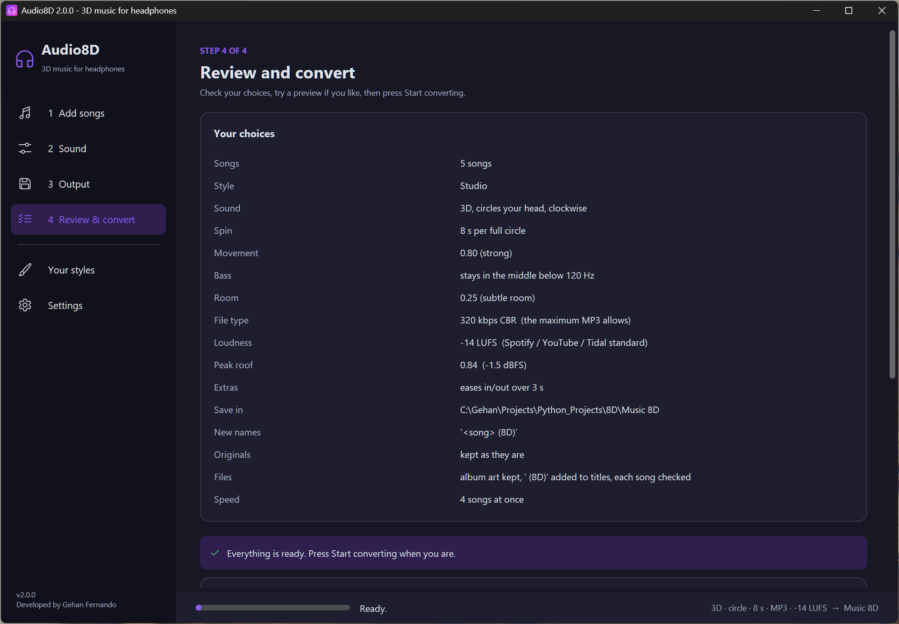 (8D)', originals kept, album art kept, 4 songs at once) and a purple note: Everything is ready" width="100%"/>
</p>

If something needs your attention, a **red note** says what and **Start converting** stays off until it's fixed. **Fix it** jumps straight to the right page. (Yellow notes are friendly warnings: you can still start.)

<p align="center">
  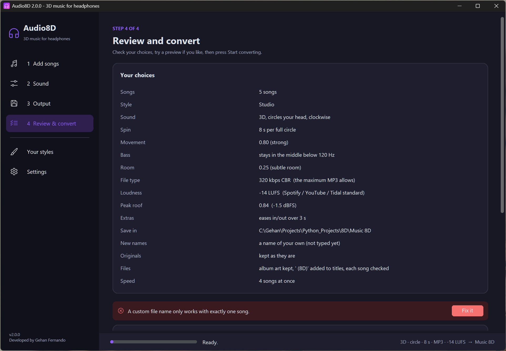
</p>

**Try it, then make it:**

| Button | What it does |
|---|---|
| 🎧 **Preview** (<kbd>Ctrl</kbd>+<kbd>P</kbd>) | Makes a short sample (10 to 60 s, set by **Preview length**) from the **loudest part** of the chosen song, usually the chorus, and plays it. It takes a few seconds |
| 🔀 **A/B compare** | Plays 15 s of the **original**, a short pause, then **the same 15 s in 8D**, both at the same loudness, so you hear only the effect |
| ▶️ **Start converting** (<kbd>Ctrl</kbd>+<kbd>Enter</kbd>) | Makes every song in the list |
| ⏹️ **Stop** (<kbd>Esc</kbd>) | Stops after the current step. Finished songs are kept; half-made files are cleaned up |

While it works, each song has its **own row** with what it's doing (*Making the 3D mix*, *Saving the file*, *Checking the result*) and a progress bar, and the **status bar** shows the overall progress and the time. The window stays responsive the whole time: you can scroll, read, or press **Stop**. With more than 25 songs, the first 25 have rows and one line counts the rest (*Songs 26 to 300: 120 made, 180 still to go.*); any of those that fails still gets its own row.

<p align="center">
  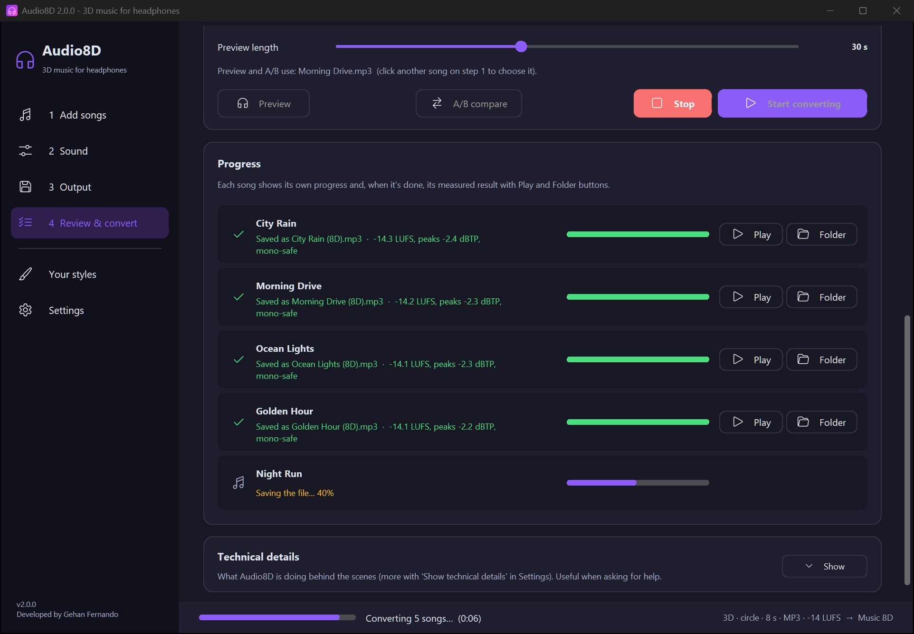
</p>

When every song is done, a message says how many were made and how long it took:

<p align="center">
  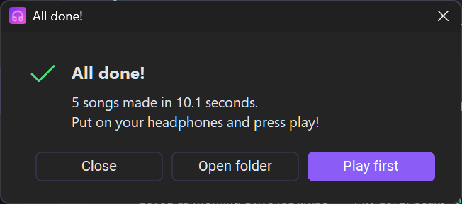
</p>

Each row then shows the **measured result**, e.g. *Saved as City Rain (8D).mp3 · -14.1 LUFS, peaks -2.2 dBTP, mono-safe*, with **Play** and **Folder** buttons (see the picture at the [top of this guide](#-audio8d)). What those numbers mean: [part 13](#-13-check-your-new-song). A song that failed shows the reason in red in one short line (e.g. *FFmpeg stopped: Permission denied*), with a **What to do:** line; the other songs carry on. The full technical details are in *Technical details* and in the [log file](#-the-log-file).

💡 **Technical details** (at the bottom of step 4) shows what Audio8D is doing behind the scenes. Handy if you ever need to ask for help.

### Step 5 · Listen! 🎧

1. Put on your **headphones** (L on the left ear).
2. Press **Play** on a finished row (or **Play first** in the message).
3. **Close your eyes.** In the first 3 seconds the movement **gently fades in**. Then, over about **8 seconds**, the music travels **in front → right ear → behind you → left ear → in front**. 🌀 The bass and kick drum stay **in the middle**.

🎉 **That's it, you made your 8D songs!** They're called **`<song> (8D).mp3`**, next to the originals or in the folder you chose. The song's **title** also gets " (8D)", so your music app shows both versions side by side, and the **album picture** comes along too.

### 🔁 Not quite right?

Change **one** thing on step 2, then press **Preview** on step 4:

| It sounds… | Try this on step 2 |
|---|---|
| 😵 Too strong or dizzy | The **smooth** style, or lower **Movement** |
| 🐌 Spinning too fast for a slow song | Raise **Spin speed** to 12 |
| 🥁 Not in time with the beat | **Spin in time with the beat** (Advanced), or the **groove** style |
| 😐 Hardly moving | Raise **Movement** to 0.95 *(and check you're on headphones)* |
| 🌫️ Too echoey | Lower **Room** to 0.15 |
| 🎤 The voice moves too much | **Keep the singer in the middle** (needs [Demucs](#-singer-in-the-middle)) |
| 🔉 Quieter than my other songs | Step 3: **Loudness → Spotify / YouTube (-14)** |
| 🚗 Sounds odd in my car | **Safe for speakers too**, or the **speakers** style |

Happy with it? Press **Start converting**. To make songs again that already have an 8D version, turn on **Replace 8D files that already exist** (step 3, Advanced output); otherwise they are skipped.

---

## 💾 8. Your styles and Settings

### 💾 Your styles

Found settings you love? Open **Your styles** in the sidebar, give them a **Name** (a-z, 0-9, `-` and `_`, e.g. `party-mix`) and an optional **Description**, and press **Save style**. Everything from steps 2 and 3 that shapes the sound and the file type is saved (not the songs, folders or file names).

<p align="center">
  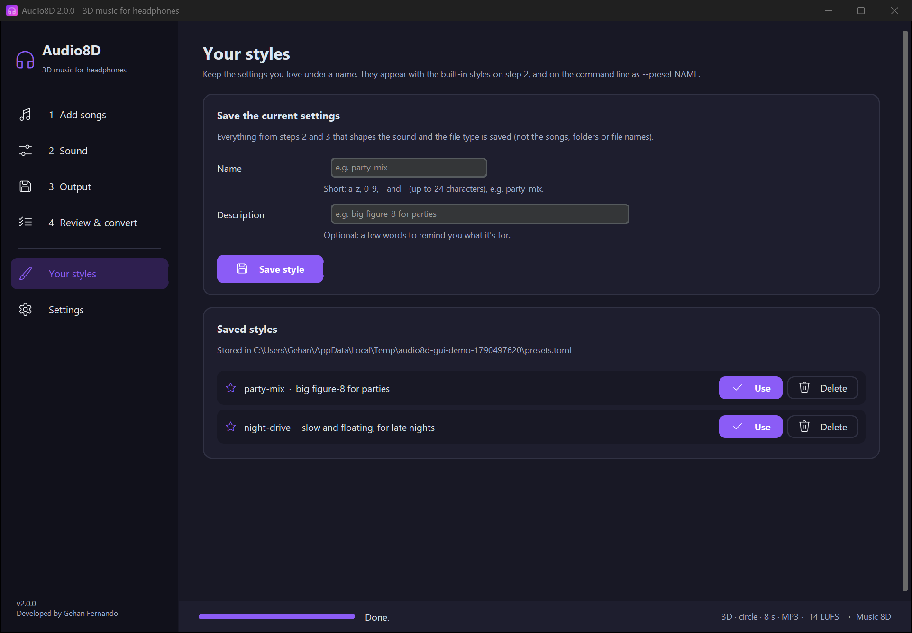
</p>

- **Use** loads a saved style (it's also a card on step 2, marked **(yours)**).
- If the styles file has a mistake (for example after editing it by hand), the window says so when it opens, and **Saved styles** names the line to fix. The built-in styles keep working meanwhile.
- **Delete** removes it, after asking.
- Saved styles work in the terminal app too (`--preset party-mix`), and styles saved in the terminal appear here. They live in one small text file, shown under **Saved styles** ([where exactly](#-your-own-styles-in-the-terminal)).

### 🔧 Settings

<p align="center">
  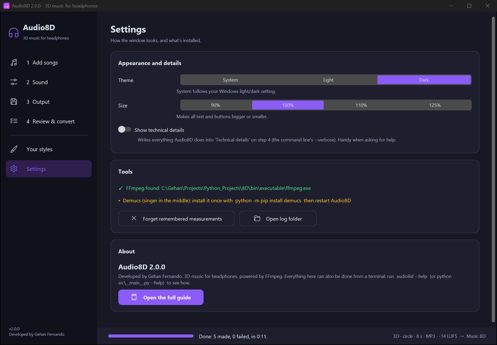
</p>

| Setting | What it does |
|---|---|
| **Theme** | **System** follows your Windows light/dark setting; or pick **Light** or **Dark** |
| **Size** | Makes all text and buttons bigger or smaller (90 % to 125 %). The layout adapts, so nothing overlaps at any size |
| **Show technical details** | Writes everything Audio8D does into *Technical details* on step 4 (like the terminal's `--verbose`) |
| **Tools** | Shows whether **FFmpeg** was found (and where) and whether **Demucs** is available, with how to get it |
| **Forget remembered measurements** | Clears the loudness measurements Audio8D remembers to make repeat conversions quicker |
| **Open log folder** | Opens the folder with Audio8D's [technical log](#-the-log-file). Handy when you ask someone for help |
| **Open the full guide** | Opens this README |

Here is the window in the **Light** theme:

<p align="center">
  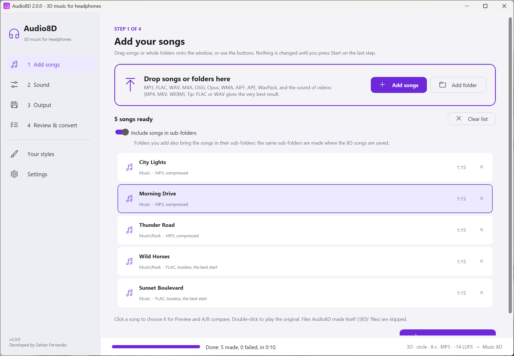
</p>

### ⌨️ Keyboard shortcuts

| Keys | Action |
|---|---|
| <kbd>Ctrl</kbd>+<kbd>O</kbd> / <kbd>Ctrl</kbd>+<kbd>Shift</kbd>+<kbd>O</kbd> | Add songs / Add folder |
| <kbd>Ctrl</kbd>+<kbd>1</kbd> … <kbd>Ctrl</kbd>+<kbd>6</kbd> | Go to step 1, 2, 3, 4, Your styles, Settings |
| <kbd>Ctrl</kbd>+<kbd>P</kbd> | Preview the chosen song |
| <kbd>Ctrl</kbd>+<kbd>Enter</kbd> | Start converting |
| <kbd>Esc</kbd> | Stop |

💡 **Closing the window while it works?** It asks first, then stops cleanly, keeping finished songs.

### 🗂️ Where Audio8D keeps things

Audio8D has no settings file to edit: every choice is made in the window (or typed in the terminal). It only writes these, all inside your own user profile:

| What | 🪟 Windows | 🍎 macOS | 🐧 Linux |
|---|---|---|---|
| **Your saved styles** (`presets.toml`, plain text) | `%APPDATA%\Audio8D` | `~/Library/Application Support/Audio8D` | `~/.config/audio8d` |
| **Remembered measurements** and singer splits (safe to delete) | `%LOCALAPPDATA%\Audio8D\cache` | `~/Library/Caches/Audio8D` | `~/.cache/audio8d` |
| **The technical log** | `%LOCALAPPDATA%\Audio8D\logs` | `…/Application Support/Audio8D/logs` | `~/.config/audio8d/logs` |

Your 8D songs go where you choose on step 3, never anywhere else.

**Optional switches** (environment variables, for special setups):

| Variable | What it does |
|---|---|
| `AUDIO8D_HOME` | Keeps styles, cache and log in this folder instead, e.g. a portable setup on a USB stick: `$env:AUDIO8D_HOME = "E:\Audio8D data"` before starting it from that terminal |
| `AUDIO8D_NO_WT` | Set to any value to stop the terminal app moving itself into Windows Terminal |
| `NO_COLOR` | Set to any value for plain terminal output without colours |

---

## 🧰 9. Every setting, explained

Every control in the window, what it does, the value that's already set, and the matching [terminal option](#-16-the-terminal-app). 🧑‍🍳 **Tip:** change **one** thing at a time, and try it with **Preview**.

### 🌀 Spin speed: how FAST it goes round

How many **seconds** for one full circle round your head. Smaller = faster 🌪️, bigger = slower 🐢.

| Value | Feels like |
|:---:|---|
| 2 – 4 | 🌪️ A merry-go-round at top speed. Fun but dizzy! |
| 6 – 10 | 🎠 The classic 8D feeling ⭐ |
| 12 – 20 | 🌊 Slow ocean waves, dreamy |
| 30 – 100 | 🌅 A very slow drift |

**Allowed:** 2 to 100 · **Best:** 8, or *Spin in time with the beat* · Terminal: `--rotation-seconds`

### 💪 Movement: how FAR it travels

| Value | Feels like |
|:---:|---|
| 0 | 🧍 Stays in the middle (no movement) |
| 0.5 – 0.7 | 🚶 A gentle sway |
| 0.8 – 0.9 | 🏃 Clear movement all round your head ⭐ |
| 0.95 – 1 | 🎢 As far as it goes, right into each ear |

**Allowed:** 0 to 1 · **Best:** 0.80 · Terminal: `--intensity`

### 🏛️ Room: how BIG the room is

A real **convolution reverb**: a short gap, a few early reflections, then a smooth tail that gets **softer and duller as it fades**, like a real room. The room stays **still** while the music moves, and it never touches the bass (so it never booms).

| Value | Feels like |
|:---:|---|
| 0 | 🛏️ No room at all (dry). Best for talking and podcasts |
| 0.2 – 0.35 | 🛋️ A cosy living room ⭐ (about 0.9 s of reverb) |
| 0.5 | 🏟️ A big hall (about 1.4 s) |
| 1 | ⛪ A giant church (about 2.2 s). Voices may become blurry |

**Allowed:** 0 to 1 · **Best:** 0.25 · Terminal: `--ambience`

### 🧭 Sound engine, Path and Direction

| Sound engine | What it does |
|:---:|---|
| **3D around you** ⭐ | The real 3D head model: time, loudness and colour clues. Goes **around** you and **behind** you |
| **Left-right panning** | Simple left-right volume panning (like Audio8D 1.0). Best for speakers |

| Path | The route | Try it for |
|:---:|---|---|
| **Circle** ⭐ | Front → right → behind → left → front | Everything |
| **Front arc** | Swings left ↔ right **through the front** only, like a pendulum | Podcasts, voice (`voice` style) |
| **Figure-8** | Loops round your **right** ear, then round your **left** ear | Dance, pop (`groove` style) |
| **Wander** | Drifts freely around you, never repeating exactly | Ambient, chill (`sky` style) |

**Direction:** clockwise (normal) or counter-clockwise. Terminal: `--engine`, `--path`, `--direction`.

### 🥁 Keep the bass in the middle · Bass below

Everything **below** this many **Hz** (the kick drum and bass guitar) stays in the **middle**, while everything above it moves. This is how professional mixes are made: a steady low end feels like solid ground, and moving bass tires your ears.

| Bass below | Effect |
|:---:|---|
| switch **off** | The bass moves too (the old Audio8D 1.0 sound) |
| 80 Hz | Only the deepest bass stays still |
| **120 Hz** ⭐ | Kick drum and bass guitar stay still, everything else moves |
| 200 – 250 Hz | Also the low piano and male voices stay still |

**Allowed:** 40 to 250 Hz · Terminal: `--bass` (`off` or a number)

### ⛰️ Height · 🌅 Ease in and out

- **Height** (0 to 1, normal 0): lets the sound **float up over your head and back down** once every two circles, by brightening the band of high notes your ears use for sounds above you. Try 0.5 for ambient music. Terminal: `--elevation`.
- **Ease in and out** (0 to 30 s, normal 3): the movement grows in at the start and settles back at the end, so a song never starts mid-spin. Terminal: `--fade`.

### 🥁 Spin in time with the beat · Tempo

Audio8D **finds the song's tempo** (BPM, beats per minute) by listening for the kick drum and hi-hats, then makes one circle last a **whole number of bars** (2, 4, 8, 16 or 32 beats), as close as possible to your spin speed. Know the tempo already? Type it in **Tempo** (40 to 240) to skip the detection. The finished row says what it found, e.g. *89.9 BPM, one circle = 16 beats*. Music with no steady beat (ambient, classical, speech) is recognised as such: the spin keeps its own speed and the row says *no clear beat, so the spin kept its own speed*. Terminal: `--beat-sync`, `--bpm`.

🎯 **Fun fact:** the normal spin of **8 seconds** is exactly **4 bars of a 120 BPM pop song**, the most common song speed!

### 📈 Speed over time · Movement over time

Type **time=value** pairs, and Audio8D moves smoothly between them. Times are written like `90` or `1:30`. The line underneath reads your text back in words as you type.

| Box | Example | Means |
|---|---|---|
| **Speed over time** | `0=10, 1:00=6, 2:30=10` | Slow (10 s) in the verse, faster (6 s) in the chorus at 1:00, slow again at 2:30 |
| **Movement over time** | `0=0.5, 1:00=0.95, 3:30=0.5` | Gentle at first, big in the chorus, gentle again at the end |

When a box is filled in, it takes over from the matching slider. Terminal: `--speed-curve`, `--intensity-curve`.

### 🎤 Singer in the middle

**Keep the singer in the middle** uses **[Demucs](https://github.com/facebookresearch/demucs)** (a free AI model from Meta) to **split the singer from the music**. The music moves the full amount, but the singer moves only a little, so the voice stays clear and close while the band flies around you. 🎤

1. **Install Demucs once** (about 1 GB, because it brings PyTorch), then restart Audio8D:
   ```powershell
   python -m pip install demucs
   ```
   *(Installed with Way C or D? `python -m pip install -e ".[gui,stems]"` does the same.)*
2. Turn on **Keep the singer in the middle** (step 2, Advanced sound).

The split takes **a minute or two per song** (the very first run also downloads the AI model, about 80 MB). Terminal: `--vocals center`.

### 🚗 Speakers and car stereos

3D sound is made for headphones. On speakers both ears hear both sides, so strong 3D clues can sound oddly coloured. **Safe for speakers too** makes **any** style speaker-friendly: plain panning, movement capped at 0.6, bass in the middle, no height. Or pick the **speakers** style. Terminal: `--speakers`.

### 🔊 Loudness · Always hit the loudness exactly · Peak roof

Music apps play every song at about the same loudness, measured in **LUFS**. The **Loudness** choice makes your 8D song match:

| Choice | Matches | Terminal |
|:---:|---|---|
| **Spotify / YouTube (-14)** 🏆 | Spotify, YouTube, Tidal, Amazon Music | `--loudness -14` |
| **Apple Music (-16)** | Apple Music | `--loudness -16` |
| **TV & radio (-23)** | EBU R128 broadcast | `--loudness -23` |
| **Same as original** | Your song's own loudness (the `hifi` style uses it) | `--loudness match` |
| **Natural (off)** | Nothing: the natural level, 3 dB lower to make room for the 3D peaks | `--loudness off` |
| **Custom…** | Any value from -30 to -5 | `--loudness -12` |

**How it works (the careful way):** Audio8D first measures the finished 8D mix, then turns the whole song up or down by **one exact amount**, so the song's quiet and loud parts keep their balance. The 3D movement creates a few **very short** peaks that weren't in the song; the limiter may trim up to 5 dB of just those. If reaching the goal would need more, it stops short and says so (*"Kept below -14 so the loudest moments are not squashed"*). **Always hit the loudness exactly** (`--exact-loudness`) always reaches the goal, shaving the loudest peaks a little more if needed.

**Peak roof** is the loudest a peak may get, so nothing crackles:

| Value | In dB | Use it for |
|:---:|:---:|---|
| 0.95 | −0.45 dB | Normal |
| 0.89 | −1 dB | The streaming-app minimum; used by `lossless` and `hifi` |
| **0.84** 🏆 | −1.5 dB | **Best** for MP3/M4A/Opus (`studio`): lossy formats push peaks up a little |

**Allowed:** 0.0625 to 1 · Terminal: `--limiter-ceiling`. When the limiter will be working (or no loudness was measured), Audio8D lowers the roof by another 1 dB for lossy formats by itself.

💡 Measurements are **remembered**: make the same song again with another bitrate or file type, and the measuring step is skipped.

### 💿 File type · Bitrate · MP3 quality

| Control | Values | Notes · Terminal |
|---|---|---|
| **File type** | MP3 ⭐, FLAC, WAV, M4A, Opus | See [part 11](#-11-which-files-go-in-and-out) · `--format` |
| **Bitrate** | Auto, 128 … 320 kbps | For MP3, M4A and Opus. **320** is the most MP3 allows 🏆. *Auto*: MP3 uses the quality below, M4A 256, Opus 192 · `--bitrate` (`--bitrate auto`) |
| **MP3 quality** | 0 (best) – 9 (smallest) | Only for MP3 with bitrate *Auto*. 2 ≈ 190 kbps · `--quality` |

### 📁 Names, originals and the rest of Advanced output

| Control | What it does | Terminal |
|---|---|---|
| **Save the new songs** | Next to each original, or in a folder you choose (sub-folders are kept) | `--output-dir` |
| **The original songs** | Keep, or replace: the original goes to the Recycle Bin (or is renamed `<song> (original)` where there is no Recycle Bin) **after** the 8D song is completely saved. Nothing is ever deleted for good | `--replace`, `--name` |
| **New file name** | `'<song> (8D)'`, **Same as the original** (e.g. in another folder), or **Custom…** for a single song | `--name`, or an output file name |
| **Replace 8D files that already exist** | Off: songs that already have an 8D version are skipped | `--overwrite` |
| **Keep the album picture** | Copies the cover art (MP3, FLAC and M4A can hold it) | `--no-cover` turns it off |
| **Add ' (8D)' to the song title** | So your music app lists the 8D version as its own track | `--keep-title` turns it off |
| **Check each finished song** | Measures the finished file ([part 13](#-13-check-your-new-song)) | `--no-check` turns it off |
| **Only part: from … to …** | Keep only part of the song, e.g. `1:00` to `1:30` for a ringtone | `--start`, `--end` |
| **Songs at once** | How many songs are made at the same time (1 to 8; a good value for your computer is set) | `--jobs` |
| **Play the first song when finished** | Opens it in your music player straight away | `--play` |

---

## 🏆 10. Best quality and sound styles

### 🥇 The best choice

**Leave everything as it is.** The window starts with the `studio` style: professional-level settings based on the standards streaming services use. Want **zero** loss? Pick **`lossless`** (FLAC) or **`hifi`** (FLAC, the original's own loudness, gentle 3D).

### 🌍 Why these values? (the world standards)

| Setting | `studio` value | Why this value | The standard behind it |
|---|:---:|---|---|
| 🧠 **Sound** | 3D head model | Time, loudness and colour clues, like real hearing | Woodworth time difference; Brown–Duda head shadow; Blauert's directional bands |
| 🥁 **Bass** | Middle below 120 Hz | A steady low end, the way records are mixed | Standard mixing and vinyl-mastering practice |
| 💎 **Quality** | 320 kbps CBR, LAME `-q 2` | The **most bits MP3 can hold**, with LAME's recommended careful mode | 320 kbps is the MPEG-1 Layer III maximum |
| 🔊 **Loudness** | -14 LUFS **goal** | As loud as Spotify and YouTube, reached by **one exact volume change** | ITU-R BS.1770 / EBU R128 |
| 🧱 **Peak roof** | 0.84 (−1.5 dBFS) | MP3 pushes peaks up slightly, so −1.5 dB keeps the *finished* file safe | Mastering practice for lossy formats: at least −1 dBTP |
| 💪 **Movement** | 0.80 | Clear 3D motion that stays comfortable over a whole album | |
| 🏛️ **Room** | 0.25 | About 0.9 s of soft room sound: depth, but crisp voices | |
| 🌀 **Spin** | 8 s | Exactly 4 bars of a 120 BPM song | Or *Spin in time with the beat* |
| 📶 **Sample rate** | kept | 44.1 and 48 kHz stay as they are; hi-res songs are resampled once for MP3/M4A, carefully | |

### Best of best for every kind of file

> [!IMPORTANT]
> 🙋 **The honest truth first:** an MP3 always leaves out a tiny bit of sound that ears can't hear. `studio` keeps that loss **as small as MP3 physically allows**. Want **zero** loss? Choose **FLAC**: the 8D mix is saved exactly as it was made, in 24-bit.

| Your file | What kind it is | Best style | What you can expect |
|---|---|---|---|
| 💿 **`.flac` `.wav` `.aiff` `.alac`** | ✅ **Lossless** | `lossless` or `hifi` (or `studio` for an MP3) | 🥇 The best possible 8D song |
| 💿 **Hi-res** 88.2 – 192 kHz | ✅ Lossless, hi-res | `lossless` / `hifi` keep the hi-res rate; MP3 resamples once to 44.1 / 48 kHz | 🥇 Same as above |
| 🎵 **`.mp3` 256–320 kbps**, **`.m4a` 256 kbps** | ⚠️ Already compressed | `studio` (or `hifi` to avoid a second lossy step) | 🥈 Sounds the same as the original to almost everyone |
| 🎵 **`.mp3` 192 kbps or less**, `.ogg`, `.opus`, `.wma` | ⚠️ Already compressed | `studio` | 🥉 **Can't sound better than the file you give it** |
| 🎞️ **Videos** `.mp4` `.mkv` `.webm` | Depends on the sound inside | `studio` | Same as the matching row above |
| 🎙️ **Mono** / 🔊 **5.1 surround** | Any | `studio` | Copied to both ears / folded down to 2 first |

**🥇 The 3 golden rules:** 1️⃣ start from the **best copy** you have · 2️⃣ use **`studio`** (or `lossless` / `hifi`) · 3️⃣ always convert from the **original**, never from an 8D file.

### 📏 Measured, not guessed

Real results, measured by Audio8D's own check on the finished files, all made on the same PC with the current version (times vary a little with what else the PC is doing). The song is Annie Lennox, *No More "I Love You's"*: a loudly mastered 320 kbps MP3, 48 kHz, 4:52, which itself measures −11.3 LUFS, +0.4 dBTP, 8.2 LU.

| Style | Loudness | Loudest peak | Dynamics (LRA) | Time | Size |
|---|:---:|:---:|:---:|:---:|:---:|
| `classic` (nothing chosen) | −15.0 LUFS | **−1.0 dBTP** ✅ | 7.9 LU | 10.1 s | 6.6 MB |
| 🏆 **`studio`** | **−14.3 LUFS** ✅ | **−2.2 dBTP** ✅ | 7.3 LU | 15.9 s | 11.2 MB |
| **`streaming`** | **−14.3 LUFS** ✅ | **−2.2 dBTP** ✅ | 7.3 LU | 13.4 s | 11.2 MB |
| **`lossless`** (FLAC) | **−14.1 LUFS** ✅ | **−0.9 dBTP** ✅ | 7.7 LU | 8.1 s | 53.4 MB |
| 💿 **`hifi`** (FLAC, same loudness as the original) | **−13.7 LUFS** | **−0.9 dBTP** ✅ | 7.7 LU | 10.2 s | 52.4 MB |
| **`groove`** as FLAC (beat sync: 89.9 BPM) | **−14.1 LUFS** ✅ | **−1.4 dBTP** ✅ | 7.6 LU | 10.9 s | 51.9 MB |
| `retro` (the 1.0 sound) | −14.7 LUFS | −0.8 dBTP ✅ | 7.9 LU | 6.4 s | 6.6 MB |

💡 **Every style stays below 0 dBTP**, so nothing clips, even between samples: the limiter works at twice the sample rate to catch those peaks too. The 3D styles keep almost all of the song's dynamics (7.3 to 7.9 LU against the original's 8.2).
💡 **`hifi` aims for the original's −11.3 LUFS** but stops at −13.7 LUFS, because getting louder would mean squashing the song's loudest moments. **Always hit the loudness exactly** would force −11.3 by shaving those peaks.
💡 `studio` and `streaming` land in the same place here, because `studio` could reach its goal without squeezing anything. The second one is quicker because it **remembered** the measurement.

### All ready-made styles

| Style | Sound | Spin | Movement | Room | File | Loudness | Great for |
|---|:---:|:---:|:---:|:---:|:---:|:---:|---|
|  ⭐ | 3D circle | 8 | 0.80 | 0.25 | MP3 320 | −14 goal | **Everything. The best of best.** |
|  | 3D circle | 8 | 0.80 | 0.25 | MP3 320 | −14 exact | Playlists and videos where every song must be equally loud |
|  | 3D circle | 8 | 0.80 | 0.25 | FLAC 24-bit | −14 goal | Nothing lost at all |
|  | 3D circle | 8 | 0.75 | 0.20 | FLAC 24-bit | original | The most faithful copy of the original |
|  | 3D circle | 8 | 0.85 | 0.30 | MP3 V2 | off | What you get when you pick nothing |
|  | 3D figure-8 | beat | 0.90 | 0.25 | MP3 320 | −14 goal | Dance, pop, hip-hop |
|  | 3D circle | 12 | 0.75 | 0.20 | MP3 V2 | off | Chill, lo-fi, acoustic |
|  | 3D circle | 8 | 0.95 | 0.35 | MP3 V2 | off | Pop, EDM, "8D video" style |
|  | 3D circle | 10 | 0.82 | 0.50 | MP3 V2 | off | Slow songs, film music |
|  | 3D wander + height | 12 | 0.80 | 0.45 | MP3 V2 | off | Chill, ambient |
|  | 3D front arc | 16 | 0.60 | 0 | MP3 V2 | off | Talking, stories, meditation |
|  | 3D circle | 3 | 1.00 | 0.30 | MP3 V2 | off | Short clips, ringtones |
|  | panning | 8 | 0.55 | 0.20 | MP3 V2 | off | Speakers and car stereos |
|  | panning, bass moves | 8 | 0.85 | 0.30 | MP3 V2 | off | The old Audio8D 1.0 ping-pong sound |

💡 **Mix and match:** pick a style, then change one setting, e.g. **smooth** with **Loudness → Spotify / YouTube**.

---

## 📂 11. Which files go in and out?

### ✅ Files that go IN

| File type | Example | What happens |
|---|---|---|
| 🎵 MP3 | `song.mp3` | ✅ Works. Song name, singer, album and **picture** are kept |
| 💿 FLAC, ALAC, APE, WavPack, AIFF | `album.flac` | ✅ Works. Lossless: the best start |
| 🌊 WAV (1, 2 or 6 speakers) | `mix.wav` | ✅ Works. Always becomes 2 sides (left + right) |
| 🍏 M4A / AAC (Apple) | `track.m4a` | ✅ Works |
| 🟠 OGG / Opus / WMA | `clip.ogg` | ✅ Works |
| 🎞️ Videos (MP4, MKV, WEBM) | `concert.mp4` | ✅ Takes the sound only. The picture is left out |
| 📄 Not music (text, pictures) | `notes.txt` | ❌ Politely refused with a message (in a folder, it's simply skipped) |

### 🎧 What comes OUT

| File type | File | Quality | Album picture | Best for |
|:---:|---|---|:---:|---|
| **MP3** ⭐ | `.mp3` | 320 kbps with `studio` | ✅ | Plays **everywhere** |
| **FLAC** | `.flac` | **Lossless, 24-bit**, keeps hi-res | ✅ | Keeping the best copy (`lossless`, `hifi`) |
| **WAV** | `.wav` | Lossless, 24-bit | – | Editing in music software |
| **M4A** | `.m4a` (AAC) | 256 kbps (or the chosen bitrate) | ✅ | Apple devices, iTunes |
| **Opus** | `.opus` | 192 kbps (or the chosen bitrate), 48 kHz | – | Small files with great quality |

### 🔎 What stays the same, and what changes

| Thing | What happens |
|---|---|
| ⏱️ **Length** | Stays **exactly** the same (unless you trim it) |
| 🏷️ **Song name, singer, album, year** | ✅ **Kept**, and the title gets **" (8D)"** (unless you switch that off) |
| 🖼️ **Album picture** | ✅ **Kept** for MP3, FLAC and M4A |
| 🔢 **Sides (channels)** | Always becomes **2** (left + right) |
| 📶 **Sound detail (sample rate)** | Kept. MP3/M4A store at most 48 kHz, so hi-res files are resampled once; Opus is always 48 kHz; FLAC/WAV keep hi-res. Low-rate recordings (below 32 kHz, e.g. phone or voice files at 8, 16 or 22 kHz) are raised to 44.1 or 48 kHz, so the 3D effect has room to work |
| 🎚️ **Files with many sound tracks** | Only the **first** sound track is used |

---

## 🔉 12. Loudness: why is my song quieter?

With a loudness goal (the normal `studio` choice, **Spotify / YouTube (-14)**) it **isn't**: it matches Spotify and YouTube. With **Natural (off)** (the `classic`, `smooth` … styles), the song is kept at its **natural level, turned down 3 dB**, so it can be a little quieter than the original. **That's on purpose:** the 3D movement makes the near ear briefly brighter, and those short peaks need room so the song never crackles.

**How to fix it (pick one):**

1. 🏆 **Easiest:** step 3 → **Loudness → Spotify / YouTube (-14)**, or **Same as original**.
2. 🔊 **Just turn up the volume.** A quieter song is not a worse song.
3. 📱 **Turn on "volume levelling" in your music app** (called *Normalize volume*, *Sound Check* or *ReplayGain*).

**Why doesn't "Same as original" always reach the original's loudness?** Many songs are mastered very loud. The 3D version has a few extra short peaks, so matching a very loud original exactly would mean squashing its loudest moments. Audio8D stops just short and tells you. Turn on **Always hit the loudness exactly** if you'd rather have the exact loudness.

---

## 🔍 13. Check your new song

### ✅ The automatic check

After every song, Audio8D **measures the finished file** and shows the result on its row, e.g. *-14.1 LUFS, peaks -2.2 dBTP, mono-safe*. (The terminal app prints a **Check:** line with a little more detail.)

| Part | What it means | Good values |
|---|---|---|
| **LUFS** | How loud it *feels* | About −14 for music apps |
| **peaks … dBTP** | The loudest point, even between samples (**true peak**) | Below 0; below −1 for streaming apps |
| **range … LU** *(terminal)* | How much the song goes from quiet to loud (**dynamics**) | About the same as the original |
| **mono-safe** | Whether it still sounds right on **one speaker** (a phone, a Bluetooth box). The terminal shows the number: +1 = the same in both ears, 0 = unrelated, below 0 = the ears cancel | Above 0 ✅ |

If a song is weak on one speaker, the row says so; **Safe for speakers too** makes a safer version.

### 🎧 Listen! (the most important test)

1. Put on **headphones**, left on your **left** ear. 👂
2. Play the 8D song and **close your eyes**. Within about **8 seconds**, the music should travel **in front → right → behind → left**.
3. Now use **A/B compare** (step 4). The 8D half should feel **wider** and more "around you", with the beat still solid in the middle.

| What you hear | What it means | What to do |
|---|---|---|
| 😍 Smooth movement, clear voice, steady beat | **Perfect!** | Enjoy! |
| 😵 Too much, dizzy | Too strong or too fast | Lower **Movement**, raise **Spin speed**, or the **smooth** style |
| 🌫️ Echoey or muddy | Too much room sound | Lower **Room** |
| 😐 Hardly moving | Maybe not on headphones | Use headphones, then raise **Movement** |
| 🎤 The voice wanders too much | The whole song moves | **Keep the singer in the middle** |
| 🥁 Movement fights the rhythm | Spin not in time | **Spin in time with the beat** |

<details>
<summary><b>🔬 For the curious: measure it yourself with FFmpeg</b> (run in Windows Terminal in the <code>8D</code> folder)</summary>

**The song's "ID card":**
```powershell
.\bin\executable\ffprobe.exe -v error -show_entries stream=codec_type,codec_name,channels,sample_rate:format=duration,bit_rate:format_tags=title -of default=nw=1 "My Song (8D).mp3"
```
You should see `codec_name=mp3`, `sample_rate=48000` (the same as the original), `channels=2`, `mjpeg` (the album picture, if the original had one), the same `duration`, `bit_rate` of about `320000` with `studio`, and `TAG:title=… (8D)`.

**Watch the sound move between the ears** (once a second, the left (1) and right (2) levels should keep taking turns being bigger):
```powershell
.\bin\executable\ffmpeg.exe -hide_banner -loglevel error -i "My Song (8D).mp3" -af "asetnsamples=n=48000,astats=metadata=1:reset=1:measure_overall=none:measure_perchannel=RMS_level,ametadata=print:file=-" -f null - | Select-String "RMS_level"
```

**Measure the loudness:**
```powershell
.\bin\executable\ffmpeg.exe -hide_banner -i "My Song (8D).mp3" -af ebur128=peak=true -f null - 2>&1 | Select-String "^\s+(I|Peak):"
```

(Using the standalone app? Run them from the `Audio8D` folder; the path is the same. FFmpeg installed for the whole computer? Type `ffmpeg` / `ffprobe` instead. On macOS/Linux use `grep` in place of `Select-String`.)

</details>

---

## 🆘 14. When something goes wrong

Don't worry! 🤗 Audio8D always says **what** went wrong in one plain line, and **what to do** about it. In the window, problems with your choices appear on step 4 with a **Fix it** button; a song that fails shows the reason and the fix on its row, and the other songs carry on.

### ⚡ Quick fixes

| What happened | Quick fix |
|---|---|
| `python` is not recognized | Windows: try `py`; if that fails, install Python and tick **"Add python.exe to PATH"** ([Step 1](#step-1-get-python)). macOS/Linux: type `python3` |
| *"The Audio8D window needs the CustomTkinter package"* | `python -m pip install customtkinter pillow` ([Step 3](#step-3-add-the-windows-two-helpers)) |
| Settings shows *FFmpeg not found*, or *"Missing required executable(s): ffmpeg"* | Windows: put `ffmpeg.exe` and `ffprobe.exe` in the `bin\executable` folder (standalone app: `Audio8D\bin\executable`; unzip the whole folder again if it's missing). macOS/Linux: install FFmpeg ([Step 2](#step-2-check-the-helper-programs)) |
| *"Windows protected your PC"* when starting `Audio8D.exe` | SmartScreen doesn't know the app yet. **More info → Run anyway**, if you trust where the zip came from |
| *"Audio8D isn't allowed to write there"* | The chosen folder is read-only or protected. Pick another folder (step 3), such as your Music folder |
| **Start converting** is greyed out | Step 4 shows a red note saying why. Press **Fix it** |
| *"Nothing new to make"* | Every song already has an 8D version. Turn on **Replace 8D files that already exist** (step 3, Advanced output) |
| A song row is red | Read its **What to do:** line. Usually the file isn't music, is damaged, or is copy-protected |
| **Keep the singer in the middle** is greyed out | Source-code version: install Demucs (`python -m pip install demucs`), then restart Audio8D. The standalone app doesn't include it |
| I can't hear any movement | Use **headphones**, and turn **off** "Mono audio" (Windows *Settings → Accessibility → Audio*) |
| I replaced my originals by mistake | Open the **Recycle Bin** (macOS/Linux: **Trash**) and **Restore** them. On a USB stick or network drive, they are still in the same folder as `<song> (original)`: rename them back |
| *"Your saved styles couldn't be read"* | Open **Your styles**: it names the line of the styles file with the mistake. Fix it in any text editor, or delete the file |
| A long list only shows 25 songs | That's on purpose, to keep the window quick. Press **Show 25 more**; every song is converted either way |

### 🪟 The window doesn't open

<details>
<summary><b>❗ <code>Audio8D.exe</code> doesn't open, or closes straight away</b></summary>

1. Make sure you unzipped the **whole** `Audio8D` folder and started `Audio8D.exe` from inside it (not from inside the zip, and not a copy of the exe on its own).
2. If Audio8D can't open its window, it says why in a message box and writes the details to the [log file](#-the-log-file).
3. Try the terminal version for more detail: in Windows Terminal, in the `Audio8D` folder, run `.\audio8d-cli.exe --version`. It should print `audio8d 2.0.0 - developed by Gehan Fernando`.
4. Some antivirus programs hold back new, unsigned programs for a scan the first time. Wait a moment and try again, or allow `Audio8D.exe` in your antivirus.

</details>

<details>
<summary><b>❗ Double-clicking <code>Audio8D.pyw</code> does nothing, or opens an editor</b></summary>

1. Right-click `Audio8D.pyw` → **Open with → Python** (choose **Always**).
2. Still nothing? Open it from Windows Terminal to read the message: `python src\__main__.py --gui`. The usual reasons are a missing package (*"needs the CustomTkinter package"*, fixed by [Step 3](#step-3-add-the-windows-two-helpers)) or an old Python ([Step 1](#step-1-get-python)).

</details>

<details>
<summary><b>❗ Linux: "No module named tkinter"</b></summary>

Install Tk for your Python: `sudo apt install python3-tk` (Ubuntu/Debian), then try again.

</details>

<details>
<summary><b>❗ Dragging songs onto the window does nothing</b></summary>

Drag-and-drop from File Explorer works on Windows. On macOS and Linux, use **Add songs** / **Add folder**. On Windows, also make sure Audio8D and File Explorer run as the same user (a window started "as administrator" can't receive files dragged from a normal File Explorer).

</details>

### 🔎 Every message, explained

| The message says… | What it means | How to fix it |
|---|---|---|
| `Missing required executable(s): ffmpeg, ffprobe` | The sound tools are missing | Put `ffmpeg.exe` + `ffprobe.exe` in the `bin\executable` folder the message names, or install FFmpeg |
| `This FFmpeg build is missing required audio filter(s)` | Your FFmpeg is a "mini" version | Download the **essentials** version from gyan.dev |
| `This FFmpeg build does not include the … encoder` | Your FFmpeg can't make that file type | Download the **essentials** version, or pick another file type |
| `Input file does not exist or cannot be accessed` | The song isn't there any more | Check the file; add it again |
| `No songs found in …` | The folder has no music files | Turn on **Include songs in sub-folders** |
| `Input file is empty` | The song file is empty (0 bytes) | Download or copy the song again |
| `FFmpeg stopped: … Invalid data found when processing input` | This file isn't music, or it's damaged | Check the file plays in a music app |
| `FFmpeg stopped: …` (anything else) | FFmpeg couldn't finish this song; the words after the colon say why | Read the **What to do** line; the full details are in *Technical details* and the [log file](#-the-log-file) |
| `The input file does not contain a usable audio stream` | The file has no sound | Use a file that has sound |
| `Output already exists: …` | A file with that name is already there | Turn on **Replace 8D files that already exist**, or choose another name |
| `Input and output paths must be different` | "In" and "out" are the same file | Choose another name or folder, or **Replace** the original |
| `The chosen start and end leave no sound to convert` | The trim start is after its end, or past the end of the song | Fix the times, e.g. `1:00` to `1:30` |
| `'…' is not a time like 90 or 1:30` | A time was written wrongly | Write `90` or `1:30` |
| `… needs the form TIME=VALUE` | A speed or movement curve was written wrongly | Write pairs like `0=8, 1:00=6` |
| `… must be …` (spin, movement, room, bass, height, ease, tempo) | A value is out of range | The message gives the allowed values and the best one |
| `Keeping vocals in the centre needs Demucs` | The AI model isn't installed | `python -m pip install demucs` |
| `Demucs could not split the vocals` | The AI model had a problem | Try again with the singer switch off |
| `Could not remove the original song` | The original is open in another program | Your new song **is saved**. Close the other program and delete the original yourself |
| `style names use a-z, 0-9, - and _ only` | A saved style needs a simple name | Pick a name like `mine` or `party-mix` |
| `'studio' is a built-in style` | You tried to save over a built-in style | Pick another name |
| `Audio8D needs Python 3.10 or newer` | Your Python is too old | Install a new Python ([Step 1](#step-1-get-python)) |
| `FFmpeg conversion failed with exit code …` | FFmpeg had a problem while working | Turn on **Show technical details** (Settings) and look at *Technical details* on step 4 |
| `Conversion cancelled by user` | You pressed **Stop** (or <kbd>Ctrl</kbd>+<kbd>C</kbd> in the terminal) | Nothing to fix. It cleaned up after itself 🧹 |
| `Unable to publish completed output` or `I/O error during conversion` | The disk is full, or the USB stick was pulled out | Free some space or plug the drive back in |
| `… Permission denied` or `Access is denied` | Audio8D isn't allowed to write in that folder, or another program has the file open | Choose another folder, or close the other program |
| `Audio8D could not open its window` | Something stopped the window from starting | The message names the reason; the details are in the [log file](#-the-log-file) |
| `Something went wrong` (in the window) | An unexpected problem. The window keeps working | Try again; if it keeps happening, send the [log file](#-the-log-file) with your question |

### 📄 The log file

Audio8D writes a **technical log** while it works: what it converted, with which settings, which FFmpeg it used, and the full details of any error, including unexpected ones on background threads. You never need to read it, but it's the first thing to send when you ask someone for help.

| | |
|---|---|
| **Where** | Windows: `%LOCALAPPDATA%\Audio8D\logs\audio8d.log` (paste that into File Explorer's address bar). macOS/Linux: `logs/audio8d.log` inside the settings folder ([part 22](#-22-remove-audio8d)). Or press **Settings → Open log folder** |
| **Size** | At most about 3 MB: when it reaches 1 MB it starts a new file and keeps the two before it |
| **More detail** | **Settings → Show technical details** (or `--verbose` in the terminal) also logs every FFmpeg step |
| **Can't be written?** | Audio8D carries on without it; a log problem never stops a conversion |

Terminal-only messages (typing mistakes, `not recognized`, exit codes) are in [part 16](#when-the-terminal-says-no).

### ⚠️ Known limitations

| Limitation | Why, and what to do instead |
|---|---|
| The standalone `Audio8D.exe` is for **Windows 10/11, 64-bit** only | On macOS and Linux, run Audio8D from its source code ([part 6](#-6-open-the-audio8d-window)) |
| **Keep the singer in the middle** isn't in the standalone app | It needs Demucs, a 1 GB AI model that needs a Python install. Use the source-code version with `python -m pip install demucs` |
| **Drag-and-drop** works on Windows only | On macOS and Linux, use **Add songs** / **Add folder** |
| Only the **first sound track** of a file is used, and everything becomes **stereo** | 5.1 is folded down to two ears; mono is copied to both |
| **Opus** and **WAV** files can't carry the album picture | Use MP3, FLAC or M4A to keep it |
| **Copy-protected** songs (from Spotify, Apple Music `.m4p`, YouTube Music…) can't be read | Use songs you own as normal files (CDs, music stores, your own recordings) |
| An 8D song can't be turned back into the normal song | Keep your originals (the normal choice); replaced ones wait in the Recycle Bin |
| Long song lists show **25 songs at a time** in the window | Press **Show 25 more**; every song is converted either way |
| The effect is made for **headphones** | For speakers and car stereos, turn on **Safe for speakers too** |
| `Audio8D.exe` isn't code-signed | Windows SmartScreen may ask once: **More info → Run anyway** |

---

## 🔒 15. How your files stay safe

Audio8D is **very careful** with your files. **In short:** it builds the new song in a hidden file first, and only shows it to you once it's completely finished. Originals are only ever removed when **you** ask, and then they go to the **Recycle Bin**.

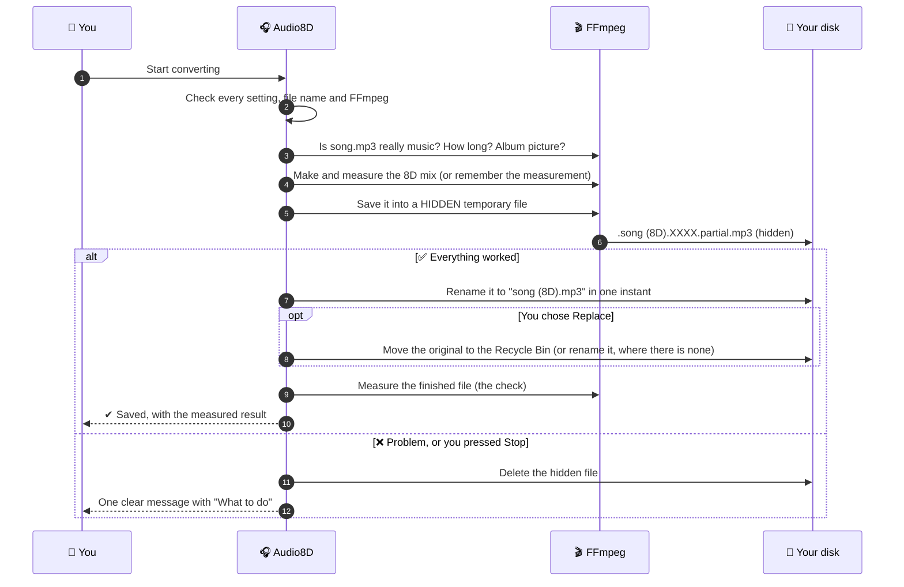
```mermaid
sequenceDiagram
    autonumber
    participant You as 🧑 You
    participant A8 as 🎧 Audio8D
    participant FF as 🎬 FFmpeg
    participant Disk as 💾 Your disk

    You->>A8: Start converting
    A8->>A8: Check every setting, file name and FFmpeg
    A8->>FF: Is song.mp3 really music? How long? Album picture?
    A8->>FF: Make and measure the 8D mix (or remember the measurement)
    A8->>FF: Save it into a HIDDEN temporary file
    FF->>Disk: .song (8D).XXXX.partial.mp3 (hidden)
    alt ✅ Everything worked
        A8->>Disk: Rename it to "song (8D).mp3" in one instant
        opt You chose Replace
            A8->>Disk: Move the original to the Recycle Bin (or rename it, where there is none)
        end
        A8->>FF: Measure the finished file (the check)
        A8-->>You: ✔ Saved, with the measured result
    else ❌ Problem, or you pressed Stop
        A8->>Disk: Delete the hidden file
        A8-->>You: One clear message with "What to do"
    end
```

| 🛡️ Safety guard | What it protects you from |
|---|---|
| 🔎 Checks FFmpeg and every setting first | Confusing crashes, and settings that would break the sound |
| 🧾 Checks the song first | Trying to "play" a text file or picture |
| 🚫 Never uses the "shell" | A file name like `song & del *.*` being run as a command |
| 🫥 Works in a hidden file first | Half-made songs that look finished |
| ⚡ Finishes in one instant | A broken file if the power goes off at the last second |
| 🔒 Never replaces files by surprise | Losing a song you already made (existing 8D files are skipped unless you say so) |
| 🗑️ **Replaced originals go to the Recycle Bin**, after asking you | Losing an original for good. The original is only moved **after** the new song is completely saved |
| 🛟 **Nothing is ever deleted for good** | USB sticks, memory cards and network drives have no Recycle Bin (Windows would delete for ever), so there the original stays in its folder as `<song> (original)` |
| 🔁 Skips its own files | Converting an 8D song a second time |
| 🧱 One bad song never stops the rest | A whole folder failing because of one broken file |
| 🪟 The window never freezes | The work runs in the background; **Stop** and closing the window always work |
| 🧵 Window clean-up stays on the window's thread | A conversion stalling because Python tidied up window objects on the background thread |
| 📄 Every error is logged | Problems that happen once and can't be explained later ([the log file](#-the-log-file)) |
| 🧹 Cleans up | Leftover junk files, even after **Stop** |

---

## 💻 16. The terminal app

Everything the window does also works by **typing commands** in **Windows Terminal**. It's handy for scripts, for very large folders, and for people who like the keyboard. The terminal app needs **no extra packages** (not even CustomTkinter).

> [!IMPORTANT]
> 🪟 **On Windows, use [Windows Terminal](https://aka.ms/terminal)**, not the old Command Prompt window. It shows the colours, progress bars and song names properly. When Audio8D is started by double-clicking `src\__main__.py`, it **opens itself in Windows Terminal** automatically.

### ▶️ Ways to start the terminal app

| Way | 🪟 Windows (PowerShell in Windows Terminal) | 🍎 macOS / 🐧 Linux |
|---|---|---|
| **Standalone app**, terminal in the `Audio8D` folder | `.\audio8d-cli.exe` | – |
| **No install**, terminal in `8D` | `python src\__main__.py` | `python3 src/__main__.py` |
| **Installed** ([Way C or D](#way-c--install-it-the-audio8d-gui-command)) | `audio8d` | `audio8d` |
| Installed, but `audio8d` isn't found | `python -m audio8d` | `python3 -m audio8d` |
| **Double-click** (step-by-step helper) | Double-click `audio8d-cli.exe` (standalone) or `src\__main__.py` | – |

In the commands below, **`audio8d`** means **"start Audio8D"**. Using the standalone app? Put `.\audio8d-cli.exe` in its place. Not installed? Put `python src\__main__.py` in its place: `audio8d "My Song.mp3" --preset studio` becomes `python src\__main__.py "My Song.mp3" --preset studio`. Everything after the start command stays **exactly the same**.

<details>
<summary><b>⚡ Type <code>audio8d</code> without installing (a shortcut)</b></summary>

**🪟 Windows (PowerShell):** type `notepad $PROFILE` (if Notepad says the file doesn't exist, first run `New-Item -ItemType File -Force $PROFILE`), paste this line with **your** path, save, and open a new Windows Terminal tab:

```powershell
function audio8d { python "C:\Gehan\Projects\Python_Projects\8D\src\__main__.py" @args }
```

Error about *"running scripts is disabled"*? Run `Set-ExecutionPolicy -Scope CurrentUser RemoteSigned` once and answer `Y`.

**🍎 macOS (zsh) / 🐧 Linux (bash):** add this line to `~/.zshrc` or `~/.bashrc`, then open a new Terminal:

```bash
alias audio8d='python3 "$HOME/Projects/8D/src/__main__.py"'
```

</details>

<details>
<summary><b>🧩 From VS Code</b></summary>

**File → Open Folder…** → the `8D` folder, open **`src\__main__.py`**, and press ▶️ **Run Python File**. The step-by-step helper appears in VS Code's terminal. (Audio8D never moves itself out of a terminal you opened yourself.)

</details>

**Check it works:**

| Check | Type | ✅ You see |
|---|---|---|
| Does it start? | `python src\__main__.py --version` | `audio8d 2.0.0 - developed by Gehan Fernando` |
| The built-in help | `python src\__main__.py --help` | `usage: audio8d …`, a **QUICK START** list and the **BEST VALUES** |
| Is FFmpeg found? | `python -c "from src.ffmpeg import FFmpegToolchain as T; print(T.discover())"` | Two paths ending in `ffmpeg.exe` and `ffprobe.exe` |

### 🪜 The step-by-step helper

Start it with **no song name** (`audio8d`, or double-click `src\__main__.py`) and it asks **4 questions**. Pressing <kbd>Enter</kbd> always picks the best answer:

1. **Which song or folder?** Drag one song or a whole folder into the window and press <kbd>Enter</kbd>. With a folder, press <kbd>Enter</kbd> for **all** songs, or type numbers like `1,3,5-7`.
2. **Which style?** <kbd>Enter</kbd> for the **BEST** one (`studio`), or a number from 1 to 14 (e.g. `3` for `lossless`, `4` for `hifi`, `6` for `groove`).
3. **Where should the 8D songs go?** <kbd>Enter</kbd> for next to the originals, or drag a folder in.
4. **What about the original songs?** <kbd>Enter</kbd> to **keep** them; `2` to **replace** them (the 8D song takes the original name); `3` to replace them keeping "(8D)" in the name.

💡 **Any song name works here**, even names with spaces, `'`, `$`, `&` or brackets, because you're answering a question, not typing a command.

### 🎵 One song with one command

```powershell
audio8d "C:\Users\Gehan\Music\My Song.mp3" --preset studio
```

`audio8d` starts the program, the text in quotes is your song, and `--preset studio` picks the best style. The new song is saved as **`My Song (8D).mp3`** next to the original. This is the real output:

```text
+-------------------------------------------------+
|  Audio8D 2.0.0  -  developed by Gehan Fernando  |
+-------------------------------------------------+
  Song in    My Song.mp3
  Song out   My Song (8D).mp3
  Source     MP3, 320 kbps, 48 kHz, stereo, 4:52  (already compressed)
  Style      studio  -  Best of best: 3D sound, 320 kbps, -14 LUFS goal, dynamics untouched  (best)
  ----------------------------------------------------
  Sound      3D, circles your head, clockwise                (best)
  Spin       8 s per full circle                             (best)
  Movement   0.80  (strong)                                  (best)
  Bass       stays in the middle below 120 Hz                (best)
  Room       0.25  (subtle room)                             (best)
  Peak roof  0.84  (-1.5 dBFS)                               (best)
  Quality    320 kbps CBR  (the maximum MP3 allows)          (best)
  Loudness   -14 LUFS goal, dynamics kept                    (best)
  Extras     eases in/out over 3 s

  Good to know:
   - Already compressed, so a little detail is gone for good.

  Conversion completed in 15.9 s  ->  C:\Users\Gehan\Music\My Song (8D).mp3  (11.2 MB)
  Loudness: measured -11.9 LUFS, turned down 2.1 dB  ->  about -14.0 LUFS
  Check: -14.3 LUFS, peaks -2.2 dBTP, range 7.3 LU, mono-safe (correlation +0.63)
  Put on your headphones and press play!
```

In Windows Terminal you also see **coloured progress bars** for each step (*Making your 8D song*, *Saving the file*, *Checking the result*). **(best)** means the value is already the best one; a grey **best: …** next to a value shows what the best one would be.

| Want to… | Add this |
|---|---|
| Choose the new file's name | A second name: `audio8d "My Song.mp3" "D:\8D Songs\My Song.mp3"` (missing folders are made; the ending picks the file type) |
| Choose only the folder | `--output-dir "D:\8D Songs"` |
| Keep the song's own name (in another folder) | `--output-dir "D:\8D Songs" --name original` |
| Replace the original (it goes to the Recycle Bin, or is renamed `<song> (original)` where there is none) | `--replace` |
| Save as FLAC, WAV, M4A or Opus | `--format flac` (or `wav`, `m4a`, `opus`) |
| Keep the original's loudness | `--loudness match` (or `--preset hifi`) |
| Open it in your music player when done | `--play` |
| Replace an 8D file you made before | `--overwrite` |
| Only a part of the song | `--start 1:00 --end 2:30` |
| See every style | `audio8d --list-presets` |
| Open the window instead | `audio8d --gui` |

Leave out `--preset` and you get the **`classic`** style (still 3D, natural loudness), with a tip pointing to `--preset studio`.

#### Song names with special characters

**All of these were tested.** Some characters mean something special to PowerShell, so **how you quote the name matters**:

| The song's name has… | Write it like this | ✅ Example |
|---|---|---|
| Spaces, `'`, `&`, `[ ]`, `( )` | Double quotes `" "` | `audio8d "Tom & Jerry [Live] (2024).mp3"` |
| A dollar sign `$` or a backtick `` ` `` | **Single** quotes `' '` | `audio8d 'Cash $ong.mp3'` |
| Both `'` **and** `$` | Single quotes, apostrophe typed **twice** | `audio8d 'Rock ''n'' $ong.mp3'` |
| Anything strange at all | Use the **window**, or the step-by-step helper and **drag the song in** | Works with every name ✅ |

💡 **Easy trick:** in File Explorer, hold <kbd>Shift</kbd>, right-click the song → **Copy as path**, then paste it with <kbd>Ctrl</kbd>+<kbd>V</kbd>. Or just drag the song into Windows Terminal.

### 📚 A whole folder at once

Give Audio8D a **folder** instead of a song, and it converts **every song inside**, several at the same time:

```powershell
audio8d "C:\Users\Gehan\Music" --recursive --output-dir "C:\Users\Gehan\Music 8D" --preset studio
```

`--recursive` also looks in **sub-folders** (and makes the same sub-folders in the output folder); `--output-dir` is where the new songs go (it's created for you). The real output, with five songs, two of them in a `Rock` sub-folder:

```text
  5 songs, 4 at a time, saved in Music 8D.

  [1/5] OK  Morning Drive (8D).mp3  (1.7 MB, 3.8 s  -14.2 LUFS)
  [2/5] OK  City Rain (8D).mp3  (1.7 MB, 3.9 s  -14.1 LUFS)
  [3/5] OK  Ocean Lights (8D).mp3  (1.7 MB, 4.1 s  -14.3 LUFS)
  [4/5] OK  Golden Hour (8D).mp3  (2.3 MB, 4.6 s  -14.2 LUFS)
  [5/5] OK  Night Run (8D).mp3  (1.7 MB, 2.8 s  -14.0 LUFS)

  Done: 5 converted in 0:07 (6.6 s).
```

**♻️ Replace the originals** with `--replace`: for each song, Audio8D makes the 8D song completely in a hidden file, moves the **original to the Recycle Bin** (on a USB stick or network drive: renames it `<song> (original)`), then gives the new song the **original's name**. Add `--name 8d` to name it `Song (8D).mp3` instead.

| Want to… | Add this |
|---|---|
| Make more (or fewer) songs at once | `--jobs 4` (normal: half your CPU cores, 1 to 4) |
| Redo songs that already have an 8D copy | `--overwrite` (otherwise they're **skipped** with a message) |
| Only some songs | The step-by-step helper (type numbers like `1,3,5-7`), or the window |
| Stop | <kbd>Ctrl</kbd>+<kbd>C</kbd>. Finished songs are kept; the song being made is cleaned up |

### 🎧 Preview and A/B compare

```powershell
audio8d "My Song.mp3" --preset studio --preview           # 30 s from the loudest part
audio8d "My Song.mp3" --preset groove --preview 20 --play  # 20 s, then play it
audio8d "My Song.mp3" --preset studio --compare --play     # original, pause, 8D
```

A preview makes **`My Song (8D preview).mp3`** in about 2 seconds. A/B compare makes **`My Song (A-B compare).mp3`**: *"First 15 s: the ORIGINAL (A). A short pause. Then the 8D version (B). Both are the same loudness, so only the 8D effect differs."*

### 🎛️ Every option

| Option | Window control | Allowed | Normal | Best (`studio`) |
|---|---|:---:|:---:|:---:|
| `--preset NAME` | Style cards (step 2) | a style name | `classic` | `studio` |
| `--rotation-seconds` | Spin speed | `2` – `100` | `8` | `8` |
| `--intensity` | Movement | `0` – `1` | `0.85` | `0.80` |
| `--ambience` | Room | `0` – `1` | `0.30` | `0.25` |
| `--engine` | Sound engine | `3d`, `pan` | `3d` | `3d` |
| `--path` | Path | `circle`, `arc`, `figure8`, `wander` | `circle` | `circle` |
| `--direction` | Direction | `clockwise`, `counterclockwise` | `clockwise` | `clockwise` |
| `--bass` | Keep the bass in the middle · Bass below | `off`, `40` – `250` | `120` | `120` |
| `--elevation` | Height | `0` – `1` | `0` | `0` |
| `--fade` | Ease in and out | `0` – `30` s | `3` | `3` |
| `--speed-curve` | Speed over time | `"TIME=SECONDS, …"` | off | off |
| `--intensity-curve` | Movement over time | `"TIME=AMOUNT, …"` | off | off |
| `--beat-sync` · `--bpm` | Spin in time with the beat · Tempo | switch · `40` – `240` | off | off (`groove`: on) |
| `--vocals` | Keep the singer in the middle | `move`, `center` | `move` | `move` |
| `--speakers` | Safe for speakers too | switch | off | off |
| `--format` | File type | `mp3`, `flac`, `wav`, `m4a`, `opus` | `mp3` | `mp3` |
| `--bitrate` | Bitrate | `128` … `320`, `auto` | `auto` | `320` |
| `--quality` | MP3 quality | `0` – `9` | `2` | `0` |
| `--loudness` | Loudness | `-30` – `-5`, `match`, `off` | `off` | `-14` |
| `--exact-loudness` | Always hit the loudness exactly | switch | off | off |
| `--limiter-ceiling` | Peak roof | `0.0625` – `1` | `0.95` | `0.84` |
| `--start` · `--end` | Only part: from … to … | times like `1:30` | whole song | whole song |
| `--output-dir` | Save the new songs → In a folder I choose | a folder | next to the original | |
| `--name` | New file name | `8d`, `original` | `8d` | |
| `--replace` | The original songs → Replace | switch | off | |
| `--overwrite` | Replace 8D files that already exist | switch | off | |
| `--no-cover` · `--keep-title` · `--no-check` | Keep the album picture · Add ' (8D)' · Check each finished song (off) | switches | off | |
| `--recursive` | Include songs in sub-folders | switch | off (window: on) | |
| `--jobs` | Songs at once | `1` – `16` | half your cores (1 – 4) | |
| `--preview [S]` · `--compare` | Preview · A/B compare | `10` – `60` s | 30 s | |
| `--play` | Play the first song when finished | switch | off | |
| `--save-preset NAME` | Your styles → Save style | a name | | |
| `--verbose` | Settings → Show technical details | switch | off | |
| `--list-presets` · `--version` · `--help` | The style cards · Settings → About · the help lines | | | |
| `--gui` | Opens the window | | | |

### 💾 Your own styles in the terminal

```powershell
audio8d --preset studio --path figure8 --elevation 0.4 --save-preset mine
audio8d "My Song.mp3" --preset mine
```

Styles saved here and in the window live in one small, readable **`presets.toml`** file, which only holds what differs from the style it's based on:

| Computer | Where the file is |
|---|---|
| 🪟 Windows | `%APPDATA%\Audio8D\presets.toml` |
| 🍎 macOS | `~/Library/Application Support/Audio8D/presets.toml` |
| 🐧 Linux | `~/.config/audio8d/presets.toml` |

```toml
# Audio8D custom styles. Save new ones with --save-preset NAME.
# Any setting left out comes from the style named in based_on.

[mine]
based_on = "studio"
summary = "your style, based on studio"
path = "figure8"
elevation = 0.4
```

### ⚠️ Warnings before it starts

If you choose a value that might not sound its best, the terminal app **tells you before it starts** (the window shows the same warnings as yellow notes on step 4), and still makes your song:

| When you… | It says | Use instead |
|---|---|---|
| Spin faster than 5 s | *A spin this fast can make people dizzy.* | `--rotation-seconds 8` |
| Spin slower than 20 s | *A spin this slow is hard to notice.* | `--rotation-seconds 8` |
| Movement below 0.5 | *The movement is gentle and may be hard to hear.* | `--intensity 0.8` |
| Movement above 0.95 with `--engine pan` | *One ear goes almost silent at times, which can tire your ears.* | `--intensity 0.8` |
| Room above 0.6 | *This much room sound can make voices blurry.* | `--ambience 0.25` |
| MP3 quality 6 or higher, or bitrate below 192 | *You may hear swishy sounds.* | `--bitrate 320` |
| Peak roof above 0.95 / below 0.5 | *May crackle* / *very quiet* | `--limiter-ceiling 0.84` |
| Loudness off | *Your 8D song will be quieter than normal music.* | `--loudness -14` |
| Loudness above −9 / below −20 | *Very loud* / *quieter than music apps* | `--loudness -14` |
| Bass moving in the 3D engine | *Moving bass can feel unsteady.* | `--bass 120` |

🏆 **With `--preset studio` there are no warnings at all.**

### When the terminal says no

| What happened | Fix |
|---|---|
| `audio8d` is not recognized / command not found | Normal if you haven't installed it. Use `python src\__main__.py` in the `8D` folder, install it ([Way C](#way-c--install-it-the-audio8d-gui-command)), or add the shortcut above |
| `unrecognized arguments` | A name with spaces needs **"quotes"** |
| `Output already exists … Use --overwrite to replace it.` | Add `--overwrite`, or give the new file another name. (In a folder it's skipped) |
| `error: argument --preset: invalid choice` | Type `audio8d --list-presets` to see the names |
| `attempted relative import with no known parent package` | You started a file that isn't a start button. Use `python src\__main__.py` |
| It opened in the old black window | Install Windows Terminal and set it as the **default terminal** (Windows Terminal → Settings → Startup). To switch the move off, set `AUDIO8D_NO_WT=1` |
| `running scripts is disabled on this system` | `Set-ExecutionPolicy -Scope CurrentUser RemoteSigned`, answer `Y` |

Every error comes with a **What to do:** line, and typing mistakes also show a working **Example:**.

**🚦 Exit codes** (for scripts): `0` everything worked · `1` a problem was found (with a folder: at least one song failed) · `2` the command was typed wrong, or nothing was given to the helper.

---

## ✅ 17. Window ↔ terminal checklist

Every feature of the terminal app, and where it lives in the window. The checklist is verified by the automatic tests: `test_every_window_control_matches_its_terminal_option` (in `tests/unit/test_gui_model.py`) sets each window control and types the matching terminal option, and checks both give **exactly** the same sound settings, file options and output names; `tests/integration/test_gui.py` drives the real window (adding songs, converting, preview, A/B compare, styles, Stop, replacing originals).

| Terminal | Window | ✅ |
|---|---|:---:|
| A song, or several songs | **Add songs**, or drag files onto the window | ✅ |
| A folder · `--recursive` | **Add folder** or drag a folder · **Include songs in sub-folders** | ✅ |
| `--preset NAME` · `--list-presets` | Style cards on step 2 (built-in and yours) | ✅ |
| `--rotation-seconds` · `--intensity` · `--ambience` | **Spin speed** · **Movement** · **Room** | ✅ |
| `--engine` · `--path` · `--direction` | **Sound engine** · **Path** · **Direction** | ✅ |
| `--bass` | **Keep the bass in the middle** + **Bass below** | ✅ |
| `--elevation` · `--fade` | **Height** · **Ease in and out** | ✅ |
| `--speed-curve` · `--intensity-curve` | **Speed over time** · **Movement over time** (checked as you type) | ✅ |
| `--beat-sync` · `--bpm` | **Spin in time with the beat** · **Tempo** | ✅ |
| `--vocals center` | **Keep the singer in the middle** (greyed out without Demucs) | ✅ |
| `--speakers` | **Safe for speakers too** | ✅ |
| `--format` | **File type** | ✅ |
| `--bitrate` (incl. `auto`) · `--quality` | **Bitrate** (incl. **Auto**) · **MP3 quality** | ✅ |
| `--loudness N / match / off` · `--exact-loudness` | **Loudness** (incl. **Same as original**, **Custom…**) · **Always hit the loudness exactly** | ✅ |
| `--limiter-ceiling` | **Peak roof** | ✅ |
| `--start` · `--end` | **Only part: from … to …** | ✅ |
| `--output-dir` | **Save the new songs → In a folder I choose** (+ Browse) | ✅ |
| An output file name | **New file name → Custom…** (one song) | ✅ |
| `--replace` · `--name` | **The original songs** (asks to confirm) · **New file name** | ✅ |
| `--overwrite` | **Replace 8D files that already exist** | ✅ |
| `--no-cover` · `--keep-title` · `--no-check` | **Keep the album picture** · **Add ' (8D)' to the song title** · **Check each finished song** | ✅ |
| `--jobs` | **Songs at once** | ✅ |
| `--preview [S]` · `--compare` | **Preview** (+ **Preview length**) · **A/B compare** | ✅ |
| `--play` | **Play the first song when finished**, and **Play** on each row | ✅ |
| `--save-preset` | **Your styles → Save style** (+ Use, Delete) | ✅ |
| `--verbose` | **Settings → Show technical details** → *Technical details* on step 4 | ✅ |
| `--version` · `--help` | **Settings → About** · the help line and tooltip on every control | ✅ |
| <kbd>Ctrl</kbd>+<kbd>C</kbd> | **Stop** (<kbd>Esc</kbd>) | ✅ |
| Heads-up warnings · "What to do" hints | Yellow and red notes on step 4 (with **Fix it**) · red rows with **What to do:** | ✅ |
| Progress bars · Check line · batch summary | A row per song with a progress bar and the measured result · status bar · **All done!** message | ✅ |

---

## 💬 18. Questions people ask

<details>
<summary><b>I don't know anything about sound or computers. Can I still use it?</b></summary>

Yes! Double-click `Audio8D.pyw`, drag your songs in, and press **Next** until you reach **Start converting**. The best choices are already selected, and every control explains itself.
</details>

<details>
<summary><b>What's the difference between "8D" and "3D" here?</b></summary>

"8D" is the popular name for music that moves around your head. Audio8D 1.0 made it the simple way, turning the left and right volume up and down. Audio8D 2.0 uses a **3D head model** (time, loudness and colour clues) so the sound truly passes **in front of you and behind you**. The old sound is the `retro` style.
</details>

<details>
<summary><b>Is this the same as Dolby Atmos?</b></summary>

No. Atmos mixes place every instrument separately in a room of speakers. Audio8D moves a finished stereo song around your head for headphones (and can keep the singer apart). It's simpler, fast, and fun.
</details>

<details>
<summary><b>Does it work on normal speakers?</b></summary>

The headphone effect doesn't: speakers let both ears hear both sides. For speakers, car stereos and phone speakers, turn on **Safe for speakers too** or use the `speakers` style.
</details>

<details>
<summary><b>Can I convert my whole music library?</b></summary>

Yes. Add the whole `Music` folder (sub-folders included), choose **In a folder I choose** on step 3, and press **Start converting**. Several songs are made at once, songs already done are skipped, and the sub-folders are kept.
</details>

<details>
<summary><b>How long does it take?</b></summary>

For a 5-minute song on a normal PC: about **7 seconds** with `classic`, **8 seconds** as FLAC (`lossless`, `hifi`), and about **14 seconds** with `studio` (MP3 encoding at 320 kbps is the slowest part). A preview takes about **2 seconds**. Folders go faster per song, because several are made at once. *Keep the singer in the middle* adds a minute or two per song.
</details>

<details>
<summary><b>Can I turn an 8D song back into the normal song?</b></summary>

No. The effect is "baked in", like a cake. 🎂 Keep your originals. If you replaced them, they're in the Recycle Bin until you empty it (or next to the new song as `<song> (original)`, on drives without a Recycle Bin).
</details>

<details>
<summary><b>Do I need the internet?</b></summary>

Only to download Audio8D (or Python and the packages, and Demucs if you want it). Making 8D songs works **completely offline**. ✈️
</details>

<details>
<summary><b>Do I have to install Python or FFmpeg?</b></summary>

Not with the [standalone app](#-the-standalone-app-audio8dexe): everything is inside the `Audio8D` folder. Only the source-code version needs Python, and on macOS/Linux, FFmpeg.
</details>

<details>
<summary><b>Can I share the songs I make?</b></summary>

Making an 8D version doesn't make the song **yours**. Listening yourself is fine. To upload or share someone else's song, you need permission from the people who own it.
</details>

---

## 📖 19. Word helper

| Word | What it means |
|---|---|
| **8D audio** | Music that seems to fly around your head on headphones |
| **3D / binaural** | Sound made for two ears so it seems to come from a real place around you |
| **Windows Terminal** | Microsoft's modern terminal app for Windows; it runs PowerShell in tabs |
| **Terminal / PowerShell** | The window where you type commands / the command language inside it |
| **Command** | A line you type in the terminal, then press <kbd>Enter</kbd> |
| **Path** | The "address" of a file, like `C:\Music\song.mp3` |
| **PATH** | The list of folders the terminal searches when you type a program's name |
| **pip / venv** | Python's installer / a private box for one project's Python things |
| **CustomTkinter / Pillow** | The Python packages that draw the Audio8D window / its icons |
| **FFmpeg / FFprobe** | Free helper programs that open, change and save sound and video |
| **Style / preset** | A ready-made set of settings with a name, like `studio` |
| **Tooltip** | The short explanation that appears when you rest the mouse on a control |
| **Channel / mono / stereo** | One side of the sound / one channel / two channels (left + right) |
| **Panning** | Moving a sound between left and right with volume |
| **ITD (time difference)** | How much sooner a sound reaches the nearer ear (up to about 0.66 ms) |
| **Head shadow (ILD)** | How much quieter the far ear hears a sound, because the head is in the way |
| **Crossover / band** | Splitting sound into low, middle and high parts |
| **Reverb / convolution** | Room sound / making it by "playing" the song through a recording of a room |
| **Limiter / peak roof** | A "safety roof" that stops sounds getting too loud |
| **dB / dBFS / dBTP** | How loud / loudness in a file (0 is the top) / the true loudest point, even between samples |
| **LUFS** | How loud music *feels* to people. Spotify aims for about −14 |
| **LRA (loudness range)** | The difference between the quiet and loud parts of a song |
| **Correlation / mono-safe** | How alike the two ears are; above 0 means it still sounds right on one speaker |
| **BPM / bar** | Beats per minute / a group of beats, usually 4 |
| **Stems / Demucs** | The separate parts of a song (vocals, music) / the AI that separates them |
| **MP3 / FLAC / WAV / M4A / Opus** | File types: plays everywhere / lossless / lossless, uncompressed / Apple / small and modern |
| **Bitrate / kbps** | How much detail is saved each second |
| **Sample rate / resample** | How many tiny "photos" of the sound per second / changing that number |
| **Lossless / lossy** | A perfect copy / a smaller file that left out sounds ears can't hear |
| **Tags / cover art** | The song name, singer and album / the album picture, stored inside the file |
| **Recycle Bin / Trash** | Where deleted files wait, so you can restore them |
| **Exit code** | A number a program gives back when it finishes (0 = all good) |
| **Standalone app** | A program folder that carries everything it needs, so nothing has to be installed |
| **PyInstaller** | The free tool that packs Python and Audio8D into `Audio8D.exe` |
| **Log file** | A text file where a program writes what it did, for troubleshooting |
| **SmartScreen** | The Windows feature that warns about programs it hasn't seen before |

---

## 🐍 20. For programmers: use it from Python

> 👩‍💻 **This part is for programmers.** If you only want to make 8D songs, you can skip it.

```python
import dataclasses
from pathlib import Path

from audio8d import PRESETS, Audio8DError, ConvertOptions, Trim, convert

config = dataclasses.replace(
    PRESETS["studio"].config,
    path="figure8",          # loops round each ear
    beat_sync=True,          # one loop = whole bars of the detected tempo
    output_format="flac",    # lossless
)

try:
    result = convert(
        Path("song.mp3"),
        Path("song (8D).flac"),
        config,
        options=ConvertOptions(trim=Trim(start=30.0, end=90.0)),
        on_progress=lambda stage, share: print(f"{stage}: {share:.0%}"),
    )
except Audio8DError as error:
    print(f"Could not convert: {error}")
else:
    print(f"Saved {result.output}")
    print(f"Tempo {result.bpm} BPM, one loop = {result.beats_per_turn} beats")
    if result.quality:
        print(f"Measured {result.quality.integrated_lufs:.1f} LUFS, "
              f"peak {result.quality.true_peak_db:.1f} dBTP")
```

> [!TIP]
> **Not installed?** Put your script in the **`8D`** folder, run it from there, and import from **`src`** instead: `from src import convert, EffectConfig`.

**`convert(input_path, output_path, config, *, overwrite=False, validate_toolchain=True, options=None, on_loudness=None, on_progress=None, cancel=None) -> ConversionResult`**

| Part | Type | What it is |
|---|---|---|
| `input_path` / `output_path` | `Path` | The song, and where to save it (the extension must match `config.output_format`) |
| `config` | `EffectConfig` | The sound and format settings |
| `overwrite` | `bool` | Allowed to replace an existing output |
| `options` | `ConvertOptions` | `trim`, `keep_cover`, `tag_title`, `title_suffix`, `check`, `replace_original` |
| `on_loudness` | callable | Called with a `LoudnessPlan` when a loudness goal is set |
| `on_progress` | callable | Called with `(stage, share)`; the stages, in order, are `"Splitting vocals"` (only with `vocals="center"`), then `"Making your 8D song"`, `"Saving the file"` and `"Checking the result"`, which `audio8d.pipeline.stages_for(options)` lists |
| `cancel` | `threading.Event` | Set it to stop the conversion cleanly |

**`ConversionResult`**: `source` (an `AudioStreamInfo`), `output`, `config` (after beat sync), `loudness`, `quality` (a `QualityReport`), `bpm`, `beats_per_turn`, `original_removed_to`.

**Also:** `preview(song, output, config, seconds=30.0)` → `ConversionResult`, and `compare(song, output, config, seconds=15.0)` → `Path`. For folders, `audio8d.batch.run_batch(items, config, jobs=4, …)` returns a `BatchReport`.

**`EffectConfig`** (frozen; `config.validate()` checks it):

| Field | Type | Normal | Allowed |
|---|---|:---:|:---:|
| `rotation_seconds` | `float` | `8.0` | `2` – `100` |
| `intensity` | `float` | `0.85` | `0` – `1` |
| `ambience` | `float` | `0.30` | `0` – `1` |
| `limiter_ceiling` | `float` | `0.95` | `0.0625` – `1` |
| `quality` | `int` | `2` | `0` – `9` |
| `loudness_target` | `float \| None` | `None` | `-30` – `-5` |
| `match_loudness` | `bool` | `False` | `True` aims for the original's loudness |
| `bitrate` | `int \| None` | `None` | `128` … `320` |
| `exact_loudness` | `bool` | `False` | |
| `engine` | `str` | `"3d"` | `"3d"`, `"pan"` |
| `bass_hz` | `float` | `120.0` | `0` (off) or `40` – `250` |
| `path` · `direction` | `str` | `"circle"` · `"clockwise"` | see [part 9](#-sound-engine-path-and-direction) |
| `elevation` · `fade_seconds` | `float` | `0.0` · `3.0` | `0` – `1` · `0` – `30` |
| `speed_curve` · `intensity_curve` | `tuple[tuple[float, float], ...]` | `()` | time-ordered `(seconds, value)` pairs |
| `beat_sync` · `bpm` | `bool` · `float \| None` | `False` · `None` | `bpm` `40` – `240` |
| `vocals` | `str` | `"move"` | `"move"`, `"center"` |
| `output_format` | `str` | `"mp3"` | `"mp3"`, `"flac"`, `"wav"`, `"m4a"`, `"opus"` |

`speaker_safe(config)` (in `audio8d.core.settings`) returns the speaker-friendly version. `PRESETS` holds the built-in styles; `audio8d.core.user_presets.all_presets()` adds the saved ones.

**Errors**: one family, so you can catch them all at once:

```text
Audio8DError                  ← catch this one to catch everything below
├── DependencyError           ← FFmpeg / FFprobe / Demucs missing
├── InputValidationError      ← wrong path, wrong setting, not music, file exists
└── ConversionError           ← FFmpeg failed, disk problem, or cancelled
```

> [!NOTE]
> **Changed from 1.x:** `convert()` returns a `ConversionResult` (the old return value is `result.source`), and `EffectConfig.mp3_quality` / `mp3_bitrate` are now `quality` / `bitrate`.

---

## 🧪 21. For programmers: tests and code

### 🧪 Run the automatic tests

```powershell
python -m pip install -e ".[dev,gui]"   # or: python -m pip install pytest ruff pylint customtkinter pillow
python -m pytest                        # all 396 tests
python -m pytest tests/unit             # the quick ones (346)
python -m pytest tests/integration      # real conversions and the real window (50)
```

✅ **Success looks like:** `396 passed`

> [!NOTE]
> The tests always use the code in the `src` folder. They keep saved styles and the cache in a private temporary folder, never open Windows Terminal windows, and never touch the Recycle Bin. Without FFmpeg the music tests are skipped, and without CustomTkinter (or a screen) the window tests are skipped.

| Test file | What it checks |
|---|---|
| 🪟 `integration/test_gui.py` | **The real window:** it starts on step 1 with `studio`; adding songs reads their details; Start stays off until the setup is valid; a real conversion shows the measured result; a failing song shows the reason and the fix; **no control overlaps another or spills out** at 100 % and 125 % size and at 1100×720 and 1600×1000; controls appear only when they apply; preview and A/B compare; saving and deleting a style; Stop keeps the window usable; replacing the originals; notices never cover a button; clean-up only ever runs on the window's own thread; **a real Windows drag-and-drop adds the song**; long lists show a page at a time while every song is converted; stopping a preview is not an error; a broken styles file is explained |
| 🧭 `unit/test_gui_model.py` | **The window ↔ terminal checklist:** each window control gives exactly the same conversion as its terminal option (35 cases); the problems, warnings and plain-word summaries |
| 🎧 `integration/test_convert.py` | Real conversions: every format and sample rate, album art, trimming, **the sound really moves between the ears**, **the bass really stays in the middle**, beat sync finds 120 BPM, replace-in-place, preview and A/B lengths, batches, loudness goals and "same as original", the dynamics never change, measurements are reused, progress never goes backwards, 8 kHz phone recordings are raised to 48 kHz, a stopped A/B compare leaves nothing behind |
| 🎛️ `unit/test_effects.py` | The paths, curves, fades and height; the head model; the gain streams; the room; the filter graph |
| 🧮 `unit/test_parsing_and_styles.py` · 🥁 `unit/test_analysis_and_files.py` | Times, curves, song picking, saved styles, speaker safety; tempo detection (and no tempo for beatless music), the loudest part, the check maths, the cache, output names, folder scanning, **originals are never deleted for good** (the tests never touch your real Recycle Bin), batches, the Windows Terminal launcher |
| ⌨️ `unit/test_cli.py` · 🖥️ `unit/test_display.py` | Every terminal option, folders, preview/compare, saved styles, the step-by-step helper; the panel, warnings, progress bars and summaries |
| 🎁 `unit/test_packaging.py` | The standalone app: it finds `bin\executable`, the guide and its own home next to the exe; restarts itself (not Python) in Windows Terminal; never offers Demucs; starts the log once; carries on when the log can't be written; explains a window that can't start |
| 🎬 `unit/test_ffmpeg.py` · 🧱 the rest | The exact FFmpeg commands; setting limits, styles, every "What to do" fix, safe paths, hidden-file-then-rename, and all the ways to start it without installing |

### 🧹 Check the code is tidy

```powershell
python -m ruff check .
python -m ruff format --check .
python -m pylint src tests
```

✅ `All checks passed!` from ruff, and `rated at 10.00/10` from pylint (88-character lines).

### 🔧 How the code fits together

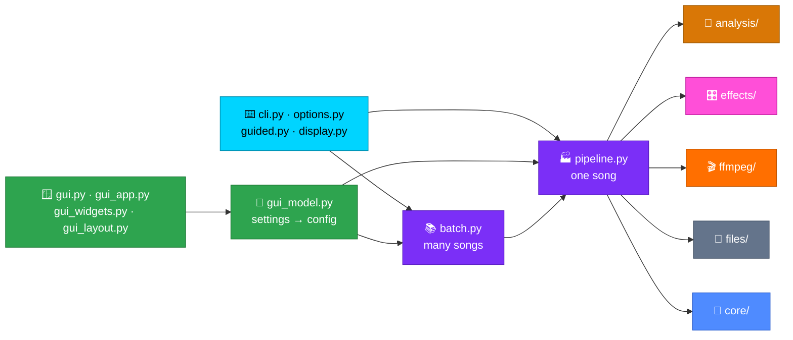
```mermaid
flowchart LR
    GUI["🪟 gui.py · gui_app.py<br/>gui_widgets.py · gui_layout.py"]:::w --> M["🧭 gui_model.py<br/>settings → config"]:::w
    CLI["⌨️ cli.py · options.py<br/>guided.py · display.py"]:::a --> B["📚 batch.py<br/>many songs"]:::b
    M --> B
    CLI --> P["🏭 pipeline.py<br/>one song"]:::b
    M --> P
    B --> P
    P --> AN["🥁 analysis/"]:::g
    P --> FX["🎛️ effects/"]:::e
    P --> FF["🎬 ffmpeg/"]:::f
    P --> FILES["💾 files/"]:::d
    P --> CORE["🧱 core/"]:::c

    classDef w fill:#2ea44f,stroke:#1f7a38,color:#fff
    classDef a fill:#00d4ff,stroke:#0090b0,color:#000
    classDef b fill:#7b2ff7,stroke:#5a1fc0,color:#fff
    classDef c fill:#4f8bff,stroke:#2a5fd0,color:#fff
    classDef d fill:#64748b,stroke:#475569,color:#fff
    classDef e fill:#ff4fd8,stroke:#c0209f,color:#fff
    classDef f fill:#ff6f00,stroke:#c05500,color:#fff
    classDef g fill:#d97706,stroke:#a15c05,color:#fff
```

The window and the terminal app are two front doors to the **same engine**: neither contains any sound or file logic of its own.

| File | Its job |
|---|---|
| `Audio8D.pyw` | Double-click start for the window (no console) |
| `bin/executable/` | `ffmpeg.exe` and `ffprobe.exe`; `core/locations.py` finds them next to the project, or next to the exe when packaged |
| `packaging/` | `build.ps1` (the one-step build), `audio8d.spec` (the PyInstaller recipe), `window_entry.py` · `terminal_entry.py` (the two exes), `version.txt` (the exe's details), `make_icon.py` (draws the icon) |
| `src/logs.py` | The rotating log file, and hooks that record uncaught errors on any thread |
| `src/gui.py` | Opens the window, or explains what to install |
| `src/gui_app.py` | The window: sidebar, the six pages, song and progress rows, the background worker thread and its event queue |
| `src/gui_model.py` | The window's settings with no Tk in sight: turns them into an `EffectConfig` and options, finds problems and warnings, writes the plain-word summaries |
| `src/gui_widgets.py` | Theme colours, icons, tooltips, cards, sliders, choices, switches, text boxes, dialogs and notices |
| `src/gui_layout.py` | Finds controls that overlap or spill past the edge (used by the tests) |
| `src/dropfiles.py` | Windows drag-and-drop (`WM_DROPFILES`) |
| `src/__main__.py` · `launcher.py` | The start button · moves a double-clicked terminal app into Windows Terminal |
| `src/cli.py` · `options.py` · `guided.py` · `display.py` · `hints.py` | The terminal app, its options, the step-by-step helper, the panel and progress bars, the "What to do" fixes |
| `src/pipeline.py` · `batch.py` · `cache.py` | One song · many songs on a thread pool · remembered measurements |
| `src/core/` | `settings.py`, `presets.py`, `user_presets.py`, `parsing.py`, `locations.py`, `types.py`, `errors.py` |
| `src/effects/` | `motion.py` (where the sound is), `head.py` (the head model), `control.py` · `wavfile.py` (gain streams), `reverb.py` (the room), `graph.py` (the FFmpeg filter graph), `levels.py` (sample rates, loudness gain) |
| `src/analysis/` | `tempo.py`, `sections.py` (loudest part), `quality.py` (the check), `stems.py` (Demucs) |
| `src/ffmpeg/` · `src/files/` | Finding FFmpeg, commands, progress, song facts, loudness · safe names, hidden-file-then-rename, folder scanning, the Recycle Bin |

### 🍳 The 3D sound recipe, step by step

1. **🎛️ Two sides.** Mono is copied to both ears; 5.1 is folded down. Audio below 32 kHz is raised to 44.1 or 48 kHz first, so the 5 and 10 kHz bands fit.
2. **✂️ Middle and side.** The **middle** is what moves. A quarter of the song's own **side** (its width) is kept still, without bass.
3. **🎚️ Five bands.** A Linkwitz-Riley crossover splits the middle at **120 Hz** (bass, stays centred), **1.2 kHz**, **5 kHz**, **10 kHz** and above.
4. **⏱️ Time.** The timing band runs at a quarter of the sample rate and feeds **8 delay taps** covering the largest time difference between the ears; blending neighbouring taps gives a smooth fractional delay.
5. **🔊 Loudness and colour.** 200 times a second, `head.py` works out each ear's gain for every tap and band (Woodworth, Brown–Duda, rear dulling, overhead brightening), keeping the total power steady.
6. **✖️ Apply.** FFmpeg multiplies each band by its gain stream (`amultiply`) and sums each ear (`pan`).
7. **🏛️ Room.** The middle (without bass) plays through the room's impulse response (`afir`).
8. **🔊 Loudness.** With a goal, the mix is measured (or remembered) and gets one exact `volume` change; without one, it's turned down 3 dB. For fast encoders the mix is made once into a lossless file while it's measured, then finished in a light second pass; for MP3 the mix is measured first and remade while LAME encodes.
9. **🧱 Safety roof.** A limiter (5 ms attack, 50 ms release) that works at twice the sample rate, so peaks between samples are caught too (the 64-tap resampler around it stays flat to 20 kHz).
10. **💎 Save.** LAME MP3, AAC, Opus, 24-bit FLAC or WAV, with tags, "(8D)" in the title, and the album picture.
11. **✅ Check.** The finished file is measured in stereo and folded to mono.

### 📏 House rules for changing the code

- ✍️ **Every code file starts with** `# Developed by Gehan Fernando`.
- 💬 **Comments are one short, natural line** that explains *why*.
- 🧭 **Keep the window thin:** settings logic goes in `gui_model.py` (testable without a screen), sound and file logic in the engine.
- 📐 **Never let controls overlap:** `test_no_control_ever_overlaps_or_spills_out` must stay green.
- 📁 **Made a new folder inside `src`?** Add it to the `packages` list in `pyproject.toml`.
- 🎛️ **Used a new FFmpeg filter?** Add it to `GRAPH_FILTERS` in `src/effects/graph.py`.
- 🚫 **Never use `shell=True`.** Always pass lists of words to programs.
- 🆘 **Error hints point into this guide** ("README part 5, Step 2"). If you renumber it, check `src/hints.py` and `src/gui_app.py`.

### 📦 Build the standalone app

The standalone app is built with **[PyInstaller](https://pyinstaller.org/)**, on Windows, in one step. In Windows Terminal, in the `8D` folder:

```powershell
powershell -ExecutionPolicy Bypass -File packaging\build.ps1
```

**You need:** Python 3.10+ and an internet connection for the first build (it downloads PyInstaller, CustomTkinter and Pillow into a private build environment, `build\venv`), plus `ffmpeg.exe` and `ffprobe.exe` in `bin\executable`.

**What the script does:**

1. Stops with a clear message if `bin\executable\ffmpeg.exe` or `ffprobe.exe` is missing.
2. Creates `build\venv` (once) and installs the current Audio8D code, CustomTkinter, Pillow and PyInstaller into it, so your own Python is never touched.
3. Runs PyInstaller with `packaging\audio8d.spec`: **`Audio8D.exe`** (the window, no console) and **`audio8d-cli.exe`** (the terminal app) share one `_internal` folder with Python, Tk, CustomTkinter's themes and the app icon. Demucs and PyTorch are left out on purpose.
4. Copies `bin\executable`, `README.md`, `docs\images`, `THIRD-PARTY-NOTICES.md` and the `licenses` folder next to the exes (FFmpeg's GPL requires its licence to travel with every copy).
5. **Tests the result** by running `audio8d-cli.exe --version`, and stops if it doesn't start.
6. Zips it all as **`dist\Audio8D-2.0.0-windows.zip`**, ready to hand out.

✅ **Success looks like:** `Built: audio8d 2.0.0 - developed by Gehan Fernando`, then the `dist\Audio8D` folder and the zip. A rebuild takes about a minute. Python's installer also leaves `build\lib` and an `audio8d.egg-info` folder behind; both are ignored by Git and safe to delete.

**How the paths work:** Audio8D never relies on the folder you start it from. In the packaged app, `core/locations.py` takes the folder of `Audio8D.exe` as its home: FFmpeg is `bin\executable` there, and the guide is `README.md` there. From source, the home is the `8D` project folder. That's why the whole `Audio8D` folder can be copied to another computer, or anywhere else, and keep working.

**Tested:** the built zip was unpacked into a new folder and run with a `PATH` holding only `C:\Windows` (no Python, no FFmpeg, no Python settings). The terminal app printed its version and styles, converted a song and a whole folder, and explained clearly when `bin\executable` was removed; the window opened in about 5 seconds with dropped songs, showed the bundled FFmpeg in Settings, converted five songs, and closed cleanly.

### 📦 About sharing on GitHub

> [!CAUTION]
> `bin\executable\ffmpeg.exe` and `ffprobe.exe` are about **105 MB each**. GitHub **refuses** files bigger than 100 MB. Use **[Git LFS](https://git-lfs.com/)** for the two `.exe` files, or leave them out and let each person add them. Share the standalone app as the zip from `dist` (for example as a GitHub release file, which allows up to 2 GB), not inside the repository; `build\` and `dist\` are already in `.gitignore`.

---

## 🧹 22. Remove Audio8D

| You used… | To remove it |
|---|---|
| 🎁 The standalone app | Delete the `Audio8D` folder (and any shortcut you made). Nothing else was installed |
| 🖱️ Way A or ⌨️ Way B | Nothing was installed except the window's helpers. Remove them with `python -m pip uninstall customtkinter pillow` if you like |
| 📦 Way C | `python -m pip uninstall audio8d`, answer **`y`**, then delete the `audio8d.egg-info` folder inside `8D` if it's still there |
| 🗃️ Way D | Just delete the **`.venv`** folder inside `8D` |
| ⚡ The terminal shortcut | Delete the `function audio8d …` line from your PowerShell `$PROFILE` (or the `alias` line) |
| 🎤 Demucs | `python -m pip uninstall demucs torch torchaudio` |

**Your saved styles, the remembered measurements and the log** live outside the program folder: `%APPDATA%\Audio8D` and `%LOCALAPPDATA%\Audio8D` on Windows (`~/Library/Application Support/Audio8D` and `~/Library/Caches/Audio8D` on macOS, `~/.config/audio8d` and `~/.cache/audio8d` on Linux).

**To remove everything:** delete the whole `8D` folder. Your original songs are **not** inside it, so they're safe. 🎵

---

## 🙏 23. Credits

<div align="center">

### 👨‍💻 Developed by **Gehan Fernando**


Audio8D was designed, written and tested by **Gehan Fernando**.

Built with 🐍 [Python](https://www.python.org/), 🎬 [FFmpeg](https://ffmpeg.org/) (with LAME, AAC, Opus and FLAC), 🪟 [CustomTkinter](https://github.com/TomSchimansky/CustomTkinter) and [Pillow](https://python-pillow.org/) for the window, with the terminal app at home in [Windows Terminal](https://aka.ms/terminal), and optional 🎤 [Demucs](https://github.com/facebookresearch/demucs) for vocal separation.

The head model follows R. S. Woodworth's interaural time difference, C. P. Brown and R. O. Duda's spherical-head shadow model, and J. Blauert's directional bands.

</div>

### 📜 Licences

The standalone app includes third-party software, each under its own licence: **FFmpeg** (GNU GPL v3), **Python** (PSF licence, with Tcl/Tk), **CustomTkinter** (MIT), **darkdetect** (BSD), **packaging** (Apache 2.0 / BSD), **Pillow** (MIT-CMU) and the **PyInstaller** bootloader. [THIRD-PARTY-NOTICES.md](THIRD-PARTY-NOTICES.md) lists each one with its version and where FFmpeg's source code can be downloaded, and the [licenses](licenses) folder holds the full texts. Both are copied into every standalone build. Audio8D itself is © Gehan Fernando; its own code does not carry an open-source licence yet.

<div align="center">

---

### 🎧 Your song goes in. It comes out flying around your head. 🌀

**Start with `studio` · Listen with headphones · Try a preview before the full song**

<sub>Audio8D 2.0.0 · Developed by Gehan Fernando · Made with 💜 for everyone who loves music</sub>


</div>
