<!-- Developed by ::> Gehan Fernando -->
<div align="center">


# 🎧 Audio8D

### Give it a song. Get back music that **travels around your head**. 🌀

**👨‍💻 Developed by Gehan Fernando**

<p>


</p>
<p>


</p>

</div>

**Audio8D** is a small, free program for your computer. You give it a song you already have (or a whole folder of songs). It makes a **new copy** in which the music seems to **move around your head**: past your right ear, behind you, past your left ear, and back in front. People call this effect **"8D audio"**. Your original songs are never changed unless you ask for that.

Everything happens in **one friendly window**. You add your songs, pick a sound, choose where to save, and press **Start converting**. The best settings are already chosen for you, and every button explains itself.

<p align="center">
  
</p>
<p align="center"><sub>☝️ The Audio8D window after making five 8D songs. Every finished song has a green tick and its own <b>Play</b> and <b>Folder</b> buttons.</sub></p>

> [!TIP]
> ### ⚡ The 30-second version
> 1. **Windows:** unzip the `Audio8D` folder and double-click **`Audio8D.exe`**. Nothing else to install. ([details](#-51-the-easy-way-the-standalone-app-windows))
> 2. **Drag your songs** onto the window.
> 3. Press **Next** three times, then **Start converting**.
> 4. Put on **headphones** and press **Play**. 🎧

> [!IMPORTANT]
> 🎧 **Always listen with headphones or earbuds.** The effect works because each ear hears something slightly different. On normal speakers you will hardly notice it. (There is a special [speaker-friendly option](#safe-for-speakers-too) if you need one.)

---

## 📚 What's inside this guide

**New to Audio8D? Read parts 1 to 6 in order.** They take about ten minutes. Parts 7 to 15 explain every button in the window, one page at a time. Keep them for when you want to know more.

| 🌱 Start here | 🪟 The window, button by button | 🎵 Understand the results | 🆘 Help |
|---|---|---|---|
| 1. [What is Audio8D?](#-1-what-is-audio8d) | 7. [Finding your way around](#-7-finding-your-way-around-the-window) | 16. [Best quality and styles](#-16-best-quality-and-the-ready-made-styles) | 20. [When something goes wrong](#-20-when-something-goes-wrong) |
| 2. [What can it do?](#-2-what-can-audio8d-do) | 8. [Step 1 · Add your songs](#-8-step-1--add-your-songs) | 17. [Which files go in and out?](#-17-which-files-go-in-and-come-out) | 21. [Known limitations](#-21-known-limitations) |
| 3. [A quick look at the window](#-3-a-quick-look-at-the-window) | 9. [Step 2 · Choose the sound](#-9-step-2--choose-the-sound) | 18. [Why is my song quieter?](#-18-loudness-why-is-my-song-quieter) | 22. [Questions people ask](#-22-questions-people-ask) |
| 4. [What you need](#-4-what-you-need) | 10. [Step 3 · Output options](#-10-step-3--output-options) | 19. [How your files stay safe](#-19-how-your-files-stay-safe) | 23. [Word helper](#-23-word-helper) |
| 5. [**Get Audio8D running**](#-5-get-audio8d-running) | 11. [Step 4 · Review and convert](#-11-step-4--review-and-convert) | | 24. [Remove Audio8D](#-24-remove-audio8d) |
| 6. [**Your first 8D song**](#-6-your-first-8d-song-step-by-step) | 12. [Listen and check your songs](#-12-listen-and-check-your-new-songs) | ⌨️ **Extras** (you can skip these) | |
| | 13. [Your styles](#-13-your-styles-page) | 25. [The terminal app](#-25-extra-the-terminal-app) | |
| | 14. [Settings](#-14-settings-page) | 26. [For programmers](#-26-extra-for-programmers) | |
| | 15. [Every message the window shows](#-15-every-message-the-window-shows) | 27. [Credits and licences](#-27-credits-and-licences) | |

> 💡 **Met a word you don't know?** The [Word helper](#-23-word-helper) explains every technical word in this guide in one simple line.

---

## 🎧 1. What is Audio8D?

### 🗣️ Imagine this

Imagine your favourite singer standing **in front of you**. 🗣️

Now imagine they **slowly walk around you**: past your right ear 👂, **behind** your head, past your left ear, and back in front, again and again. 🚶‍♂️🔄

That feeling is called **8D audio**. **Audio8D makes it for you** from any song you already have.


```mermaid
flowchart LR
    A(["🎵 Your normal song<br/>or a whole folder"]):::a --> B["🎧 Audio8D"]:::b --> C(["🌀 New songs that<br/>move around your head"]):::c

    classDef a fill:#1e1e3f,stroke:#00d4ff,color:#fff
    classDef b fill:#7b2ff7,stroke:#5a1fc0,color:#fff
    classDef c fill:#2ea44f,stroke:#1f7a38,color:#fff
```

### 🤔 How does the trick work?

Your brain works out where a sound comes from using **three clues**. Audio8D gives it all three, and changes them smoothly as the sound "moves":

| Clue | In real life | What Audio8D does |
|---|---|---|
| ⏱️ **Timing** | A sound on your right reaches your right ear a tiny moment before your left ear | Delays the far ear by exactly that tiny moment |
| 🔊 **Loudness** | Your head is in the way, so the far ear hears the sound a little quieter | Turns the far ear down, more for high notes than low notes |
| 🎨 **Tone** | A sound from **behind** you sounds slightly duller; a sound from **above** sounds brighter | Dulls the sound as it passes behind you, and brightens it if you let it rise |

It also keeps the **bass and drums in the middle** (like a real record, so the beat stays steady), adds a little natural **room sound** so the music feels *outside* your head, and makes sure nothing ends up too loud or crackly. ✨

> [!NOTE]
> "8D" is just a fun name: there are **not** eight of anything. The trick uses your **two** ears. The first version of Audio8D only used the loudness clue, so the sound bounced left and right. Audio8D 2.0.0 uses all three clues, so the sound goes **around** you and **behind** you. The old sound is still there as the [**Retro** style](#-all-the-ready-made-styles).

---

## 🌟 2. What can Audio8D do?

<table>
<tr>
<td width="50%" valign="top">

**🪟 An easy window**
- 🧭 Four simple steps: **Add songs → Sound → Output → Review & convert**
- 🖱️ **Drag and drop** songs and whole folders (Windows)
- 💬 Every control has **a line of help** under it and a **tip** when you rest the mouse on it
- ✅ It **checks your choices** before it starts, with a **Fix it** button that takes you to the problem
- 🎧 **Preview** a short sample, or hear an **A/B compare** (before and after)
- 📊 A **progress bar for every song**, then its **measured result**
- ⏹️ **Stop** at any time; finished songs are kept
- 🎚️ **One style for all songs, or a different style for any song**
- ✨ **Create your own styles** with a few simple questions and a built-in quality check
- 📤 **Export and import** your styles to share them
- 🌗 Light or dark look, and bigger or smaller text

</td>
<td width="50%" valign="top">

**🎵 Great sound, safe files**
- 🧠 A real **3D effect** that goes around and behind you
- 🥁 **Bass stays in the middle**, like every professional record
- 🎨 **14 ready-made styles**, from gentle to wild, plus your own
- 🥁 Can **spin in time with the beat** of the song
- 🔊 Can make songs **as loud as Spotify and YouTube**
- 📚 Converts **whole folders**, several songs at once
- 💿 Saves as **MP3, FLAC, WAV, M4A or Opus**, keeping the **album picture**
- ♻️ Can **replace your originals**, but only moves them to the **Recycle Bin**, never deletes them for good
- 🔒 Never leaves half-made files behind

</td>
</tr>
</table>

---

## 👀 3. A quick look at the window

When Audio8D opens, you see this:

<p align="center">
  
</p>

The window has **three areas**:

| Area | Where | What it's for |
|---|---|---|
| 🧭 **The sidebar** | Left edge | The four steps in order (**1 Add songs**, **2 Sound**, **3 Output**, **4 Review & convert**), then **Your styles** and **Settings**. Click any of them at any time. The page you're on is highlighted in purple |
| 📄 **The page** | Middle | The step you're on. Scroll down with the mouse wheel to see everything. Each page ends with a **Next** button that takes you to the following step |
| 📊 **The status bar** | Bottom edge | A progress bar, a short message about what's happening (*Ready.*), and on the right a one-line summary of your choices |

> [!TIP]
> **You can't break anything by exploring.** Nothing happens to any file until you press **Start converting** on step 4.

Part 7 explains every part of the window in detail: [Finding your way around](#-7-finding-your-way-around-the-window).

---

## 🧺 4. What you need

### If you use the standalone app (Windows, recommended)

| | You need | Notes |
|:---:|---|---|
| 💻 | **Windows 10 or 11**, 64-bit | Almost every Windows computer from the last ten years |
| 💾 | About **260 MB** of free space | For the `Audio8D` folder |
| 🎧 | **Headphones** or earbuds | Any normal pair |
| 🎵 | Some **songs** | MP3, FLAC, WAV, M4A and most other music files |

That's all. Everything else (the helper programs and the window itself) is already inside the `Audio8D` folder.

### If you run it from the source code (Windows, macOS or Linux)

The "source code" is the original program files in the `8D` folder. Running from there needs a few free things installed first. [Part 5.2](#-52-from-the-source-code-any-computer) walks you through each one.

| | Thing | What it is |
|:---:|---|---|
| 🐍 | **Python** 3.10 or newer | Free software that runs Audio8D |
| 🎬 | **FFmpeg** and **FFprobe** | Free helper programs that read and save music files. Already included for Windows, in the `bin\executable` folder |
| 🪟 | **CustomTkinter** and **Pillow** | Two small add-ons for Python that draw the window |
| 🎤 | *Optional:* **Demucs** | A free AI helper (about 1 GB) for one special setting, [Keep the singer in the middle](#keep-the-singer-in-the-middle) |

---

## 🚀 5. Get Audio8D running

There are two ways. **Pick one.**

| | 🎁 **The standalone app** | 🐍 **From the source code** |
|---|---|---|
| **Best for** | Almost everyone on Windows | macOS, Linux, or people who like Python |
| **Install anything?** | No | Python and two small add-ons |
| **How long?** | 1 minute | About 10 minutes, once |
| **Go to** | [5.1](#-51-the-easy-way-the-standalone-app-windows) | [5.2](#-52-from-the-source-code-any-computer) |

### 🎁 5.1 The easy way: the standalone app (Windows)

The standalone app is a folder called **`Audio8D`** that carries everything it needs inside it, so **nothing has to be installed**. It also doesn't change anything else on your computer.

**Step by step:**

1. **Get the zip file** **`Audio8D-2.0.0-windows.zip`**. (If you have the source code instead, you can [build it yourself](#-build-the-standalone-app).)
2. **Unzip it.** Right-click the zip → **Extract All…** → **Extract**. You now have a normal folder called `Audio8D`.
3. **Move the folder** wherever you like: your Documents, `C:\Programs`, even a USB stick. It works from anywhere.
4. **Open the folder and double-click `Audio8D.exe`.**
   - ✅ **You should see:** the Audio8D window from [part 3](#-3-a-quick-look-at-the-window), after a few seconds the very first time.

**What's inside the `Audio8D` folder:**

```text
📁 Audio8D\
├── 🪟 Audio8D.exe            ← DOUBLE-CLICK ME: opens the Audio8D window
├── ⌨️ audio8d-cli.exe        ← the typing version (optional, see part 25)
├── 📁 bin\executable\        ← ffmpeg.exe and ffprobe.exe, the sound helpers
├── 📄 THIRD-PARTY-NOTICES.md ← the free software Audio8D includes
├── 📁 licenses\              ← the licence texts of that software
└── 📁 _internal\             ← the program's own parts (leave this alone)
```

> [!WARNING]
> **Keep the folder together.** Everything in the `Audio8D` folder belongs together. To move or copy Audio8D, move **the whole folder**, never `Audio8D.exe` on its own. For a shortcut, right-click `Audio8D.exe` → **Send to → Desktop (create shortcut)**, or choose **Pin to Start**.

> [!NOTE]
> 🛡️ **"Windows protected your PC"?** The first time, Windows may show a blue warning, because Audio8D is new to it and isn't signed with a paid certificate. If you trust where the zip came from, click **More info → Run anyway**. It only asks once.

💡 **Handy:** drag songs or a folder in File Explorer and **drop them onto `Audio8D.exe`**. The window opens with those songs already on the list.

💡 **This guide from inside the app:** **Settings → Open the full guide** opens the online copy of this guide in your web browser.

**Now go to [part 6](#-6-your-first-8d-song-step-by-step) and make your first song!** 🎉

### 🐍 5.2 From the source code (any computer)

You do this **only once**. Follow the steps in order. 🐢

#### 💬 First: what is a terminal?

A **terminal** is a window where you type an instruction (a **command**) and press <kbd>Enter</kbd>. You only need it for these setup steps.

| Computer | The terminal to use | How to open it |
|---|---|---|
| 🪟 Windows | **Windows Terminal** | Press the <kbd>⊞ Windows</kbd> key, type `terminal`, press <kbd>Enter</kbd>. Or right-click a folder → **Open in Terminal** |
| 🍎 macOS | **Terminal** | Press <kbd>⌘ Cmd</kbd>+<kbd>Space</kbd>, type `terminal`, press <kbd>Enter</kbd> |
| 🐧 Linux | **Terminal** | Press <kbd>Ctrl</kbd>+<kbd>Alt</kbd>+<kbd>T</kbd> on most systems |

> [!IMPORTANT]
> 🪟 **On Windows, please use Windows Terminal, not the old Command Prompt.** Every command in this guide was tested in Windows Terminal (which runs **PowerShell** inside). Don't have it? Get it free from the [Microsoft Store](https://aka.ms/terminal).

> [!NOTE]
> 📁 The examples use the author's folders, such as `C:\Gehan\Projects\Python_Projects\8D`. Use **your own** folder in their place.

#### Step 1: Get Python

1. Open a terminal.
2. Type this and press <kbd>Enter</kbd>: `python --version` (on macOS/Linux: `python3 --version`).
3. Read the answer:
   - ✅ `Python 3.10` or a higher number (`3.11`, `3.12`, `3.13`…)? **Great, go to Step 2.**
   - ❌ An error, or a lower number? Install Python:

<details open>
<summary><b>🪟 Install Python on Windows</b></summary>

1. Go to **[python.org/downloads](https://www.python.org/downloads/)** and click the big yellow **Download Python** button.
2. Open the downloaded file.
3. ⚠️ **Very important:** on the first screen, **tick "Add python.exe to PATH"**. (PATH is the list of places the terminal looks for programs.)
4. Click **Install Now** and wait until it finishes.
5. **Close** the terminal, open a **new** one, and try `python --version` again.

💡 Still "not recognized"? Try **`py --version`**. If that works, type `py` instead of `python` in every command.

</details>

<details>
<summary><b>🍎 Install Python on macOS</b></summary>

Download the macOS installer from **[python.org/downloads](https://www.python.org/downloads/)** and run it. Then open a new Terminal and try `python3 --version` again. On macOS, type **`python3`** wherever this guide says `python`, and use `/` instead of `\` in folder paths.

</details>

<details>
<summary><b>🐧 Install Python on Linux</b></summary>

Most Linux systems already have Python 3. Add the window toolkit and the "venv" tool, for example on Ubuntu or Debian:

```bash
sudo apt install python3 python3-venv python3-tk
```

Type **`python3`** wherever this guide says `python`.

</details>

#### Step 2: Check the sound helpers (FFmpeg)

Audio8D uses two free helper programs: **FFmpeg** (changes and saves sound) and **FFprobe** (reads facts about a song, like its length).

**🪟 On Windows** they are already included. Open File Explorer and go into the `8D` folder, then **`bin\executable`**. You should see **`ffmpeg.exe`** and **`ffprobe.exe`**. Both there? **Go to Step 3.** 🎉

**🍎🐧 On macOS and Linux**, install FFmpeg once:

| Computer | Type this in the terminal |
|---|---|
| 🍎 macOS | `brew install ffmpeg` |
| 🐧 Linux (Ubuntu/Debian) | `sudo apt install ffmpeg` |

<details>
<summary><b>😟 Windows: the two files are missing. What do I do?</b></summary>

**Option A, easiest:** go to **[gyan.dev/ffmpeg/builds](https://www.gyan.dev/ffmpeg/builds/)**, download **`ffmpeg-release-essentials.zip`**, open it, open its **`bin`** folder, and copy **`ffmpeg.exe`** and **`ffprobe.exe`** into the `8D\bin\executable` folder.

**Option B:** install FFmpeg for the whole computer with `winget install Gyan.FFmpeg`, then close and reopen the terminal. Audio8D looks in `bin\executable` first, and then for an FFmpeg installed on the computer.

</details>

#### Step 3: Add the window's two add-ons

The window is drawn with **CustomTkinter** (buttons, sliders, themes) and **Pillow** (the icons). In the terminal, type:

```powershell
python -m pip install customtkinter pillow
```

✅ **Success looks like:** `Successfully installed customtkinter-… pillow-…` (or `Requirement already satisfied`, which means you already had them).

<details>
<summary><b>😟 macOS/Linux says <code>externally-managed-environment</code></b></summary>

Newer systems protect their own Python. Use a private "virtual environment" instead: [Way D](#way-d-in-a-virtual-environment) below sets everything up in one go.

</details>

#### Step 4: Open the window

Pick **one** of these four ways. They all open the same window.

| | 🖱️ Way A | ⌨️ Way B | 📦 Way C | 🗃️ Way D |
|---|:---:|:---:|:---:|:---:|
| **How** | Double-click `Audio8D.pyw` | One command | Install it once | A private "box" |
| **Typing** | None | One line | One line, once | A few lines, once |
| **Computers** | Windows | All | All | All |

##### Way A: Double-click (Windows)

1. Open the `8D` folder in File Explorer.
2. **Double-click `Audio8D.pyw`**.
   - Windows asks which app to use? Choose **Python**.
   - It opened in a text editor instead? Right-click `Audio8D.pyw` → **Open with → Python**.

💡 You can also drop songs or folders **onto `Audio8D.pyw`**; the window opens with them already listed.

##### Way B: One command

Right-click the `8D` folder → **Open in Terminal**, then type:

```powershell
python src\__main__.py --gui
```

(macOS/Linux: `python3 src/__main__.py --gui`.) You can add song or folder names after `--gui` to open the window with them listed.

##### Way C: Install it

This teaches your computer a new command, **`audio8d-gui`**, that opens the window from any terminal. In a terminal in the `8D` folder:

```powershell
python -m pip install -e ".[gui]"
audio8d-gui
```

✅ **Success looks like:** `Successfully installed audio8d-2.0.0 …`, then the window opens. If `audio8d-gui` is "not found", use `python -m audio8d --gui` instead, which always works.

> [!WARNING]
> **Moved the `8D` folder after installing?** Install again, because the install remembers the old place. An `audio8d.egg-info` folder also appears inside `8D`; that's Python's receipt for the install, so leave it alone.

##### Way D: In a virtual environment

A **virtual environment** is a private box just for Audio8D, so it never mixes with other Python programs. 📦

| Step | 🪟 Windows | 🍎 macOS / 🐧 Linux |
|---|---|---|
| **1. Make the box** (once) | `python -m venv .venv` | `python3 -m venv .venv` |
| **2. Open the box** (in every new terminal) | `.\.venv\Scripts\Activate.ps1` | `source .venv/bin/activate` |
| **3. Install Audio8D** (once) | `python -m pip install -e ".[gui]"` | `python -m pip install -e ".[gui]"` |
| **4. Open the window** | `audio8d-gui` | `audio8d-gui` |

<details>
<summary><b>😟 Red error: "running scripts is disabled on this system"</b></summary>

Type this **once**, press <kbd>Enter</kbd>, answer **`Y`**, then try step 2 again:

```powershell
Set-ExecutionPolicy -Scope CurrentUser RemoteSigned
```

</details>

#### ✅ It worked if…

The **Audio8D** window opens on **STEP 1 OF 4 · Add your songs**, like the picture in [part 3](#-3-a-quick-look-at-the-window). It didn't? See [The window doesn't open](#-the-window-doesnt-open).

#### 📍 The folders that matter in `8D`

You don't need to open any code. This small map just helps you find your way:

```text
📁 8D\                      ← the main folder
├── 🪟 Audio8D.pyw          ← double-click to open the window (Way A)
├── 📄 README.md            ← this guide
├── 📁 bin\executable\      ← ffmpeg.exe and ffprobe.exe
├── 📁 docs\images\         ← the pictures in this guide
├── 📁 src\                 ← the program itself
└── 📁 dist\Audio8D\        ← the standalone app, once it has been built
```

---

## 🎵 6. Your first 8D song, step by step

This is the quickest way to your first 8D song. The best settings are **already chosen**, so you mostly just press **Next**. (Every button is explained in detail in parts 8 to 11.)


```mermaid
flowchart LR
    A(["🎵 1 · Add songs"]):::a --> B["🎨 2 · Sound"]:::b --> C["💾 3 · Output"]:::c --> D["✅ 4 · Review<br/>& convert"]:::d --> E(["🎧 Listen!"]):::e

    classDef a fill:#1e1e3f,stroke:#00d4ff,color:#fff
    classDef b fill:#7b2ff7,stroke:#5a1fc0,color:#fff
    classDef c fill:#4f8bff,stroke:#2a5fd0,color:#fff
    classDef d fill:#ff4fd8,stroke:#c0209f,color:#fff
    classDef e fill:#2ea44f,stroke:#1f7a38,color:#fff
```

**1️⃣ Add a song.** Open File Explorer, find a song, and **drag it onto the Audio8D window**. (Or press **Add songs** and pick it.) The song appears in the list:

<p align="center">
  
</p>

**2️⃣ Press Next: choose the sound.** The **Studio** style is already chosen; it's the best one for most music. Press **Next: output options**.

**3️⃣ Output options.** The best choices are already selected: an MP3 file, as loud as Spotify, saved next to your original song. Press **Next: review and convert**.

**4️⃣ Review and convert.** You see a summary of your choices and a purple note saying *Everything is ready*. Press **▶ Start converting**.

<p align="center">
  
</p>

**5️⃣ Wait a few seconds.** Each song gets a row with a progress bar. When all are finished, a message pops up:

<p align="center">
  
</p>

**6️⃣ Listen!** Put on your headphones and press **Play first**. Close your eyes: after a gentle start, the music travels **in front of you → past your right ear → behind you → past your left ear**, every 8 seconds. 🌀

🎉 **Done!** Your new song is called **`<song name> (8D).mp3`** and sits right next to the original. The original song is untouched.

> 💡 **Didn't sound right?** See [Not quite right?](#-not-quite-right-quick-fixes-for-the-sound). **Want to understand every button?** Read on.

---

## 🧭 7. Finding your way around the window

This part explains the pieces that appear all over the window. Once you know them, every page is easy.

### 🧭 The sidebar

| Button | Takes you to | Shortcut |
|---|---|---|
| **1 Add songs** | Step 1: choose your songs | <kbd>Ctrl</kbd>+<kbd>1</kbd> |
| **2 Sound** | Step 2: pick a style and fine-tune the sound | <kbd>Ctrl</kbd>+<kbd>2</kbd> |
| **3 Output** | Step 3: file type, loudness, where to save | <kbd>Ctrl</kbd>+<kbd>3</kbd> |
| **4 Review & convert** | Step 4: check, try a preview, start | <kbd>Ctrl</kbd>+<kbd>4</kbd> |
| **Your styles** | Create, save, rename, share and manage your own styles | <kbd>Ctrl</kbd>+<kbd>5</kbd> |
| **Settings** | Look of the window, helpers, about | <kbd>Ctrl</kbd>+<kbd>6</kbd> |

You don't have to go in order: click any button at any time. The bottom of the sidebar shows the version (**v2.0.0**) and the author.

### 📄 Pages, cards and the Next button

- Each page starts with a small purple **STEP N OF 4**, a big title, and one sentence explaining the page.
- Settings are grouped in rounded boxes called **cards** (for example *1. Pick a style* or *The essentials*).
- Some cards are folded shut to keep things simple: **Advanced sound**, **Advanced output** and **Technical details**. Press **⌄ Show** on the right of the card to open it, and **⌃ Hide** to fold it again.
- Steps 1 to 3 end with a purple **Next** button (*Next: choose the sound*, *Next: output options*, *Next: review and convert*). Steps 2 and 3 also have a **Back** button.
- **Scroll** with the mouse wheel to see the whole page.

### 🎛️ The four kinds of controls

| Control | What it looks like | How to use it |
|---|---|---|
| **Slider** | A line with a round purple handle; the value is shown on the right (e.g. **0.80**) | Drag the handle, or click on the line |
| **Choice buttons** | A row of joined buttons; the chosen one is purple | Click the one you want |
| **Switch** | A small pill that slides right (purple, **on**) or left (grey, **off**) | Click it |
| **Typing box** | A white or dark box, sometimes with a grey example inside like *e.g. 1:00* | Click it and type. It's **checked as you type**: a mistake turns the box red and the line underneath says what's wrong |

A control that doesn't apply right now is **greyed out** (you can see it but not change it), and its help line usually says why. Some controls only **appear** when they're needed; for example the tempo box appears when you switch on beat sync.

### 💬 Help is everywhere

- **The help line:** every control has a short grey sentence under it, usually with the **recommended value**.
- **Tooltips:** rest the mouse on a button or sidebar entry for about half a second and a small box pops up with a tip (and the keyboard shortcut, if there is one). Moving the mouse away hides it.

### 📊 The status bar

The strip along the bottom of the window has three parts:

1. **The progress bar** (left): fills up while Audio8D works.
2. **The message** (middle): what's happening right now, like *Ready.*, *Converting 5 songs… (0:08)* or *Done: 5 made, 0 failed, in 0:10.* All the messages are listed in [part 15](#-15-every-message-the-window-shows).
3. **The summary** (right): what every song will get, for example **3D · circle · 8 s · MP3 · -14 LUFS → next to originals**. Rest the mouse on it to see *What every song will get. Change it on steps 2 and 3.*

**How to read the summary:**

| Part | Means | Set on |
|---|---|---|
| **3D** (or *panning*) | The sound engine: full 3D, or simple left-right | Step 2 |
| **circle** (or *arc*, *figure8*, *wander*) | The route the music takes around your head | Step 2 |
| **8 s** (or *beat sync*) | Seconds for one full circle, or *beat sync* when it follows the beat | Step 2 |
| **MP3** (or FLAC, WAV, M4A, OPUS) | The type of file that will be made | Step 3 |
| **-14 LUFS** (or *original loudness*) | How loud the new songs will be. Missing when loudness is left natural | Step 3 |
| **speaker-safe** (only when on) | *Safe for speakers too* is switched on | Step 2 |
| **2 songs with own style** (only when some have one) | How many songs use a style of their own | Step 2, card 4 |
| **→ next to originals** (or a folder name) | Where the new songs will be saved | Step 3 |

If a setting has a mistake, the summary says *some settings need fixing (see step 4)*.

### 🔔 Short notices

Sometimes a small box with a coloured border appears in the right-hand corner of the status bar for about **4 seconds**, then disappears by itself. It replaces the summary for that moment and never covers a button:

- **Green** ✔: something worked (*Added 5 songs*, *Preview ready: …*).
- **Purple** ℹ: for your information (*Style: Studio*).
- **Red** ✖: something needs your attention (*Add a song first (step 1)*).

<p align="center">
  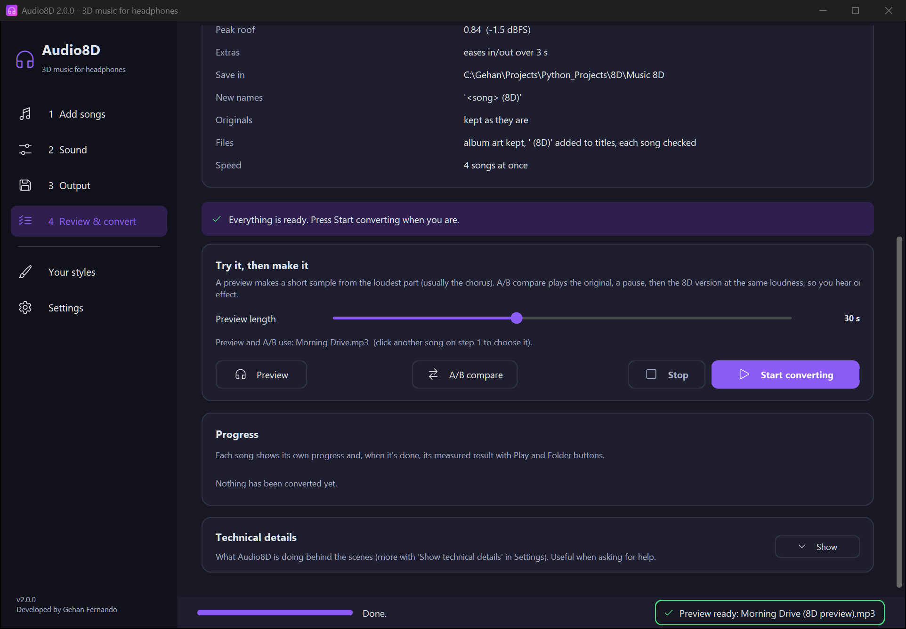
</p>
<p align="center"><sub>☝️ A green notice in the bottom-right corner: <i>Preview ready: Morning Drive (8D preview).mp3</i>.</sub></p>

### 🪟 The window itself

- It opens at a comfortable size and you can **resize** or **maximise** it like any window (it won't get smaller than 1100 × 720, so nothing gets squashed). Nothing ever overlaps, at any size.
- **Audio8D doesn't remember your choices** after you close it. Each time it opens, it starts fresh with the **Studio** style and the recommended settings. To keep settings you like, save them as [your own style](#-13-your-styles-page).
- If you **close the window while it's working**, it asks first ([Stop and close?](#stop-and-close)).

### ⌨️ Keyboard shortcuts

| Keys | What they do |
|---|---|
| <kbd>Ctrl</kbd>+<kbd>O</kbd> | **Add songs** (pick files) |
| <kbd>Ctrl</kbd>+<kbd>Shift</kbd>+<kbd>O</kbd> | **Add folder** |
| <kbd>Ctrl</kbd>+<kbd>1</kbd> … <kbd>Ctrl</kbd>+<kbd>6</kbd> | Go to step 1, 2, 3, 4, Your styles, Settings |
| <kbd>Ctrl</kbd>+<kbd>P</kbd> | **Preview** the chosen song |
| <kbd>Ctrl</kbd>+<kbd>Enter</kbd> | **Start converting** |
| <kbd>Esc</kbd> | **Stop** the work in progress. In a message window, <kbd>Esc</kbd> closes it like **Cancel** |

---

## 🎵 8. Step 1 · Add your songs

**What it's for:** choosing which songs get an 8D version.
**Where:** **1 Add songs** in the sidebar. This is the page the window opens on.

<p align="center">
  
</p>

### ➕ Four ways to add songs

| Way | How | Notes |
|---|---|---|
| 🖱️ **Drag and drop** (Windows) | Drag songs or whole folders from File Explorer and drop them **anywhere** on the window | The easiest way. You can drop many files and folders at once |
| ➕ **Add songs** button (<kbd>Ctrl</kbd>+<kbd>O</kbd>) | A *Choose songs* window opens; pick one or more files (hold <kbd>Ctrl</kbd> to pick several) and press **Open** | Shows only music files; choose *All files* at the bottom to see everything |
| 📁 **Add folder** button (<kbd>Ctrl</kbd>+<kbd>Shift</kbd>+<kbd>O</kbd>) | A *Choose a folder of songs* window opens; pick a folder and press **Select Folder** | Adds every song in that folder |
| 🚀 **When starting** | Drop songs onto `Audio8D.exe` (or `Audio8D.pyw`) in File Explorer | The window opens with them already listed |

After adding, a green notice says how many were added (*Added 5 songs*), and the heading changes from *Your list* to **5 songs ready**.

**The drop area** also lists what Audio8D can read: *MP3, FLAC, WAV, M4A, OGG, Opus, WMA, AIFF, APE, WavPack, and the sound of videos (MP4, MKV, WEBM)*.

### 🌳 Include songs in sub-folders

This switch is **on** at the start.

- **On:** adding a folder also brings the songs in the folders inside it (for example `Music\Rock`). Where the 8D songs are saved, **the same sub-folders are made**, so your library stays tidy.
- **Off:** only the songs directly inside the folder you add.

The switch affects folders you add **after** changing it. Songs already on the list stay.

### 🎼 The song list

Each song gets a row:

| Part of the row | What it shows |
|---|---|
| 🎵 **Name** | The song's file name. Rest the mouse on it to see the full location of the file |
| **Folder** (grey, under the name) | The folder it came from, such as `Music` or `Music\Rock` |
| **Kind** (after the folder) | What kind of file it is: e.g. *MP3, compressed* or *FLAC, lossless, the best start* |
| **Length** (right) | How long the song is, e.g. **1:15**. It shows **…** for a moment while the file is being read, and **?** if the length is unknown |
| **✕** (far right) | Takes the song off the list (it turns red when you point at it) |

**What you can do with a row:**

| To… | Do this |
|---|---|
| Choose the song used for **Preview** and **A/B compare** | **Click** the row. It gets a purple outline. (If you don't click one, the first song is used) |
| Hear the original song | **Double-click** the row. It opens in your normal music player |
| Take one song off the list | Click its **✕**. The file itself is **not** touched |
| Start again with an empty list | Press **Clear list** (top right). The files are **not** touched |

> [!NOTE]
> While songs are being converted, the list is locked: ✕ and **Clear list** do nothing, and adding songs shows *Please wait until the conversion finishes*.

### 🟥 A song that can't be read

If a file isn't really music, or is damaged, its row turns red with a red **!** and the words ***Can't be read as music - it will fail***. You can remove it with ✕, or leave it: the other songs still get converted, and this one will show a clear reason on step 4.

<p align="center">
  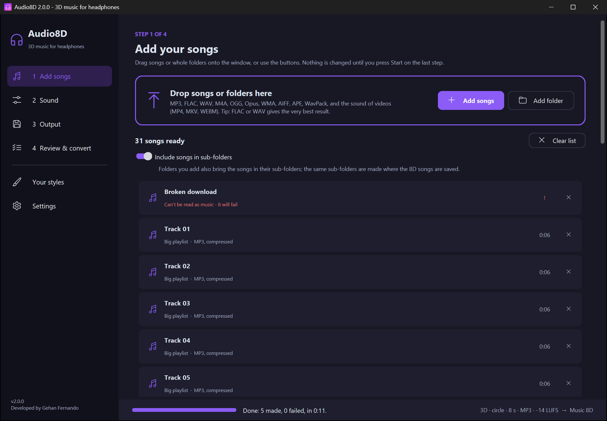
</p>

### 📜 Long lists

To keep the window quick, a long list shows **25 songs at a time**. Underneath, a line says, for example, *Showing 25 of 31 songs. All 31 will be converted.* Press **Show 6 more** (or **Show 25 more**) to see the next ones. **Every song on the list is converted**, whether it's shown or not.

<p align="center">
  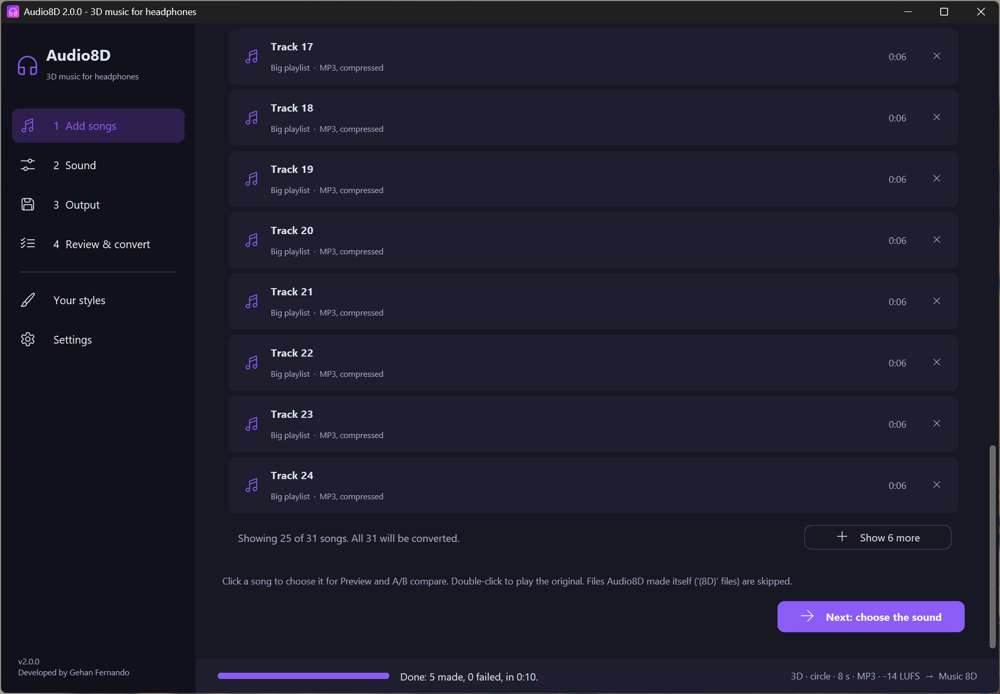
</p>

### 🙈 What gets skipped automatically

Audio8D quietly leaves these out, so you can safely add a whole music folder:

- files that aren't music (a red notice says *Those files aren't music (or were made by Audio8D)*);
- songs that are **already on the list**;
- files Audio8D made itself: names ending in **(8D)**, **(8D preview)** and **(A-B compare)**, and originals it kept as **(original)**.

A folder with no music at all shows *No songs found in …*.

> [!TIP]
> 💎 **Use the best copy you have.** A FLAC or WAV file gives the best result, then a 320 kbps MP3, then smaller MP3s. Songs from streaming apps (Spotify, Apple Music `.m4p` files) are copy-protected and can't be converted.

When you're happy with the list, press **Next: choose the sound**.

---

## 🎨 9. Step 2 · Choose the sound

**What it's for:** deciding how the 8D effect sounds.
**Where:** **2 Sound** in the sidebar.

The page has four cards: **1. Pick a style for all songs**, **2. The essentials**, **3. Advanced sound**, and **4. A different style for some songs**. Most people only ever use the first one.

### 🎨 9.1 Pick a style for all songs

A **style** is a ready-made set of settings with a name. The style you click here is used for **every song** on the list (unless you give a song [its own style](#-94-a-different-style-for-some-songs)). **Studio ★ best** is chosen when the window opens.

<p align="center">
  
</p>

**Each style card shows:**

| Part | Example | Meaning |
|---|---|---|
| **Name** | **Studio ★ best** | The style's name. **★ best** marks the recommended one; **(yours)** marks [a style you saved](#-13-your-styles-page) |
| **Purple line** | *3D · Circle · MP3 · -14 LUFS* | The engine (3D or Panning), the route (Circle, Front arc, Figure-8, Wander), the file type, **beat** if it follows the beat, and the loudness goal if it has one |
| **Description** | *Best of best: 3D sound, 320 kbps…* | What it's good for |

**To choose a style: click its card.** It gets a purple outline and a notice says, for example, *Style: Groove*.

> [!NOTE]
> Clicking a style sets **every** sound setting and the file type and loudness to that style's values. It also switches *Safe for speakers too* off. It doesn't change your songs, where they're saved, or what happens to the originals.

**Which style should I pick?**

| Style | Great for |
|---|---|
| **Studio** ★ | **Everything.** The best overall choice |
| **Streaming** | Playlists where every song must be exactly as loud as the others |
| **Lossless** | Saving as FLAC so nothing at all is lost |
| **Hifi** | The most faithful copy: FLAC, the song's own loudness, gentle 3D |
| **Classic** | The everyday default (what you get if you pick nothing) |
| **Groove** | Dance, pop, hip-hop: loops round each ear **in time with the beat** |
| **Smooth** | Slow and relaxed: lo-fi, acoustic, background |
| **Strong** | Big, obvious movement: pop, EDM, "8D video" feel |
| **Spacious** | Roomy and atmospheric: slow songs, film music |
| **Sky** | Drifts up over your head and back: chill, ambient |
| **Voice** | Gentle and dry: podcasts, audiobooks, meditation |
| **Whirlwind** | Very fast spin: short clips and ringtones |
| **Speakers** | Speakers and car stereos, not just headphones |
| **Retro** | The old left-right ping-pong sound of the first Audio8D |

All the exact values are in [part 16](#-all-the-ready-made-styles).

### 🎚️ 9.2 The essentials

The three settings that change the sound the most.

<p align="center">
  
</p>

At the top, a purple label shows the chosen style, for example **Style: Studio**. As soon as you change anything, it says **Style: Studio (changed by you)**. To undo your changes, use **Back to the style** in the Advanced card, or simply click the style card again.

#### 💪 Movement: how FAR the music travels

| Value | Feels like |
|:---:|---|
| 0 | 🧍 Stays in the middle (no movement at all) |
| 0.5 – 0.7 | 🚶 A gentle sway |
| **0.80** ⭐ | 🏃 Clear movement all round your head (recommended) |
| 0.95 – 1 | 🎢 As far as it goes, right into each ear (can tire your ears) |

Range 0 to 1, in steps of 0.05.

#### 🌀 Spin speed: how FAST it goes round

The number of **seconds** for one full circle round your head. Smaller is faster, bigger is slower.

| Value | Feels like |
|:---:|---|
| 2 – 4 s | 🌪️ A merry-go-round at top speed. Fun but dizzy! |
| **6 – 10 s** ⭐ | 🎠 The classic 8D feeling (8 s is recommended) |
| 12 – 20 s | 🌊 Slow ocean waves, dreamy |
| 30 – 100 s | 🌅 A very slow drift |

Range 2 to 100 seconds, in half-second steps. When **Speed over time** (Advanced) is filled in, this slider is greyed out and says *'Speed over time' (Advanced) is in charge of the spin now.* With beat sync on, it notes that *Beat sync rounds it to whole bars.*

🎯 **Fun fact:** 8 seconds is exactly 4 bars of a 120 BPM pop song, the most common song speed!

#### 🏛️ Room: how much room sound

A little natural room sound (called **reverb**) makes music feel like it's around you, not inside your head.

| Value | Feels like |
|:---:|---|
| 0 | 🛏️ No room at all ("dry"). Best for talking and podcasts |
| **0.25** ⭐ | 🛋️ A cosy living room (recommended) |
| 0.5 | 🏟️ A big hall |
| 1 | ⛪ A huge church. Voices may get blurry above 0.6 |

Range 0 to 1, in steps of 0.05.

### 🔧 9.3 Advanced sound

Press **⌄ Show** on the *3. Advanced sound* card to open it. The chosen style already set good values here, so you only need this for special wishes.

<p align="center">
  
</p>

#### Sound engine

| Choice | What it does |
|---|---|
| **3D around you** ⭐ | Uses all three hearing clues (timing, loudness, tone), so the music goes **round and behind** you |
| **Left-right panning** | Simple left-right volume changes, like the first Audio8D. Also friendlier for speakers |

This is greyed out while **Safe for speakers too** is on (that switch always uses panning).

#### Path

The route the music takes around your head:

| Path | The route | Try it for |
|---|---|---|
| **Circle** ⭐ | Front → right → behind → left → front | Everything |
| **Front arc** | Swings side to side **in front of you** only, like a pendulum | Podcasts and voice |
| **Figure-8** | Loops round your **right** ear, then round your **left** ear | Dance and pop |
| **Wander** | Drifts freely around you, never repeating exactly | Ambient and chill |

#### Direction

**Clockwise** (normal) or **Counter-clockwise**: which way it turns round your head.

#### Keep the bass in the middle · Bass below

With the switch **on** (recommended), the kick drum and bass guitar stay in the centre while everything else moves, just like a professional mix. This makes the beat feel solid.

**Bass below** (40 to 250 Hz, recommended **120 Hz**) sets how low a sound has to be to stay in the middle. "Hz" measures how low or high a sound is: small numbers are deep sounds.

| Bass below | Effect |
|:---:|---|
| switch **off** | The bass moves too (the sound of the first Audio8D) |
| 80 Hz | Only the deepest bass stays still |
| **120 Hz** ⭐ | Kick drum and bass guitar stay still, everything else moves |
| 200 – 250 Hz | The low piano and deep voices stay still as well |

The **Bass below** slider is greyed out while the switch is off.

#### Height

Lets the sound **float up over your head and back down** (once every two circles). 0 stays at ear level; try **0.5** for ambient music. Range 0 to 1.

Greyed out with *Left-right panning* or *Safe for speakers too*, with the note *Height needs the 3D engine (not panning or 'Safe for speakers').*

#### Ease in and out

The movement **grows in gently** at the start of the song and **settles back** at the end, so a song never starts mid-spin. Recommended **3 s**; **0** turns it off. Range 0 to 30 seconds.

<p align="center">
  
</p>

#### Spin in time with the beat · Tempo (optional)

With this switch **on**, Audio8D **listens for the song's beat** (its tempo, in **BPM**, beats per minute) and makes one circle last a whole number of bars, as close as possible to your spin speed. Great for dance and pop.

- When you switch it on, a **Tempo (optional)** box appears. If you know the song's BPM, type it (40 to 240) to skip the listening step. Leave it empty to let Audio8D find it.
- Typing a tempo turns the switch on by itself.
- When the song is finished, its row on step 4 says what was found, for example *89.9 BPM, one circle = 16 beats*.
- Music without a steady beat (ambient, classical, speech) is recognised: the row says *no clear beat, so the spin kept its own speed*.

#### Speed over time · Movement over time

For songs that should change as they go, such as a faster spin in the chorus. You type **time=value** pairs separated by commas. Times can be seconds (`90`) or minutes:seconds (`1:30`).

| Box | Example | Means |
|---|---|---|
| **Speed over time** | `0=10, 1:00=6, 2:30=10` | 10-second circles at the start, 6-second circles from 1:00 (the chorus), back to 10 at 2:30 |
| **Movement over time** | `0=0.5, 1:00=0.95` | Gentle at first, big from 1:00. Values go from 0 to 1 |

- As you type, a **green line reads it back in words** so you can check it (*Reads as: 10 s per circle at 0:00, then 6 s per circle at 1:00…*).
- A mistake turns the box **red** and says what's wrong, with a working example.
- Audio8D moves smoothly between the values.
- While a box is filled in, it **takes over** from the matching slider (*Spin speed* or *Movement*), which is greyed out. Empty the box to use the slider again.

#### Keep the singer in the middle

Uses a free AI helper called **Demucs** to separate the singer from the band. The band travels round your head while the voice stays clear and close. It takes **a minute or two per song**.

- This switch is **greyed out** until Demucs is installed. Its help line says how to get it.
- To install Demucs (source-code version only; it's about 1 GB), type `python -m pip install demucs` in a terminal, then restart Audio8D. The very first use also downloads the AI model (about 80 MB).
- The **standalone app doesn't include it**, because the AI model needs a full Python install.

#### Safe for speakers too

3D sound is made for headphones. On speakers, both ears hear both sides, so strong 3D clues can sound odd. Switch this **on** if the song will play on **speakers, in a car, or on a phone speaker**. It makes any style speaker-friendly: gentle left-right movement (at most 0.6), bass in the middle, and no height.

While it's on, **Sound engine** is greyed out, and the summary in the status bar says **speaker-safe**.

#### Back to the style

The button at the bottom of the card. It **undoes every change** you made on this page and goes back to the chosen style's own values.

### 🎼 9.4 A different style for some songs

**What it's for:** giving one or more songs a different style from the rest. For example, a playlist in **Studio**, but the podcast episode in **Voice**, or one song kept lossless in **Lossless**.

**Where:** card **4. A different style for some songs**, at the bottom of step 2. Press **⌄ Show** to open it.

<p align="center">
  
</p>

**How it works:**

- Every song starts on **Same as all songs**: it uses the style from card 1, with your changes from cards 2 and 3 and from step 3. **This is exactly how Audio8D always worked**, so if you never open this card, nothing changes.
- To give a song its own style, open its menu and pick one: every built-in style (**Studio**, **Streaming**, **Lossless**…) and every style of yours (marked **(yours)**).
- **A song with its own style uses that style exactly as it is**, including **its file type and loudness**. The changes you make on cards 2 and 3, and the file type and loudness on step 3, apply to the songs that use the style for all songs. (So a song set to **Lossless** is saved as FLAC while the others are MP3.) Everything else on step 3 applies to every song: where they're saved, the names, the originals, trimming and so on.
- You can change a song's style as often as you like, before or after changing the style for all songs. To undo one song, pick **Same as all songs** again; to undo them all, press **All songs use the style above**.
- The line at the top says how many songs have their own style. The same count appears in the status-bar summary (*1 song with own style*), and step 4 lists them on an **Own styles** line.
- **Preview** and **A/B compare** on step 4 use the chosen song's own style when it has one.
- Long lists show 25 songs at a time, with a **Show 25 more** button, like step 1. Taking a song off the list forgets its own style.
- If a style you gave a song is **deleted** on *Your styles*, that song goes back to the style for all songs (a notice says so). If it's **renamed**, the song keeps it under its new name.

> [!NOTE]
> Songs' own styles are part of the list you're working on: like the other choices, they are not remembered after you close Audio8D. Your saved styles themselves are always kept.

### 🔁 Not quite right? Quick fixes for the sound

Change **one** thing, then use **Preview** on step 4 to hear it:

| It sounds… | Try this |
|---|---|
| 😵 Too strong or dizzy | The **Smooth** style, or lower **Movement** |
| 🐌 Spinning too fast for a slow song | Raise **Spin speed** to 12 |
| 🥁 Not in time with the beat | Switch on **Spin in time with the beat**, or pick the **Groove** style |
| 😐 Hardly moving | Raise **Movement** to 0.95, and check you're wearing headphones |
| 🌫️ Too echoey | Lower **Room** to 0.15 |
| 🎤 The voice moves too much | **Keep the singer in the middle** (needs Demucs) |
| 🔉 Quieter than my other songs | Step 3: **Loudness → Spotify / YouTube (-14)** |
| 🚗 Sounds odd in my car | Switch on **Safe for speakers too**, or pick the **Speakers** style |

Press **Next: output options** to continue.

---

## 💾 10. Step 3 · Output options

**What it's for:** deciding what kind of file to make, how loud, where to put it, and what happens to your originals.
**Where:** **3 Output** in the sidebar.

<p align="center">
  
</p>

### ⭐ The essentials

#### File type

| Choice | Good for | What its help line says |
|---|---|---|
| **MP3** ⭐ | Playing **everywhere** | *MP3: plays on everything; 320 kbps is the best MP3 can be.* |
| **FLAC** | Keeping **every detail** (bigger files) | *FLAC 24-bit: nothing is lost at all; keeps the album art.* |
| **WAV** | Music-editing software | *WAV 24-bit: nothing is lost; big files, and no album picture.* |
| **M4A** | iPhone and iTunes | *M4A (AAC): great for iPhone and iTunes; keeps the album art.* |
| **Opus** | Small files that still sound great | *Opus: small files that still sound great; no album picture.* |

Picking a file type also changes what's possible in *Advanced output* (see below).

#### Loudness

Music apps play every song at about the same loudness. This choice decides how loud your 8D songs will be. Loudness is measured in **LUFS**: the closer to zero, the louder.

| Choice | Means |
|---|---|
| **Spotify / YouTube (-14)** ⭐ | As loud as Spotify, YouTube, Tidal and Amazon Music. Your 8D song fits in with the rest of your music |
| **Apple Music (-16)** | As loud as Apple Music |
| **TV & radio (-23)** | The quieter broadcast standard |
| **Same as original** | Keeps your song's own loudness |
| **Natural (off)** | No target: the song's natural level, turned down a little to leave room for the 3D peaks. It can sound quieter than other music ([why?](#-18-loudness-why-is-my-song-quieter)) |
| **Custom…** | Your own number. A **Custom loudness** box appears |

<p align="center">
  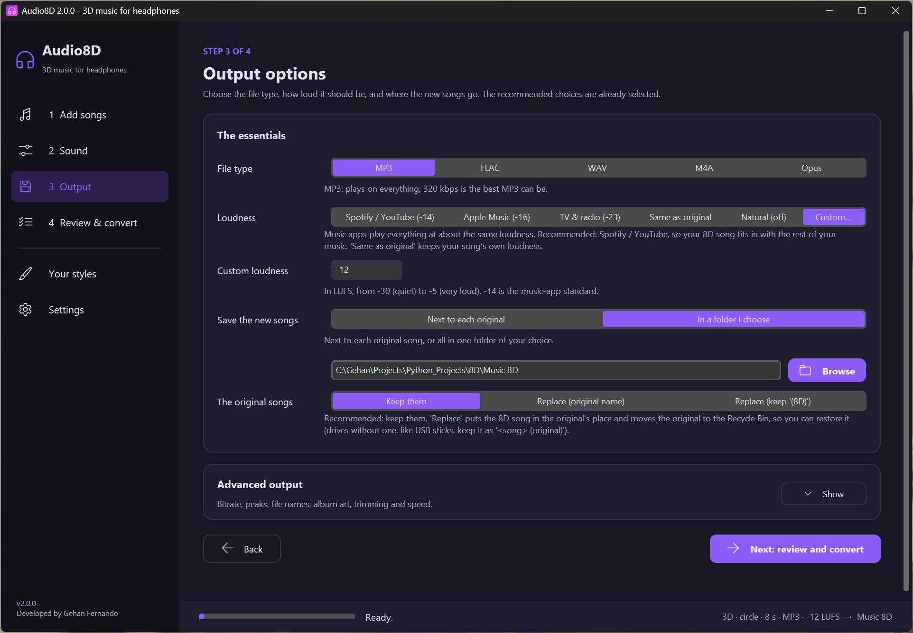
</p>

**Custom loudness:** type a number from **-30** (quiet) to **-5** (very loud). **-14** is the music-app standard. A number outside that range turns the box red with *Type a loudness from -30 to -5, e.g. -14.*

#### Save the new songs

| Choice | Means |
|---|---|
| **Next to each original** | Each 8D song goes in the same folder as its original |
| **In a folder I choose** | All 8D songs go in one folder. A box and a **Browse** button appear |

- Press **Browse** to pick the folder in a *Where should the 8D songs go?* window, or type the folder's path into the box.
- If the box is still empty when you choose *In a folder I choose*, the Browse window opens straight away.
- The folder **doesn't need to exist**: Audio8D creates it. With *Include songs in sub-folders*, the sub-folders are copied too.
- If you type the path of a **file** instead of a folder, step 4 shows a red note.

#### The original songs

| Choice | What happens to your original song | New song's name |
|---|---|---|
| **Keep them** ⭐ | Nothing. It stays exactly where it was | `Song (8D).mp3` |
| **Replace (original name)** | Moved to the **Recycle Bin** after the 8D song is safely saved | Takes the original's name: `Song.mp3` |
| **Replace (keep '(8D)')** | Moved to the **Recycle Bin** after the 8D song is safely saved | `Song (8D).mp3` |

> [!IMPORTANT]
> **Replacing never deletes anything for good.** The original goes to the **Recycle Bin** (macOS/Linux: the **Trash**), so you can restore it. Drives without a Recycle Bin, such as **USB sticks, memory cards and network drives**, keep the original in its folder, renamed **`<song> (original)`**. Audio8D also asks you to confirm before it starts ([see the message](#replace-the-original-songs)).

### 🔧 Advanced output

Press **⌄ Show** on the *Advanced output* card. The recommended values are already set.

<p align="center">
   (8D)' (Same as the original and Custom also offered). Replace 8D files that already exist (off). Keep the album picture (on). Add ' (8D)' to the song title (on). Check each finished song (on). Only part: from and to boxes, both empty. Songs at once slider at 4. Play the first song when finished (off)." width="100%"/>
</p>

| Control | What it does | Recommended |
|---|---|---|
| **Bitrate** | How much detail is kept each second, for MP3, M4A and Opus: **Auto**, 128, 160, 192, 224, 256 or **320** kbps. 320 is the most MP3 allows. *Auto* lets MP3 use the *MP3 quality* slider, and gives M4A 256 and Opus 192. **Greyed out for FLAC and WAV**, which lose nothing and have no bitrate | 320 (set by *studio*) |
| **MP3 quality** | **Only appears** for MP3 with bitrate *Auto*. **V0** is the best (about 245 kbps), **V2** excellent (about 190 kbps), **V9** the smallest files | V0 to V2 |
| **Always hit the loudness exactly** | **Off:** the song is never squeezed; if reaching the loudness goal would squash the loudest moments, Audio8D stops just short. **On:** every song lands exactly on the goal, shaving the very loudest peaks a little. **Greyed out** with *Natural (off)*, because there's no goal | Off |
| **Peak roof** | The loudest a sound may get, so nothing crackles. Range 0.50 to 1.00 | 0.84 for MP3, M4A and Opus; 0.89 is fine for FLAC and WAV |
| **New file name** | **'<song> (8D)'** puts "(8D)" after the name, so it can sit next to the original. **Same as the original** keeps the exact name, which only works when saving to **a different folder**. **Custom…** lets you type a name, **for one song only**. **Greyed out while replacing originals**, because *The original songs* decides the name then | '<song> (8D)' |
| **Custom name** | **Appears** with *Custom…*. Type the new name, e.g. *My Song 8D version*. The right ending (`.mp3`, `.flac`…) is added for you. Names can't contain `< > : " / \ \| ? *` | |
| **Replace 8D files that already exist** | **Off:** songs that already have an 8D version are skipped. **On:** they are made again and the old 8D file is replaced | Off |
| **Keep the album picture** | Copies the cover picture into the new file. **Greyed out for WAV and Opus**, which can't hold one | On |
| **Add ' (8D)' to the song title** | Adds " (8D)" to the title stored inside the file, so your music app lists the 8D version as its own track | On |
| **Check each finished song** | Measures every finished song (loudness, peaks, how it sounds on one speaker) and shows the result on its row. Takes a second | On |
| **Only part: from … to …** | Keeps only part of the song, e.g. from `1:00` to `1:30` for a ringtone. Write times like `90` or `1:30`. Leave both empty for the whole song; you can also fill in just one of them | Empty |
| **Songs at once** | How many songs are made at the same time, 1 to 8. More is faster on powerful computers. A good value for your computer is set when the window opens | As set |
| **Play the first song when finished** | Opens the first new song in your music player as soon as everything is done | Off |

Press **Next: review and convert** to continue.

---

## ✅ 11. Step 4 · Review and convert

**What it's for:** checking your choices, trying a sample, and making the songs.
**Where:** **4 Review & convert** in the sidebar.

The page has five parts, from top to bottom: **Your choices**, the **notes**, **Try it, then make it**, **Progress** and **Technical details**.

### 📋 Your choices

A plain-words summary of everything, so you can check it at a glance:

<p align="center">
  
</p>

| Line | Shows |
|---|---|
| **Songs** | How many songs are on the list |
| **Own styles** (only when some songs have one) | Which songs have a style of their own, e.g. *1 song with its own style (Morning Drive: Lossless)* |
| **Style** | The style for all songs |
| **Sound** · **Spin** · **Movement** · **Bass** · **Room** | The sound settings from step 2, in words |
| **File type** · **Loudness** · **Peak roof** | The file settings from step 3 |
| **Extras** | Anything extra: easing in and out, height, changes over time, the singer kept in the middle, a trimmed part |
| **Save in** | The chosen folder, or *next to each original song* |
| **New names** | How the new files will be named |
| **Originals** | *kept as they are*, or where they'll go |
| **Files** | Album art, " (8D)" in titles, the check, replacing existing 8D files |
| **Speed** | How many songs are made at once |

### 🚦 The notes: red, yellow and purple

Under the summary, coloured notes tell you whether you're ready:

| Note | Means | What to do |
|---|---|---|
| 🟥 **Red** (with a **Fix it** button) | Something **must be fixed** before starting. **Start converting**, **Preview** and **A/B compare** won't run until it is | Press **Fix it**: it takes you to the right page |
| 🟨 **Yellow** | A friendly **heads-up**. You can still start | Read it; change the setting if you agree |
| 🟪 **Purple** ✔ | *Everything is ready. Press Start converting when you are.* | Go ahead! |

<p align="center">
  
</p>
<p align="center"><sub>☝️ A red note: a custom file name was chosen for five songs. <b>Fix it</b> jumps to step 3.</sub></p>

<p align="center">
  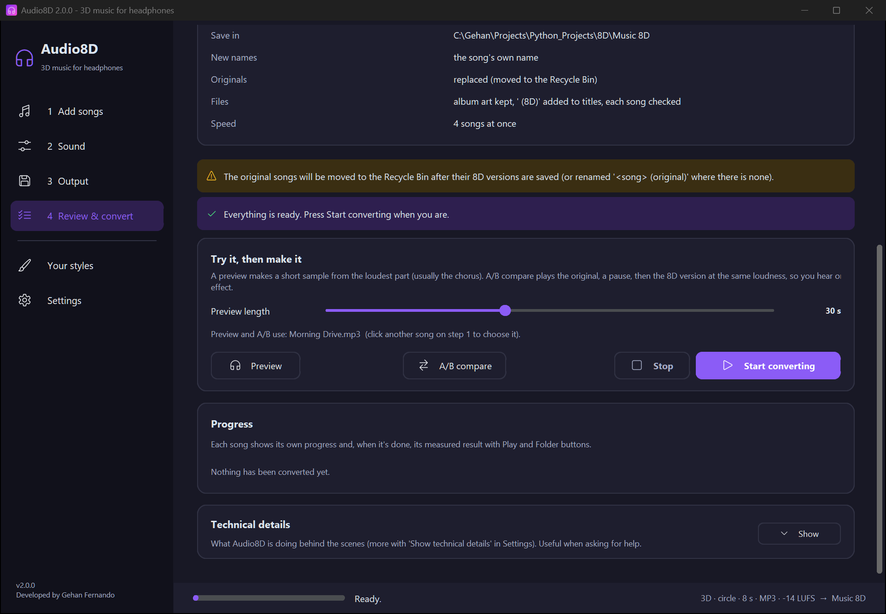 (original)' where there is none). Below it, the purple note says Everything is ready." width="100%"/>
</p>
<p align="center"><sub>☝️ A yellow note: a heads-up that the originals will go to the Recycle Bin. You can still start.</sub></p>

**Heads-ups about the song files themselves.** Once Audio8D has read your songs, step 4 also tells you if any of them will hold the result back, because an 8D version can never sound better than the file it's made from:

- *2 songs are low-quality files (Track 01, Track 02), under 192 kbps. The 8D version can't sound better than the file you give it: use a better copy (FLAC, WAV or a 320 kbps MP3) if you have one.*
- *1 song is a low-detail recording (Voice Memo), like a phone or voice memo. Audio8D raises it so the 3D effect works, but it can't add the missing high notes.*

These are yellow: you can still start, but if you have a better copy of the song, use it.

<p align="center">
  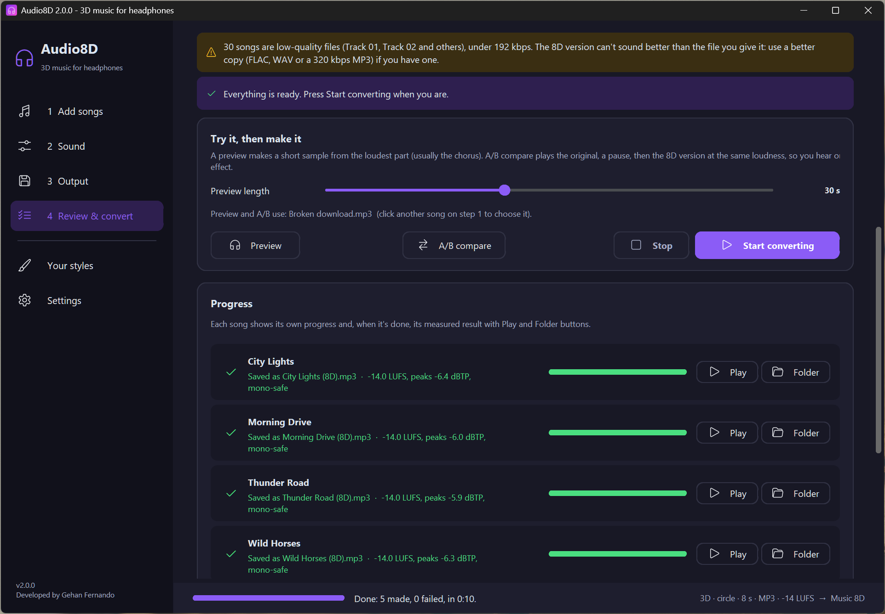
</p>

All the possible notes are listed in [part 15](#-red-and-yellow-notes-on-step-4).

### 🎧 Try it, then make it

This card holds the main buttons:

| Control | What it does |
|---|---|
| **Preview length** | How long a preview is: 10 to 60 seconds (normally **30 s**) |
| **Preview and A/B use: …** | Names the song used for Preview and A/B compare. To use another song, click it on step 1 |
| 🎧 **Preview** (<kbd>Ctrl</kbd>+<kbd>P</kbd>) | Makes a short 8D sample from the **loudest part** of the chosen song (usually the chorus), with its style (its own, if it has one), and plays it in your music player. It takes a few seconds. The sample is saved next to the song as **`<song> (8D preview)`** and replaced each time you make a new one |
| 🔀 **A/B compare** | Makes one file that plays **15 seconds of the original**, a short pause, then **the same 15 seconds in 8D**, both at the same loudness, so you hear only the effect. Saved next to the song as **`<song> (A-B compare).mp3`** and played straight away |
| ⏹️ **Stop** (<kbd>Esc</kbd>) | **Red only while something is running**; otherwise it's a grey outline and does nothing. Stops after the current step: finished songs are kept, and the half-made file is cleaned up |
| ▶️ **Start converting** (<kbd>Ctrl</kbd>+<kbd>Enter</kbd>) | Makes the 8D version of **every song on the list**. Greyed out while there's a red note or while something is running |

While Preview, A/B compare or a conversion is running, **Preview**, **A/B compare** and **Start converting** are greyed out and **Stop** turns red.

### ▶️ What happens when you press Start converting

1. **If you chose to replace originals**, a message asks you to confirm first ([Replace the original songs?](#replace-the-original-songs)).
2. **Songs that already have an 8D version are skipped** (unless *Replace 8D files that already exist* is on). A notice says, for example, *Skipped 2 song(s) that already have an 8D version*. If **every** song already has one, the [Nothing new to make](#nothing-new-to-make) message appears instead.
3. **The window shows step 4**, and every song gets a row in the **Progress** card.

### 📊 Progress

<p align="center">
  
</p>

**Each song's row goes through these stages:**

| The row says | Means |
|---|---|
| *Waiting* (grey) | Its turn hasn't come yet |
| *Splitting vocals… 40%* (orange) | Separating the singer (only with *Keep the singer in the middle*) |
| *Making the 3D mix… 40%* (orange) | Creating the 8D sound |
| *Saving the file… 40%* (orange) | Writing the new file |
| *Checking the result… 40%* (orange) | Measuring the finished song (only with *Check each finished song*) |
| ✔ **Green line** | **Finished!** See below |
| ✖ **Red line** | This song couldn't be made. The line says why, and a **What to do:** line says how to fix it. The other songs carry on |

**A finished row** shows a green tick, a full green bar, **Play** and **Folder** buttons, and a line like:

*Saved as City Lights (8D).mp3 · -14.0 LUFS, peaks -6.8 dBTP, mono-safe*

| Part | Means |
|---|---|
| **Saved as …** | The new file's name |
| **-14.0 LUFS** | How loud it turned out (only with *Check each finished song*) |
| **peaks -6.8 dBTP** | Its loudest moment; below 0 means nothing crackles |
| **mono-safe** (or *weak on one speaker*) | Whether it still sounds right on one small speaker (a phone, a Bluetooth box) |
| *89.9 BPM, one circle = 16 beats* | The tempo found (with beat sync) |
| *original moved to the Recycle Bin* | What happened to the original (when replacing) |

- **Play** opens the new song in your music player.
- **Folder** opens the folder that holds it.

While it works, the **status bar** shows the overall progress and a timer, e.g. *Converting 5 songs… (0:08)*. The window keeps responding the whole time: you can scroll, read, visit other pages, or press **Stop**.

**A song that failed** looks like this. The row turns red, and the other songs are made as normal:

<p align="center">
  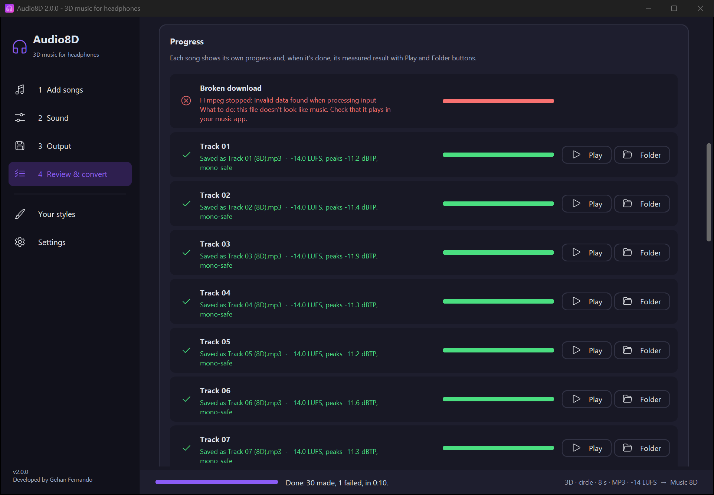
</p>

**Very long lists:** the first 25 songs get their own rows, and one line counts the rest, for example *Songs 26 to 31: 6 made.* (while working: *…, 3 still to go*). Any song past the first 25 that fails still gets its own red row, so you never miss a problem.

<p align="center">
  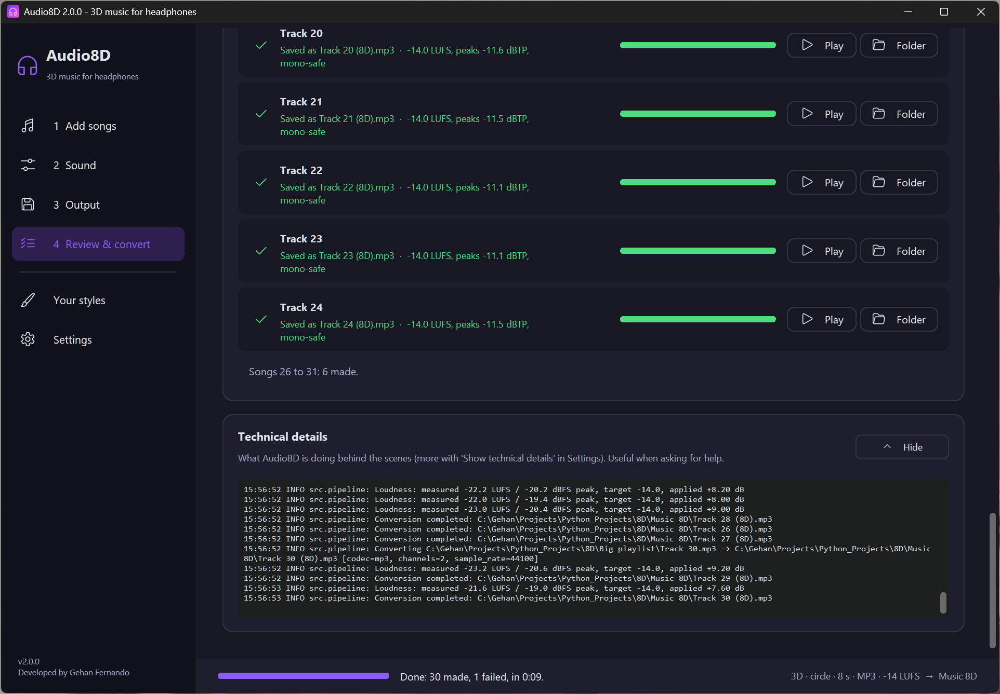
</p>

### 🎉 When it's finished

A message pops up. If every song worked, it's called **All done!**; if some failed, it's called **Finished, with some problems**:

<table>
<tr>
<td width="50%" align="center"></td>
<td width="50%" align="center">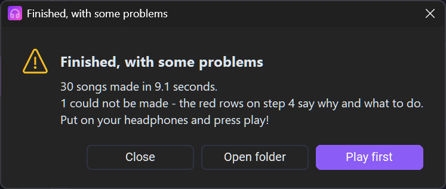</td>
</tr>
</table>

The message says how many songs were made and how long it took. If originals were replaced, it adds a line such as *3 originals moved to the Recycle Bin.* If some failed, it says how many and points to the red rows.

| Button | What it does |
|---|---|
| **Close** | Closes the message |
| **Open folder** | Opens the folder with the new songs |
| **Play first** | Plays the first new song |

(If no song could be made at all, only **Close** is shown.) The status bar then says, for example, *Done: 5 made, 0 failed, in 0:10.* If you pressed **Stop**, there's no message; the status bar says *Stopped. Finished songs are kept.*

### 🔬 Technical details

The last card on the page. Press **⌄ Show** to see a box of text that records what Audio8D is doing behind the scenes: each song it converts, the loudness it measured, where it saved the file, and the full details of any problem. You never need to read it, but it's handy if you ask someone for help.

<p align="center">
  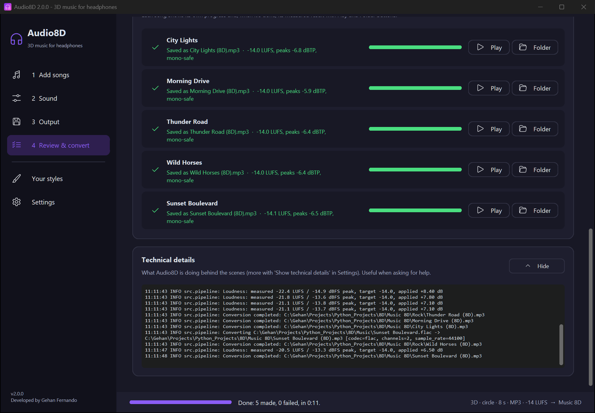
</p>

For even more detail, switch on **Settings → Show technical details**.

---

## 🎧 12. Listen and check your new songs

### 🎧 How to listen

1. Put on your **headphones**, with **L** on your left ear. 👂
2. Press **Play** on a finished row (or **Play first** in the message).
3. **Close your eyes.** For the first few seconds the movement fades in gently. Then, over about **8 seconds**, the music travels **in front → right ear → behind you → left ear → in front**. 🌀 The bass and drums stay in the middle.
4. Try **A/B compare** on step 4: the 8D half should feel **wider** and more "around you", with the beat still solid.

| What you hear | What it means | What to do |
|---|---|---|
| 😍 Smooth movement, clear voice, steady beat | **Perfect!** | Enjoy! |
| 😵 Too much, dizzy | Too strong or too fast | Lower **Movement**, raise **Spin speed**, or use **Smooth** |
| 🌫️ Echoey or muddy | Too much room sound | Lower **Room** |
| 😐 Hardly moving | Maybe not on headphones | Use headphones, then raise **Movement** |
| 🎤 The voice wanders too much | The whole song moves | **Keep the singer in the middle** |
| 🥁 Movement fights the rhythm | The spin isn't in time | **Spin in time with the beat** |

### ✅ The best-sound checklist

Audio8D already chooses good settings and warns you about weak ones. These five things make the biggest difference to the result:

| | Do this | Why |
|:---:|---|---|
| 1️⃣ | **Start from the best copy of the song** you have: FLAC or WAV, or at least a 320 kbps MP3 | An 8D song can't be better than its source. Step 4 warns you about low-quality files |
| 2️⃣ | **Use the Studio style** (or Lossless / Hifi), unless you have a reason not to | They follow the standards music apps use |
| 3️⃣ | **Try a Preview or A/B compare** before converting a whole folder | You hear the result in seconds, and can change one thing at a time |
| 4️⃣ | **Keep the yellow notes in mind** on step 4 (and the quality check when you create a style) | Each one says what may not sound its best, and what to do |
| 5️⃣ | **Listen on headphones**, left on your left ear | The effect is made for two ears; on speakers use *Safe for speakers too* |

### 🏷️ What your new song has

| | |
|---|---|
| **Name** | `<song> (8D).mp3` (or the name you chose), next to the original or in your chosen folder |
| **Title inside the file** | The song's title plus " (8D)", so your music app shows both versions side by side |
| **Album picture** | Kept (for MP3, FLAC and M4A) |
| **Length** | Exactly the same as the original (unless you chose *Only part*) |

### ✅ The automatic check, explained

With **Check each finished song** on, each row shows three measurements:

| Measurement | What it means | Good values |
|---|---|---|
| **LUFS** | How loud the song *feels* | About −14 for music apps |
| **peaks … dBTP** | The loudest moment, even between the tiny steps of the sound ("true peak") | Below 0; below −1 is ideal for streaming apps |
| **mono-safe** | It still sounds right on one speaker (phone, Bluetooth box) | ✅ mono-safe |

If a row says **weak on one speaker**, the song may sound thin on a single speaker. **Safe for speakers too** makes a safer version.

---

## 💾 13. Your styles page

**What it's for:** making styles of your own, and keeping, renaming, copying, sharing and removing them.
**Where:** **Your styles** in the sidebar (<kbd>Ctrl</kbd>+<kbd>5</kbd>).

Your styles work exactly like the built-in ones: they appear as cards on step 2 (marked **(yours)**), and in every song's menu in [card 4](#-94-a-different-style-for-some-songs), so you can use them for all songs or just some. They're kept on this computer and are still there next time you open Audio8D.

The page has three cards, from top to bottom: **Create your own style**, **Or save your current settings**, and **Saved styles**.

### ✨ Create your own style (the guided way)

You don't need to know anything about sound: you answer a few simple questions, and Audio8D turns your answers into the right settings, checks them, suggests a name and a description, and lets you try the result before you save.

<p align="center">
  
</p>

**Step by step:**

1. **Music: what will you listen to?** Pick the closest: **Strong beat** (dance, pop, hip-hop), **Calm** (chill, acoustic, lo-fi), **Big and loud** (rock, EDM, film music), **Talking** (podcasts, audiobooks) or **A bit of everything**. This **fills in good answers for all the other questions**, so a beginner can simply press **Save style** now.
2. **Change any answer you like** (every question explains its choices in the line under it):

   | Question | Choices | What they mean |
   |---|---|---|
   | **Movement** | Gentle · **Clear** · Big | How far the music travels round your head: relaxing · the classic 8D feeling (recommended) · right into each ear |
   | **Speed** | Slow · **Normal** · Fast · With the beat | One circle every 12 s · every 8 s (recommended) · every 5 s · in time with the song's beat |
   | **Room** | None · **A little** · A big hall | No room sound (best for talking) · music feels around you (recommended) · spacious, but voices can blur |
   | **Listen on** | **Headphones** · Speakers or a car too | Full 3D · a gentler version that sounds right everywhere |
   | **File type** | **MP3** · FLAC · M4A | Plays everywhere, at the best MP3 quality · keeps every detail · for iPhone and iTunes |
   | **Loudness** | **Like music apps** · Same as the song · Natural | As loud as Spotify and YouTube (recommended) · keeps each song's own loudness · can sound quieter |

3. **Name.** A free name is suggested for you (for example *Calm Mix*; if you already have one, *Calm Mix 2*). Type your own if you like, **in any form**: the line under the box shows what it will be saved as (see [style names](#-style-names) below).
4. **Description.** One is written for you from your answers (for example *Calm music: gentle movement, slow spin, a little room, MP3*). Change it if you like; it's shown on the style's card.
5. **Look at "Your style"** underneath: it describes in plain words what the style will do (sound, spin, movement, room, file and loudness).
6. **Read the quality check** (see below).
7. Press **🎧 Try it** to hear a short preview of the chosen song (step 1) with this style, before saving. It uses **only** these answers, so it works even if something on steps 2 or 3 still needs fixing.
8. Press **💾 Save style**.

✅ **You should see:** a green line under the name, *Saved 'Calm Mix'. It's now on step 2 with the other styles.*, and a notice *Saved your style 'Calm Mix'*. The new style is selected on step 2 for all songs, and the creator is ready for another style.

#### ✅ The quality check

As you answer, Audio8D checks the style the way a sound engineer would, and tells you if anything would make it weaker:

<p align="center">
  
</p>

| You see | Means |
|---|---|
| ✔ *Quality check: this style looks good.* (green) | Nothing to improve |
| ⚠ An orange line, e.g. *Your 8D song will be quieter than normal music.* | Something may not sound its best. **Improve it for me** changes the answers to follow the advice |
| ✖ A red line, e.g. *This style doesn't move the music at all, so there would be no 8D effect.* | The style can't be saved like this |
| ℹ *Add a few words to the description so you remember its use.* | A friendly tip; it doesn't stop you saving |

If you press **Save style** while an orange warning is showing, Audio8D asks first:

<p align="center">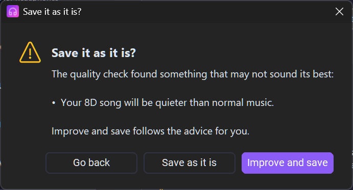</p>

**Go back** returns without saving · **Save as it is** saves it anyway · **Improve and save** follows the advice, then saves.

### 💾 Or save your current settings

The quick way when you've already set everything up on steps 2 and 3:

1. Set up the sound on step 2 and the file type and loudness on step 3.
2. Open **Your styles**, type a **Name** (in any form) and optionally a **Description**.
3. Press **Save style**.

**What's saved:** every setting from steps 2 and 3 that shapes **the sound, the file type and the loudness**, including *Safe for speakers too*. Not saved: your songs, folders, file names, what happens to originals, and the songs' own styles. The same quality check runs, and the same **Save it as it is?** question appears if there's a warning. If a setting on steps 2 or 3 has a mistake, the line under the name says *Fix the settings first: …*.

### 🔤 Style names

Every style of yours has a **unique name made of words that each start with a capital letter** (PascalCase). You choose whether the words are **kept apart by spaces** or **joined**: **Example Custom Name** and **ExampleCustomName** are both fine.

- **Type it any way you like; Audio8D tidies it up:**

  | You type | It's saved as |
  |---|---|
  | `example custom name` | **Example Custom Name** |
  | `Example   custom Name` (extra spaces) | **Example Custom Name** |
  | `ExampleCustomName` | **ExampleCustomName** |
  | `exampleCustomName` | **ExampleCustomName** |
  | `example_custom_name` or `example-custom-name` | **ExampleCustomName** (underscores and hyphens join the words) |
  | `party mix 2` | **Party Mix 2** |

- The line under every name box shows what it will be saved as (*It will be saved as Example Custom Name.*) or exactly why it can't be:

| Message | Why | Fix |
|---|---|---|
| *You already have a style called 'Party Mix'; pick another name.* | Names must be unique. Spaces, letter case and separators don't count, so *PartyMix*, *party mix* and *PARTY-MIX* are all the same name as *Party Mix* | Choose another name, e.g. Party Mix 2 |
| *'Studio' is a built-in style; pick another name for your own style.* | Built-in names are taken | Choose another name |
| *Style names start with a letter ('2 Night' starts with a number).* | A name must begin with a letter (numbers are fine later on) | e.g. Night 2 |
| *'…' is too long: style names have at most 40 letters, numbers and spaces.* | Too long | Use fewer words |
| *Type a name for the style, e.g. Sunset Drive* | The box is empty, or holds only symbols | Type a name |

Audio8D **never** replaces, merges or quietly renames a style: saving, renaming, copying and importing all refuse a name that's already taken, and nothing is changed until you choose a free one. (Styles saved by an older version with names like `party-mix` keep working; their names count as taken, and you can tidy them with **Rename**.)

### 📂 Saved styles

<p align="center">
  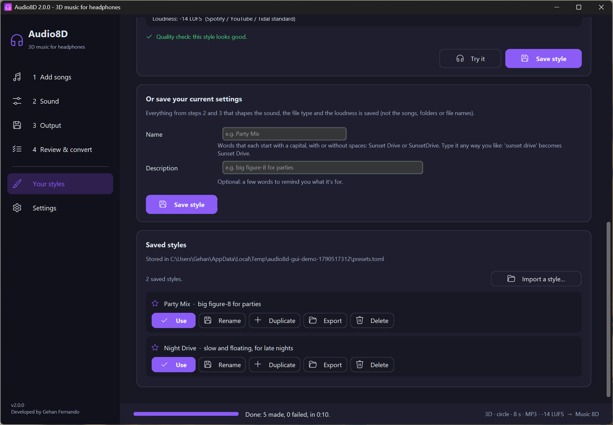
</p>

The card says which file your styles are stored in, and how many you have. Each style shows its name and description, and five buttons:

| Button | What it does |
|---|---|
| **Use** | Chooses that style for all songs and takes you to step 2 |
| **Rename** | Asks for a new name ([the name window](#the-name-window)). Songs on your list that use the style keep using it under its new name |
| **Duplicate** | Makes a copy under a new name (a free name like *Party Mix Copy* is suggested), handy for trying a variation |
| **Export** | Saves the style to a file (for example `Party Mix.json`) that you can keep as a backup or give to someone else |
| **Delete** | Removes it, after asking ([Delete this style?](#delete-this-style)). Songs you made with it are not touched; songs on the list that used it go back to the style for all songs |

**Import a style…** (top right) adds a style from a file exported by Audio8D: see below.

If you have no saved styles yet, it says *No saved styles yet. Create one above, or import a style file.*

### 📤 Export and 📥 import

**To share a style:** press **Export** on it, choose where to save the file, and send the file to someone (by e-mail, a USB stick…). The file holds **every** setting of the style, so it sounds exactly the same on their computer.

**To add a style from a file:**

1. Press **Import a style…** and choose the file.
2. Audio8D **checks the whole file first**: that it really is an Audio8D style file, of a version it understands, with every setting present, of the right kind, and within the allowed range. If anything is wrong, it says exactly what, **and nothing is changed** (see [import messages](#-import-messages)).
3. If the file passes, the name window asks what to call it. The file's own name is suggested, but you can type any name you like. **If you already have a style with that name, the box turns red and Import stays off until you choose a free name**, so an existing style can never be overwritten:

<p align="center">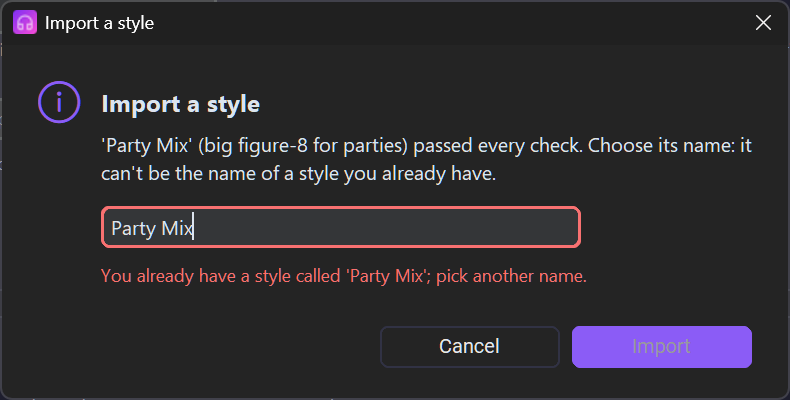</p>

4. Press **Import**. A notice says *Imported 'Party Mix 2'*, and the style is on step 2 and in the song menus straight away.

#### The name window

Rename, Duplicate and Import all use the same small window: a message, a name box, and a line underneath that says *It will be saved as …* in green, or exactly why the name can't be used in red. The main button (**Rename**, **Duplicate** or **Import**) only works when the name is valid; <kbd>Enter</kbd> does the same, and **Cancel** or <kbd>Esc</kbd> closes it without changing anything.

#### What's inside a style file

For the curious: a style file is a small, readable text file in **JSON** format, with a version number so future versions of Audio8D can read it:

```json
{
  "format": "audio8d-style",
  "version": 1,
  "name": "Party Mix",
  "description": "big figure-8 for parties",
  "settings": {
    "rotation_seconds": 8.0,
    "intensity": 0.95,
    "...": "every one of the 21 settings, nothing left out"
  }
}
```

> [!NOTE]
> 📝 **Your styles live in one small text file**, `presets.toml` (on Windows in `%APPDATA%\Audio8D`). If that file ever gets a mistake (for example after editing it by hand), Audio8D says so when it opens (*Your saved styles couldn't be read: see Your styles*), and this card names the line to fix. The built-in styles keep working meanwhile. You can fix the line in any text editor, or delete the file to start again.

💡 Styles saved here also work in the [terminal app](#-25-extra-the-terminal-app) (`--preset "Party Mix"`, written any way: `--preset partymix` works too), and styles saved there appear here.

---

## 🔩 14. Settings page

**What it's for:** how the window looks, which helpers Audio8D found, and information about the app.
**Where:** **Settings** in the sidebar (<kbd>Ctrl</kbd>+<kbd>6</kbd>).

<p align="center">
  
</p>

### 🎨 Appearance and details

| Setting | What it does |
|---|---|
| **Theme** | **System** follows your computer's light or dark setting; or choose **Light** or **Dark** |
| **Size** | Makes all text and buttons bigger or smaller: **90%**, **100%**, **110%** or **125%**. The layout adapts, so nothing overlaps at any size |
| **Show technical details** | Writes **everything** Audio8D does into *Technical details* on step 4, not just the important lines. Handy when asking for help |

These go back to their normal values when you close Audio8D.

Here is the window in the **Light** theme:

<p align="center">
  
</p>

### 🧰 Tools

| Line or button | Means |
|---|---|
| ✔ **FFmpeg found: …** (green) | The sound helpers were found, and where. If it says **FFmpeg not found** (orange), put `ffmpeg.exe` and `ffprobe.exe` in the folder it names |
| **Demucs (singer in the middle): …** | Whether the AI helper for *Keep the singer in the middle* is installed, and if not, how to get it |
| **Forget remembered measurements** | Audio8D remembers each song's loudness measurement, so making the same song again (say, as FLAC after MP3) is quicker. This button clears that memory. It's safe: nothing else is touched, and it's rebuilt by itself. A notice confirms: *Remembered measurements cleared* |
| **Open log folder** | Opens the folder holding Audio8D's [log file](#-the-log-file). Send that file along when you ask for help |

### ℹ️ About

Shows the version (**Audio8D 2.0.0**), the author, and how to see the terminal app's help. **Open the full guide** opens this guide: in the standalone app it opens the online copy in your web browser; from the source folder it opens `README.md` itself.

---

## 💬 15. Every message the window shows

Audio8D talks to you in four places. Here is everything it can say, what it means, and what to do.

### 📊 The status bar

| It says | Means |
|---|---|
| *Ready.* | Nothing is running |
| *Making a 30-second preview of My Song… (0:02)* | A preview is being made; the time counts up |
| *Making an A/B compare of My Song…* | An A/B compare is being made |
| *Making the 3D mix…* / *Saving the file…* / *Checking the result…* | The stage a preview or A/B compare is on |
| *Converting 5 songs… (0:06)* | The songs are being made |
| *Stopping after the current step…* | You pressed **Stop**; it's finishing the current step safely |
| *Stopped. Finished songs are kept.* | It stopped. Songs already made stay; the half-made one was cleaned up |
| *Done: 5 made, 0 failed, in 0:07.* | Every song is finished. Failed ones have a red row on step 4 |
| *Done.* | A preview or A/B compare is finished |

### 🔔 Short notices

| Notice | Means | What to do |
|---|---|---|
| ✔ *Added 5 songs* | The songs are on the list | Nothing |
| ✖ *Those files aren't music (or were made by Audio8D)* | What you added was skipped | Add music files, not 8D copies |
| ✖ *No songs found in Rock* | That folder has no music | Check the folder, or switch on **Include songs in sub-folders** |
| ✖ *Please wait until the conversion finishes* | Songs can't be added while it works | Wait, or press **Stop** |
| ✖ *Add a song first (step 1)* | Preview and A/B compare need a song | Add one on step 1 |
| ✖ *Please fix the red items first* | A red note is waiting on step 4 | Press **Fix it** next to it |
| ℹ *Skipped 2 song(s) that already have an 8D version* | Those songs were made before | Switch on **Replace 8D files that already exist** to make them again |
| ✔ *Preview ready: My Song (8D preview).mp3* | The sample is made and starts playing | Listen with headphones |
| ✔ *A/B file ready: original first, then 8D* | The comparison is made and starts playing | Listen for the change after the pause |
| ℹ *Style: Studio* | A style was chosen | Nothing |
| ✔ *Saved your style 'Party Mix'* / *Imported 'Party Mix 2'* / *Renamed 'Party Mix' to 'Big Party'* / *Made 'Party Mix Copy', a copy of 'Party Mix'* / *Exported 'Party Mix' to Party Mix.json* | Your styles changed | Nothing |
| ℹ *Deleted 'Party Mix'* (… *; 2 songs now use the style for all songs*) | A style was deleted, and any songs that used it went back to the style for all songs | Nothing |
| ✔ *Improved: the answers now follow the advice* | **Improve it for me** changed the creator's answers | Check the new answers |
| ✔ *Remembered measurements cleared* | The loudness memory was emptied | Nothing |
| ✖ *Your saved styles couldn't be read: see Your styles* | The styles file has a mistake | Open **Your styles**; it names the line to fix |
| ✖ *Could not clear the cache* / *The log folder can't be created* | Windows refused access to that folder | Close other copies of Audio8D and try again |

### 🟥 Red and yellow notes on step 4

**Red notes** (must be fixed; **Fix it** takes you there):

| Red note | How to fix it |
|---|---|
| *Add at least one song or folder first.* | Add songs on step 1 |
| *'Morning Drive' uses the style 'X', which no longer exists. Choose another style for it.* | Pick another style for that song in card 4 of step 2 |
| *A custom file name only works with exactly one song.* | Choose another **New file name**, or keep only one song |
| *Type the custom file name, or choose another naming.* | Fill in the **Custom name** box |
| *File names can't contain < > : " / \ \| ? \** | Remove those characters from the custom name |
| *Keeping the original name next to the original would overwrite it…* | Choose **In a folder I choose**, or **Replace** the originals |
| *The 'Save in' place is a file, not a folder.* | Type or Browse to a folder |
| *Trim: … Write times like 90 or 1:30.* | Fix the **Only part** times (the end must be after the start) |
| *The loudness must be between -30 and -5* / *Type a loudness between -30 and -5, e.g. -14* | Fix the **Custom loudness** box |
| *The tempo (BPM) must be between 40 and 240* | Fix the **Tempo** box, or empty it |
| *Changes over time: …* / *Movement over time values must be between 0 and 1* | Fix the **Speed over time** or **Movement over time** box |

**Yellow notes** (heads-ups; you can still start):

| Yellow note | Appears when | To follow the advice |
|---|---|---|
| *A spin this fast can make people dizzy…* | Spin speed below 5 s | Spin speed 6 to 10 |
| *A spin this slow is hard to notice…* | Spin speed above 20 s | Spin speed 6 to 10 |
| *The movement is gentle and may be hard to hear…* | Movement below 0.5 | Movement 0.8 |
| *One ear goes almost silent at times…* | Movement above 0.95 with panning | Movement 0.8 |
| *This much room sound can make voices blurry…* | Room above 0.6 | Room 0.25 |
| *Lower quality / Low bitrate: you may hear swishy sounds…* | MP3 quality V6 to V9, or an MP3 bitrate below 192 | Bitrate 320 |
| *Peaks this high may crackle on some phones…* | Peak roof above 0.95 | Peak roof 0.84 |
| *Your 8D song will be quieter than normal music…* | Loudness **Natural (off)** (many styles use it) | Loudness: Spotify / YouTube (-14) |
| *That is very loud…* / *Quieter than music apps…* | Loudness above −9, or below −20 | Loudness −14 |
| *Moving bass can feel unsteady…* | *Keep the bass in the middle* off with 3D | Switch it on at 120 Hz |
| *The original songs will be moved to the Recycle Bin…* | Replacing originals | Choose **Keep them** if you'd rather |
| *8D files that already exist will be replaced.* | *Replace 8D files that already exist* is on | Switch it off to skip them |
| *Keeping the singer in the middle takes a minute or two per song.* | Singer switch on | Nothing; just be patient |
| *2 songs are low-quality files (…), under 192 kbps…* | Some songs are MP3/AAC files below 192 kbps | Use a better copy (FLAC, WAV or a 320 kbps MP3) if you have one |
| *1 song is a low-detail recording (…), like a phone or voice memo…* | A song is recorded below 32 kHz | Fine for speech; for music, find a better recording |

🏆 **The studio style gives no yellow notes at all.**

### 🪟 Message windows

These small windows wait for your answer. The purple button on the right is the main choice; <kbd>Esc</kbd> or the window's ✕ is the same as **Cancel**.

#### Replace the original songs?

<p align="center">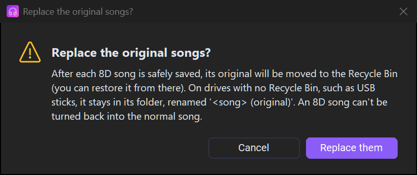 (original)' on drives without one, and that an 8D song can't be turned back into the normal song. Buttons: Cancel and Replace them." width="70%"/></p>

**When:** you press **Start converting** with *The original songs* set to a **Replace** choice.
**Cancel** goes back without changing anything. **Replace them** starts converting.

#### Nothing new to make

<p align="center">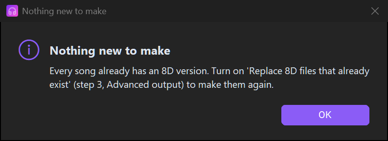</p>

**When:** every song on the list already has an 8D version.
**OK** closes it. To make them again, switch on **Replace 8D files that already exist** (step 3, Advanced output).

#### All done! / Finished, with some problems

Shown when a conversion finishes: see [When it's finished](#-when-its-finished).

#### Delete this style?

<p align="center">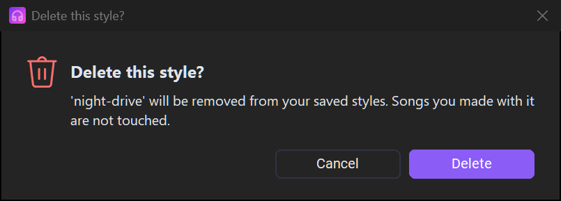</p>

**When:** you press **Delete** on *Your styles*.
**Cancel** keeps the style. **Delete** removes it for good. Songs you made with it aren't touched; songs on the list that used it go back to the style for all songs.

#### Save it as it is?

**When:** you save a style while the quality check shows a warning. See [the quality check](#-the-quality-check).

#### Rename this style / Duplicate this style / Import a style

**When:** you press **Rename**, **Duplicate** or **Import a style…** on *Your styles*. See [the name window](#the-name-window).

#### Can't import this style / Can't rename this style / Can't duplicate this style / Can't export this style

**When:** a style file or name fails a check, or the file can't be read or written. The message says exactly why, what to do, and *Nothing was changed.* **OK** closes it. See [import messages](#-import-messages).

#### Stop and close?

<p align="center">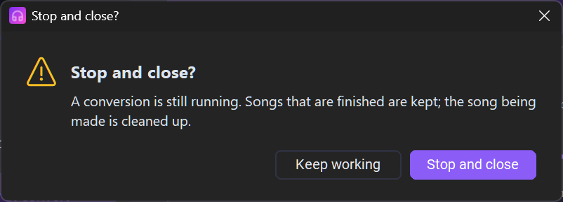</p>

**When:** you close the window while Audio8D is working.
**Keep working** carries on. **Stop and close** stops cleanly (finished songs are kept) and closes the window.

#### Something went wrong

<p align="center">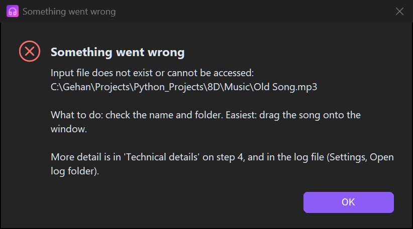</p>

**When:** an unexpected problem happens, such as a helper program missing or a file vanishing.
It says **what happened**, **What to do**, and where to find more detail. **OK** closes it, and the window keeps working. The meanings of common messages are in [part 20](#-every-error-message-explained).

---

## 🏆 16. Best quality and the ready-made styles

### 🥇 The best choice

**Leave everything as it is.** The window starts with the **Studio** style, which follows the standards streaming services use. Want **zero** loss? Pick **Lossless** (FLAC) or **Hifi** (FLAC, the original's own loudness, gentle 3D).

> [!IMPORTANT]
> 🙋 **The honest truth:** an MP3 always leaves out a tiny bit of sound that ears can't hear. **Studio** keeps that loss as small as MP3 allows (320 kbps). For **no** loss at all, choose **FLAC**. And an 8D song can never sound better than the file you start with.

**🥇 The 3 golden rules:** 1️⃣ start from the **best copy** you have · 2️⃣ use **Studio** (or **Lossless** / **Hifi**) · 3️⃣ always convert from the **original**, never from an 8D file.

| Your file | Best style | What to expect |
|---|---|---|
| 💿 **FLAC, WAV, AIFF, ALAC** (lossless) | **Lossless** or **Hifi** (or **Studio** for an MP3) | 🥇 The best possible 8D song |
| 💿 **Hi-res** (88.2 to 192 kHz) | **Lossless** / **Hifi** keep the hi-res; MP3 converts it once to 44.1 or 48 kHz | 🥇 Same as above |
| 🎵 **MP3 256–320 kbps, M4A 256 kbps** | **Studio** (or **Hifi** to avoid compressing twice) | 🥈 Sounds the same as the original to almost everyone |
| 🎵 **MP3 192 kbps or less, OGG, Opus, WMA** | **Studio** | 🥉 Can't sound better than the file you give it |
| 🎞️ **Videos** (MP4, MKV, WEBM) | **Studio** | Takes the sound only |

### ⚡ Speed and quality, measured

Measured on a normal Windows PC with the current version (times vary with the computer and what else it's doing):

| What | Result |
|---|---|
| A 5-minute song, **Studio** (MP3 320) | about 17 s: **18× faster** than playing it |
| The same song as **Lossless** (FLAC) | about 10 s: **29× faster** |
| **Groove** (listens for the beat first) | about 20 s |
| **8 one-minute songs**, one at a time → 4 at once | 26 s → **6 s** (4× faster) |
| Memory used while converting | about **13 MB**, even for long songs |
| Loudness reached (Studio, Lossless, Groove) | **−14.0 LUFS** exactly, peaks between −1.1 and −2.1 dBTP, mono-safe |
| Opening the window | about **4 s** (the standalone app's terminal version starts in 0.3 s) |
| Adding 300 songs to the list | about **1.4 s** (the list shows 25 at a time) |
| Switching pages | 0.1 to 0.5 s |
| Giving a song its own style / changing an answer in the style creator | instant (under 0.05 s) |
| Checking a style file before import | under 1 ms |

### 📋 All the ready-made styles

| Style | Sound | Spin | Movement | Room | File | Loudness | Great for |
|---|:---:|:---:|:---:|:---:|:---:|:---:|---|
|  ⭐ | 3D circle | 8 s | 0.80 | 0.25 | MP3 320 | −14 goal | **Everything. The best of best** |
|  | 3D circle | 8 s | 0.80 | 0.25 | MP3 320 | −14 exact | Playlists where every song must be equally loud |
|  | 3D circle | 8 s | 0.80 | 0.25 | FLAC 24-bit | −14 goal | Nothing lost at all |
|  | 3D circle | 8 s | 0.75 | 0.20 | FLAC 24-bit | original | The most faithful copy |
|  | 3D circle | 8 s | 0.85 | 0.30 | MP3 V2 | natural | What you get if you pick nothing |
|  | 3D figure-8 | beat | 0.90 | 0.25 | MP3 320 | −14 goal | Dance, pop, hip-hop |
|  | 3D circle | 12 s | 0.75 | 0.20 | MP3 V2 | natural | Chill, lo-fi, acoustic |
|  | 3D circle | 8 s | 0.95 | 0.35 | MP3 V2 | natural | Pop, EDM, "8D video" style |
|  | 3D circle | 10 s | 0.82 | 0.50 | MP3 V2 | natural | Slow songs, film music |
|  | 3D wander + height | 12 s | 0.80 | 0.45 | MP3 V2 | natural | Chill, ambient |
|  | 3D front arc | 16 s | 0.60 | 0 | MP3 V2 | natural | Talking, stories, meditation |
|  | 3D circle | 3 s | 1.00 | 0.30 | MP3 V2 | natural | Short clips, ringtones |
|  | panning | 8 s | 0.55 | 0.20 | MP3 V2 | natural | Speakers and car stereos |
|  | panning, bass moves | 8 s | 0.85 | 0.30 | MP3 V2 | natural | The old ping-pong sound of the first Audio8D |

*"MP3 V2" means MP3 with bitrate Auto at quality V2 (about 190 kbps). "−14 goal" aims for −14 LUFS without squeezing the song; "−14 exact" always reaches it.*

💡 **Mix and match:** pick a style, then change one setting, e.g. **Smooth** with **Loudness → Spotify / YouTube**.

### 📏 Measured, not guessed

Real results measured by Audio8D's own check, all on the same PC. The song was a loudly mastered 320 kbps MP3 (4:52 long) that itself measures −11.3 LUFS with peaks at +0.4 dBTP.

| Style | Loudness | Loudest peak | Time | Size |
|---|:---:|:---:|:---:|:---:|
| **Classic** (nothing chosen) | −15.0 LUFS | **−1.0 dBTP** ✅ | 10.1 s | 6.6 MB |
| 🏆 ****Studio**** | **−14.3 LUFS** ✅ | **−2.2 dBTP** ✅ | 15.9 s | 11.2 MB |
| ****Streaming**** | **−14.3 LUFS** ✅ | **−2.2 dBTP** ✅ | 13.4 s | 11.2 MB |
| ****Lossless**** (FLAC) | **−14.1 LUFS** ✅ | **−0.9 dBTP** ✅ | 8.1 s | 53.4 MB |
| 💿 ****Hifi**** (FLAC) | **−13.7 LUFS** | **−0.9 dBTP** ✅ | 10.2 s | 52.4 MB |
| ****Groove**** as FLAC (found 89.9 BPM) | **−14.1 LUFS** ✅ | **−1.4 dBTP** ✅ | 10.9 s | 51.9 MB |
| **Retro** | −14.7 LUFS | −0.8 dBTP ✅ | 6.4 s | 6.6 MB |

💡 **Every style stays below 0 dBTP**, so nothing crackles. **Hifi** aimed for the original's −11.3 LUFS but stopped at −13.7, because getting louder would have squashed the song's loudest moments (*Always hit the loudness exactly* would force it).

---

## 📂 17. Which files go in and come out?

### ✅ Files that go in

| File type | What happens |
|---|---|
| 🎵 **MP3** | ✅ Works. Song name, singer, album and **picture** are kept |
| 💿 **FLAC, ALAC, APE, WavPack, AIFF** | ✅ Works. Lossless: the best start |
| 🌊 **WAV** | ✅ Works |
| 🍏 **M4A / AAC** | ✅ Works |
| 🟠 **OGG, Opus, WMA** | ✅ Works |
| 🎞️ **Videos (MP4, MKV, WEBM)** | ✅ Takes the sound only; the picture is left out |
| 📄 **Not music** (text, pictures) | ❌ Skipped with a message |
| 🔒 **Copy-protected** (Spotify, Apple Music `.m4p`) | ❌ Can't be read |

### 🎧 What comes out

| File type | Quality | Album picture | Best for |
|:---:|---|:---:|---|
| **MP3** ⭐ | 320 kbps with **Studio** | ✅ | Playing **everywhere** |
| **FLAC** | Lossless, 24-bit, keeps hi-res | ✅ | Keeping the best copy |
| **WAV** | Lossless, 24-bit | – | Music-editing software |
| **M4A** (AAC) | 256 kbps (or the chosen bitrate) | ✅ | Apple devices |
| **Opus** | 192 kbps (or the chosen bitrate) | – | Small files, great quality |

### 🔎 What stays the same, and what changes

| Thing | What happens |
|---|---|
| ⏱️ **Length** | Stays exactly the same (unless you trim it) |
| 🏷️ **Song name, singer, album, year** | Kept; the title gets " (8D)" unless you switch that off |
| 🖼️ **Album picture** | Kept for MP3, FLAC and M4A |
| 🔢 **Channels** | Always becomes **stereo** (left + right). Mono is copied to both ears; 5.1 surround is folded down |
| 📶 **Sound detail (sample rate)** | Kept where the file type allows. Very low-quality recordings (below 32 kHz, like phone recordings) are raised to 44.1 or 48 kHz so the 3D effect has room to work |
| 🎚️ **Files with several sound tracks** | Only the first sound track is used |

---

## 🔉 18. Loudness: why is my song quieter?

With the normal **Studio** choice (**Spotify / YouTube (-14)**), it **isn't**: it matches Spotify and YouTube.

With **Natural (off)** (used by the **Classic**, **Smooth**, **Strong** and other styles), the song keeps its natural level, **turned down a little**, so it can be a bit quieter than the original. **That's on purpose:** the 3D movement makes the nearer ear briefly louder, and those short moments need room so the song never crackles.

**How to make it louder (pick one):**

1. 🏆 **Easiest:** step 3 → **Loudness → Spotify / YouTube (-14)**, or **Same as original**.
2. 🔊 Just turn up the volume. A quieter song is not a worse song.
3. 📱 Switch on "volume levelling" in your music app (called *Normalize volume*, *Sound Check* or *ReplayGain*).

**Why doesn't "Same as original" always reach the original's loudness?** Many songs are mastered very loud. The 3D version has a few extra short peaks, so matching a very loud original exactly would mean squashing its loudest moments. Audio8D stops just short instead. Switch on **Always hit the loudness exactly** if you'd rather have the exact loudness.

---

## 🔒 19. How your files stay safe

Audio8D is **very careful** with your files:

| 🛡️ What Audio8D does | What it protects you from |
|---|---|
| 🔎 Checks every setting and file before it starts | Confusing crashes halfway through |
| 🫥 Builds each new song in a **hidden file** first, and only shows it once it's completely finished | Half-made songs that look finished |
| ⚡ Gives it its final name in one instant | A broken file if the power goes off at the last second |
| 🔒 Never replaces a file by surprise: existing 8D songs are skipped unless you say so | Losing a song you already made |
| 🗑️ Moves originals to the **Recycle Bin** only when you choose *Replace*, only **after** asking you, and only **after** the new song is saved | Losing an original |
| 🛟 **Never deletes anything for good**: on drives without a Recycle Bin, the original is kept as `<song> (original)` | USB sticks and network drives, where Windows would delete forever |
| 🔁 Skips files it made itself | Turning an 8D song into 8D again |
| 🧱 One bad song never stops the others | A whole folder failing because of one broken file |
| 🪟 Does the work in the background | A frozen window; **Stop** and closing always work |
| 🧹 Cleans up after itself, even after **Stop** | Leftover junk files |
| 📄 Writes every problem in the [log file](#-the-log-file) | Problems nobody can explain later |

---

## 🆘 20. When something goes wrong

Don't worry! 🤗 Audio8D always says **what** went wrong in one plain line, and **what to do** about it. Problems with your choices appear as red notes on step 4 with a **Fix it** button. A song that fails shows the reason on its own row, and the other songs carry on.

### ⚡ Quick fixes

| What happened | Quick fix |
|---|---|
| **Start converting** is greyed out | Step 4 shows a red note saying why. Press **Fix it** |
| *"Nothing new to make"* | Every song already has an 8D version. Switch on **Replace 8D files that already exist** (step 3, Advanced output) |
| A song row is red | Read its **What to do:** line. Usually the file isn't music, is damaged, or is copy-protected |
| I can't hear any movement | Use **headphones**. On Windows, also make sure "Mono audio" is off (*Settings → Accessibility → Audio*) |
| I replaced my originals by mistake | Open the **Recycle Bin** and **Restore** them. On a USB stick or network drive, they're still in the same folder as `<song> (original)`: rename them back |
| Settings shows *FFmpeg not found* | Put `ffmpeg.exe` and `ffprobe.exe` in the `bin\executable` folder (standalone app: `Audio8D\bin\executable`; unzip the whole folder again if it's missing). macOS/Linux: install FFmpeg ([Step 2](#step-2-check-the-sound-helpers-ffmpeg)) |
| *"Windows protected your PC"* | **More info → Run anyway**, if you trust where the zip came from |
| *"… isn't allowed to write there"* / *Permission denied* | That folder is protected. Choose another folder on step 3, such as your Music folder |
| **Keep the singer in the middle** is greyed out | Source-code version: install Demucs (`python -m pip install demucs`) and restart. The standalone app doesn't include it |
| *"Your saved styles couldn't be read"* | Open **Your styles**: it names the line to fix. Or delete the styles file |
| *"You already have a style called …"* | Names are unique: choose another name (the red line under the box says why a name can't be used) |
| Only 25 songs are shown | On purpose, to keep the window quick. Press **Show 25 more**; every song is converted either way |
| Dragging songs onto the window does nothing | Drag-and-drop works on Windows only; on macOS/Linux use **Add songs**. On Windows, Audio8D and File Explorer must both run normally (a window started "as administrator" can't receive dragged files) |
| `python` is not recognized | Windows: try `py`, or reinstall Python and tick **"Add python.exe to PATH"** ([Step 1](#step-1-get-python)). macOS/Linux: type `python3` |
| *"The Audio8D window needs the CustomTkinter package"* | `python -m pip install customtkinter pillow` ([Step 3](#step-3-add-the-windows-two-add-ons)) |

### 🪟 The window doesn't open

<details>
<summary><b>❗ <code>Audio8D.exe</code> doesn't open, or closes straight away</b></summary>

1. Make sure you unzipped the **whole** `Audio8D` folder and started `Audio8D.exe` from inside it (not from inside the zip, and not a copy of the exe on its own).
2. If Audio8D can't open its window, it says why in a message and writes the details to the [log file](#-the-log-file).
3. Some antivirus programs hold back new programs for a scan the first time. Wait a moment and try again.
4. For more detail, open Windows Terminal in the `Audio8D` folder and run `.\audio8d-cli.exe --version`. It should print `audio8d 2.0.0 - developed by Gehan Fernando`.

</details>

<details>
<summary><b>❗ Double-clicking <code>Audio8D.pyw</code> does nothing, or opens an editor</b></summary>

1. Right-click `Audio8D.pyw` → **Open with → Python** (tick **Always**).
2. Still nothing? Open it from Windows Terminal to see the message: `python src\__main__.py --gui`. The usual reasons are a missing add-on ([Step 3](#step-3-add-the-windows-two-add-ons)) or an old Python ([Step 1](#step-1-get-python)).

</details>

<details>
<summary><b>❗ Linux: "No module named tkinter"</b></summary>

Install the window toolkit for your Python: `sudo apt install python3-tk` (Ubuntu/Debian), then try again.

</details>

### 🔎 Every error message, explained

| The message says… | What it means | How to fix it |
|---|---|---|
| `Missing required executable(s): ffmpeg, ffprobe` | The sound helpers are missing | Put `ffmpeg.exe` + `ffprobe.exe` in the `bin\executable` folder the message names, or install FFmpeg |
| `This FFmpeg build is missing required audio filter(s)` / `does not include the … encoder` | Your FFmpeg is a cut-down version | Download the **essentials** version from gyan.dev, or pick another file type |
| `Input file does not exist or cannot be accessed` | The song isn't there any more | Check the file; add it again |
| `Input file is empty` | The song file is empty (0 bytes) | Download or copy the song again |
| `FFmpeg stopped: … Invalid data found when processing input` | This file isn't music, or it's damaged | Check the file plays in a music app |
| `FFmpeg stopped: …` (anything else) | FFmpeg couldn't finish this song; the words after the colon say why | Read the **What to do** line; full details are in *Technical details* and the log file |
| `The input file does not contain a usable audio stream` | The file has no sound | Use a file that has sound |
| `Output already exists: …` | A file with that name is already there | Switch on **Replace 8D files that already exist**, or choose another name |
| `Input and output paths must be different` | The new file would be the old one | Choose another name or folder, or **Replace** the original |
| `The chosen start and end leave no sound to convert` | The trim start is after its end, or past the end of the song | Fix the times, e.g. `1:00` to `1:30` |
| `Keeping vocals in the centre needs Demucs` / `Demucs could not split the vocals` | The AI helper is missing or had a problem | Install Demucs, or switch the singer option off |
| `Could not remove the original song` | The original is open in another program | Your new song **is saved**. Close the other program and delete the original yourself |
| `Conversion cancelled by user` | You pressed **Stop** | Nothing to fix. It cleaned up after itself 🧹 |
| `Unable to publish completed output` / `I/O error during conversion` | The disk is full, or the USB stick was pulled out | Free some space, or plug the drive back in |
| `… Permission denied` / `Access is denied` | Audio8D can't write in that folder, or another program has the file open | Choose another folder, or close the other program |
| `Audio8D could not open its window` | Something stopped the window from starting | The message names the reason; details are in the log file |
| `Audio8D needs Python 3.10 or newer` | Your Python is too old | Install a newer Python ([Step 1](#step-1-get-python)) |

### 📥 Import messages

When a style file can't be imported, the message starts with *This style file can't be imported:* and says exactly why. **Nothing is ever partly imported**: your styles stay exactly as they were.

| The message ends with… | Means |
|---|---|
| *… does not exist* / *can't be read* | The file was moved, or Windows refused access |
| *it is 80 KB, far too big for a style file* | It isn't a style file (a real one is under 2 KB) |
| *it is not a text file* / *the file is empty* | It isn't a style file, or it's damaged |
| *it is not valid JSON (line 3, column 5: …)* | The text is damaged, e.g. after editing it by hand |
| *it does not hold a style (expected a JSON object)* | It's some other kind of JSON file |
| *it is not an Audio8D style file (format "…")* | It was made by another program |
| *it was made by a newer Audio8D (style file version 2)* | Update Audio8D to import it |
| *the file is missing 'settings'* / *'settings' is missing 'intensity'* | A required part is missing |
| *the file has an unknown property 'x'* / *'settings' has an unknown property 'x'* | Something is there that a style file never has |
| *'x' appears twice* | The same property is written twice |
| *setting 'intensity' must be a number, not "big"* (or *a whole number*, *true or false*, *text*) | A setting has the wrong kind of value |
| *setting 'engine' is "4d"; it must be one of 3d, pan* | A setting has a value Audio8D doesn't know |
| *intensity must be between 0.0 and 1.0* | A setting is out of range |
| *its 'name' must be some text* / *its 'description' is longer than 120 characters* | The name or description is missing or too long |

After the file passes, the **name** you choose gets the usual [name checks](#-style-names).

### 📄 The log file

Audio8D writes a **log**: a text file recording what it did, with which settings, and the full details of any error. You never need to read it, but it's the first thing to send when you ask someone for help.

| | |
|---|---|
| **Where** | **Settings → Open log folder** opens it. On Windows it's `%LOCALAPPDATA%\Audio8D\logs\audio8d.log` (you can paste that into File Explorer's address bar) |
| **Size** | At most about 3 MB: it starts a new file at 1 MB and keeps the two before it |
| **More detail** | **Settings → Show technical details** records every step |
| **Can't be written?** | Audio8D carries on without it; a log problem never stops a conversion |

### 📁 Where Audio8D keeps things

Audio8D has **no settings file to edit**: every choice is made in the window. It only writes these few things, all inside your own user folder:

| What | 🪟 Windows | 🍎 macOS | 🐧 Linux |
|---|---|---|---|
| **Your saved styles** (`presets.toml`) | `%APPDATA%\Audio8D` | `~/Library/Application Support/Audio8D` | `~/.config/audio8d` |
| **Remembered measurements** (safe to delete) | `%LOCALAPPDATA%\Audio8D\cache` | `~/Library/Caches/Audio8D` | `~/.cache/audio8d` |
| **The log** | `%LOCALAPPDATA%\Audio8D\logs` | `~/Library/Application Support/Audio8D/logs` | `~/.config/audio8d/logs` |

Your 8D songs go only where you choose on step 3. Because these files live outside the program folder, they survive when you replace Audio8D with a newer version.

---

## 🚧 21. Known limitations

| Limitation | What to do instead |
|---|---|
| The standalone `Audio8D.exe` is for **Windows 10/11, 64-bit** only | On macOS and Linux, run Audio8D from its source code ([5.2](#-52-from-the-source-code-any-computer)) |
| **Keep the singer in the middle** isn't in the standalone app | Use the source-code version with `python -m pip install demucs` |
| **Drag-and-drop** works on Windows only | Use **Add songs** / **Add folder** |
| The window **doesn't remember your settings** (or the songs' own styles) after closing | Save them as [your own style](#-13-your-styles-page) |
| A different style **per song** is a window feature | The terminal app uses one style for all the songs in a command; run it once per style |
| Only the **first sound track** of a file is used, and everything becomes **stereo** | Mono is copied to both ears; 5.1 is folded down to two |
| **Opus** and **WAV** files can't hold the album picture | Use MP3, FLAC or M4A to keep it |
| **Copy-protected** songs can't be read | Use songs you own as normal files |
| An 8D song **can't be turned back** into the normal song | Keep your originals (the normal choice) |
| The effect is made for **headphones** | For speakers, switch on **Safe for speakers too** |
| `Audio8D.exe` isn't signed with a paid certificate | Windows SmartScreen may ask once: **More info → Run anyway** |

---

## 💬 22. Questions people ask

<details>
<summary><b>I don't know anything about sound or computers. Can I still use it?</b></summary>

Yes! Open Audio8D, drag your songs in, and press **Next** until you reach **Start converting**. The best choices are already selected, and every control explains itself.
</details>

<details>
<summary><b>Will it change or delete my songs?</b></summary>

No. Audio8D makes a **new** file and leaves your original alone. Only if you choose **Replace** on step 3 does the original move, and then only to the Recycle Bin, where you can restore it.
</details>

<details>
<summary><b>Does it work on normal speakers?</b></summary>

The headphone effect doesn't, because on speakers both ears hear both sides. For speakers, car stereos and phone speakers, switch on **Safe for speakers too** or use the **Speakers** style.
</details>

<details>
<summary><b>Can I convert my whole music library?</b></summary>

Yes. Add your whole `Music` folder (sub-folders included), choose **In a folder I choose** on step 3, and press **Start converting**. Several songs are made at once, songs already done are skipped, and the sub-folders are kept.
</details>

<details>
<summary><b>How long does it take?</b></summary>

For a 5-minute song on a normal PC: about **10 seconds** with **Classic**, about **8 to 11 seconds** as FLAC (**Lossless**, **Hifi**), and about **16 seconds** with **Studio**. A preview takes a few seconds. Folders go faster per song, because several are made at once. *Keep the singer in the middle* adds a minute or two per song.
</details>

<details>
<summary><b>Can I turn an 8D song back into the normal song?</b></summary>

No. The effect is "baked in", like a cake. 🎂 Keep your originals.
</details>

<details>
<summary><b>What's the difference between "8D" and "3D" here?</b></summary>

"8D" is the popular name for music that moves around your head. Audio8D makes it with a **3D** head model (timing, loudness and tone clues), so the sound truly passes in front of you and behind you. The simpler left-right version is the **Retro** style.
</details>

<details>
<summary><b>Is this the same as Dolby Atmos?</b></summary>

No. Atmos places every instrument separately in a room full of speakers. Audio8D moves a finished song around your head for headphones. It's simpler, fast, and fun.
</details>

<details>
<summary><b>Do I need the internet?</b></summary>

Only to download Audio8D (and, for the source-code version, Python and the add-ons). Making 8D songs works **completely offline**. ✈️
</details>

<details>
<summary><b>Why are my settings gone when I reopen Audio8D?</b></summary>

Audio8D always starts fresh with the recommended settings. Save the settings you like on **Your styles**, then pick your style on step 2 next time.
</details>

<details>
<summary><b>Can I use different styles for different songs?</b></summary>

Yes. Pick the style for most songs on step 2, then open card **4. A different style for some songs** and choose another style for any song. See [9.4](#-94-a-different-style-for-some-songs).
</details>

<details>
<summary><b>My 8D song doesn't sound as clear as I hoped. Why?</b></summary>

Usually it's the song file: an 8D version can't sound better than the file it's made from. Step 4 warns you about low-quality files (under 192 kbps) and low-detail recordings. Use the best copy you have (FLAC, WAV or a 320 kbps MP3), the **Studio** style, and headphones. See [the best-sound checklist](#-the-best-sound-checklist).
</details>

<details>
<summary><b>Can I share my styles with a friend?</b></summary>

Yes. On **Your styles**, press **Export** on a style and send them the file. They press **Import a style…** and choose it. Audio8D checks the whole file first and asks them for a name that isn't taken yet.
</details>

<details>
<summary><b>Where did the preview file go?</b></summary>

Next to the song you previewed, called `<song> (8D preview)`. It's replaced each time you make a new preview, and Audio8D skips it when you add songs. Delete it whenever you like.
</details>

<details>
<summary><b>Can I share the songs I make?</b></summary>

Making an 8D version doesn't make the song yours. Listening yourself is fine. To upload or share someone else's song, you need permission from the people who own it.
</details>

---

## 📖 23. Word helper

| Word | What it means |
|---|---|
| **8D audio** | Music that seems to travel around your head on headphones |
| **3D sound** | Sound made for two ears so it seems to come from a real place around you |
| **Style** (or **preset**) | A ready-made set of settings with a name, like **Studio** |
| **PascalCase** | Words that each start with a capital letter, joined or kept apart by spaces: SunsetDrive, Sunset Drive, Party Mix 2 |
| **Export / import** | Save something to a file to share it / add it back from such a file |
| **JSON** | A common, readable text format for data, used by style files |
| **Standalone app** | A program folder that carries everything it needs, so nothing has to be installed |
| **Source code** | The original program files that a program is made from |
| **Terminal / command** | A window where you type instructions / one instruction you type and send with <kbd>Enter</kbd> |
| **Windows Terminal / PowerShell** | Microsoft's modern terminal app / the command language inside it |
| **Path** | The "address" of a file or folder, like `C:\Music\song.mp3` |
| **PATH** | The list of folders the terminal searches when you type a program's name |
| **Python / pip / venv** | The language Audio8D is written in / Python's installer / a private box for one program's Python add-ons |
| **FFmpeg / FFprobe** | Free helper programs that read, change and save sound and video |
| **CustomTkinter / Pillow** | The Python add-ons that draw the window / its icons |
| **Demucs** | A free AI helper that separates the singer from the music |
| **Tooltip** | The small tip that appears when you rest the mouse on a control |
| **Card** | A rounded box in the window that groups related settings |
| **Stereo / mono** | Two sides (left + right) / one single side |
| **Panning** | Moving a sound between left and right with volume |
| **Bass** | The deep, low sounds: kick drum, bass guitar |
| **Hz (hertz)** | How low or high a sound is; small numbers are deep sounds |
| **Reverb / room sound** | The echo a room adds to sound |
| **BPM / bar** | Beats per minute (how fast a song is) / a group of beats, usually 4 |
| **LUFS** | How loud music *feels*. Spotify aims for about −14; closer to 0 is louder |
| **dB / dBTP / peak** | A measure of loudness / the true loudest point / the loudest moment in a song |
| **Peak roof (limiter)** | A "safety ceiling" that stops sounds getting so loud they crackle |
| **Mono-safe** | Still sounds right when played on one speaker |
| **MP3 / FLAC / WAV / M4A / Opus** | File types: plays everywhere / lossless / lossless and uncompressed / Apple / small and modern |
| **Lossless / lossy (compressed)** | A perfect copy / a smaller file that left out sounds ears can't hear |
| **Bitrate / kbps** | How much detail is kept each second; bigger is better |
| **Sample rate / kHz** | How many tiny "snapshots" of the sound are taken each second |
| **Tags / album picture** | The song name, singer and album / the cover picture, stored inside the file |
| **Recycle Bin / Trash** | Where deleted files wait, so you can restore them |
| **Log file** | A text file where a program writes what it did, for troubleshooting |
| **SmartScreen** | The Windows feature that warns about programs it hasn't seen before |

---

## 🧹 24. Remove Audio8D

| You used… | To remove it |
|---|---|
| 🎁 **The standalone app** | Delete the `Audio8D` folder (and any shortcut you made). Nothing else was installed |
| 🖱️ **Way A or Way B** | Nothing was installed except the window's add-ons. Remove them with `python -m pip uninstall customtkinter pillow` if you like |
| 📦 **Way C** | `python -m pip uninstall audio8d`, answer **`y`**, then delete the `audio8d.egg-info` folder inside `8D` if it's still there |
| 🗃️ **Way D** | Delete the **`.venv`** folder inside `8D` |
| 🎤 **Demucs** | `python -m pip uninstall demucs torch torchaudio` |

**To also remove your saved styles, measurements and log**, delete the `Audio8D` folders listed in [Where Audio8D keeps things](#-where-audio8d-keeps-things) (on Windows: `%APPDATA%\Audio8D` and `%LOCALAPPDATA%\Audio8D`).

Your original songs are **never** inside the program folders, so they're safe. 🎵

---

## 💻 25. Extra: the terminal app

> 🙋 **You can skip this part.** It's for people who like typing commands, or who want to convert songs from scripts. Everything here can also be done in the window.

Everything the window does also works by **typing commands** in **Windows Terminal**. The terminal app needs no extra add-ons (not even CustomTkinter).

> [!IMPORTANT]
> 🪟 **On Windows, use [Windows Terminal](https://aka.ms/terminal)**, not the old Command Prompt. It shows the colours, progress bars and song names properly. When the terminal app is started by double-clicking, it **opens itself in Windows Terminal** automatically.

### ▶️ Ways to start it

| Way | 🪟 Windows (in Windows Terminal) | 🍎 macOS / 🐧 Linux |
|---|---|---|
| **Standalone app**, terminal in the `Audio8D` folder | `.\audio8d-cli.exe` | – |
| **Source code**, terminal in `8D` | `python src\__main__.py` | `python3 src/__main__.py` |
| **Installed** (Way C or D) | `audio8d` | `audio8d` |
| Installed, but `audio8d` isn't found | `python -m audio8d` | `python3 -m audio8d` |
| **Double-click** (the step-by-step helper) | `audio8d-cli.exe` (standalone) or `src\__main__.py` | – |

In the examples below, **`audio8d`** means "start Audio8D". Put `.\audio8d-cli.exe` or `python src\__main__.py` in its place if that's how you start it. Everything after it stays exactly the same.

**Check it works:** `audio8d --version` prints `audio8d 2.0.0 - developed by Gehan Fernando`, and `audio8d --help` shows every option with a **QUICK START** list and the **BEST VALUES**.

<details>
<summary><b>⚡ Type <code>audio8d</code> without installing (a shortcut)</b></summary>

**🪟 Windows (PowerShell):** type `notepad $PROFILE` (if Notepad says the file doesn't exist, first run `New-Item -ItemType File -Force $PROFILE`), paste this line with **your** path, save, and open a new Windows Terminal tab:

```powershell
function audio8d { python "C:\Gehan\Projects\Python_Projects\8D\src\__main__.py" @args }
```

**🍎 macOS (zsh) / 🐧 Linux (bash):** add this line to `~/.zshrc` or `~/.bashrc`, then open a new Terminal:

```bash
alias audio8d='python3 "$HOME/Projects/8D/src/__main__.py"'
```

To remove the shortcut later, delete that line again.

</details>

### 🪜 The step-by-step helper

Start it with **no song name** (`audio8d`, or double-click it) and it asks **4 questions**. Pressing <kbd>Enter</kbd> always picks the best answer:

1. **Which song or folder?** Drag one song or a whole folder into the terminal and press <kbd>Enter</kbd>. With a folder, press <kbd>Enter</kbd> for **all** songs, or type numbers like `1,3,5-7`.
2. **Which style?** <kbd>Enter</kbd> for the **BEST** one (`studio`), or a number from 1 to 14 (e.g. `3` for `lossless`, `4` for `hifi`, `6` for `groove`).
3. **Where should the 8D songs go?** <kbd>Enter</kbd> for next to the originals, or drag a folder in.
4. **What about the original songs?** <kbd>Enter</kbd> to **keep** them; `2` to **replace** them (the 8D song takes the original name); `3` to replace them keeping "(8D)" in the name.

💡 Any song name works here, even names with spaces, `'`, `$`, `&` or brackets, because you're answering a question, not typing a command.

### 🎵 One song with one command

```powershell
audio8d "C:\Users\Gehan\Music\My Song.mp3" --preset studio
```

The new song is saved as **`My Song (8D).mp3`** next to the original. This is the real output:

```text
+-------------------------------------------------+
|  Audio8D 2.0.0  -  developed by Gehan Fernando  |
+-------------------------------------------------+
  Song in    My Song.mp3
  Song out   My Song (8D).mp3
  Source     MP3, 320 kbps, 48 kHz, stereo, 4:52  (already compressed)
  Style      studio  -  Best of best: 3D sound, 320 kbps, -14 LUFS goal, dynamics untouched  (best)
  ----------------------------------------------------
  Sound      3D, circles your head, clockwise                (best)
  Spin       8 s per full circle                             (best)
  Movement   0.80  (strong)                                  (best)
  Bass       stays in the middle below 120 Hz                (best)
  Room       0.25  (subtle room)                             (best)
  Peak roof  0.84  (-1.5 dBFS)                               (best)
  Quality    320 kbps CBR  (the maximum MP3 allows)          (best)
  Loudness   -14 LUFS goal, dynamics kept                    (best)
  Extras     eases in/out over 3 s

  Good to know:
   - Already compressed, so a little detail is gone for good.

  Conversion completed in 15.9 s  ->  C:\Users\Gehan\Music\My Song (8D).mp3  (11.2 MB)
  Loudness: measured -11.9 LUFS, turned down 2.1 dB  ->  about -14.0 LUFS
  Check: -14.3 LUFS, peaks -2.2 dBTP, range 7.3 LU, mono-safe (correlation +0.63)
  Put on your headphones and press play!
```

In Windows Terminal you also see coloured progress bars for each step. **(best)** means the value is already the best one.

| Want to… | Add this |
|---|---|
| Choose the new file's name | A second name: `audio8d "My Song.mp3" "D:\8D Songs\My Song.mp3"` (the ending picks the file type) |
| Choose only the folder | `--output-dir "D:\8D Songs"` |
| Keep the song's own name (in another folder) | `--output-dir "D:\8D Songs" --name original` |
| Replace the original (it goes to the Recycle Bin) | `--replace` |
| Save as FLAC, WAV, M4A or Opus | `--format flac` (or `wav`, `m4a`, `opus`) |
| Keep the original's loudness | `--loudness match` (or `--preset hifi`) |
| Play it when done | `--play` |
| Replace an 8D file you made before | `--overwrite` |
| Only part of the song | `--start 1:00 --end 2:30` |
| See every style | `audio8d --list-presets` |
| Open the window instead | `audio8d --gui` |

Leave out `--preset` and you get the **classic** style, with a tip pointing to `--preset studio`.

#### Song names with special characters

Some characters mean something special to PowerShell, so **how you quote the name matters** (all of these were tested):

| The song's name has… | Write it like this | Example |
|---|---|---|
| Spaces, `'`, `&`, `[ ]`, `( )` | Double quotes `" "` | `audio8d "Tom & Jerry [Live] (2024).mp3"` |
| A dollar sign `$` or a backtick `` ` `` | **Single** quotes `' '` | `audio8d 'Cash $ong.mp3'` |
| Both `'` **and** `$` | Single quotes, apostrophe typed **twice** | `audio8d 'Rock ''n'' $ong.mp3'` |
| Anything strange at all | Use the window, or the step-by-step helper and **drag the song in** | Works with every name ✅ |

💡 **Easy trick:** in File Explorer, hold <kbd>Shift</kbd>, right-click the song → **Copy as path**, then paste it. Or just drag the song into Windows Terminal.

### 📚 A whole folder at once

```powershell
audio8d "C:\Users\Gehan\Music" --recursive --output-dir "C:\Users\Gehan\Music 8D" --preset studio
```

`--recursive` also looks in sub-folders (and makes the same sub-folders in the output folder). The real output, with five songs:

```text
  5 songs, 4 at a time, saved in Music 8D.

  [1/5] OK  Morning Drive (8D).mp3  (1.7 MB, 3.8 s  -14.2 LUFS)
  [2/5] OK  City Rain (8D).mp3  (1.7 MB, 3.9 s  -14.1 LUFS)
  [3/5] OK  Ocean Lights (8D).mp3  (1.7 MB, 4.1 s  -14.3 LUFS)
  [4/5] OK  Golden Hour (8D).mp3  (2.3 MB, 4.6 s  -14.2 LUFS)
  [5/5] OK  Night Run (8D).mp3  (1.7 MB, 2.8 s  -14.0 LUFS)

  Done: 5 converted in 0:07 (6.6 s).
```

| Want to… | Add this |
|---|---|
| Make more (or fewer) songs at once | `--jobs 4` (normal: half your processor cores, 1 to 4; up to 16) |
| Redo songs that already have an 8D copy | `--overwrite` (otherwise they're skipped with a message) |
| Replace the originals | `--replace` (add `--name 8d` to keep "(8D)" in the new names) |
| Stop | <kbd>Ctrl</kbd>+<kbd>C</kbd>. Finished songs are kept; the song being made is cleaned up |

### 🎧 Preview and A/B compare

```powershell
audio8d "My Song.mp3" --preset studio --preview           # 30 s from the loudest part
audio8d "My Song.mp3" --preset groove --preview 20 --play  # 20 s, then play it
audio8d "My Song.mp3" --preset studio --compare --play     # original, pause, 8D
```

### 🎛️ Every option, and where it is in the window

| Option | Window control | Allowed | Normal | Best (`studio`) |
|---|---|:---:|:---:|:---:|
| A song, several songs, or a folder | **Add songs** / **Add folder** / drag and drop | | | |
| `--recursive` | Include songs in sub-folders | switch | off (window: on) | |
| `--preset NAME` | Style cards (step 2) | a style name | `classic` | `studio` |
| `--rotation-seconds` | Spin speed | `2` – `100` | `8` | `8` |
| `--intensity` | Movement | `0` – `1` | `0.85` | `0.80` |
| `--ambience` | Room | `0` – `1` | `0.30` | `0.25` |
| `--engine` | Sound engine | `3d`, `pan` | `3d` | `3d` |
| `--path` | Path | `circle`, `arc`, `figure8`, `wander` | `circle` | `circle` |
| `--direction` | Direction | `clockwise`, `counterclockwise` | `clockwise` | `clockwise` |
| `--bass` | Keep the bass in the middle · Bass below | `off`, `40` – `250` | `120` | `120` |
| `--elevation` | Height | `0` – `1` | `0` | `0` |
| `--fade` | Ease in and out | `0` – `30` s | `3` | `3` |
| `--speed-curve` | Speed over time | `"TIME=SECONDS, …"` | off | off |
| `--intensity-curve` | Movement over time | `"TIME=AMOUNT, …"` | off | off |
| `--beat-sync` · `--bpm` | Spin in time with the beat · Tempo | switch · `40` – `240` | off | off |
| `--vocals` | Keep the singer in the middle | `move`, `center` | `move` | `move` |
| `--speakers` | Safe for speakers too | switch | off | off |
| `--format` | File type | `mp3`, `flac`, `wav`, `m4a`, `opus` | `mp3` | `mp3` |
| `--bitrate` | Bitrate | `128` … `320`, `auto` | `auto` | `320` |
| `--quality` | MP3 quality | `0` – `9` | `2` | `0` |
| `--loudness` | Loudness | `-30` – `-5`, `match`, `off` | `off` | `-14` |
| `--exact-loudness` | Always hit the loudness exactly | switch | off | off |
| `--limiter-ceiling` | Peak roof | `0.0625` – `1` | `0.95` | `0.84` |
| `--start` · `--end` | Only part: from … to … | times like `1:30` | whole song | |
| `--output-dir` | Save the new songs → In a folder I choose | a folder | next to the original | |
| An output file name | New file name → Custom… | a file name | | |
| `--name` | New file name | `8d`, `original` | `8d` | |
| `--replace` | The original songs → Replace | switch | off | |
| `--overwrite` | Replace 8D files that already exist | switch | off | |
| `--no-cover` · `--keep-title` · `--no-check` | Keep the album picture · Add ' (8D)' · Check each finished song (switched off) | switches | off | |
| `--jobs` | Songs at once | `1` – `16` (window: 1 – 8) | half your cores (1 – 4) | |
| `--preview [S]` · `--compare` | Preview (+ Preview length) · A/B compare | `10` – `60` s | 30 s | |
| `--play` | Play the first song when finished | switch | off | |
| `--save-preset NAME` | Your styles → Save style | a name | | |
| `--verbose` | Settings → Show technical details | switch | off | |
| `--list-presets` · `--version` · `--help` | The style cards · Settings → About · the help lines | | | |
| `--gui` | Opens the window | | | |
| <kbd>Ctrl</kbd>+<kbd>C</kbd> | **Stop** (<kbd>Esc</kbd>) | | | |

### 💾 Your own styles in the terminal

```powershell
audio8d --preset studio --path figure8 --elevation 0.4 --save-preset mine
audio8d "My Song.mp3" --preset mine
```

Names are tidied the same way as in the window (`--save-preset mine` saves **Mine**; `--save-preset "night drive"` saves **Night Drive**), and a name that's already taken is refused, so a saved style is never replaced. `--preset` doesn't mind letter case or spaces: `--preset "Night Drive"`, `--preset nightdrive` and `--preset NIGHT-DRIVE` all find it. Put a name with spaces in quotes.

Styles saved here and in the window live in one small, readable **`presets.toml`** file (see [Where Audio8D keeps things](#-where-audio8d-keeps-things)). It only holds what differs from the style it's based on:

```toml
# Audio8D custom styles. Save new ones with --save-preset NAME.
# Any setting left out comes from the style named in based_on.

[Mine]
based_on = "studio"
summary = "your style, based on studio"
path = "figure8"
elevation = 0.4
```

### ⚠️ Warnings before it starts

If a value might not sound its best, the terminal app **tells you before it starts** (the same advice as the window's [yellow notes](#-red-and-yellow-notes-on-step-4)), then still makes your song. With `--preset studio` there are no warnings at all.

### When the terminal says no

| What happened | Fix |
|---|---|
| `audio8d` is not recognized | Normal if you haven't installed it. Use `python src\__main__.py` in the `8D` folder, install it (Way C), or add the shortcut above |
| `unrecognized arguments` | A name with spaces needs **"quotes"** |
| `Output already exists … Use --overwrite to replace it.` | Add `--overwrite`, or choose another name |
| `error: argument --preset: invalid choice` | Type `audio8d --list-presets` to see the names |
| `attempted relative import with no known parent package` | You started the wrong file. Use `python src\__main__.py` |
| It opened in the old black window | Install Windows Terminal and make it the **default terminal** (Windows Terminal → Settings → Startup) |
| `running scripts is disabled on this system` | `Set-ExecutionPolicy -Scope CurrentUser RemoteSigned`, answer `Y` |

Every error comes with a **What to do:** line, and typing mistakes also show a working **Example:**.

**Exit codes** (for scripts): `0` everything worked · `1` a problem was found (with a folder: at least one song failed) · `2` the command was typed wrong, or nothing was given to the helper.

**Optional switches** (environment variables, for special setups):

| Variable | What it does |
|---|---|
| `AUDIO8D_HOME` | Keeps styles, cache and log in this folder instead, e.g. a portable setup on a USB stick: `$env:AUDIO8D_HOME = "E:\Audio8D data"` before starting it from that terminal |
| `AUDIO8D_NO_WT` | Set to any value to stop the terminal app moving itself into Windows Terminal |
| `NO_COLOR` | Set to any value for plain terminal output without colours |

---

## 👩‍💻 26. Extra: for programmers

> 🙋 **You can skip this part.** It's for people who want to change Audio8D, test it, or use it from their own Python code.

### 🐍 Use it from Python

```python
import dataclasses
from pathlib import Path

from audio8d import PRESETS, Audio8DError, ConvertOptions, Trim, convert

config = dataclasses.replace(
    PRESETS["studio"].config,
    path="figure8",          # loops round each ear
    beat_sync=True,          # one loop = whole bars of the detected tempo
    output_format="flac",    # lossless
)

try:
    result = convert(
        Path("song.mp3"),
        Path("song (8D).flac"),
        config,
        options=ConvertOptions(trim=Trim(start=30.0, end=90.0)),
        on_progress=lambda stage, share: print(f"{stage}: {share:.0%}"),
    )
except Audio8DError as error:
    print(f"Could not convert: {error}")
else:
    print(f"Saved {result.output}")
    print(f"Tempo {result.bpm} BPM, one loop = {result.beats_per_turn} beats")
    if result.quality:
        print(f"Measured {result.quality.integrated_lufs:.1f} LUFS, "
              f"peak {result.quality.true_peak_db:.1f} dBTP")
```

> [!TIP]
> **Not installed?** Put your script in the `8D` folder, run it from there, and import from **`src`** instead: `from src import convert, EffectConfig`.

**`convert(input_path, output_path, config, *, overwrite=False, validate_toolchain=True, options=None, on_loudness=None, on_progress=None, cancel=None) -> ConversionResult`**

| Part | Type | What it is |
|---|---|---|
| `input_path` / `output_path` | `Path` | The song, and where to save it (the extension must match `config.output_format`) |
| `config` | `EffectConfig` | The sound and format settings |
| `overwrite` | `bool` | Allowed to replace an existing output |
| `options` | `ConvertOptions` | `trim`, `keep_cover`, `tag_title`, `title_suffix`, `check`, `replace_original` |
| `on_loudness` | callable | Called with a `LoudnessPlan` when a loudness goal is set |
| `on_progress` | callable | Called with `(stage, share)`; the stages, in order, are `"Splitting vocals"` (only with `vocals="center"`), `"Making your 8D song"`, `"Saving the file"` and `"Checking the result"`, which `audio8d.pipeline.stages_for(options)` lists |
| `cancel` | `threading.Event` | Set it to stop the conversion cleanly |

**`ConversionResult`**: `source` (an `AudioStreamInfo`), `output`, `config` (after beat sync), `loudness`, `quality` (a `QualityReport`), `bpm`, `beats_per_turn`, `original_removed_to`.

**Also:** `preview(song, output, config, seconds=30.0)` → `ConversionResult`, and `compare(song, output, config, seconds=15.0)` → `Path`. For folders, `audio8d.batch.run_batch(items, config, jobs=4, …)` returns a `BatchReport`; a `BatchItem(source, output, config)` with its own `config` uses that instead of the shared one (that's how songs get their own style).

**Styles:** `audio8d.core.user_presets` has `save_user_preset`, `rename_user_preset`, `duplicate_user_preset` and `delete_user_preset` (all refuse a taken name), `check_style_name` and `pascal_case`. `audio8d.core.style_files` has `export_style(preset, path)`, `read_style_file(path)` (checks everything, raises `InputValidationError` with the exact reason) and `import_style(path, name)`.

**`EffectConfig`** (frozen; `config.validate()` checks it):

| Field | Type | Normal | Allowed |
|---|---|:---:|:---:|
| `rotation_seconds` | `float` | `8.0` | `2` – `100` |
| `intensity` | `float` | `0.85` | `0` – `1` |
| `ambience` | `float` | `0.30` | `0` – `1` |
| `limiter_ceiling` | `float` | `0.95` | `0.0625` – `1` |
| `quality` | `int` | `2` | `0` – `9` |
| `loudness_target` | `float \| None` | `None` | `-30` – `-5` |
| `match_loudness` | `bool` | `False` | `True` aims for the original's loudness |
| `bitrate` | `int \| None` | `None` | `128` … `320` |
| `exact_loudness` | `bool` | `False` | |
| `engine` | `str` | `"3d"` | `"3d"`, `"pan"` |
| `bass_hz` | `float` | `120.0` | `0` (off) or `40` – `250` |
| `path` · `direction` | `str` | `"circle"` · `"clockwise"` | see [Path](#path) |
| `elevation` · `fade_seconds` | `float` | `0.0` · `3.0` | `0` – `1` · `0` – `30` |
| `speed_curve` · `intensity_curve` | `tuple[tuple[float, float], ...]` | `()` | time-ordered `(seconds, value)` pairs |
| `beat_sync` · `bpm` | `bool` · `float \| None` | `False` · `None` | `bpm` `40` – `240` |
| `vocals` | `str` | `"move"` | `"move"`, `"center"` |
| `output_format` | `str` | `"mp3"` | `"mp3"`, `"flac"`, `"wav"`, `"m4a"`, `"opus"` |

`speaker_safe(config)` (in `audio8d.core.settings`) returns the speaker-friendly version. `PRESETS` holds the built-in styles; `audio8d.core.user_presets.all_presets()` adds the saved ones.

**Errors** are one family, so you can catch them all at once:

```text
Audio8DError                  ← catch this one to catch everything below
├── DependencyError           ← FFmpeg / FFprobe / Demucs missing
├── InputValidationError      ← wrong path, wrong setting, not music, file exists
└── ConversionError           ← FFmpeg failed, disk problem, or cancelled
```

> [!NOTE]
> **Changed from 1.x:** `convert()` returns a `ConversionResult` (the old return value is `result.source`), and `EffectConfig.mp3_quality` / `mp3_bitrate` are now `quality` / `bitrate`.

### 🧪 Run the automatic tests

```powershell
python -m pip install -e ".[dev,gui]"   # or: python -m pip install pytest ruff pylint customtkinter pillow
python -m pytest                        # all 499 tests
python -m pytest tests/unit             # the quick ones (438)
python -m pytest tests/integration      # real conversions and the real window (61)
```

✅ **Success looks like:** `499 passed`

The tests always use the code in `src`. They keep saved styles and the cache in a private temporary folder, never open Windows Terminal windows, and never touch the Recycle Bin. Without FFmpeg the music tests are skipped; without CustomTkinter (or a screen) the window tests are skipped.

| Test file | What it checks |
|---|---|
| 🪟 `integration/test_gui.py` | **The real window:** starts on step 1 with `studio`; adding songs reads their details; Start stays off until the setup is valid; a real conversion shows the measured result; a failing song shows the reason and the fix; **no control overlaps another** at 100 % and 125 % size and at 1100×720 and 1600×1000; controls appear only when they apply; preview and A/B compare; saving and deleting a style; Stop keeps the window usable; replacing originals; notices never cover a button; clean-up only runs on the window's own thread; a real Windows drag-and-drop adds the song; long lists show a page at a time; message windows keep the Audio8D icon; **Open the full guide** falls back to the online copy; per-song styles really convert (MP3 and FLAC side by side); the style creator, the name window, rename, duplicate, export and import |
| 🧭 `unit/test_gui_model.py` | **Window ↔ terminal parity:** each window control gives exactly the same conversion as its terminal option (35 cases); the problems, warnings and plain-word summaries; one style for all songs and a style per song; the style creator's answers, suggestions and quality check; the Studio/Streaming labels |
| 📤 `unit/test_style_files.py` | Export and import: a style comes back exactly; every part of a file is checked (missing, unknown, wrongly typed and out-of-range properties, corrupted, empty, huge and newer-version files); the chosen name must be free and valid; nothing is ever partly imported or overwritten |
| 🎧 `integration/test_convert.py` | Real conversions: every format and sample rate, album art, trimming, **the sound really moves between the ears**, **the bass really stays in the middle**, beat sync finds 120 BPM, replace-in-place, preview and A/B lengths, batches, loudness goals, measurements are reused, progress never goes backwards |
| 🎛️ `unit/test_effects.py` | The paths, curves, fades and height; the head model; the gain streams; the room; the filter graph |
| 🧮 `unit/test_parsing_and_styles.py` · 🥁 `unit/test_analysis_and_files.py` | Times, curves, saved styles, speaker safety; tempo detection, the loudest part, the check maths, the cache, output names, folder scanning, **originals are never deleted for good** |
| ⌨️ `unit/test_cli.py` · 🖥️ `unit/test_display.py` | Every terminal option, folders, preview/compare, saved styles, the step-by-step helper; the panel, warnings and progress bars |
| 🎁 `unit/test_packaging.py` | The standalone app: finds `bin\executable` and its home next to the exe; restarts itself in Windows Terminal; never offers Demucs; handles the log file |
| 🎬 `unit/test_ffmpeg.py` · 🧱 the rest | The exact FFmpeg commands; setting limits, every "What to do" fix, safe paths, hidden-file-then-rename |

**Check the code is tidy:**

```powershell
python -m ruff check .
python -m ruff format --check .
python -m pylint src tests
```

✅ `All checks passed!` from ruff, and `rated at 10.00/10` from pylint (88-character lines).

### 🔧 How the code fits together

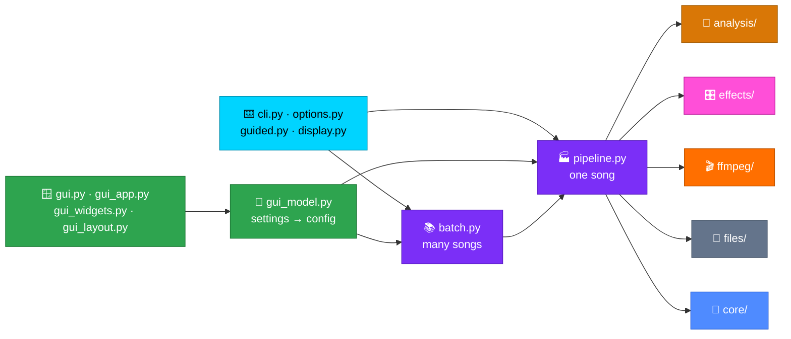
```mermaid
flowchart LR
    GUI["🪟 gui.py · gui_app.py<br/>gui_widgets.py · gui_layout.py"]:::w --> M["🧭 gui_model.py<br/>settings → config"]:::w
    CLI["⌨️ cli.py · options.py<br/>guided.py · display.py"]:::a --> B["📚 batch.py<br/>many songs"]:::b
    M --> B
    CLI --> P["🏭 pipeline.py<br/>one song"]:::b
    M --> P
    B --> P
    P --> AN["🥁 analysis/"]:::g
    P --> FX["🎛️ effects/"]:::e
    P --> FF["🎬 ffmpeg/"]:::f
    P --> FILES["💾 files/"]:::d
    P --> CORE["🧱 core/"]:::c

    classDef w fill:#2ea44f,stroke:#1f7a38,color:#fff
    classDef a fill:#00d4ff,stroke:#0090b0,color:#000
    classDef b fill:#7b2ff7,stroke:#5a1fc0,color:#fff
    classDef c fill:#4f8bff,stroke:#2a5fd0,color:#fff
    classDef d fill:#64748b,stroke:#475569,color:#fff
    classDef e fill:#ff4fd8,stroke:#c0209f,color:#fff
    classDef f fill:#ff6f00,stroke:#c05500,color:#fff
    classDef g fill:#d97706,stroke:#a15c05,color:#fff
```

The window and the terminal app are two front doors to the **same engine**: neither contains any sound or file logic of its own.

| File | Its job |
|---|---|
| `Audio8D.pyw` | Double-click start for the window (no console) |
| `bin/executable/` | `ffmpeg.exe` and `ffprobe.exe`; `core/locations.py` finds them next to the project, or next to the exe when packaged |
| `packaging/` | `build.ps1` (the one-step build), `audio8d.spec` (the PyInstaller recipe), `window_entry.py` · `terminal_entry.py` (the two exes), `version.txt` (the exe's details), `make_icon.py` (draws the icon) |
| `src/gui.py` · `gui_app.py` | Opens the window (or explains what to install) · the window: sidebar, the six pages, song and progress rows, the background worker and its event queue |
| `src/gui_model.py` | The window's settings with no Tk in sight: turns them into an `EffectConfig` and options, finds problems and warnings, writes the plain-word summaries |
| `src/gui_widgets.py` · `gui_layout.py` | Theme colours, icons, tooltips, cards, sliders, choices, drop-down menus, switches, text boxes, dialogs (including the name window) and notices, plus two CustomTkinter fixes: scrollbars no longer force a full layout on every redraw (much faster opening and Size changes), and closed drop-down menus stop being resized · finds controls that overlap (used by the tests) |
| `src/dropfiles.py` | Windows drag-and-drop (`WM_DROPFILES`) |
| `src/__main__.py` · `launcher.py` | The start button · moves a double-clicked terminal app into Windows Terminal |
| `src/cli.py` · `options.py` · `guided.py` · `display.py` · `hints.py` | The terminal app, its options, the step-by-step helper, the panel and progress bars, the "What to do" fixes |
| `src/pipeline.py` · `batch.py` · `cache.py` · `logs.py` | One song · many songs on a thread pool · remembered measurements · the rotating log file and crash hooks |
| `src/core/` | `settings.py`, `presets.py` (with each style's display `label`), `user_presets.py` (saving, PascalCase names, rename, duplicate), `style_files.py` (the versioned export/import format and its checks), `parsing.py`, `locations.py`, `types.py`, `errors.py` |
| `src/effects/` | `motion.py` (where the sound is), `head.py` (the head model), `control.py` · `wavfile.py` (gain streams), `reverb.py` (the room), `graph.py` (the FFmpeg filter graph), `levels.py` (sample rates, loudness gain) |
| `src/analysis/` | `tempo.py`, `sections.py` (loudest part), `quality.py` (the check), `stems.py` (Demucs) |
| `src/ffmpeg/` · `src/files/` | Finding FFmpeg, commands, progress, song facts, loudness · safe names, hidden-file-then-rename, folder scanning, the Recycle Bin |

### 🍳 The 3D sound recipe

1. **Two sides.** Mono is copied to both ears; 5.1 is folded down. Audio below 32 kHz is raised to 44.1 or 48 kHz first, so the 5 and 10 kHz bands fit.
2. **Middle and side.** The **middle** is what moves. A quarter of the song's own **side** (its width) is kept still, without bass.
3. **Five bands.** A Linkwitz-Riley crossover splits the middle at **120 Hz** (bass, stays centred), **1.2 kHz**, **5 kHz**, **10 kHz** and above.
4. **Time.** The timing band feeds **8 delay taps** covering the largest time difference between the ears (Woodworth); blending neighbouring taps gives a smooth fractional delay.
5. **Loudness and colour.** 200 times a second, `head.py` works out each ear's gain for every tap and band (Brown–Duda head shadow, rear dulling, Blauert's overhead band), keeping the total power steady.
6. **Apply.** FFmpeg multiplies each band by its gain stream (`amultiply`) and sums each ear (`pan`).
7. **Room.** The middle (without bass) plays through the room's impulse response (`afir`).
8. **Loudness.** With a goal, the mix is measured (or remembered) and gets one exact `volume` change; without one, it's turned down 3 dB.
9. **Safety roof.** A limiter that works at twice the sample rate, so peaks between samples are caught too.
10. **Save.** LAME MP3, AAC, Opus, 24-bit FLAC or WAV, with tags, "(8D)" in the title, and the album picture.
11. **Check.** The finished file is measured in stereo and folded to mono.

### 📏 House rules for changing the code

- ✍️ Every code file starts with `# Developed by ::> Gehan Fernando`.
- 💬 Every comment is one meaningful line; a longer thought goes in the docstring.
- 💬 Comments are one short, natural line that explains *why*.
- 🧭 Keep the window thin: settings logic goes in `gui_model.py` (testable without a screen), sound and file logic in the engine.
- 📐 Never let controls overlap: `test_no_control_ever_overlaps_or_spills_out` must stay green.
- 📁 Made a new folder inside `src`? Add it to the `packages` list in `pyproject.toml`.
- 🎛️ Used a new FFmpeg filter? Add it to `GRAPH_FILTERS` in `src/effects/graph.py`.
- 🚫 Never use `shell=True`. Always pass lists of words to programs.
- 📚 This `README.md` is the **only** guide for the project; don't add README files in sub-folders.

### 📦 Build the standalone app

The standalone app is built with **[PyInstaller](https://pyinstaller.org/)** on Windows, in one step. In Windows Terminal, in the `8D` folder:

```powershell
powershell -ExecutionPolicy Bypass -File packaging\build.ps1
```

**You need:** Python 3.10+, an internet connection for the first build (it downloads PyInstaller, CustomTkinter and Pillow into a private build environment, `build\venv`), and `ffmpeg.exe` and `ffprobe.exe` in `bin\executable`.

**What the script does:**

1. Stops with a clear message if `bin\executable\ffmpeg.exe` or `ffprobe.exe` is missing.
2. Creates `build\venv` (once) and installs the current Audio8D code, CustomTkinter, Pillow and PyInstaller into it, so your own Python is never touched.
3. Runs PyInstaller with `packaging\audio8d.spec`: **`Audio8D.exe`** (the window, no console) and **`audio8d-cli.exe`** (the terminal app) share one `_internal` folder. Demucs and PyTorch are left out on purpose.
4. Copies `bin\executable`, `THIRD-PARTY-NOTICES.md` and the `licenses` folder next to the exes (FFmpeg's licence requires its licence text to travel with every copy). No README is copied: this file is the single guide, and **Settings → Open the full guide** opens its online copy.
5. **Tests the result** by running `audio8d-cli.exe --version`.
6. Zips it all as **`dist\Audio8D-2.0.0-windows.zip`**.

✅ **Success looks like:** `Built: audio8d 2.0.0 - developed by Gehan Fernando`, then the `dist\Audio8D` folder and the zip. The build also leaves `build\` and an `audio8d.egg-info` folder behind; both are ignored by Git and safe to delete.

**How the paths work:** Audio8D never relies on the folder you start it from. In the packaged app, `core/locations.py` takes the folder of `Audio8D.exe` as its home, so FFmpeg is `bin\executable` there. From source, the home is the `8D` project folder. That's why the whole `Audio8D` folder can be copied anywhere and keep working.

> [!CAUTION]
> `bin\executable\ffmpeg.exe` and `ffprobe.exe` are about **105 MB each**, and GitHub refuses files over 100 MB. This project stores them with **[Git LFS](https://git-lfs.com/)**. Share the standalone app as the zip from `dist` (for example as a GitHub release file), not inside the repository; `build\` and `dist\` are in `.gitignore`.

---

## 🙏 27. Credits and licences

<div align="center">

### 👨‍💻 Developed by **Gehan Fernando**


Audio8D was designed, written and tested by **Gehan Fernando**.

Built with 🐍 [Python](https://www.python.org/), 🎬 [FFmpeg](https://ffmpeg.org/) (with LAME, AAC, Opus and FLAC), 🪟 [CustomTkinter](https://github.com/TomSchimansky/CustomTkinter) and [Pillow](https://python-pillow.org/) for the window, with the terminal app at home in [Windows Terminal](https://aka.ms/terminal), and optional 🎤 [Demucs](https://github.com/facebookresearch/demucs) for vocal separation.

The head model follows R. S. Woodworth's interaural time difference, C. P. Brown and R. O. Duda's spherical-head shadow model, and J. Blauert's directional bands.

</div>

### 📜 Licences

The standalone app includes third-party software, each under its own licence: **FFmpeg** (GNU GPL v3), **Python** (PSF licence, with Tcl/Tk), **CustomTkinter** (MIT), **darkdetect** (BSD), **packaging** (Apache 2.0 / BSD), **Pillow** (MIT-CMU) and the **PyInstaller** bootloader. [THIRD-PARTY-NOTICES.md](THIRD-PARTY-NOTICES.md) lists each one with its version and where FFmpeg's source code can be downloaded, and the [licenses](licenses) folder holds the full texts. Both are copied into every standalone build. Audio8D itself is © Gehan Fernando; its own code does not carry an open-source licence yet.

<div align="center">

---

### 🎧 Your song goes in. It comes out moving around your head. 🌀

**Start with `studio` · Listen with headphones · Try a preview first**

<sub>Audio8D 2.0.0 · Developed by Gehan Fernando · Made with 💜 for everyone who loves music</sub>


</div>
